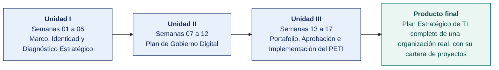

  
  &nbsp;&nbsp;&nbsp;&nbsp;&nbsp;&nbsp;
  

  <strong>Universidad Privada de Tacna</strong> 
  Facultad de Ingeniería · Escuela Profesional de Ingeniería de Sistemas 
  Tacna, Perú

<h1 align="center">SI-886 · Planeamiento Estratégico de TI</h1>

---

## Docente del curso

| | |
|---|---|
| **Nombre** | Dr. Oscar Juan Jimenez Flores |
| **Correo institucional** | [oscarjimenezflores@upt.pe](mailto:oscarjimenezflores@upt.pe) |
| **Escuela** | Escuela Profesional de Ingeniería de Sistemas · Facultad de Ingeniería |
| **Perfil profesional** | [LinkedIn](https://www.linkedin.com/in/oscar-jimenez-flores/) |
| **Perfil de investigación** | [CTI Vitae — CONCYTEC](https://ctivitae.concytec.gob.pe/appDirectorioCTI/VerDatosInvestigador.do?id_investigador=33398) |

Escribe al correo institucional para consultas del curso. Indica en el asunto la sigla de la asignatura y el número de semana, para que la respuesta llegue antes.

## Datos generales de la asignatura

| | |
|---|---|
| **Asignatura** | SI-886 · Planeamiento Estratégico de TI |
| **Ciclo** | VIII |
| **Horas semanales** | 04 horas académicas de 50 min · 2 en aula: teoría 60 + dinámica 35 + cierre 5 · 2 en laboratorio: taller 60 + avance asistido 40 |
| **Créditos** | 03 |
| **Tipo** | Obligatorio |
| **Prerrequisito** | Ninguno |
| **Área curricular** | Infraestructura de TI |
| **Duración** | 17 semanas, organizadas en 3 unidades |
| **Unidades** | **I** Marco, Identidad y Diagnóstico Estratégico · **II** Plan de Gobierno Digital · **III** Portafolio, Aprobación e Implementación del PETI |
| **Producto final** | Plan Estratégico de TI completo de una organización real, con su cartera de proyectos |

## En este documento

1. [Docente del curso](#docente-del-curso)
2. [Datos generales de la asignatura](#datos-generales-de-la-asignatura)
3. [Competencia de la asignatura](#competencia-de-la-asignatura)
4. [Idea rectora del curso](#idea-rectora-del-curso)
5. [Cómo avanza el curso](#cómo-avanza-el-curso)
6. [Índice de semanas](#índice-de-semanas)
7. [Qué contiene cada semana](#qué-contiene-cada-semana)
8. [Cómo se entregan los trabajos](#cómo-se-entregan-los-trabajos)
9. [Plan de evaluación](#plan-de-evaluación)
10. [Herramientas del curso](#herramientas-del-curso)
11. [Glosario técnico](#glosario-técnico)
12. [Atributos del Graduado y assessment](#atributos-del-graduado-y-assessment)
13. [Bibliografía y fuentes del curso](#bibliografía-y-fuentes-del-curso)

## Competencia de la asignatura

> Diagnostica y elabora el plan de TI de la organización con la cartera de proyectos.
>
> **Evidencia.** Plan de Tecnologías de Información y cartera de proyectos.

## Idea rectora del curso

El curso es la construcción progresiva de un Plan Estratégico de Tecnologías de Información completo para una organización real. No se estudia planeamiento, se planifica.

Cada semana produce **una sección del plan**. En la Semana 17 el documento está terminado, sustentado y en condiciones de entregarse a la organización.

Cada equipo elige en la Semana 01 la **organización objeto de estudio** y el docente aprueba la factibilidad del acceso. Si el acceso no se concreta, el equipo pasa al caso simulado de respaldo del [`ANEXO-CASO-SIMULADO.md`](ANEXO-CASO-SIMULADO.md).

## Cómo avanza el curso

## Índice de semanas

Cada semana es una carpeta con cuatro documentos — la portada, la teoría de la sesión de aula, la dinámica de aula evaluada como nota cognitiva y la guía del taller de laboratorio.

### Unidad I — Marco, Identidad y Diagnóstico Estratégico

| Semana | Tema | Teoría | Dinámica | Taller |
|---|---|---|---|---|
| **[01](SEMANA-01/)** | Inducción y Lineamientos Generales del Curso | [Teoría](SEMANA-01/1-TEORIA.md) | [Dinámica](SEMANA-01/2-DINAMICA.md) | [Taller](SEMANA-01/3-TALLER.md) |
| **[02](SEMANA-02/)** | Introducción a la Dirección Estratégica · Desafíos y Cambios Mundiales | [Teoría](SEMANA-02/1-TEORIA.md) | [Dinámica](SEMANA-02/2-DINAMICA.md) | [Taller](SEMANA-02/3-TALLER.md) |
| **[03](SEMANA-03/)** | La Planificación · El Planeamiento Estratégico · El Enfoque Estratégico | [Teoría](SEMANA-03/1-TEORIA.md) | [Dinámica](SEMANA-03/2-DINAMICA.md) | [Taller](SEMANA-03/3-TALLER.md) |
| **[04](SEMANA-04/)** | Misión y Visión · Construcción y Evaluación | [Teoría](SEMANA-04/1-TEORIA.md) | [Dinámica](SEMANA-04/2-DINAMICA.md) | [Taller](SEMANA-04/3-TALLER.md) |
| **[05](SEMANA-05/)** | Valores Organizacionales · Cultura Organizacional | [Teoría](SEMANA-05/1-TEORIA.md) | [Dinámica](SEMANA-05/2-DINAMICA.md) | [Taller](SEMANA-05/3-TALLER.md) |
| **[06](SEMANA-06/)** | Análisis Interno y Análisis Externo de la Organización | [Teoría](SEMANA-06/1-TEORIA.md) | [Dinámica](SEMANA-06/2-DINAMICA.md) | [Taller](SEMANA-06/3-TALLER.md) |

### Unidad II — Plan de Gobierno Digital

| Semana | Tema | Teoría | Dinámica | Taller |
|---|---|---|---|---|
| **[07](SEMANA-07/)** | Análisis de la Organización con FODA y PESTEL | [Teoría](SEMANA-07/1-TEORIA.md) | [Dinámica](SEMANA-07/2-DINAMICA.md) | [Taller](SEMANA-07/3-TALLER.md) |
| **[08](SEMANA-08/)** | Normas Nacionales · Marco Normativo de las TIC en el Perú | [Teoría](SEMANA-08/1-TEORIA.md) | [Dinámica](SEMANA-08/2-DINAMICA.md) | [Taller](SEMANA-08/3-TALLER.md) |
| **[09](SEMANA-09/)** | Herramientas y Marcos para el Desarrollo de la TI en la Organización | [Teoría](SEMANA-09/1-TEORIA.md) | [Dinámica](SEMANA-09/2-DINAMICA.md) | [Taller](SEMANA-09/3-TALLER.md) |
| **[10](SEMANA-10/)** | Arquitectura Empresarial | [Teoría](SEMANA-10/1-TEORIA.md) | [Dinámica](SEMANA-10/2-DINAMICA.md) | [Taller](SEMANA-10/3-TALLER.md) |
| **[11](SEMANA-11/)** | Situación Actual del Gobierno Digital | [Teoría](SEMANA-11/1-TEORIA.md) | [Dinámica](SEMANA-11/2-DINAMICA.md) | [Taller](SEMANA-11/3-TALLER.md) |
| **[12](SEMANA-12/)** | Objetivos del Gobierno Digital · Indicadores y Metas · Examen de Unidad II | [Teoría](SEMANA-12/1-TEORIA.md) | [Dinámica](SEMANA-12/2-DINAMICA.md) | [Taller](SEMANA-12/3-TALLER.md) |

### Unidad III — Portafolio, Aprobación e Implementación del PETI

| Semana | Tema | Teoría | Dinámica | Taller |
|---|---|---|---|---|
| **[13](SEMANA-13/)** | Portafolio de Proyectos · Identificación, Caso de Negocio y Valor | [Teoría](SEMANA-13/1-TEORIA.md) | [Dinámica](SEMANA-13/2-DINAMICA.md) | [Taller](SEMANA-13/3-TALLER.md) |
| **[14](SEMANA-14/)** | Priorización del Portafolio · Hoja de Ruta y Presupuesto | [Teoría](SEMANA-14/1-TEORIA.md) | [Dinámica](SEMANA-14/2-DINAMICA.md) | [Taller](SEMANA-14/3-TALLER.md) |
| **[15](SEMANA-15/)** | Gestión de Riesgos del Plan | [Teoría](SEMANA-15/1-TEORIA.md) | [Dinámica](SEMANA-15/2-DINAMICA.md) | [Taller](SEMANA-15/3-TALLER.md) |
| **[16](SEMANA-16/)** | El Plan de Gobierno Digital · Integración, Revisión y Aprobación | [Teoría](SEMANA-16/1-TEORIA.md) | [Dinámica](SEMANA-16/2-DINAMICA.md) | [Taller](SEMANA-16/3-TALLER.md) |
| **[17](SEMANA-17/)** | Implementación y Supervisión del Plan · Sustentación · Examen de Unidad III | [Teoría](SEMANA-17/1-TEORIA.md) | [Dinámica](SEMANA-17/2-DINAMICA.md) | [Taller](SEMANA-17/3-TALLER.md) |

## Qué contiene cada semana

| Documento | Para qué sirve | Cuándo se usa |
|---|---|---|
| `README.md` | Portada de la semana con los datos de la asignatura, la ruta de trabajo, los entregables y la forma de evaluación | Antes de la clase |
| `1-TEORIA.md` | Desarrollo conceptual de la sesión de aula, con el mapa de la sesión y las fuentes citadas | Sesión 1, en aula |
| `2-DINAMICA.md` | Actividad en equipo con su consigna, su producto y su rúbrica, evaluada como nota cognitiva | Sesión 1, dentro de los 100 min |
| `3-TALLER.md` | Guía de laboratorio en formato EPIS, evaluada como nota procedimental | Sesión 2, en laboratorio |

## Cómo se entregan los trabajos

Todo trabajo del curso se entrega en **PDF**, con la carátula de la UPT y los códigos de todos los integrantes. Las dos plantillas son obligatorias. Se llenan en Word y se exportan a PDF.

| Plantilla | Para qué | Nombre del archivo que entregas |
|---|---|---|
| [Dinámica de aula](PLANTILLAS/SI886-PLANTILLA-DINAMICA.docx) | Lo que el grupo resolvió en la sesión de aula | `SI886-S<NN>-DINAMICA-Grupo<N>.pdf` |
| [Taller de laboratorio](PLANTILLAS/SI886-PLANTILLA-TALLER.docx) | El informe del taller, en formato EPIS | `SI886-S<NN>-TALLER-Grupo<N>.pdf` |

Las reglas completas de entrega están en [`PLANTILLAS/`](PLANTILLAS/).

## Plan de evaluación

| Criterio | Peso en la unidad | De dónde sale |
|---|---|---|
| Cognitivo | 25 % | Dinámica de aula, su producto y la exposición del equipo |
| Procedimental | 35 % | Guía de laboratorio y sus entregables verificables |
| Actitudinal | 15 % | Participación, puntualidad y trabajo en equipo |
| Examen de unidad | 25 % | **Teórico** (40 min en aula, alternativas) y **práctico** (100 min en laboratorio, sobre los productos de los talleres, con IA permitida) |

Peso de cada unidad en la nota del curso. **Unidad I 25 %**, **Unidad II 35 %** y **Unidad III 40 %**.

## Herramientas del curso

Todas son libres, gratuitas o de uso académico sin costo. El requisito base del laboratorio es Docker con permisos de administrador, Git y un navegador actualizado.

| Recurso | Detalle y enlace | Semanas |
|---|---|---|
| **INEI** | https://www.inei.gob.pe · Sistema de Información Regional https://systems.inei.gob.pe/SIRTOD/ | 02 |
| **BCRP — Estadísticas** | https://estadisticas.bcrp.gob.pe · **API pública** de series | 02 |
| **OSIPTEL** | https://www.osiptel.gob.pe · Punto de Intercambio de Datos | 02 |
| **MEF — Consulta Amigable** | https://apps5.mineco.gob.pe/transparencia/ | 02 |
| **Datos Abiertos del Perú** | https://www.datosabiertos.gob.pe | 02 |
| **Banco Mundial — API** | https://data.worldbank.org · https://api.worldbank.org/v2/ | 02 |
| **Python 3.11+** | Procesamiento de la encuesta y de la rúbrica | 02, 03, 04, 05, 06, 07, 08, 09, 10, 11, 12, 13, 14, 15, 16, 17 |
| **Jupyter Lab** | `pip install jupyterlab` | 02 |
| **LibreOffice Calc** | Matriz VRIO y de capacidades | 02, 03, 06, 07, 08, 12, 13, 14, 17 |
| **Portal del Estado Peruano** | https://www.gob.pe — sección de transparencia de cada entidad | 03 |
| **CEPLAN** | https://www.gob.pe/ceplan — *Guía para el Planeamiento Institucional* | 03 |
| **Lineamientos del PGD** | https://cdn.www.gob.pe/uploads/document/file/356863/Anexo_I_Lineamientos_PGD.pdf | 03 |
| **Normativa de gobierno digital** | https://www.gob.pe/institucion/pcm/colecciones/147-normativa-sobre-gobierno-digital | 03 |
| **draw.io** | Cadena de valor y matriz de interesados | 03, 04, 05, 06, 07, 10, 13 |
| **Grabación o notas de la Entrevista 1** con la gerencia | Insumo obligatorio | 04 |
| **LimeSurvey** (Docker) o Google Forms | Aplicación del instrumento | 04, 05 |
| **LibreOffice Writer** | Redacción y control de cambios | 04 |
| Declaraciones de tres organizaciones comparables | Ejercicio de referencia | 04 |
| Encuesta de la Semana 04 | Base de respondientes ya establecida | 05 |
| Documentación de la organización | Organigrama, mapa de procesos, presupuesto de TI, inventario de sistemas | 05, 06 |
| Cameron y Quinn, *Diagnosing and Changing Organizational Culture* | Referencia metodológica | 05 |
| **Bizagi Modeler** (gratuito) o **bpmn.io** | Modelado de procesos en BPMN 2.0 | 06 |
| Fuentes sectoriales oficiales | INEI, gremios, SMV (memorias anuales de empresas listadas) | 06 |
| Secciones Sección 1.1, Sección 3.1 y Sección 3.2 del PETI | Insumo obligatorio | 07 |
| Fuentes oficiales | INEI, BCRP, OSIPTEL, MEF, ANPD, MINAM, PCM | 07 |
| **Pandoc** | Generación del documento único: https://pandoc.org/ | 07, 16 |
| **Plataforma del Estado Peruano** | https://www.gob.pe — normas legales por institución | 08 |
| **Normativa sobre gobierno digital — PCM** | https://www.gob.pe/institucion/pcm/colecciones/147-normativa-sobre-gobierno-digital | 08 |
| **Diario Oficial El Peruano** | https://busquedas.elperuano.pe | 08 |
| **ANPD** | https://www.gob.pe/institucion/anpd | 08 |
| **SBS**, **SMV**, **Contraloría**, **INDECOPI**, **SUNAT** | Normativa sectorial | 08 |
| Los 8 resúmenes normativos de la dinámica de aula | Base compartida del curso | 08 |
| **COBIT 2019 — Introduction and Methodology**, **Governance and Management Objectives** y **Design Guide** | https://www.isaca.org/resources/cobit | 09 |
| **ITIL 4 Foundation** — prácticas de gestión | https://www.axelos.com/certifications/itil-service-management | 09 |
| **ISO/IEC 20000-1**, **ISO/IEC 27001:2022**, **ISO/IEC 33020** | https://www.iso.org | 09 |
| **NIST CSF 2.0** | https://www.nist.gov/cyberframework | 09 |
| Notas de la **Entrevista 2 con la jefatura de TI** | Criterios de priorización y presupuesto disponible | 09, 14 |
| Documentación de TI de la organización | Procedimientos, registro de incidentes, contratos, indicadores | 09 |
| **GLPI** o **Zammad** (Docker) | Demostración de mesa de servicio | 09 |
| **Archi** — modelador ArchiMate libre | https://www.archimatetool.com/download/ | 10 |
| **ArchiMate 3.2 Specification** | https://pubs.opengroup.org/architecture/archimate3-doc/ | 10 |
| **TOGAF Standard, 10th Edition** | https://www.opengroup.org/togaf | 10 |
| Inventario de sistemas de la organización | Insumo obligatorio | 10 |
| Cadena de valor de sección 3.1.1 | Procesos de negocio | 10 |
| **RSGD 005-2018-PCM/SEGDI**, Anexo I | https://cdn.www.gob.pe/uploads/document/file/356863/Anexo_I_Lineamientos_PGD.pdf | 11, 16, 17 |
| **D. S. 029-2021-PCM** y **D. S. 085-2023-PCM** | Componentes del gobierno digital y objetivos de la política | 11 |
| **Estándares de Interoperabilidad de la PIDE** | https://www.peru.gob.pe/normas/docs/Estandares_Interoperabilidad_PIDE_SEGDI.pdf | 11 |
| **Metabase** (Docker) | https://www.metabase.com/ | 11 |
| **PostgreSQL** (Docker) | Base del tablero | 11 |
| Secciones Sección 4.1, Sección 4.3 y Sección 5 del PETI | Insumos del diagnóstico | 11 |
| Secciones Sección 3.5, Sección 4.3, Sección 5.4 y Sección 6.1 del PETI | Insumos obligatorios | 12 |
| **CEPLAN** — Guía para el Planeamiento Institucional | https://www.gob.pe/ceplan | 12 |
| **D. S. 085-2023-PCM** | Objetivos prioritarios de la Política Nacional de Transformación Digital | 12 |
| **Metabase** de la Semana 11 | Verificación de líneas base | 12 |
| Secciones Sección 3.5, Sección 4.1.5, Sección 4.3.5, Sección 5.4.2 y Sección 6.1.7 del PETI | Las cinco fuentes admisibles | 13 |
| **PMBOK Guide** / **ISO 21500** | Estructura del caso de negocio | 13 |
| Cotizaciones referenciales | Precios de mercado para estimar; se documenta la fuente | 13 |
| Secciones Sección 2.4, Sección 4.1.5, Sección 6.2, Sección 7.1 del PETI | Insumos obligatorios | 14 |
| **GanttProject** | https://www.ganttproject.biz/ | 14 |
| **OpenProject** (Docker, alternativa) | https://www.openproject.org/ | 14 |
| **ISO 31000:2018** | https://www.iso.org/standard/65694.html | 15 |
| **ISO/IEC 27005:2022** | Referencia metodológica complementaria | 15 |
| **SimpleRisk Community** (Docker) | https://www.simplerisk.com/ | 15 |
| Secciones Sección 2.4, Sección 7.2, Sección 7.3 y Sección 7.4 del PETI | Insumos del análisis | 15 |
| Resultado del pre-mortem de la dinámica de aula | Insumo de identificación | 15 |
| Secciones Sección 0 a Sección 8 del PETI | Todo el trabajo del semestre | 16 |
| **Git** | Versionado y etiqueta de la versión final | 16 |
| PETI v1.0 completo | Secciones Sección 0 a Sección 9 | 17 |
| **Metabase** y **PostgreSQL** (Docker) | Tablero de supervisión | 17 |
| Secciones Sección 2.4 y Sección 8 del PETI | Cultura y riesgos, para el plan de cambio | 17 |

## Atributos del Graduado y assessment

El curso contribuye al **Plan de Assessment de la Escuela**, que mide los once Atributos del Graduado del perfil de egreso bajo el modelo ICACIT.

| | |
|---|---|
| **Atributo que mide este curso** | **AG-I01 · El Profesional y el Mundo** |
| **Producto acreditable** | Plan Estratégico de TI de una organización real, con su cartera de proyectos, sustentado ante panel |
| **Instrumento** | Rúbrica analítica institucional, escala 1–4 |
| **Nivel de logro esperado** | ≥ 65 % de los estudiantes en nivel ≥ 3 (Logrado) |
| **Semanas de captura de evidencia** | **05** · dinámica de aula sobre un caso · y **16** · informe del PETI por grupos |
| **Momentos de reporte** | Semana 08 (corte 1) y Semana 16 (corte 2) |
| **Docente responsable** | Dr. Oscar Juan Jimenez Flores |

> **No afecta la calificación.** La rúbrica del atributo se aplica sobre los mismos entregables que el curso ya exige, con un registro paralelo al de notas. El estudiante no entrega nada adicional.

La única captura **individual** es la sustentación de la Semana 17, y es la que alimenta el indicador de cohorte. Las demás son grupales y sirven para la mejora del curso.

Todo el instrumental está en [`ASSESSMENT/`](ASSESSMENT/) — el [mapa del atributo semana a semana](ASSESSMENT/MAPA-AG.md), la [rúbrica](ASSESSMENT/RUBRICAS-AG.md), la [ficha de evidencia](ASSESSMENT/PLANTILLA-EVIDENCIA-AG.md) que se llena en cada captura, el registro por estudiante y la [plantilla del informe de assessment](ASSESSMENT/PLANTILLA-INFORME-ASSESSMENT.md) del ciclo.

## Glosario técnico

Todo término, sigla y norma que aparece en el curso está definido en el [**glosario técnico**](GLOSARIO.md). Los términos en inglés se conservan cuando así se usan en el trabajo profesional. Es como se encuentran en la documentación y en el código.

## Bibliografía y fuentes del curso

Reunidas de las guías de laboratorio de las 17 semanas. Son normas técnicas, marcos profesionales y bibliografía indexada.

- Archi. *Archi — Open Source ArchiMate Modelling*. https://www.archimatetool.com/
- AXELOS. *ITIL 4 Foundation: ITIL 4 Edition*. https://www.axelos.com/certifications/itil-service-management
- Banco Central de Reserva del Perú. *Series estadísticas*. https://estadisticas.bcrp.gob.pe
- Banco Mundial. *World Development Indicators*. https://data.worldbank.org
- Barney, J. B. (1991). Firm resources and sustained competitive advantage. *Journal of Management*, 17(1), 99–120.
- Cameron, K. S. y Quinn, R. E. (2011). *Diagnosing and Changing Organizational Culture: Based on the Competing Values Framework* (3.ª ed.). Jossey-Bass.
- CEPLAN. *Guía para el Planeamiento Institucional* — formulación de objetivos e indicadores. https://www.gob.pe/ceplan
- CMMI Institute. *CMMI Model V3.0*. https://cmmiinstitute.com/
- Collins, J. y Porras, J. (1996). Building your company's vision. *Harvard Business Review*, 74(5), 65–77.
- David, F. R. y David, F. R. (2017). *Strategic Management: A Competitive Advantage Approach* (16.ª ed.). Pearson. — matrices EFI, EFE y FODA cruzado.
- Decreto Legislativo 1412, Ley de Gobierno Digital. https://www.gob.pe/institucion/pcm/colecciones/147-normativa-sobre-gobierno-digital
- Decreto Legislativo 822, Ley sobre el Derecho de Autor. https://www.gob.pe/institucion/indecopi
- Decreto Supremo 029-2021-PCM, Reglamento de la Ley de Gobierno Digital. https://www.gob.pe/13326-reglamento-de-la-ley-de-gobierno-digital
- Decreto Supremo 085-2023-PCM, Política Nacional de Transformación Digital al 2030 — objetivos prioritarios e indicadores. https://busquedas.elperuano.pe/dispositivo/NL/2200457-5
- Estándares de Interoperabilidad de la PIDE. https://www.peru.gob.pe/normas/docs/Estandares_Interoperabilidad_PIDE_SEGDI.pdf
- Estándares de Interoperabilidad de la Plataforma de Interoperabilidad del Estado (PIDE). https://www.peru.gob.pe/normas/docs/Estandares_Interoperabilidad_PIDE_SEGDI.pdf
- GanttProject. *User Guide*. https://www.ganttproject.biz/
- García Sánchez, E. y Valencia Velazco, M. L. *Planeación estratégica: teoría y práctica*. Trillas.
- González Millán, J. (2020). *Manual práctico de planeación estratégica*. Ediciones Díaz de Santos. https://elibro.net/es/lc/bibliotecaupt/titulos/129291
- IEC 31010:2019. *Risk management — Risk assessment techniques*. https://www.iso.org/standard/72140.html
- Instituto Nacional de Estadística e Informática. *Estadísticas de las Tecnologías de Información y Comunicación en los Hogares*. https://www.inei.gob.pe
- ISACA. (2018). *COBIT 2019*, **MEA01 Managed Performance and Conformance Monitoring** y **BAI05 Managed Organizational Change**. https://www.isaca.org/resources/cobit
- ISACA. *Val IT Framework — Enterprise Value: Governance of IT Investments*. https://www.isaca.org/resources/frameworks-standards-and-models
- ISO 21500:2021. *Project, programme and portfolio management — Context and concepts*. https://www.iso.org/standard/75704.html
- ISO 31000:2018. *Risk management — Guidelines*. https://www.iso.org/standard/65694.html
- ISO/IEC 20000-1:2018. *Service management system requirements*. https://www.iso.org/standard/70636.html
- ISO/IEC 27001:2022. *Information security management systems — Requirements*. https://www.iso.org/standard/27001
- ISO/IEC 27004. *Information security management — Monitoring, measurement, analysis and evaluation*. https://www.iso.org/standard/80404.html
- ISO/IEC 27005:2022. *Guidance on managing information security risks*. https://www.iso.org/standard/80585.html
- ISO/IEC 33020:2019. *Process measurement framework for assessment of process capability*. https://www.iso.org/standard/54195.html
- ISO/IEC 38500:2024. *Governance of IT for the organization*. https://www.iso.org/standard/81684.html
- ISO/IEC 42001:2023. *Artificial intelligence — Management system*. https://www.iso.org/standard/81230.html
- Kaplan, R. S. y Norton, D. P. (1996). *The Balanced Scorecard*. Harvard Business School Press.
- Klein, G. (2007). Performing a project premortem. *Harvard Business Review*, 85(9), 18–19.
- Kotter, J. P. (2012). *Leading Change*. Harvard Business Review Press. — capacidad de absorción del cambio.
- Lankhorst, M. (2017). *Enterprise Architecture at Work: Modelling, Communication and Analysis* (4.ª ed.). Springer.
- Ley 27269, Ley de Firmas y Certificados Digitales.
- Ley 27806, Ley de Transparencia y Acceso a la Información Pública.
- Ley 28716, Ley de Control Interno de las Entidades del Estado. https://www.gob.pe/contraloria
- Ley 29733 y Decreto Supremo 016-2024-JUS, Reglamento de Protección de Datos Personales. https://www.gob.pe/institucion/anpd
- LimeSurvey Project. *LimeSurvey Manual*. https://www.limesurvey.org/manual
- López Posada, L. M. (2016). *Cultura organizacional: entre el individualismo y el colectivismo*. Sello Editorial Universidad del Tolima. https://elibro.net/es/ereader/bibliotecaupt/71071
- Metabase. *Documentation*. https://www.metabase.com/docs/latest/
- Metabase. *Metabase Documentation*. https://www.metabase.com/docs/latest/
- Ministerio de Economía y Finanzas. *Consulta Amigable de ejecución presupuestal*. https://apps5.mineco.gob.pe/transparencia/
- Ministerio del Ambiente. *Gestión de residuos de aparatos eléctricos y electrónicos*. https://www.gob.pe/minam
- MINTIC Colombia. *Guía para la construcción del PETI* — catálogo de proyectos. https://www.mintic.gov.co/arquitecturati/630/w3-propertyvalue-8114.html
- MINTIC Colombia. *Guía para la construcción del Plan Estratégico de Tecnologías de la Información — PETI*. https://www.mintic.gov.co/arquitecturati/630/w3-propertyvalue-8114.html
- MINTIC Colombia. *Marco de Referencia de Arquitectura Empresarial para la gestión de TI*. https://www.mintic.gov.co/arquitecturati/630/w3-channel.html
- NIST. (2024). *The NIST Cybersecurity Framework (CSF) 2.0*. https://www.nist.gov/cyberframework
- Object Management Group. *BPMN 2.0 Specification*. https://www.omg.org/spec/BPMN/
- OCDE. *Digital Government Policy Framework*. https://www.oecd.org/governance/digital-government/
- OCDE. *Recomendación del Consejo sobre Inteligencia Artificial*. https://www.oecd.org/
- OSIPTEL. *Indicadores del mercado de telecomunicaciones*. https://www.osiptel.gob.pe
- Plataforma Nacional de Datos Abiertos. https://www.datosabiertos.gob.pe
- Porter, M. E. (1985). *Competitive Advantage: Creating and Sustaining Superior Performance*. Free Press.
- Porter, M. E. (1996). What is strategy? *Harvard Business Review*, 74(6), 61–78.
- Porter, M. E. (2008). The five competitive forces that shape strategy. *Harvard Business Review*, 86(1), 78–93.
- Presidencia del Consejo de Ministros. *Transformación digital en el Perú*. https://www.gob.pe/transformaciondigital
- Project Management Institute. *A Guide to the Project Management Body of Knowledge (PMBOK Guide)*. https://www.pmi.org/
- Project Management Institute. *PMBOK Guide* — gestión de riesgos del proyecto. https://www.pmi.org/
- Project Management Institute. *The Standard for Portfolio Management*. https://www.pmi.org/
- Resolución de Secretaría de Gobierno Digital 005-2018-PCM/SEGDI — Lineamientos para la formulación del Plan de Gobierno Digital. https://cdn.www.gob.pe/uploads/document/file/356863/Anexo_I_Lineamientos_PGD.pdf
- Resolución de Secretaría de Gobierno y Transformación Digital 003-2023-PCM/SGTD — uso obligatorio de la NTP-ISO/IEC 27001 vigente. https://www.gob.pe/institucion/pcm/tema/transformacion-digital/normas-legales
- Resolución Ministerial 119-2018-PCM — Comité de Gobierno Digital y Líder de Gobierno Digital.
- Resolución SBS N.º 504-2021 y modificatorias. https://www.sbs.gob.pe/
- Rodríguez Bermúdez, J. R. (2015). *Planificación y dirección estratégica de sistemas de información*. Editorial UOC. https://elibro.net/es/lc/bibliotecaupt/titulos/57875
- Rodríguez Bermúdez, J. R. (2015). *Usos estratégicos de las TIC*. Editorial UOC. https://elibro.net/es/lc/bibliotecaupt/titulos/57677
- Ross, J. W., Weill, P. y Robertson, D. C. (2006). *Enterprise Architecture as Strategy*. Harvard Business School Press.
- Schein, E. H. y Schein, P. (2017). *Organizational Culture and Leadership* (5.ª ed.). Wiley.
- SimpleRisk. *Documentation*. https://www.simplerisk.com/documentation
- SUNAT. *Consulta RUC*. https://e-consultaruc.sunat.gob.pe/
- Superintendencia del Mercado de Valores — memorias anuales de empresas listadas. https://www.smv.gob.pe
- The Open Group. *ArchiMate 3.2 Specification*. https://pubs.opengroup.org/architecture/archimate3-doc/
- The Open Group. *TOGAF Standard, 10th Edition*. https://www.opengroup.org/togaf
- Treacy, M. y Wiersema, F. (1995). *The Discipline of Market Leaders*. Addison-Wesley.
- UNESCO. (2021). *Recomendación sobre la Ética de la Inteligencia Artificial*. https://www.unesco.org/es/artificial-intelligence/recommendation-ethics

---

**SI-886 · Planeamiento Estratégico de TI** · Escuela Profesional de Ingeniería de Sistemas
Universidad Privada de Tacna · Tacna, Perú

Docente · Dr. Oscar Juan Jimenez Flores · [oscarjimenezflores@upt.pe](mailto:oscarjimenezflores@upt.pe)

Material docente de uso académico. Cita la fuente si lo reutilizas.
