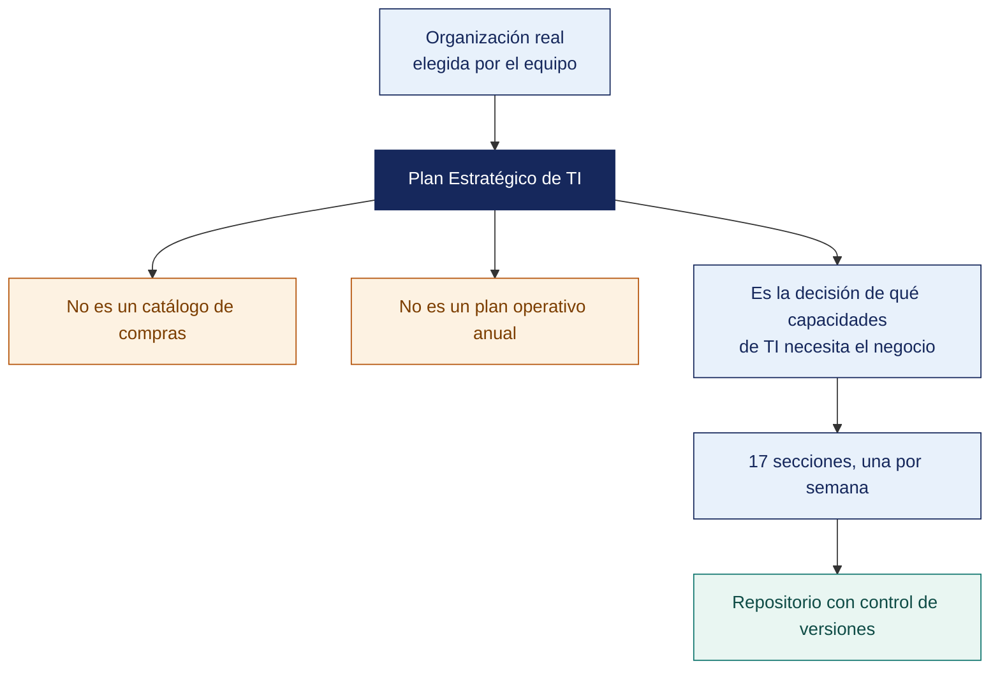

[Semana 01](README.md) · **Teoría** · [Dinámica de aula](2-DINAMICA.md) · [Taller de laboratorio](3-TALLER.md)

# Teoría · Inducción y Lineamientos Generales del Curso

**SI-886 · Planeamiento Estratégico de TI** · Semana 01 · Sesión 1 en aula · 2 horas académicas, 100 min, con la dinámica incluida

> ¿Un término no le resulta claro? Está definido en el [glosario técnico del curso](../GLOSARIO.md).

---

## Qué se trabaja en esta sesión

- El encargo del semestre.
- Qué es un PETI y qué no es.
- De dónde viene y hacia dónde va el planeamiento.
- La organización objeto de estudio.

## Distribución del tiempo

| Bloque | Minutos |
|---|---|
| El encargo del semestre | 10 |
| Qué es un PETI y qué no es | 15 |
| De dónde viene y hacia dónde va el planeamiento | 15 |
| La organización objeto de estudio | 10 |
| Prueba de entrada y encuadre | 15 |
| **Total de la sesión de aula** | **65** |

## Mapa de la sesión



---

## El encargo del semestre

**El curso no es una asignatura sobre planeamiento: es un encargo de consultoría.** Al terminar el semestre cada equipo entrega a una organización real un **Plan Estratégico de Tecnologías de Información completo**, con su portafolio de proyectos priorizado y su hoja de ruta.

| Unidad | Semanas | Producto acumulado |
|---|---|---|
| I | 1–6 | **Identidad estratégica y diagnóstico base**: misión, visión, valores, cultura, análisis interno y externo |
| II | 7–12 | **Diagnóstico estratégico completo**: FODA cruzado, marco normativo, marcos de gestión, arquitectura empresarial, objetivos de gobierno digital |
| III | 13–17 | **Plan ejecutable**: portafolio priorizado, riesgos, hoja de ruta, implementación y supervisión |

**Regla estructural del curso:** cada laboratorio produce **una sección del documento final**. No hay trabajo que se descarte. En la Semana 17 el PETI está terminado porque se construyó semana a semana, no porque se escribió al final.

## Qué es un PETI y qué no es

**Definición operativa.** El Plan Estratégico de Tecnologías de Información es el instrumento que traduce la estrategia de una organización en **decisiones sobre tecnología, información, personas y procesos**, con un horizonte de tres a cinco años, un portafolio de inversiones priorizado y una forma de medir si funcionó.

| **Un PETI ES** | **Un PETI NO ES** |
|---|---|
| Un instrumento de **decisión de inversión** | Un catálogo de tecnologías de moda |
| Derivado de la estrategia del negocio | Un documento redactado por TI para TI |
| Un portafolio **priorizado** con criterios explícitos | Una lista de deseos del área de sistemas |
| Un compromiso con recursos, plazos y responsables | Una declaración de intenciones |
| Un documento **vivo**, revisado anualmente | Un archivo que se abre cuando lo pide el auditor |
| Medible: cada objetivo tiene indicador y meta | Una narrativa sin cifras |
| Explícito sobre **lo que no se hará** | Un documento que promete todo |

**La prueba de fuego de un PETI.** Si al leerlo un gerente que no es de TI **no puede responder «¿qué gana la empresa con esto y cuándo?»**, el documento fracasó, con independencia de su extensión y de su calidad técnica.

**Los cinco defectos que matan un PETI**, observados sistemáticamente en la práctica:

| Defecto | Cómo se reconoce | Consecuencia |
|---|---|---|
| **Desconexión estratégica** | Los objetivos de TI no se pueden rastrear a ningún objetivo del negocio | El plan compite por presupuesto sin argumento |
| **Diagnóstico decorativo** | El FODA tiene frases genéricas aplicables a cualquier empresa | Las estrategias no responden a la realidad de la organización |
| **Portafolio sin priorización real** | Todos los proyectos son «alta prioridad» | Se ejecuta lo que se pueda, no lo que importa |
| **Ausencia de línea base** | Se declaran metas sin saber el valor actual | Es imposible demostrar avance |
| **Sin dueño ni gobernanza** | Nadie es responsable del plan después de su aprobación | El plan muere el día siguiente a su presentación |


**Ejemplo trabajado — lo mismo, escrito como lista de compras y como plan.**

| | Lista de compras de TI | PETI |
|---|---|---|
| Enunciado | «Comprar 20 computadoras y renovar el servidor» | «La recaudación depende de un sistema sin soporte desde hace 24 meses. Se propone renovar la plataforma para sostener la campaña de amnistía, que concentra el 40 % del ingreso anual» |
| De dónde sale | De lo que el área pidió | Del objetivo institucional que sostiene y del riesgo de no hacerlo |
| Cómo se prioriza | Por urgencia percibida | Por criterios ponderados fijados antes de calcular |
| Qué mide el éxito | Que se compró | Que la recaudación de la campaña no se interrumpió |
| Quién lo aprueba | Administración, si alcanza el presupuesto | El directorio o concejo, porque compromete varios años |
| Qué pasa si el presupuesto se recorta 30 % | Se compra menos de todo | Se sabe **qué proyecto no se hará** y qué objetivo queda sin cubrir |

> **La última fila es la prueba definitiva.** Un plan que ante un recorte solo puede «comprar menos de todo» no es un plan: es una lista. Un PETI dice qué se deja de hacer y qué consecuencia tiene.

**Preguntas para la sesión**

| Pregunta | Qué debe contener una buena respuesta |
|---|---|
| ¿Puede una organización sin plan estratégico institucional tener PETI? | Puede, pero cojo. Sin objetivos institucionales, el PETI no tiene con qué alinearse y termina justificándose a sí mismo. Se declara esa limitación |
| ¿Cuánto debe durar un PETI? | Típicamente tres años, con revisión anual. Más allá, la tecnología cambia lo suficiente para invalidar los supuestos |
| ¿Es el PETI un documento de TI? | No. Lo elabora TI y lo aprueba la alta dirección, porque compromete presupuesto plurianual y decide qué capacidades tendrá la organización |
## De dónde viene y hacia dónde va el planeamiento

Un PETI no nace de la nada ni termina en sí mismo. Se inserta en una cadena:

```
      ESTRATEGIA DEL NEGOCIO
    (visión, objetivos, modelo de negocio)
                │
                ▼
        DIAGNÓSTICO ESTRATÉGICO
     (interno + externo + arquitectura actual)
                │
                ▼
         OBJETIVOS DE TI
    (derivados, medibles, con línea base)
                │
                ▼
      ARQUITECTURA OBJETIVO
      (negocio, datos, aplicaciones, tecnología)
                │
                ▼
       ANÁLISIS DE BRECHAS
                │
                ▼
    PORTAFOLIO DE PROYECTOS
   (priorizado, con caso de negocio)
                │
                ▼
          HOJA DE RUTA
      (secuencia, dependencias, presupuesto)
                │
                ▼
   EJECUCIÓN · SUPERVISIÓN · AJUSTE
```

**Lo que ocurre cuando se saltan pasos.** La mayoría de los planes fallidos empiezan en «portafolio de proyectos»: alguien decide comprar un ERP, y el plan se escribe hacia atrás para justificarlo. **El síntoma es reconocible:** el diagnóstico de esos planes siempre concluye exactamente lo que hace falta para justificar la compra ya decidida.

**El horizonte y la revisión.** En el sector público peruano, el **Plan de Gobierno Digital** se aprueba por un periodo **mínimo de tres años** y debe **actualizarse y evaluarse anualmente**, conforme a los Lineamientos aprobados por la Resolución de Secretaría de Gobierno Digital 005-2018-PCM/SEGDI. En el sector privado la práctica es equivalente: horizonte de tres a cinco años con revisión anual. **Un plan que no se revisa no es estratégico: es histórico.**

## La organización objeto de estudio

**Requisitos de la organización.** Cada equipo (4 a 5 integrantes) propone esta misma semana una organización real que cumpla:

| Requisito | Por qué |
|---|---|
| Al menos 15 personas y un responsable de TI o de sistemas identificable | Sin estructura mínima no hay nada que planificar |
| Un contacto dispuesto a conceder **al menos tres entrevistas** durante el semestre | El diagnóstico requiere acceso a la gerencia, no solo a TI |
| Documentación básica accesible: organigrama, plan institucional o de negocio, presupuesto aproximado | Sin evidencia, el diagnóstico es especulación |
| Puede ser **empresa privada, entidad pública, ONG, cooperativa o institución educativa** | La metodología es la misma; cambia el marco normativo |

**Ventaja de elegir una entidad pública.** El marco normativo peruano es explícito y auditable —Ley de Gobierno Digital, Lineamientos del PGD, Política Nacional de Transformación Digital—, lo que da al equipo un criterio objetivo. **Ventaja de elegir una empresa privada:** mayor libertad metodológica y acceso más directo a la gerencia.

**Ética del encargo.** Antes de solicitar cualquier documento se entrega la **carta de presentación institucional de la UPT** y se firma el **acuerdo de confidencialidad**. El PETI que se produce **es propiedad intelectual compartida** con la organización: se le entrega al cierre del semestre, y esa es la principal razón por la que las organizaciones aceptan participar.

**Caso simulado de respaldo.** Si el acceso no se concreta, el equipo trabaja con la organización ficticia documentada en `ANEXO-CASO-SIMULADO.md`, con todos sus documentos, cifras y personajes. La metodología y la exigencia son idénticas.

## Prueba de entrada y encuadre

**Prueba de entrada diagnóstica** (15 preguntas, sin nota) sobre: diferencia entre eficacia y eficiencia, lectura de un organigrama, noción de FODA, qué es un indicador, qué es una arquitectura de aplicaciones, lectura de un presupuesto simple y noción de valor presente. El resultado agregado define los refuerzos de las semanas 2 a 5.

**Regla de trabajo del curso:** todo producto se versiona en Git y se redacta en Markdown. La razón no es tecnológica: es que **un PETI real pasa por decenas de versiones y la trazabilidad de los cambios es parte de su calidad**.

---

---

[Semana 01](README.md) · **Teoría** · [Dinámica de aula](2-DINAMICA.md) · [Taller de laboratorio](3-TALLER.md)

---

**Docente** · Dr. Oscar Juan Jimenez Flores
[oscarjimenezflores@upt.pe](mailto:oscarjimenezflores@upt.pe) · [LinkedIn](https://www.linkedin.com/in/oscar-jimenez-flores/) · [CTI Vitae — CONCYTEC](https://ctivitae.concytec.gob.pe/appDirectorioCTI/VerDatosInvestigador.do?id_investigador=33398)

Escuela Profesional de Ingeniería de Sistemas · Universidad Privada de Tacna · Tacna, Perú
