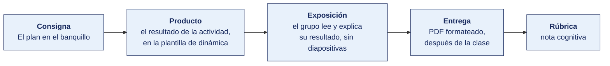

[Semana 01](README.md) · [Teoría](1-TEORIA.md) · **Dinámica de aula** · [Taller de laboratorio](3-TALLER.md)

# Dinámica de aula · El plan en el banquillo

**SI-886 · Planeamiento Estratégico de TI** · Semana 01 · Actividad en aula, **dentro de los 100 min de la sesión de teoría** · calificación **cognitiva**

> ¿Un término no le resulta claro? Está definido en el [glosario técnico del curso](../GLOSARIO.md).

---

## Cómo funciona la actividad

## Qué entregas

| | |
|---|---|
| **Archivo** | `SI886-S01-DINAMICA-Grupo<N>.pdf` |
| **Plantilla obligatoria** | [SI886-PLANTILLA-DINAMICA.docx](../PLANTILLAS/SI886-PLANTILLA-DINAMICA.docx) |
| **Formato** | PDF exportado desde la plantilla en Word, con la carátula de la UPT y los apellidos, nombres y códigos de todos los integrantes |
| **Dónde se sube** | Aula virtual, tarea «Dinámica · Semana 01» |
| **Cuándo vence** | Hasta 24 h después de la sesión de teoría. La tabla se resuelve en aula; el PDF se formatea y se sube después |
| **Exposición** | En la ronda de cierre de **esta misma sesión**. El grupo **lee y explica su resultado** ante el aula, con el documento a la vista. No se usan diapositivas |

> No se califica un trabajo entregado en `.docx`, sin carátula, sin los códigos de los integrantes o con la tabla del producto incompleta.

---

## Consigna

> **«El plan en el banquillo»**
> Una organización pagó una consultoría y recibió el plan que su equipo tiene delante. Un año después no se ejecutó nada. La gerencia quiere saber si el plan era malo o si falló la ejecución.

| | |
|---|---|
| **Su papel** | La mitad del aula es la **fiscalía**, que sostiene que el plan era inejecutable desde el día uno. La otra mitad es la **defensa**, que sostiene que el plan servía. Los papeles se reparten al empezar la actividad |
| **Misión** | Ganar el veredicto del aula sobre si el plan era ejecutable |
| **Restricción** | **Una sola frase del extracto como prueba.** La segunda no se escucha. Y noventa segundos por intervención |

Es la prueba de fuego que se acaba de ver en la teoría. *Si un gerente que no es de TI no puede responder qué gana la empresa con este plan, el plan no se ejecutará.*

## Cómo se desarrolla · 35 minutos

| | Bloque | Quién | Minutos |
|---|---|---|---|
| **1** | **Instrucción del caso.** Cada equipo lee su extracto buscando **su única prueba**, según el papel que le tocó | Equipo | 9 |
| **2** | **El juicio.** La fiscalía formula el cargo en 90 segundos. La defensa responde en 90. Sin réplica | Todos | 10 |
| **3** | **El veredicto.** El aula vota a mano alzada. Se anota el conteo | Todos | 8 |
| **4** | **La sentencia.** El lado que ganó reescribe la frase para que el plan sí se ejecute, y dice qué otra parte del plan cambia con ella | Equipo | 8 |

## Material de trabajo

Uno por equipo.

### Extracto 1 · Agroexportadora de aceituna · 142 trabajadores · TI 3 personas · S/ 486 000

> **Objetivo 2.** «Modernizar la infraestructura tecnológica de la empresa para soportar el crecimiento.»
> **Indicador.** «Nivel de modernización tecnológica. Meta, alto.»
> **Proyectos.** Renovación de servidores · Actualización de licencias · Mejora de la red · Sistema de trazabilidad.
> **Responsable.** «Jefatura de Sistemas.»
> **Plazo.** «Durante la vigencia del plan.»
> **Presupuesto.** «Según disponibilidad presupuestal de cada ejercicio.»

### Extracto 2 · Clínica privada de 60 camas · 310 trabajadores · TI 6 personas · S/ 1 240 000

> **Objetivo 1.** «Reducir el tiempo de espera en consulta externa de 42 a 25 minutos al cierre del tercer año.»
> **Indicador.** «Tiempo medio de espera, medido por el sistema de admisión. Línea base 42 min, medida en diciembre. Responsable, Jefatura de Admisión. Frecuencia mensual.»
> **Proyectos.** Integración de historia clínica y laboratorio · Autoservicio de citas.
> **Responsable.** «Jefatura de TI, con la Jefatura de Admisión como área usuaria.»
> **Presupuesto.** «S/ 420 000 en tres años, aprobado en sesión de Directorio del 14/11.»
> **Riesgos.** «Ninguno identificado.»

### Extracto 3 · Municipalidad distrital · 41 800 habitantes · TI 3 personas · S/ 520 000

> **Objetivo 4.** «Implementar el gobierno digital en la Municipalidad conforme a la normativa vigente.»
> **Indicador.** «Cumplimiento normativo. Meta 100 %.»
> **Proyectos.** Mesa de partes virtual · Portal de transparencia · Firma digital · Interoperabilidad con la PIDE · Expediente electrónico · Aplicación móvil del vecino.
> **Responsable.** «Comité de Gobierno Digital.»
> **Nota al pie.** «El Comité será conformado una vez aprobado el presente plan.»
> **Presupuesto.** «S/ 96 000.»

### Extracto 4 · Cooperativa de ahorro y crédito · 18 400 socios · TI 7 personas · S/ 980 000

> **Objetivo 3.** «Incrementar la proporción de operaciones realizadas por canal digital del 18 % al 45 % al cierre del tercer año.»
> **Indicador.** «Operaciones por canal digital sobre el total. Línea base 18 %, tomada del core al 31/12. Metas anuales 26 %, 36 % y 45 %. Responsable, Jefatura de Canales.»
> **Proyectos.** Apertura de productos en la aplicación móvil · Firma digital · Campaña de adopción con los socios de mayor movimiento.
> **Presupuesto.** «S/ 340 000, con el detalle por año en el anexo 3.»
> **Supuesto declarado.** «La meta asume que la SBS mantiene el marco vigente de firma digital para cooperativas.»

### Extracto 5 · Empresa de transporte de carga · 96 trabajadores · TI 2 personas · S/ 320 000

> **Objetivo 1.** «Ser líderes en innovación tecnológica en el sector transporte de la macrorregión sur.»
> **Indicador.** «Posicionamiento como líder tecnológico.»
> **Proyectos.** Inteligencia artificial para optimización de rutas · Internet de las cosas en la flota · Analítica avanzada · Blockchain para trazabilidad de la carga.
> **Responsable.** «Gerencia General y Jefatura de TI.»
> **Presupuesto.** «S/ 280 000.»

### Extracto 6 · Distribuidora mayorista · 157 trabajadores · TI 4 personas · S/ 742 000

> **Objetivo 4.** «Modernizar la infraestructura tecnológica.»
> **Indicador.** «Porcentaje de avance del plan de TI. Meta 100 %.»
> **Observación de la Gerencia, incorporada al plan.** «Este objetivo está en el plan desde su aprobación en 2024, pero nunca se desagregó en proyectos ni se le asignó presupuesto específico.»
> **Proyectos.** «Por definir.»
> **Responsable.** «Jefatura de Sistemas.»
> **Presupuesto.** «El asignado anualmente al área.»

### Extracto 7 · Instituto de educación superior · 2 100 estudiantes · TI 3 personas · S/ 410 000

> **Objetivo 3.** «Implementar el campus virtual en el 100 % de las carreras al cierre del segundo año.»
> **Indicador.** «Carreras con campus virtual implementado, sobre el total de carreras. Línea base 0 de 8. Meta 8 de 8.»
> **Proyectos.** Licenciamiento de la plataforma · Migración de contenidos · Capacitación docente.
> **Responsable.** «Jefatura de TI.»
> **Presupuesto.** «S/ 210 000.»
> **Del diagnóstico del mismo plan.** «El problema declarado en tres actas del último año es la deserción del primer ciclo, que alcanza el 34 %.»

### Extracto 8 · Empresa de saneamiento · 68 000 conexiones · TI 5 personas · S/ 890 000

> **Objetivo 2.** «Reducir el tiempo de atención de reclamos de 9 a 5 días hábiles al cierre del segundo año.»
> **Indicador.** «Días hábiles entre el registro y el cierre del reclamo. Línea base 9 días, del registro único de reclamos. Frecuencia mensual. Responsable, Jefatura Comercial.»
> **Proyectos.** Portal del usuario con estado del reclamo · Integración de catastro comercial y facturación.
> **Responsable.** «Jefatura de TI.»
> **Presupuesto.** «S/ 257 000 en dos años.»
> **Riesgo declarado.** «La integración de catastro y facturación está en el plan desde 2022 sin ejecutarse. Se asigna presupuesto propio y hito de decisión al sexto mes.»

### Extracto 9 · Servicios de ingeniería para minería · 88 trabajadores · TI 4 personas · S/ 640 000

> **Objetivo 1.** «Desarrollar dos servicios nuevos por año basados en instrumentación propia.»
> **Indicador.** «Servicios nuevos lanzados al año. Línea base 1.5 servicios por año, promedio de los dos años previos. Meta 2.»
> **Proyectos.** Laboratorio de ensayo de sensores · Portal de telemetría para el cliente.
> **Responsable.** «Jefatura de Proyectos, con la Jefatura de TI como soporte.»
> **Presupuesto.** «S/ 405 000, aprobado.»
> **Dependencia.** «El portal de telemetría requiere que el laboratorio esté operativo. Se secuencian, no se ejecutan en paralelo.»

### Extracto 10 · Cadena regional de farmacias · 34 locales · TI 5 personas · S/ 560 000

> **Objetivo 1.** «Elevar la recompra del cliente frecuente en 25 %.»
> **Indicador.** «Incremento de la recompra. Meta 25 %.»
> **Proyectos.** Historial de compra en el mostrador · Aplicación de pedido y retiro en local · Reposición predictiva.
> **Responsable.** «Jefatura de TI.»
> **Presupuesto.** «S/ 368 000.»
> **Del diagnóstico del mismo plan.** «El programa de cliente frecuente registra la compra desde 2021 y nunca se ha explotado. No existe medición de recompra.»

## Producto

**La ficha del juicio.**

| | Contenido |
|---|---|
| **Nuestro papel** | Fiscalía o defensa |
| **Nuestra única prueba** | La frase transcrita entre comillas, y **cuál de los cinco defectos** la condena, o por qué supera **la prueba de fuego** |
| **El cargo o el descargo** | Una frase. La que se dijo en el juicio |
| **El veredicto del aula** | Ejecutable o inejecutable, con el conteo de votos |
| **La frase corregida** | Cómo debió escribirse, y **qué otra parte del plan hay que cambiar** como consecuencia |

> **Dónde va.** Este producto se presenta en la **sección 2 de la [plantilla de dinámica](../PLANTILLAS/SI886-PLANTILLA-DINAMICA.docx)**, «El producto». No se copia la consigna ni la teoría. Solo el resultado y lo que lo sostiene.

## Ejemplo resuelto

*El caso de este ejemplo es distinto del que le toca a tu grupo. Sirve para que veas el nivel de detalle que se espera, no para copiarlo.*

**El extracto.** Plan de TI de una caja municipal, sección «Objetivos».

> «Modernizar la plataforma tecnológica de la institución mediante la adquisición de soluciones de última generación, a fin de mejorar la calidad del servicio y contribuir al desarrollo regional.»

**Nos tocó la fiscalía.**

| | Contenido |
|---|---|
| **Nuestro papel** | Fiscalía |
| **Nuestra única prueba** | *«mediante la adquisición de soluciones de última generación»*. El defecto es **el objetivo escrito como compra**, no como resultado del negocio |
| **El cargo** | El objetivo no dice qué gana la caja. Dice qué compra. Cuando llegue el recorte, nadie sabrá qué se pierde si no se compra |
| **El veredicto del aula** | Inejecutable · 7 votos contra 4 |
| **La frase corregida** | «Reducir de 9 a 4 días el plazo de desembolso de un crédito de campaña.» Cambia también el **portafolio**, porque ahora el proyecto se evalúa por el plazo que reduce, no por la tecnología que trae |

**Por qué esa frase y no otra.** El extracto también dice «contribuir al desarrollo regional», que es igual de vago. Pero esa se defiende como declaración de intención. La compra no se defiende. Es una decisión de gasto disfrazada de objetivo.

**La diferencia entre aprobar y no aprobar**

| Así no | Así sí |
|---|---|
| «El objetivo es muy general.» | «Está escrito como una compra, no como un resultado. Dice qué se adquiere, no qué mejora.» |
| «Habría que redactarlo mejor.» | «Reducir de 9 a 4 días el plazo de desembolso.» |
| «Y ya está corregido.» | «Y con eso cambia el portafolio: el proyecto ahora se evalúa por el plazo, no por la tecnología.» |

## Reglas

- 35 min en aula, dentro de la sesión de teoría.
- **Una sola frase como prueba.** Si el equipo necesita dos, todavía no encontró la que decide.
- Prohibido decir «es muy general». El defecto tiene que ser **uno de los cinco defectos que matan un PETI** que se vieron hoy, nombrado tal cual.
- Noventa segundos por intervención. Pasado ese tiempo se cierra la intervención.
- El veredicto del aula no se discute. Se anota, aunque el equipo no esté de acuerdo.
- La exposición es la ronda de cierre de esta misma sesión. El grupo **lee y explica su resultado**. No se usan diapositivas.

## Rúbrica cognitiva (20 puntos)

| Criterio | 5 | 3 | 1 |
|---|---|---|---|
| **La prueba elegida** | Una sola frase, transcrita, y es la más fuerte del extracto para su papel | Una frase válida, habiendo otra más fuerte disponible | Varias frases, o una afirmación sin transcribir |
| **El defecto nombrado** | Es uno de **los cinco defectos que matan un PETI**, y se explica por qué esa frase lo encarna | Nombrado sin explicar | «Es muy general» |
| **La corrección** | La frase reescrita sería ejecutable, y se identifica qué otra parte del plan arrastra | Reescrita sin identificar la consecuencia | Reescrita con otro texto igual de vago |
| **La defensa en el juicio** | Sostiene su prueba ante la réplica del lado contrario sin cambiar de argumento | Responde con dudas pero mantiene el criterio | No sostiene su propia prueba |

---

---

[Semana 01](README.md) · [Teoría](1-TEORIA.md) · **Dinámica de aula** · [Taller de laboratorio](3-TALLER.md)

---

**Docente** · Dr. Oscar Juan Jimenez Flores
[oscarjimenezflores@upt.pe](mailto:oscarjimenezflores@upt.pe) · [LinkedIn](https://www.linkedin.com/in/oscar-jimenez-flores/) · [CTI Vitae — CONCYTEC](https://ctivitae.concytec.gob.pe/appDirectorioCTI/VerDatosInvestigador.do?id_investigador=33398)

Escuela Profesional de Ingeniería de Sistemas · Universidad Privada de Tacna · Tacna, Perú
