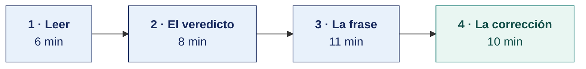

[Semana 01](README.md) · [Teoría](1-TEORIA.md) · **Dinámica de aula** · [Taller de laboratorio](3-TALLER.md)

# Dinámica de aula · La frase que condena al plan

**SI-886 · Planeamiento Estratégico de TI** · Semana 01 · Actividad en aula, **dentro de los 100 min de la sesión de teoría** · calificación **cognitiva**

> ¿Un término no le resulta claro? Está definido en el [glosario técnico del curso](../GLOSARIO.md).

---

## La pregunta

Su equipo recibe un extracto de un plan de tecnología ya aprobado por su organización.

Debe responder si ese plan **se va a ejecutar o no**, señalar **la única frase que lo decide** y actuar sobre ella.

**No todos los extractos están mal.** Algunos son planes sólidos, y declararlos inejecutables cuesta lo mismo que no ver el defecto de los que sí lo tienen.

## Lo que ya sabes de hoy

| De la teoría | Cómo se usa aquí |
|---|---|
| [Qué es un PETI y qué no es](1-TEORIA.md) | Los cinco defectos que hacen inejecutable un plan. Uno de ellos está en su extracto |
| [La organización objeto de estudio](1-TEORIA.md) | Un plan se juzga contra la organización que lo va a ejecutar, no en abstracto. El tamaño y el presupuesto de la ficha deciden |

## Cómo se desarrolla · 35 minutos

**Paso 1 · Leer — 6 min.** Se lee el extracto entero antes de opinar. Se anotan al margen los números que aparecen y los que faltan.

**Paso 2 · El veredicto — 8 min.** El equipo decide, sin matices, si el plan se ejecutará. No se admite «parcialmente». Un plan que se ejecuta a medias no se ejecutó, porque el beneficio se prometió completo.

**Paso 3 · La frase que decide — 11 min.** Se transcribe **una sola frase** del extracto, entre comillas. La que basta para sostener el veredicto, sea la que condena al plan o la que lo salva. Si el equipo necesita tres frases, todavía no encontró la que decide. Cuando la frase condena, se nombra el defecto al que corresponde.

**Paso 4 · La consecuencia — 10 min.** Si el plan no se ejecutará, se reescribe la frase para que sí lo haga y se dice **qué otra parte del plan hay que cambiar** como consecuencia. Corregir una frase sin tocar nada más suele significar que la corrección es cosmética.

Si el plan sí se ejecutará, se señala **el riesgo que sigue en pie pese a estar bien formulado**, y qué lo activaría.

## Qué entregas

| | |
|---|---|
| **Archivo** | `SI886-S01-DINAMICA-Grupo<N>.pdf` |
| **Plantilla obligatoria** | [SI886-PLANTILLA-DINAMICA.docx](../PLANTILLAS/SI886-PLANTILLA-DINAMICA.docx) |
| **Formato** | PDF exportado desde la plantilla en Word, con la carátula de la UPT y los apellidos, nombres y códigos de todos los integrantes |
| **Dónde se sube** | Aula virtual, tarea «Dinámica · Semana 01» |
| **Cuándo vence** | Antes de cerrar la sesión de teoría |
| **Exposición** | 10 minutos por grupo en la sesión de teoría de la Semana 02, con una o dos diapositivas hechas a partir de este documento |

> No se califica un trabajo entregado en `.docx`, sin carátula, sin los códigos de los integrantes o con la tabla del producto incompleta.

## Producto

**Un solo producto**, que va en la sección 2.1 de la plantilla, con estas cuatro filas.

| | Contenido |
|---|---|
| **Veredicto** | Se ejecutará o no se ejecutará. Sin matices |
| **La frase** | Una sola, transcrita entre comillas. Con el defecto que representa, si condena al plan |
| **Por qué esa frase lo decide** | Qué le ocurrirá al plan por causa de esa frase, en concreto y en el tiempo |
| **La consecuencia** | Si condena, la frase reescrita y el cambio que arrastra. Si salva, el riesgo que sigue en pie y qué lo activaría |

## Ejemplo resuelto

*Este extracto no es ninguno del anexo.*

> **Extracto.** Plan de Tecnología 2025-2027 de una empresa constructora de 70 trabajadores, TI de 2 personas, presupuesto de TI S/ 180 000 anuales.
> **Objetivo 3.** «Transformar digitalmente todos los procesos de la empresa, alcanzando la excelencia operativa mediante la adopción de tecnologías emergentes.»
> **Indicador.** «Porcentaje de avance de la transformación digital. Meta 100 %.»
> **Proyectos.** Implementar ERP, implementar CRM, implementar BI, implementar firma digital, implementar app móvil de obra, migrar a la nube.
> **Responsable.** «El área de TI, con apoyo de todas las áreas.»
> **Presupuesto.** «Se financiará con el presupuesto operativo asignado.»

| | Contenido |
|---|---|
| **Veredicto** | **No se ejecutará.** |
| **La frase** | «Porcentaje de avance de la transformación digital. Meta 100 %.» Defecto, **ausencia de línea base** |
| **Por qué esa frase lo decide** | Nadie puede calcular ese porcentaje. Sin línea base no hay numerador ni denominador, así que en la primera evaluación anual el avance lo declarará quien lo reporte. El plan no fracasará, se volverá **inverificable**, que es peor, porque nadie podrá demostrar que no se cumplió |
| **La corrección** | «Proporción de procesos críticos con soporte en sistema, de 2 de 9 hoy a 6 de 9 al cierre del tercer año.» Con ella hay que cambiar además la lista de proyectos, porque **seis implantaciones simultáneas no caben en un área de dos personas** con S/ 180 000. La corrección del indicador obliga a recortar el portafolio a dos proyectos |

> **Fíjese en el último párrafo.** Corregir el indicador destapó el problema real, que era el portafolio. Ese encadenamiento es lo que la rúbrica premia.

## Reglas

- 35 min en aula.
- El veredicto es binario. «Depende» no puntúa.
- **Cuatro de los diez extractos corresponden a planes ejecutables.** Buscar un defecto donde no lo hay se penaliza igual que no verlo donde lo hay.
- **Una sola frase** transcrita. Una lista de defectos no puntúa.
- La corrección debe arrastrar un cambio en otra parte del plan, y hay que nombrarlo.
- Exposición de 10 min en la Semana 02.

> **Varios extractos tienen más de un defecto grave, y otros no tienen ninguno.** Dos equipos pueden elegir frases distintas y los dos tener razón. Gana la exposición que demuestra que **su** frase es la que decide, y el equipo que defiende que su plan sí se ejecutará tiene que sostenerlo con la misma firmeza.

## Rúbrica cognitiva (20 puntos)

| Criterio | 5 | 3 | 1 |
|---|---|---|---|
| **Veredicto** | Binario y sostenido en el extracto | Binario, con fundamento débil | «Depende», o veredicto sin fundamento |
| **La frase** | Una sola, transcrita, y es la de mayor alcance del extracto | Una sola, transcrita, pero hay otra más determinante | Varias frases, o parafraseadas |
| **La consecuencia** | Describe qué le ocurrirá al plan, en concreto y en el tiempo | Nombra el defecto sin describir su consecuencia | Dice que «está mal formulado» |
| **La consecuencia** | Corrección ejecutable con el cambio que arrastra, o riesgo en pie con su detonante | Corrección o riesgo, sin arrastre ni detonante | Genérico, aplicable a cualquier plan |

---

## Anexo · Extractos para repartir

Uno por equipo.

### Extracto 1 · Agroexportadora de aceituna · 142 trabajadores · TI 3 personas · S/ 486 000

> **Objetivo 2.** «Modernizar la infraestructura tecnológica de la empresa para soportar el crecimiento.»
> **Indicador.** «Nivel de modernización tecnológica. Meta, alto.»
> **Proyectos.** Renovación de servidores · Actualización de licencias · Mejora de la red · Sistema de trazabilidad.
> **Responsable.** «Jefatura de Sistemas.»
> **Plazo.** «Durante la vigencia del plan.»
> **Presupuesto.** «Según disponibilidad presupuestal de cada ejercicio.»

### Extracto 2 · Clínica privada de 60 camas · 310 trabajadores · TI 6 personas · S/ 1 240 000

> **Objetivo 1.** «Reducir el tiempo de espera en consulta externa de 42 a 25 minutos al cierre del tercer año.»
> **Indicador.** «Tiempo medio de espera, medido por el sistema de admisión. Línea base 42 min, medida en diciembre. Responsable, Jefatura de Admisión. Frecuencia mensual.»
> **Proyectos.** Integración de historia clínica y laboratorio · Autoservicio de citas.
> **Responsable.** «Jefatura de TI, con la Jefatura de Admisión como área usuaria.»
> **Presupuesto.** «S/ 420 000 en tres años, aprobado en sesión de Directorio del 14/11.»
> **Riesgos.** «Ninguno identificado.»

### Extracto 3 · Municipalidad distrital · 41 800 habitantes · TI 3 personas · S/ 520 000

> **Objetivo 4.** «Implementar el gobierno digital en la Municipalidad conforme a la normativa vigente.»
> **Indicador.** «Cumplimiento normativo. Meta 100 %.»
> **Proyectos.** Mesa de partes virtual · Portal de transparencia · Firma digital · Interoperabilidad con la PIDE · Expediente electrónico · Aplicación móvil del vecino.
> **Responsable.** «Comité de Gobierno Digital.»
> **Nota al pie.** «El Comité será conformado una vez aprobado el presente plan.»
> **Presupuesto.** «S/ 96 000.»

### Extracto 4 · Cooperativa de ahorro y crédito · 18 400 socios · TI 7 personas · S/ 980 000

> **Objetivo 3.** «Incrementar la proporción de operaciones realizadas por canal digital del 18 % al 45 % al cierre del tercer año.»
> **Indicador.** «Operaciones por canal digital sobre el total. Línea base 18 %, tomada del core al 31/12. Metas anuales 26 %, 36 % y 45 %. Responsable, Jefatura de Canales.»
> **Proyectos.** Apertura de productos en la aplicación móvil · Firma digital · Campaña de adopción con los socios de mayor movimiento.
> **Presupuesto.** «S/ 340 000, con el detalle por año en el anexo 3.»
> **Supuesto declarado.** «La meta asume que la SBS mantiene el marco vigente de firma digital para cooperativas.»

### Extracto 5 · Empresa de transporte de carga · 96 trabajadores · TI 2 personas · S/ 320 000

> **Objetivo 1.** «Ser líderes en innovación tecnológica en el sector transporte de la macrorregión sur.»
> **Indicador.** «Posicionamiento como líder tecnológico.»
> **Proyectos.** Inteligencia artificial para optimización de rutas · Internet de las cosas en la flota · Analítica avanzada · Blockchain para trazabilidad de la carga.
> **Responsable.** «Gerencia General y Jefatura de TI.»
> **Presupuesto.** «S/ 280 000.»

### Extracto 6 · Distribuidora mayorista · 157 trabajadores · TI 4 personas · S/ 742 000

> **Objetivo 4.** «Modernizar la infraestructura tecnológica.»
> **Indicador.** «Porcentaje de avance del plan de TI. Meta 100 %.»
> **Observación de la Gerencia, incorporada al plan.** «Este objetivo está en el plan desde su aprobación en 2024, pero nunca se desagregó en proyectos ni se le asignó presupuesto específico.»
> **Proyectos.** «Por definir.»
> **Responsable.** «Jefatura de Sistemas.»
> **Presupuesto.** «El asignado anualmente al área.»

### Extracto 7 · Instituto de educación superior · 2 100 estudiantes · TI 3 personas · S/ 410 000

> **Objetivo 3.** «Implementar el campus virtual en el 100 % de las carreras al cierre del segundo año.»
> **Indicador.** «Carreras con campus virtual implementado, sobre el total de carreras. Línea base 0 de 8. Meta 8 de 8.»
> **Proyectos.** Licenciamiento de la plataforma · Migración de contenidos · Capacitación docente.
> **Responsable.** «Jefatura de TI.»
> **Presupuesto.** «S/ 210 000.»
> **Del diagnóstico del mismo plan.** «El problema declarado en tres actas del último año es la deserción del primer ciclo, que alcanza el 34 %.»

### Extracto 8 · Empresa de saneamiento · 68 000 conexiones · TI 5 personas · S/ 890 000

> **Objetivo 2.** «Reducir el tiempo de atención de reclamos de 9 a 5 días hábiles al cierre del segundo año.»
> **Indicador.** «Días hábiles entre el registro y el cierre del reclamo. Línea base 9 días, del registro único de reclamos. Frecuencia mensual. Responsable, Jefatura Comercial.»
> **Proyectos.** Portal del usuario con estado del reclamo · Integración de catastro comercial y facturación.
> **Responsable.** «Jefatura de TI.»
> **Presupuesto.** «S/ 257 000 en dos años.»
> **Riesgo declarado.** «La integración de catastro y facturación está en el plan desde 2022 sin ejecutarse. Se asigna presupuesto propio y hito de decisión al sexto mes.»

### Extracto 9 · Servicios de ingeniería para minería · 88 trabajadores · TI 4 personas · S/ 640 000

> **Objetivo 1.** «Desarrollar dos servicios nuevos por año basados en instrumentación propia.»
> **Indicador.** «Servicios nuevos lanzados al año. Línea base 1.5 servicios por año, promedio de los dos años previos. Meta 2.»
> **Proyectos.** Laboratorio de ensayo de sensores · Portal de telemetría para el cliente.
> **Responsable.** «Jefatura de Proyectos, con la Jefatura de TI como soporte.»
> **Presupuesto.** «S/ 405 000, aprobado.»
> **Dependencia.** «El portal de telemetría requiere que el laboratorio esté operativo. Se secuencian, no se ejecutan en paralelo.»

### Extracto 10 · Cadena regional de farmacias · 34 locales · TI 5 personas · S/ 560 000

> **Objetivo 1.** «Elevar la recompra del cliente frecuente en 25 %.»
> **Indicador.** «Incremento de la recompra. Meta 25 %.»
> **Proyectos.** Historial de compra en el mostrador · Aplicación de pedido y retiro en local · Reposición predictiva.
> **Responsable.** «Jefatura de TI.»
> **Presupuesto.** «S/ 368 000.»
> **Del diagnóstico del mismo plan.** «El programa de cliente frecuente registra la compra desde 2021 y nunca se ha explotado. No existe medición de recompra.»

---

---

[Semana 01](README.md) · [Teoría](1-TEORIA.md) · **Dinámica de aula** · [Taller de laboratorio](3-TALLER.md)

---

**Docente** · Dr. Oscar Juan Jimenez Flores
[oscarjimenezflores@upt.pe](mailto:oscarjimenezflores@upt.pe) · [LinkedIn](https://www.linkedin.com/in/oscar-jimenez-flores/) · [CTI Vitae — CONCYTEC](https://ctivitae.concytec.gob.pe/appDirectorioCTI/VerDatosInvestigador.do?id_investigador=33398)

Escuela Profesional de Ingeniería de Sistemas · Universidad Privada de Tacna · Tacna, Perú
