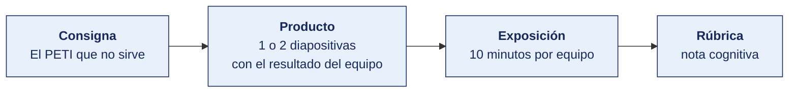

[Semana 01](README.md) · [Teoría](1-TEORIA.md) · **Dinámica de aula** · [Taller de laboratorio](3-TALLER.md)

# Dinámica de aula · El PETI que no sirve

**SI-886 · Planeamiento Estratégico de TI** · Semana 01 · Actividad en aula, **dentro de los 100 min de la sesión de teoría** · calificación **cognitiva**

> ¿Un término no le resulta claro? Está definido en el [glosario técnico del curso](../GLOSARIO.md).

---

## Cómo funciona la actividad

## Qué entregas

| | |
|---|---|
| **Archivo** | `SI886-S01-DINAMICA-Grupo<N>.pdf` |
| **Plantilla obligatoria** | [SI886-PLANTILLA-DINAMICA.docx](../PLANTILLAS/SI886-PLANTILLA-DINAMICA.docx) |
| **Formato** | PDF exportado desde la plantilla en Word, con la carátula de la UPT y los apellidos, nombres y códigos de todos los integrantes |
| **Qué va dentro** | Lo que el grupo resolvió en aula. Las tablas de la sección **Producto** van completas, con los textos redactados, y cada decisión va justificada |
| **Dónde se sube** | Aula virtual, tarea «Dinámica · Semana 01» |
| **Cuándo vence** | Antes de cerrar la sesión de teoría |
| **Exposición** | 10 minutos por grupo en la sesión de teoría de la Semana 02 |

> No se califica un trabajo entregado en `.docx`, sin carátula, sin los códigos de los integrantes o con las tablas del producto vacías.

---

## Consigna

> **«El PETI que no sirve»**
> Cada equipo recibe **un fragmento real de un Plan de Gobierno Digital publicado por una entidad pública peruana** (documento oficial que descargas del portal de la entidad; ver **Material de trabajo**). Debe **evaluarlo con los cinco defectos de la sección 1.2** y determinar si el plan es ejecutable.

## Material de trabajo

Cada equipo analiza el **Plan de Gobierno Digital de una entidad pública peruana distinta**. Son documentos públicos y los descargas tú.

**Dónde encontrarlo**

1. Entra al portal de la entidad en `www.gob.pe/<entidad>`, sección **Transparencia** o **Normas y documentos legales**.
2. Busca «Plan de Gobierno Digital». Suele estar aprobado por una resolución que lo acompaña.
3. Si la entidad no lo publica, prueba con el buscador de normas legales del portal, filtrando por «Plan de Gobierno Digital».

**Reparto de entidades.** El docente asigna una entidad por equipo en la primera sesión, para que no se repitan. Si el equipo no consigue el documento de su entidad en 20 minutos, lo informa y se le reasigna otra.

**Tipos de entidad que sirven para esta dinámica**

| Tipo | Ejemplos de entidad |
|---|---|
| Gobierno local | Una municipalidad provincial o distrital |
| Gobierno regional | Un gobierno regional y sus direcciones |
| Organismo público | Un organismo técnico especializado o regulador |
| Universidad pública | Una universidad nacional |

**Qué debe tener el documento para que sirva.** Al menos un diagnóstico de situación actual, una relación de proyectos y una sección de objetivos con indicadores. Si el documento tiene menos de 15 páginas o no llega a proponer proyectos, avisa: no permite aplicar los cinco defectos.

**Los cinco defectos que vas a buscar**

| Defecto | Cómo se reconoce |
|---|---|
| Desconexión estratégica | Los objetivos del plan digital no se pueden rastrear a ningún objetivo del plan estratégico institucional de la misma entidad |
| Diagnóstico decorativo | El diagnóstico describe la situación pero ningún proyecto responde a lo que describió |
| Portafolio sin priorización real | Los proyectos se listan sin criterio de orden, o todos son «prioridad alta» |
| Ausencia de línea base | Los indicadores tienen meta pero no valor de partida, o dicen «por definir» |
| Sin dueño ni gobernanza | No se nombra responsable de la ejecución ni órgano de seguimiento con periodicidad |

## Producto

**Diapositiva 1 — Diagnóstico del plan analizado.**

| Defecto | ¿Presente? | Evidencia (cita textual del documento, con página) | Consecuencia práctica |
|---|---|---|---|
| Desconexión estratégica | | | |
| Diagnóstico decorativo | | | |
| Portafolio sin priorización real | | | |
| Ausencia de línea base | | | |
| Sin dueño ni gobernanza | | | |

**Diapositiva 2 — La prueba de fuego.** Responder, **usando solo el documento analizado**: *¿qué gana la organización con este plan y cuándo?* Si el documento no permite responderlo, indicar **qué le falta exactamente** para permitirlo.

## Ejemplo resuelto

*El caso de este ejemplo es distinto del que le toca a tu grupo. Sirve para que veas el nivel de detalle que se espera, no para copiarlo.*

**Dos filas bien resueltas.** El plan del ejemplo es de una municipalidad distrital, distinto del que te toca.

| Defecto | ¿Presente? | Evidencia con cita textual y página | Consecuencia práctica |
|---|---|---|---|
| Desconexión estratégica | **Sí** | El plan declara en la página 12 que su objetivo es «modernizar la gestión municipal mediante el uso de tecnologías de la información». El plan estratégico institucional de la misma entidad fija en su página 8 el objetivo «reducir el tiempo de atención de licencias de funcionamiento de 30 a 15 días». Ningún proyecto del plan de gobierno digital menciona licencias de funcionamiento. | Los siete proyectos del plan pueden ejecutarse al 100 % sin que el tiempo de atención de licencias baje un solo día. El plan no está obligado a producir el resultado que la entidad comprometió. |
| Ausencia de línea base | **Sí** | El indicador «porcentaje de trámites digitalizados» aparece en la página 34 con meta 60 %, y en la columna de línea base figura «por definir». | No se puede saber si 60 % es una meta exigente o un valor ya alcanzado. Al cierre del horizonte nadie podrá afirmar si el plan sirvió, porque no hay punto de partida contra el cual comparar. |

*La prueba de fuego*

> **¿Qué gana la organización con este plan y cuándo?**
>
> El documento no permite responderlo. Enuncia siete proyectos con su presupuesto, pero ninguno declara qué cambia para el ciudadano ni en qué fecha. El único beneficio expresado es «mejorar la eficiencia de los procesos internos», sin magnitud ni plazo.
>
> **Qué le falta exactamente.** Tres cosas. Una línea base medida para cada uno de los cinco indicadores. Una meta anual por indicador, no solo la meta final del horizonte. Y la trazabilidad explícita de cada proyecto al objetivo del plan estratégico institucional que contribuye a cerrar.

**La diferencia entre aprobar y no aprobar.**

| Así no | Así sí |
|---|---|
| «El plan tiene desconexión estratégica.» | «El plan estratégico institucional fija reducir licencias de 30 a 15 días (p. 8). Ningún proyecto del plan digital menciona licencias.» |
| «Evidencia: se observa en el documento.» | «Página 34: meta 60 %, línea base "por definir".» |
| «Consecuencia: el plan no sirve.» | «Los siete proyectos pueden ejecutarse al 100 % sin que el tiempo de atención baje un día.» |

## Reglas

- 35 min en aula. Entrega como `S01_<equipo>_diagnostico_peti.pdf`.
- Toda afirmación debe sostenerse en una **cita textual con número de página**.
- Prohibido descalificar el documento sin evidencia. Se evalúa el análisis, no la opinión.
- Exposición de 10 min en la Semana 02.

## Rúbrica cognitiva (20 puntos)

| Criterio | 5 | 3 | 1 |
|---|---|---|---|
| **Evidencia documental** | Cada defecto sostenido en cita textual con página | La mayoría con evidencia | Afirmaciones sin sustento |
| **Precisión del diagnóstico** | Distingue los cinco defectos sin confundirlos | Identifica tres o cuatro correctamente | Confunde defectos entre sí |
| **Prueba de fuego** | Responde con el documento, o identifica con precisión qué falta | Respuesta parcial | No la aborda |
| **Consecuencia práctica** | Explica qué ocurriría en la ejecución real del plan | Consecuencia general | Ausente |

---

---

[Semana 01](README.md) · [Teoría](1-TEORIA.md) · **Dinámica de aula** · [Taller de laboratorio](3-TALLER.md)

---

**Docente** · Dr. Oscar Juan Jimenez Flores
[oscarjimenezflores@upt.pe](mailto:oscarjimenezflores@upt.pe) · [LinkedIn](https://www.linkedin.com/in/oscar-jimenez-flores/) · [CTI Vitae — CONCYTEC](https://ctivitae.concytec.gob.pe/appDirectorioCTI/VerDatosInvestigador.do?id_investigador=33398)

Escuela Profesional de Ingeniería de Sistemas · Universidad Privada de Tacna · Tacna, Perú
