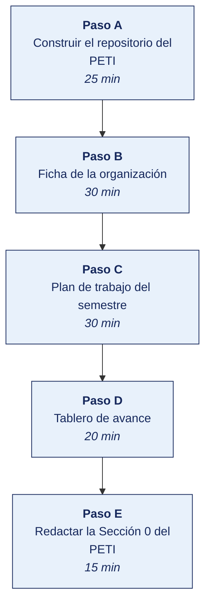

[Semana 01](README.md) · [Teoría](1-TEORIA.md) · [Dinámica de aula](2-DINAMICA.md) · **Taller de laboratorio**

# Taller de laboratorio 01 · Repositorio del PETI, selección de la organización y tablero de avance

**SI-886 · Planeamiento Estratégico de TI** · Semana 01 · Sesión 2 en laboratorio · 2 h · calificación **procedimental**

---

## Secuencia del taller



## Qué entregas

| | |
|---|---|
| **Archivo** | `SI886-S01-TALLER-Grupo<N>.pdf` |
| **Plantilla obligatoria** | [SI886-PLANTILLA-TALLER.docx](../PLANTILLAS/SI886-PLANTILLA-TALLER.docx) |
| **Formato** | PDF exportado desde la plantilla en Word, con la carátula de la UPT, el índice actualizado y las capturas numeradas |
| **Qué va dentro** | Las siete secciones del formato EPIS. La sección **3. Resultados** se califica contra la tabla de resultados esperados de esta guía, y cada resultado necesita su evidencia |
| **Dónde se sube** | Aula virtual, tarea «Taller · Semana 01» |
| **Cuándo vence** | 48 horas después de la sesión de laboratorio |

> No se califica un informe entregado en `.docx`, sin carátula, sin los códigos de los integrantes o con resultados declarados sin evidencia.

---

## 1. Información sobre el evento práctico

### 1.1. Título del evento práctico

Construcción del entorno de trabajo del plan — repositorio versionado con la estructura completa del PETI, ficha de la organización objeto de estudio, plan de trabajo del semestre y tablero de avance.

### 1.2. Objetivos

- Construir el **repositorio del PETI** con la estructura de las diez secciones del documento y su control de versiones.
- Elaborar la **ficha de la organización** propuesta y la evidencia del acercamiento inicial.
- Redactar la **carta de presentación** y el **acuerdo de confidencialidad**.
- Definir el **plan de trabajo del semestre** con hitos por semana y responsables por integrante.
- Desplegar un **tablero de avance** para gestionar el encargo.
- Producir la **Sección 0** del PETI. Presentación, control de versiones y equipo formulador.

### 1.3. Tiempo de duración

**02 horas.**

### 1.4. Resultados de Aprendizaje (RA)

- **RA1** Aplica la dirección estratégica, definiendo la misión y visión.
- **RA2** Desarrolla el análisis FODA.

### 1.5. Recursos (equipos, materiales, programas y otros)

**Equipos y sistema operativo**

| Recurso | Requisito mínimo |
|---|---|
| Computadora | 4 GB de RAM, 5 GB libres en disco |
| Sistema operativo | Windows, Linux o macOS |
| Conexión | Necesaria para el repositorio remoto y la descarga de datos oficiales |

**Herramientas y enlaces de descarga.** Todas son libres o gratuitas. Se instalan **antes** de la sesión.

| Herramienta | Para qué se usa en este laboratorio | Descarga |
|---|---|---|
| **Git** | Versionar el documento del PETI sección por sección. *GPL-2.0* | https://git-scm.com/downloads |
| **GitHub** o **GitLab** | Repositorio remoto privado del equipo. *Nivel gratuito* | https://github.com/signup · https://gitlab.com/users/sign_up |
| **Visual Studio Code** | Redactar el documento en Markdown. *MIT* | https://code.visualstudio.com/download |
| **Markdown All in One** | Extensión de VS Code: índice automático y vista previa. *MIT* | https://marketplace.visualstudio.com/items?itemName=yzhang.markdown-all-in-one |
| **Pandoc** | Convertir el documento a PDF y a Word para la gerencia. *GPL-2.0* | https://pandoc.org/installing.html |
| **LibreOffice** | Fichas, matrices y presupuesto. *MPL-2.0* | https://www.libreoffice.org/download/download-libreoffice/ |
| **draw.io / diagrams.net** | Diagramas de arquitectura y cadena de valor. *Apache 2.0* | https://www.drawio.com/ · en línea: https://app.diagrams.net/ |
| **Wekan** o **Taiga** *(opcional)* | Tablero de avance del equipo, en Docker. *MIT / AGPL* | https://wekan.github.io/ · https://taiga.io/ |

**Fuentes de datos oficiales que se consultarán**

| Fuente | Qué aporta al diagnóstico | Enlace |
|---|---|---|
| **INEI** | Estadísticas de TIC en hogares, población y empresas | https://www.inei.gob.pe |
| **BCRP** | Series macroeconómicas para el análisis del entorno | https://estadisticas.bcrp.gob.pe |
| **OSIPTEL** | Cobertura y penetración de servicios de telecomunicaciones | https://www.osiptel.gob.pe |
| **Plataforma Nacional de Datos Abiertos** | Conjuntos de datos de entidades públicas | https://www.datosabiertos.gob.pe |
| **Portal de Transparencia Estándar** | PEI, POI y PGD de la entidad elegida | https://www.transparencia.gob.pe |

> **Verificación previa.** Ejecuta `git --version` y `pandoc --version`. Si el equipo trabajará con una entidad pública, descargue **antes** su PEI y su PGD del portal de transparencia.

### 1.6. Seguridad

1. El repositorio del equipo es **privado**. La información de la organización se clasifica **Confidencial**.
2. No se solicita ningún documento a la organización antes de entregar la carta de presentación y firmar el acuerdo de confidencialidad.
3. En el documento del PETI **no se nombran personas naturales**. Se usan cargos. La excepción es el equipo formulador.
4. Los datos financieros de la organización se agregan o se expresan en porcentajes cuando su detalle no es necesario.

---

## 2. Procedimiento o Metodología

### Paso A — Construir el repositorio del PETI (25 min)

```bash
mkdir -p peti-<organizacion>/{00_gestion,01_marco,02_identidad,03_diagnostico,\
04_normativa,05_arquitectura,06_gobierno_digital,07_portafolio,08_riesgos,\
09_aprobacion,10_implementacion,anexos,evidencias,graficos}
cd peti-<organizacion>
git init
```

| Carpeta | Sección del PETI | Semana |
|---|---|---|
| `00_gestion` | Sección 0 Presentación, versiones, equipo, plan de trabajo | 01 |
| `01_marco` | Sección 1 Contexto, tendencias y articulación de instrumentos | 02, 03 |
| `02_identidad` | Sección 2 Misión, visión, valores, cultura | 04, 05 |
| `03_diagnostico` | Sección 3 Análisis interno, externo, PESTEL, FODA | 06, 07 |
| `04_normativa` | Sección 4 Marco normativo y marcos de gestión | 08, 09 |
| `05_arquitectura` | Sección 5 Arquitectura empresarial | 10 |
| `06_gobierno_digital` | Sección 6 Situación actual y objetivos | 11, 12 |
| `07_portafolio` | Sección 7 Portafolio, priorización, hoja de ruta, presupuesto | 13, 14 |
| `08_riesgos` | Sección 8 Gestión de riesgos del plan | 15 |
| `09_aprobacion` | Sección 9 Documento integrado y aprobación | 16 |
| `10_implementacion` | Sección 10 Implementación, comunicación y supervisión | 17 |
| `evidencias` | Documentos recibidos, entrevistas, encuestas | Todas |
| `anexos` | Instrumentos, fichas técnicas, modelos | Todas |

**Control de versiones del documento** (`00_gestion/CONTROL_VERSIONES.md`):

| Versión | Fecha | Secciones incorporadas | Elaborado por | Revisado por | Cambios respecto de la versión anterior |
|---|---|---|---|---|---|
| 0.1 | | Sección 0 | | | Versión inicial |

> **Por qué importa.** Un PETI real se revisa entre diez y veinte veces antes de aprobarse. El control de versiones permite que la organización vea qué cambió tras cada revisión, y esa trazabilidad es lo que sostiene la confianza en el documento.

### Paso B — Ficha de la organización (30 min)

`00_gestion/FICHA_ORGANIZACION.md`:

| Campo | Contenido | Fuente |
|---|---|---|
| Razón social y RUC | | SUNAT — consulta RUC |
| Tipo | Privada / Pública / ONG / Cooperativa / Educativa | |
| **Régimen normativo aplicable** | ¿Le aplica la Ley de Gobierno Digital? ¿Es supervisada por SBS, SMV, SUNEDU u otro? | |
| Sector y actividad económica | | CIIU |
| Antigüedad y ámbito geográfico | | |
| Personal (total y por área) | | Organigrama |
| Ingresos o presupuesto anual aproximado | | Estados financieros o presupuesto público |
| Productos o servicios principales | | |
| Clientes o usuarios (cantidad y tipo) | | |
| **Estructura de TI**: personas, dependencia jerárquica, presupuesto | | Organigrama y entrevista |
| Sistemas de información en producción | Nombre, función, proveedor, antigüedad | Entrevista |
| ¿Existe un plan estratégico institucional o de negocio vigente? | | |
| ¿Existe un PETI o PGD previo? | | |
| Contacto: cargo, disponibilidad, expectativas | | |
| **Evidencia del acercamiento** | Correo, acta de reunión o carta de aceptación | Adjunto |

**Carta de presentación** (`00_gestion/CARTA_PRESENTACION.md`) — una página con: identificación del curso y la universidad, propósito académico, qué se solicita a la organización (entrevistas y documentación), **qué recibe la organización a cambio** (el PETI completo), compromiso de confidencialidad y datos del docente responsable.

**Acuerdo de confidencialidad** (`00_gestion/ACUERDO_CONFIDENCIALIDAD.md`) — con: información alcanzada, obligaciones del equipo, prohibición de divulgación y de uso distinto del académico, destino de la información al cierre y plazo de vigencia.

### Paso C — Plan de trabajo del semestre (30 min)

`00_gestion/PLAN_TRABAJO.csv`:

| Semana | Sección del PETI | Entregable del laboratorio | Insumo requerido de la organización | Responsable | Estado |
|---|---|---|---|---|---|
| 01 | Sección 0 | Repositorio, ficha, plan de trabajo | Aceptación del acercamiento | | |
| 02 | Sección 1.1 | Contexto y tendencias | — (fuentes públicas) | | |
| 03 | Sección 1.2 | Marco de planeamiento | Plan institucional o de negocio | | |
| 04 | Sección 2.1–2.2 | Misión y visión | **Entrevista 1: gerencia** | | |
| 05 | Sección 2.3–2.4 | Valores y cultura | **Encuesta al personal** | | |
| 06 | Sección 3.1–3.2 | Análisis interno y externo | Organigrama, procesos, presupuesto de TI | | |
| 07 | Sección 3.3–3.5 | PESTEL y FODA cruzado | — | | |
| 08 | Sección 4.1 | Marco normativo | Contratos y normativa sectorial | | |
| 09 | Sección 4.2–4.3 | Marcos de gestión y madurez | **Entrevista 2: jefatura de TI** | | |
| 10 | Sección 5 | Arquitectura empresarial | Inventario de sistemas e integraciones | | |
| 11 | Sección 6.1 | Situación del gobierno digital | Indicadores actuales | | |
| 12 | Sección 6.2 | Objetivos e indicadores | — | | |
| 13 | Sección 7.1 | Portafolio | Necesidades por área | | |
| 14 | Sección 7.2–7.4 | Priorización y hoja de ruta | **Entrevista 3: gerencia — criterios y presupuesto** | | |
| 15 | Sección 8 | Riesgos | — | | |
| 16 | Sección 9 | Documento integrado | Revisión de la organización | | |
| 17 | Sección 10 | Implementación y supervisión | — | | |

> **Las tres entrevistas son el cuello de botella del semestre.** Se agendan **esta semana**, no cuando se necesiten: conseguir 45 minutos de un gerente con dos semanas de anticipación es viable; con dos días, no.

**Matriz de responsabilidades del equipo** (`00_gestion/RACI_EQUIPO.csv`): por cada sección del PETI, quién es responsable (R), quién aprueba (A), a quién se consulta (C) y a quién se informa (I). **Un solo A por sección.**

### Paso D — Tablero de avance (20 min)

```bash
# Wekan — tablero kanban libre
docker run -d --name peti_wekan -p 127.0.0.1:8088:8080 \
  -e ROOT_URL=http://127.0.0.1:8088 \
  -e MONGO_URL=mongodb://peti_mongo:27017/wekan \
  --link peti_mongo:peti_mongo wekan/wekan

# (previamente)
docker run -d --name peti_mongo mongo:6 --oplogSize 128
```

Columnas del tablero. **Pendiente · Insumo solicitado · En elaboración · En revisión interna · Aprobado por el equipo · Validado por la organización**.

Se carga una tarjeta por sección del PETI, con responsable, semana comprometida, insumo requerido y criterio de terminado.

> **Alternativa sin Docker:** el mismo tablero en un archivo `TABLERO.md` versionado, o en un proyecto de GitHub/GitLab. Lo que importa es la **visibilidad del avance**, no la herramienta.

### Paso E — Redactar la Sección 0 del PETI (15 min)

`00_gestion/00_presentacion.md`:

```markdown
# Plan Estratégico de Tecnologías de Información
## <Organización> · Horizonte: tres años

**Documento en elaboración** · Versión 0.1 · <fecha>
**CONFIDENCIAL** — Elaborado en el marco del curso SI-886 Planeamiento Estratégico de TI,
Escuela Profesional de Ingeniería de Sistemas, Universidad Privada de Tacna.

## 0.1 Presentación
Propósito del documento, horizonte temporal, alcance organizacional y destinatarios.

## 0.2 Metodología
Marcos y guías aplicados: Lineamientos para la formulación del Plan de Gobierno Digital
(RSGD 005-2018-PCM/SEGDI) si aplica; COBIT 2019; TOGAF ADM; ISO/IEC 38500:2024;
ISO 31000:2018. Fuentes de evidencia: entrevistas, encuestas, documentación institucional
y estadística oficial.

## 0.3 Equipo formulador
| Integrante | Rol en el equipo | Secciones bajo su responsabilidad |

## 0.4 Contraparte de la organización
| Cargo | Rol en la formulación del plan |

## 0.5 Control de versiones
(tabla de CONTROL_VERSIONES.md)

## 0.6 Estructura del documento
Índice de las diez secciones con su descripción en una línea.
```

```bash
pandoc 00_gestion/00_presentacion.md -o 00_gestion/00_presentacion.pdf \
  -V geometry:margin=2.5cm -V fontsize=11pt
git add . && git commit -m "S01: estructura del repositorio, ficha de la organizacion y seccion 0 del PETI"
git tag -a v0.1 -m "PETI v0.1 — presentacion y plan de trabajo"
```

---

## 3. Resultados

| # | Resultado esperado | Verificación |
|---|---|---|
| 1 | Repositorio Git privado con las 14 carpetas y el docente como colaborador | URL del repositorio |
| 2 | `CONTROL_VERSIONES.md` con la versión 0.1 registrada | Contenido del archivo |
| 3 | Ficha de la organización completa, **incluido su régimen normativo** | `FICHA_ORGANIZACION.md` |
| 4 | Evidencia del acercamiento a la organización (correo, acta o carta) | Adjunto en `evidencias/` |
| 5 | Carta de presentación y acuerdo de confidencialidad redactados | `00_gestion/` |
| 6 | Plan de trabajo con las 17 semanas, insumos y responsables | `PLAN_TRABAJO.csv` |
| 7 | **Las tres entrevistas agendadas con fecha**, o la gestión iniciada con evidencia | Plan de trabajo |
| 8 | Matriz RACI del equipo con **un solo responsable de aprobación por sección** | `RACI_EQUIPO.csv` |
| 9 | Tablero de avance operativo con una tarjeta por sección | Captura o archivo |
| 10 | Sección 0 del PETI redactada y generada en PDF | `00_presentacion.pdf` |
| 11 | Etiqueta `v0.1` en Git | `git tag` |

## 4. Conclusiones

Mínimo tres. Líneas argumentales esperadas:

1. La estructura del documento decidida al inicio determina la calidad del resultado. Un PETI construido sección por sección durante el semestre es coherente; uno redactado al final es una recopilación.
2. El acceso a la organización es el recurso más escaso del encargo, y su gestión —entrevistas agendadas con anticipación, insumos solicitados con plazo— condiciona todo el cronograma.
3. El control de versiones no es una formalidad técnica. Es lo que permite mostrar a la organización qué cambió tras cada revisión y sostener la confianza en el documento.

## 5. Cuestionario

1. Enumera los cinco defectos que inutilizan un PETI y explica cuál de ellos considera más difícil de detectar desde fuera del documento.
2. ¿Por qué un PETI cuyo diagnóstico concluye exactamente lo necesario para justificar una compra ya decidida es metodológicamente inválido? ¿Cómo se detecta ese patrón?
3. La organización elegida es una entidad pública. ¿Qué obligación normativa específica tiene respecto de su Plan de Gobierno Digital y con qué periodicidad?
4. Diferencia **plan estratégico institucional**, **PETI** y **Plan de Gobierno Digital**, indicando el alcance de cada uno.
5. Tu contacto en la organización es el jefe de TI y no consigue acceso a la gerencia. ¿Qué secciones del PETI quedan comprometidas y cómo lo resolvería?
6. Justifica por qué el documento no debe nombrar personas naturales y qué se usa en su lugar.
7. Redacta el criterio de terminado de la Sección 2.1 «Misión». ¿Qué debe cumplir para considerarse aprobada por el equipo?

## 6. Referencias Bibliográficas

- Rodríguez Bermúdez, J. R. (2015). *Planificación y dirección estratégica de sistemas de información*. Editorial UOC. https://elibro.net/es/lc/bibliotecaupt/titulos/57875
- Rodríguez Bermúdez, J. R. (2015). *Usos estratégicos de las TIC*. Editorial UOC. https://elibro.net/es/lc/bibliotecaupt/titulos/57677
- González Millán, J. (2020). *Manual práctico de planeación estratégica*. Ediciones Díaz de Santos. https://elibro.net/es/lc/bibliotecaupt/titulos/129291
- Resolución de Secretaría de Gobierno Digital 005-2018-PCM/SEGDI — *Lineamientos para la formulación del Plan de Gobierno Digital*, Anexo I. https://cdn.www.gob.pe/uploads/document/file/356863/Anexo_I_Lineamientos_PGD.pdf
- Decreto Legislativo 1412, Ley de Gobierno Digital. https://www.gob.pe/institucion/pcm/colecciones/147-normativa-sobre-gobierno-digital
- Decreto Supremo 029-2021-PCM, Reglamento de la Ley de Gobierno Digital. https://www.gob.pe/13326-reglamento-de-la-ley-de-gobierno-digital
- CEPLAN. *Guía para el Planeamiento Institucional*. https://www.gob.pe/ceplan
- MINTIC Colombia. *Guía para la construcción del Plan Estratégico de Tecnologías de la Información — PETI*. https://www.mintic.gov.co/arquitecturati/630/w3-propertyvalue-8114.html
- ISACA. (2018). *COBIT 2019 Framework: Introduction and Methodology*. https://www.isaca.org/resources/cobit
- SUNAT. *Consulta RUC*. https://e-consultaruc.sunat.gob.pe/

## 7. Anexos

- `anexo_A_ficha_organizacion.pdf`
- `anexo_B_carta_presentacion.pdf`
- `anexo_C_acuerdo_confidencialidad.pdf`
- `anexo_D_plan_trabajo.xlsx`
- `anexo_E_tablero_avance.png`

---

---

[Semana 01](README.md) · [Teoría](1-TEORIA.md) · [Dinámica de aula](2-DINAMICA.md) · **Taller de laboratorio**

---

**Docente** · Dr. Oscar Juan Jimenez Flores
[oscarjimenezflores@upt.pe](mailto:oscarjimenezflores@upt.pe) · [LinkedIn](https://www.linkedin.com/in/oscar-jimenez-flores/) · [CTI Vitae — CONCYTEC](https://ctivitae.concytec.gob.pe/appDirectorioCTI/VerDatosInvestigador.do?id_investigador=33398)

Escuela Profesional de Ingeniería de Sistemas · Universidad Privada de Tacna · Tacna, Perú
