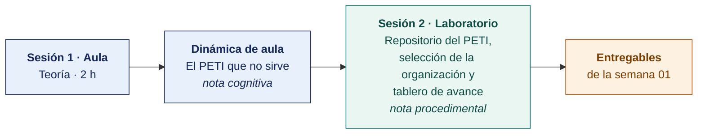

  
  &nbsp;&nbsp;&nbsp;&nbsp;&nbsp;&nbsp;
  

  <strong>Universidad Privada de Tacna</strong> 
  Facultad de Ingeniería · Escuela Profesional de Ingeniería de Sistemas

<h1 align="center">Semana 01 · Inducción y Lineamientos Generales del Curso</h1>

  <strong>SI-886 · Planeamiento Estratégico de TI</strong> 
  4 h semanales · 2 h de teoría en aula, con la dinámica incluida · 2 h de taller en laboratorio

---

## Datos de la asignatura

| | |
|---|---|
| **Asignatura** | SI-886 · Planeamiento Estratégico de TI |
| **Escuela** | Escuela Profesional de Ingeniería de Sistemas |
| **Ciclo** | VIII · 04 horas semanales · 03 créditos · Obligatorio |
| **Unidad** | I — Fundamentos de Planeamiento Estratégico |
| **Semana** | 01 de 17 |
| **Duración** | 4 h semanales · 2 h de teoría en aula, con la dinámica incluida · 2 h de taller en laboratorio |
| **Resultados de aprendizaje** | **RA1** Aplica la dirección estratégica, definiendo la misión y visión · **RA2** Desarrolla el análisis FODA |

### Lo que indica el sílabo

**Contenido procedimental.** Lineamientos generales del curso.

## Materiales de esta semana

| | Documento | Qué encontrarás | Dónde y cuánto dura |
|---|---|---|---|
| 1 | **[Teoría](1-TEORIA.md)** | El encargo del semestre · Qué es un PETI y qué no es · De dónde viene y hacia dónde va el planeamiento | Aula · 2 h |
| 2 | **[Dinámica de aula](2-DINAMICA.md)** | El PETI que no sirve, con su material, su ejemplo resuelto y su rúbrica | Aula · dentro de las 2 h de teoría |
| 3 | **[Taller de laboratorio](3-TALLER.md)** | Repositorio del PETI, selección de la organización y tablero de avance | Laboratorio · 2 h |

## Ruta de la semana

## Entregables

| Entregable | Formato y nombre del archivo | Vence |
|---|---|---|
| **Dinámica de aula** · El PETI que no sirve | PDF desde la [plantilla de dinámica](../PLANTILLAS/SI886-PLANTILLA-DINAMICA.docx) · `SI886-S01-DINAMICA-Grupo<N>.pdf` | Antes de cerrar la sesión de teoría |
| **Informe del taller de laboratorio N.º 01** | PDF en formato EPIS desde la [plantilla de taller](../PLANTILLAS/SI886-PLANTILLA-TALLER.docx) · `SI886-S01-TALLER-Grupo<N>.pdf` | 48 h después del taller |
| Repositorio del PETI con la etiqueta `v0.1` | URL del repositorio privado | 48 h después del laboratorio |

> Ambos se entregan en **PDF**, con la carátula de la UPT y los códigos de todos los integrantes. Las plantillas obligatorias están en [`PLANTILLAS/`](../PLANTILLAS/).

## Cómo se evalúa

| Criterio | Instrumento | Peso |
|---|---|---|
| Cognitivo | Rúbrica de «El PETI que no sirve» + exposición de 10 min en la Semana 02 | 25 % |
| Procedimental | Lista de cotejo de los 11 resultados del laboratorio | 35 % |
| Actitudinal | Profesionalismo en el acercamiento a la organización y cumplimiento del acuerdo de confidencialidad | 15 % |

## Preparación para la Semana 02

- **Leer.** Rodríguez Bermúdez, *Planificación y dirección estratégica de sistemas de información*, capítulos introductorios.
- Explorar los portales de estadística oficial que se usarán en el laboratorio. **INEI** (https://www.inei.gob.pe), **BCRP** (https://estadisticas.bcrp.gob.pe), **OSIPTEL** (https://www.osiptel.gob.pe) y **Datos Abiertos del Perú** (https://www.datosabiertos.gob.pe).
- Confirmar la aceptación de la organización y traer la evidencia escrita.

---

**Docente** · Dr. Oscar Juan Jimenez Flores
[oscarjimenezflores@upt.pe](mailto:oscarjimenezflores@upt.pe) · [LinkedIn](https://www.linkedin.com/in/oscar-jimenez-flores/) · [CTI Vitae — CONCYTEC](https://ctivitae.concytec.gob.pe/appDirectorioCTI/VerDatosInvestigador.do?id_investigador=33398)

Escuela Profesional de Ingeniería de Sistemas · Universidad Privada de Tacna · Tacna, Perú
