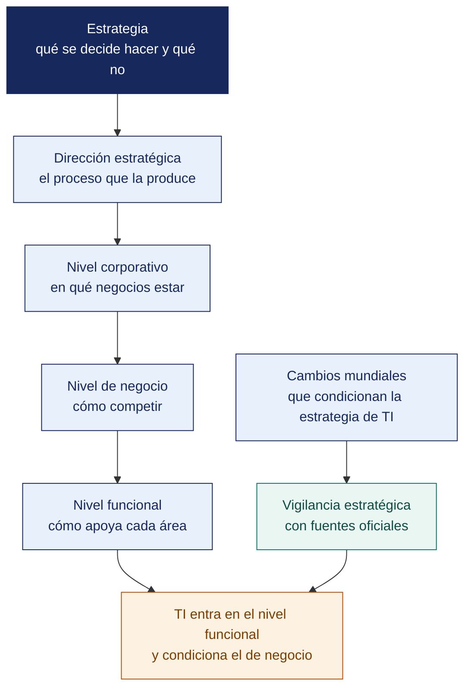

[Semana 02](README.md) · **Teoría** · [Dinámica de aula](2-DINAMICA.md) · [Taller de laboratorio](3-TALLER.md)

# Teoría · Introducción a la Dirección Estratégica · Desafíos y Cambios Mundiales

**SI-886 · Planeamiento Estratégico de TI** · Semana 02 · Sesión 1 en aula · 2 horas académicas, 100 min, con la dinámica incluida

> ¿Un término no le resulta claro? Está definido en el [glosario técnico del curso](../GLOSARIO.md).

---

## La pregunta de esta sesión

Una empresa declara en su plan que quiere «ser líder en todos sus segmentos, con productos de calidad y precio competitivo». Es una frase que su directorio aprobó por unanimidad.

Seis meses después, el área comercial pide invertir en el canal digital, operaciones pide invertir en almacén y finanzas pide reducir el gasto. Las tres peticiones son coherentes con el plan aprobado, y no hay forma de decidir entre ellas.

> **La pregunta que ordena esta sesión.** *¿Qué le falta a una declaración que todos aprueban para poder llamarse estrategia?*

## Antes de empezar

| Lo que necesita traer | De dónde sale |
|---|---|
| Qué es un PETI y a qué se ancla | Semana 01 |
| La organización elegida y su información básica | Trabajo de la Semana 01 |
| Nociones de mercado, competencia y margen | Cursos previos de la carrera |
| Ningún marco de análisis del entorno | Se introduce hoy |

> **Exploración (5 min), antes de cualquier definición.** El aula responde antes de la teoría y se anota. *¿Está mal esa declaración? ¿Cómo decidiría usted entre las tres peticiones? ¿Qué habría que haber escrito para poder decidir?* No se corrige nada todavía.

## Distribución del tiempo

| Momento | Minutos |
|---|---|
| El caso de las tres peticiones y la exploración inicial | 8 |
| **Bloque 1.** Qué es estrategia y qué es dirección estratégica · con su microaplicación | 20 |
| **Bloque 2.** Los niveles de la estrategia y dónde entra TI | 15 |
| **Bloque 3.** Los cambios mundiales que condicionan la estrategia de TI | 17 |
| Cierre, respuesta a la pregunta de la sesión y puente a la dinámica | 5 |
| **Total de la sesión de aula** | **65** |

## Mapa de la sesión



---

## Bloque 1 · Qué es estrategia y qué es dirección estratégica

> **La pregunta del bloque.** *Si una declaración no renuncia a nada, ¿qué es exactamente?*

**Estrategia.** Es el conjunto de decisiones sobre **dónde competir** y **cómo ganar**, que determina la asignación de recursos escasos. Su esencia es la **elección**. Una estrategia que no renuncia a nada no es una estrategia, es una lista de aspiraciones.

**Las tres preguntas que toda estrategia responde.**

| Pregunta | Qué define | Si no se responde |
|---|---|---|
| **¿Dónde jugamos?** | Mercados, segmentos, geografías, canales, productos | La organización se dispersa y compite mal en todo |
| **¿Cómo ganamos?** | **Fuente de ventaja.** Costo, diferenciación, foco, velocidad, ecosistema | La organización compite solo por precio |
| **¿Qué capacidades necesitamos?** | Recursos, procesos y sistemas indispensables | Se invierte en lo urgente, no en lo que sostiene la ventaja |

**Dirección estratégica.** Es el **proceso continuo** por el cual la dirección formula, implanta y evalúa la estrategia. Sus tres momentos:

```
   FORMULACIÓN                IMPLANTACIÓN                EVALUACIÓN
   ───────────                ─────────────               ──────────
 Análisis externo         Estructura organizativa     Indicadores y metas
 Análisis interno    →    Recursos y presupuesto  →   Revisión y ajuste
 Misión y visión          Cultura y personas          Aprendizaje
 Objetivos                Sistemas y procesos              │
 Estrategias              Gestión del cambio               │
       ▲                                                   │
       └───────────────────────────────────────────────────┘
```

**El error de confundir formulación con dirección estratégica.** La mayoría de las organizaciones invierte en formular —talleres, documentos, consultores— y no en implantar ni evaluar. El resultado es reconocible. **Planes excelentes que nadie ejecuta**. Las tres causas dominantes son la estrategia no se tradujo a objetivos operativos, no se asignaron recursos, y nadie midió el avance.

> **El error frecuente del bloque.** Confundir formular con dirigir. La mayoría de las organizaciones invierte en formular —talleres, documentos, consultores— y no en implantar ni evaluar. El resultado es reconocible y es el del caso de hoy — **planes excelentes que nadie ejecuta**, porque la estrategia no se tradujo a objetivos, no se asignaron recursos y nadie midió el avance.

## Bloque 2 · Los niveles de la estrategia y dónde entra TI

> **La pregunta del bloque.** *¿En qué nivel vive el plan de TI, y por qué importa saberlo?*

| Nivel | Pregunta | Quién decide | Rol de TI |
|---|---|---|---|
| **Corporativa** | ¿En qué negocios estamos? ¿Crecemos, diversificamos, salimos? | Directorio | Habilita fusiones, integraciones, escalabilidad |
| **De negocio** | ¿Cómo competimos en cada negocio? | Gerencia general y de unidad | **Sostiene la ventaja.** Costo, experiencia, velocidad |
| **Funcional** | ¿Cómo apoya cada función a la estrategia de negocio? | Gerencias funcionales | **Aquí vive el PETI** |
| **Operativa** | ¿Cómo se ejecuta día a día? | Jefaturas | Servicios, operaciones, soporte |

**Las cuatro posturas de TI respecto de la estrategia.** Determinan qué tipo de PETI (Plan Estratégico de Tecnologías de Información) corresponde:

| Postura | Descripción | Tipo de PETI apropiado |
|---|---|---|
| **Soporte** | TI mantiene la operación; su falla no compromete la estrategia | Plan orientado a eficiencia y continuidad; presupuesto contenido |
| **Fábrica** | La operación depende críticamente de TI, pero TI no crea ventaja nueva | Plan orientado a disponibilidad, resiliencia y control de costos |
| **Giro estratégico** | TI aún no es crítica, pero las iniciativas en curso la volverán decisiva | Plan orientado a construir capacidades y a gestionar el cambio |
| **Estratégica** | TI es fuente de ventaja competitiva y su falla compromete el negocio | Plan orientado a innovación, arquitectura y gobierno robusto |

> **Consecuencia práctica.** Recomendar una arquitectura de microservicios y un centro de datos redundante a una organización en postura de **soporte** es un error de diagnóstico, no una ambición legítima. El PETI debe ser proporcional a la postura real de TI en esa organización.

> **El error frecuente del bloque.** Proponer una arquitectura ambiciosa a una organización en postura de soporte. Recomendar microservicios y un centro de datos redundante a una empresa cuya operación no depende críticamente de TI **es un error de diagnóstico, no una ambición legítima**. El plan debe ser proporcional a la postura real de TI en esa organización.

## Bloque 3 · Desafíos y cambios mundiales que condicionan la estrategia de TI

> **La pregunta del bloque.** *¿Qué distingue una tendencia que pertenece al plan de una que pertenece a una charla?*

El análisis de tendencias no es un ejercicio de futurología. Es la identificación de **fuerzas verificables** que modifican las reglas del sector. Cada tendencia se documenta con **fuente oficial y cifra**, nunca con impresiones.

| Fuerza | Qué está cambiando | Implicancia para el PETI | Fuentes oficiales para evidenciarla |
|---|---|---|---|
| **Transformación digital del Estado** | La interacción con el Estado migra a canales digitales obligatorios — facturación electrónica, libros electrónicos, planilla electrónica, interoperabilidad | Obligaciones de integración y de conservación de información con valor legal | PCM–SGTD, SUNAT, Política Nacional de Transformación Digital al 2030 (D. S. 085-2023-PCM) |
| **Conectividad y penetración digital** | Cambia el canal de relación con el cliente y el usuario | Justifica o desaconseja inversiones en canal digital según el mercado real | OSIPTEL, INEI (ENAHO, estadísticas TIC en hogares) |
| **Computación en la nube** | El gasto migra de inversión de capital a gasto operativo; cambia el perfil de riesgo y el marco legal | Decisiones de arquitectura, flujo transfronterizo de datos, dependencia de proveedor | Documentación oficial de proveedores; ISO/IEC 27017 |
| **Inteligencia artificial** | Automatización de tareas cognitivas; nuevos requisitos de gobierno del dato | Oportunidad de eficiencia y riesgo de decisiones no explicables | OCDE, UNESCO (Recomendación sobre la Ética de la IA), ISO/IEC 42001 |
| **Ciberseguridad y ransomware** | El costo del incidente crece; el respaldo tradicional deja de proteger | Justifica inversión en resiliencia con argumento económico | ENISA, NIST, informes de organismos oficiales |
| **Protección de datos personales** | Marco más exigente y con sanción | Restricciones de arquitectura y obligaciones de diseño | Ley 29733 y D. S. 016-2024-JUS; ANPD |
| **Escasez de talento técnico** | Rotación alta y competencia salarial global por trabajo remoto | Riesgo de dependencia de personal clave; decisiones de tercerización | INEI, MTPE, estudios sectoriales oficiales |
| **Sostenibilidad y eficiencia energética** | Presión regulatoria y de mercado sobre el consumo de TI | Criterios de decisión en infraestructura y ciclo de vida de equipos | MINAM; normativa de residuos de aparatos eléctricos y electrónicos |
| **Volatilidad macroeconómica** | Tipo de cambio e inflación afectan contratos de TI denominados en moneda extranjera | Riesgo presupuestal del portafolio plurianual | BCRP, MEF, INEI |

**La regla del análisis de tendencias.** Cada fuerza incluida en el PETI debe responder tres preguntas, **con evidencia**:

1. **¿Qué está cambiando?** — con dato y fuente.
2. **¿Cómo afecta a *esta* organización?** — no al sector en abstracto.
3. **¿Qué decisión obliga a tomar?** — invertir, protegerse, esperar o abandonar.

Una tendencia que no responde la tercera pregunta **no pertenece al PETI**. Pertenece a una presentación de divulgación.

**Ejemplo trabajado — de una tendencia global a una decisión local.** Cómo se baja una tendencia hasta que obliga a decidir algo.

| Nivel | Contenido | Error frecuente |
|---|---|---|
| **Tendencia global** | Adopción acelerada de servicios en nube en Latinoamérica | Quedarse aquí y llamarlo análisis |
| **Efecto en el sector** | Los proveedores de software del rubro migran a suscripción y dejan de vender licencia perpetua | Mencionar el sector sin dato |
| **Efecto en la organización** | El proveedor del ERP anunció fin de soporte de la versión local para dentro de 18 meses | Sin fecha, no obliga a nada |
| **Decisión que obliga** | Migrar a la versión en nube o cambiar de proveedor, con presupuesto plurianual, antes de que expire el soporte | La tendencia sin decisión es información, no análisis |
| **Riesgo de no decidir** | Operar sin actualizaciones de seguridad sobre el sistema que sostiene la facturación | — |

> **La regla del análisis de entorno. Una tendencia que no termina en una decisión con fecha no pertenece al plan.** Se retira o se reformula hasta que obligue a algo.

> **Microaplicación (5 min) · la postura de su organización.** En parejas, el aula **sitúa a su propia organización en una de las cuatro posturas de TI** y escribe en una línea la razón. Se recogen dos o tres y se contrastan, porque la postura decide el tipo de plan que se va a escribir.

| Caso | Qué debe contener una buena respuesta |
|---|---|
| «La inteligencia artificial va a transformar los negocios». ¿Sirve en un PETI? | No como está. Sirve si se concreta — qué proceso de **esta** organización cambia, con qué dato, en qué plazo y qué decisión exige |
| ¿De dónde se sacan datos confiables del entorno peruano? | INEI, BCRP, ministerios sectoriales, el regulador del rubro y los reportes del propio proveedor. Cada dato con su fuente, año y URL |
| ¿Cuántas tendencias debe recoger un análisis de entorno? | Pocas y decisivas. Diez tendencias sin decisión valen menos que tres con fecha y consecuencia |
## Cierre · qué se lleva de aquí

**La respuesta a la pregunta con la que abrimos.** Le falta **la renuncia**. La esencia de la estrategia es la elección, y una declaración que no descarta nada no permite rechazar ninguna de las tres peticiones. Las tres son coherentes con el plan porque el plan es coherente con todo. Una estrategia responde dónde jugamos, cómo ganamos y qué capacidades necesitamos, y las tres respuestas excluyen alternativas.

**Las tres ideas que deben quedar.**

| Idea | Por qué importa en el ejercicio profesional |
|---|---|
| Una estrategia que no renuncia a nada es una lista de aspiraciones | Es lo que hace imposible priorizar cuando llegan peticiones legítimas y compiten |
| El plan de TI vive en el nivel funcional y se ancla al de negocio | Determina a qué debe responder cada objetivo del plan que se construirá |
| La postura de TI decide el tipo de plan | Soporte, fábrica, giro estratégico y estratégica no admiten el mismo nivel de inversión ni de riesgo |

**Volviendo a la exploración del inicio.** Se releen las respuestas iniciales. Casi nadie dice que la declaración está mal, porque suena bien y fue aprobada por unanimidad. Que una frase pueda ser aprobada por todos **precisamente porque no compromete a nada** es la lección de la sesión.

**Lo que sigue.** La [dinámica de esta sesión](2-DINAMICA.md) sitúa al equipo en un comité que debe tomar **una sola decisión**, y a mitad de sesión entra una segunda noticia que la pone a prueba. La restricción es la de hoy — no se puede acordar «hacer todo».


**Pregunta de cierre.** *¿cuál de estas nueve fuerzas puede sacar del mercado a nuestra organización en los próximos tres años?* Esa es la que encabeza el análisis de contexto del PETI, y probablemente la que origine el proyecto más importante del portafolio.
---

---

[Semana 02](README.md) · **Teoría** · [Dinámica de aula](2-DINAMICA.md) · [Taller de laboratorio](3-TALLER.md)

---

**Docente** · Dr. Oscar Juan Jimenez Flores
[oscarjimenezflores@upt.pe](mailto:oscarjimenezflores@upt.pe) · [LinkedIn](https://www.linkedin.com/in/oscar-jimenez-flores/) · [CTI Vitae — CONCYTEC](https://ctivitae.concytec.gob.pe/appDirectorioCTI/VerDatosInvestigador.do?id_investigador=33398)

Escuela Profesional de Ingeniería de Sistemas · Universidad Privada de Tacna · Tacna, Perú
