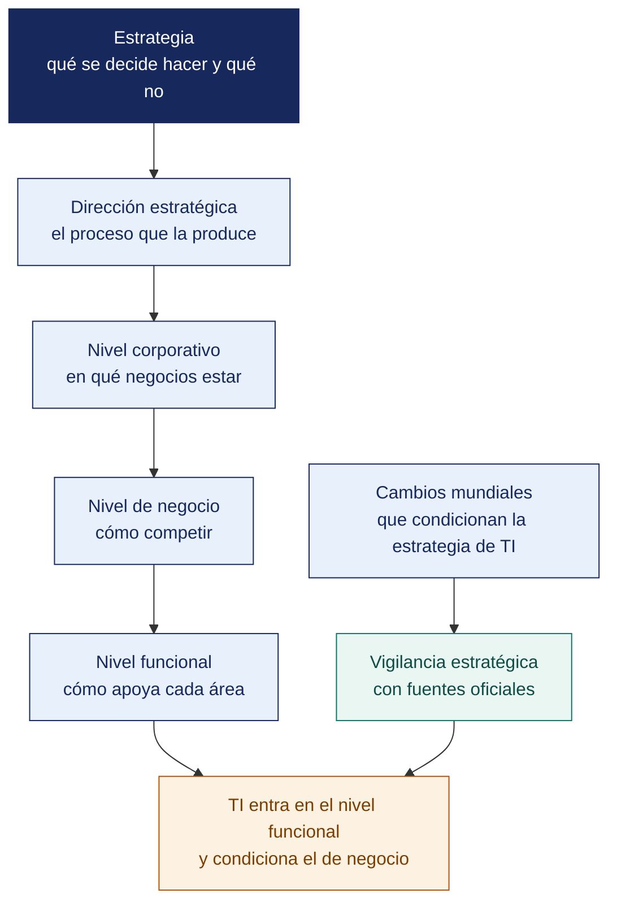

[Semana 02](README.md) · **Teoría** · [Dinámica de aula](2-DINAMICA.md) · [Taller de laboratorio](3-TALLER.md)

# Teoría · Introducción a la Dirección Estratégica · Desafíos y Cambios Mundiales

**SI-886 · Planeamiento Estratégico de TI** · Semana 02 · Sesión 1 en aula · 2 h, con la dinámica incluida

---

## Qué se trabaja en esta sesión

- Qué es estrategia y qué es dirección estratégica.
- Los niveles de la estrategia y dónde entra TI.
- Desafíos y cambios mundiales que condicionan la estrategia de TI.

## Mapa de la sesión



---

## Exposición de la dinámica de la Semana 01 (20 min)

Exposiciones de 10 minutos sobre «El PETI que no sirve». Cierre del docente. **el defecto más frecuente en los planes reales no es la falta de tecnología: es la ausencia de línea base. Sin saber dónde se está, cualquier meta es una cifra decorativa.**

Se confirman las organizaciones aprobadas y se asigna el caso simulado a los equipos sin acceso.

## Qué es estrategia y qué es dirección estratégica (30 min)

**Estrategia.** Es el conjunto de decisiones sobre **dónde competir** y **cómo ganar**, que determina la asignación de recursos escasos. Su esencia es la **elección**: una estrategia que no renuncia a nada no es una estrategia, es una lista de aspiraciones.

**Las tres preguntas que toda estrategia responde:**

| Pregunta | Qué define | Si no se responde |
|---|---|---|
| **¿Dónde jugamos?** | Mercados, segmentos, geografías, canales, productos | La organización se dispersa y compite mal en todo |
| **¿Cómo ganamos?** | Fuente de ventaja: costo, diferenciación, foco, velocidad, ecosistema | La organización compite solo por precio |
| **¿Qué capacidades necesitamos?** | Recursos, procesos y sistemas indispensables | Se invierte en lo urgente, no en lo que sostiene la ventaja |

**Dirección estratégica.** Es el **proceso continuo** por el cual la dirección formula, implanta y evalúa la estrategia. Sus tres momentos:

```
   FORMULACIÓN                IMPLANTACIÓN                EVALUACIÓN
   ───────────                ─────────────               ──────────
 Análisis externo         Estructura organizativa     Indicadores y metas
 Análisis interno    →    Recursos y presupuesto  →   Revisión y ajuste
 Misión y visión          Cultura y personas          Aprendizaje
 Objetivos                Sistemas y procesos              │
 Estrategias              Gestión del cambio               │
       ▲                                                   │
       └───────────────────────────────────────────────────┘
```

**El error de confundir formulación con dirección estratégica.** La mayoría de las organizaciones invierte en formular —talleres, documentos, consultores— y no en implantar ni evaluar. El resultado es reconocible: **planes excelentes que nadie ejecuta**. Las tres causas dominantes son: la estrategia no se tradujo a objetivos operativos, no se asignaron recursos, y nadie midió el avance.

## Los niveles de la estrategia y dónde entra TI (25 min)

| Nivel | Pregunta | Quién decide | Rol de TI |
|---|---|---|---|
| **Corporativa** | ¿En qué negocios estamos? ¿Crecemos, diversificamos, salimos? | Directorio | Habilita fusiones, integraciones, escalabilidad |
| **De negocio** | ¿Cómo competimos en cada negocio? | Gerencia general y de unidad | Sostiene la ventaja: costo, experiencia, velocidad |
| **Funcional** | ¿Cómo apoya cada función a la estrategia de negocio? | Gerencias funcionales | **Aquí vive el PETI** |
| **Operativa** | ¿Cómo se ejecuta día a día? | Jefaturas | Servicios, operaciones, soporte |

**Las cuatro posturas de TI respecto de la estrategia.** Determinan qué tipo de PETI corresponde:

| Postura | Descripción | Tipo de PETI apropiado |
|---|---|---|
| **Soporte** | TI mantiene la operación; su falla no compromete la estrategia | Plan orientado a eficiencia y continuidad; presupuesto contenido |
| **Fábrica** | La operación depende críticamente de TI, pero TI no crea ventaja nueva | Plan orientado a disponibilidad, resiliencia y control de costos |
| **Giro estratégico** | TI aún no es crítica, pero las iniciativas en curso la volverán decisiva | Plan orientado a construir capacidades y a gestionar el cambio |
| **Estratégica** | TI es fuente de ventaja competitiva y su falla compromete el negocio | Plan orientado a innovación, arquitectura y gobierno robusto |

> **Consecuencia práctica.** Recomendar una arquitectura de microservicios y un centro de datos redundante a una organización en postura de **soporte** es un error de diagnóstico, no una ambición legítima. El PETI debe ser proporcional a la postura real de TI en esa organización.

## Desafíos y cambios mundiales que condicionan la estrategia de TI (35 min)

El análisis de tendencias no es un ejercicio de futurología. Es la identificación de **fuerzas verificables** que modifican las reglas del sector. Cada tendencia se documenta con **fuente oficial y cifra**, nunca con impresiones.

| Fuerza | Qué está cambiando | Implicancia para el PETI | Fuentes oficiales para evidenciarla |
|---|---|---|---|
| **Transformación digital del Estado** | La interacción con el Estado migra a canales digitales obligatorios: facturación electrónica, libros electrónicos, planilla electrónica, interoperabilidad | Obligaciones de integración y de conservación de información con valor legal | PCM–SGTD, SUNAT, Política Nacional de Transformación Digital al 2030 (D. S. 085-2023-PCM) |
| **Conectividad y penetración digital** | Cambia el canal de relación con el cliente y el usuario | Justifica o desaconseja inversiones en canal digital según el mercado real | OSIPTEL, INEI (ENAHO, estadísticas TIC en hogares) |
| **Computación en la nube** | El gasto migra de inversión de capital a gasto operativo; cambia el perfil de riesgo y el marco legal | Decisiones de arquitectura, flujo transfronterizo de datos, dependencia de proveedor | Documentación oficial de proveedores; ISO/IEC 27017 |
| **Inteligencia artificial** | Automatización de tareas cognitivas; nuevos requisitos de gobierno del dato | Oportunidad de eficiencia y riesgo de decisiones no explicables | OCDE, UNESCO (Recomendación sobre la Ética de la IA), ISO/IEC 42001 |
| **Ciberseguridad y ransomware** | El costo del incidente crece; el respaldo tradicional deja de proteger | Justifica inversión en resiliencia con argumento económico | ENISA, NIST, informes de organismos oficiales |
| **Protección de datos personales** | Marco más exigente y con sanción | Restricciones de arquitectura y obligaciones de diseño | Ley 29733 y D. S. 016-2024-JUS; ANPD |
| **Escasez de talento técnico** | Rotación alta y competencia salarial global por trabajo remoto | Riesgo de dependencia de personal clave; decisiones de tercerización | INEI, MTPE, estudios sectoriales oficiales |
| **Sostenibilidad y eficiencia energética** | Presión regulatoria y de mercado sobre el consumo de TI | Criterios de decisión en infraestructura y ciclo de vida de equipos | MINAM; normativa de residuos de aparatos eléctricos y electrónicos |
| **Volatilidad macroeconómica** | Tipo de cambio e inflación afectan contratos de TI denominados en moneda extranjera | Riesgo presupuestal del portafolio plurianual | BCRP, MEF, INEI |

**La regla del análisis de tendencias.** Cada fuerza incluida en el PETI debe responder tres preguntas, **con evidencia**:

1. **¿Qué está cambiando?** — con dato y fuente.
2. **¿Cómo afecta a *esta* organización?** — no al sector en abstracto.
3. **¿Qué decisión obliga a tomar?** — invertir, protegerse, esperar o abandonar.

Una tendencia que no responde la tercera pregunta **no pertenece al PETI**. Pertenece a una presentación de divulgación.

## Cierre (10 min)

**Pregunta de cierre.** *¿cuál de estas nueve fuerzas puede sacar del mercado a nuestra organización en los próximos tres años?* Esa es la que encabeza el análisis de contexto del PETI, y probablemente la que origine el proyecto más importante del portafolio.

---

---

[Semana 02](README.md) · **Teoría** · [Dinámica de aula](2-DINAMICA.md) · [Taller de laboratorio](3-TALLER.md)

---

**Docente** · Dr. Oscar Juan Jimenez Flores
[oscarjimenezflores@upt.pe](mailto:oscarjimenezflores@upt.pe) · [LinkedIn](https://www.linkedin.com/in/oscar-jimenez-flores/) · [CTI Vitae — CONCYTEC](https://ctivitae.concytec.gob.pe/appDirectorioCTI/VerDatosInvestigador.do?id_investigador=33398)

Escuela Profesional de Ingeniería de Sistemas · Universidad Privada de Tacna · Tacna, Perú
