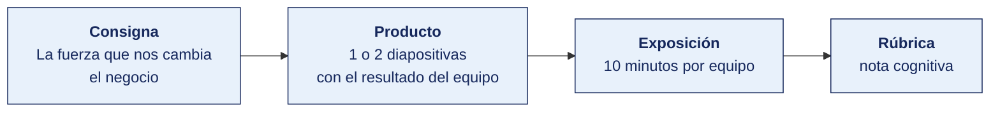

[Semana 02](README.md) · [Teoría](1-TEORIA.md) · **Dinámica de aula** · [Taller de laboratorio](3-TALLER.md)

# Dinámica de aula · La fuerza que nos cambia el negocio

**SI-886 · Planeamiento Estratégico de TI** · Semana 02 · Actividad en aula, **dentro de las 2 h de teoría** · calificación **cognitiva**

---

## Cómo funciona la actividad

## Qué entregas

| | |
|---|---|
| **Archivo** | `SI886-S02-DINAMICA-Grupo<N>.pdf` |
| **Plantilla obligatoria** | [SI886-PLANTILLA-DINAMICA.docx](../PLANTILLAS/SI886-PLANTILLA-DINAMICA.docx) |
| **Formato** | PDF exportado desde la plantilla en Word, con la carátula de la UPT y los apellidos, nombres y códigos de todos los integrantes |
| **Qué va dentro** | Lo que el grupo resolvió en aula. Las tablas de la sección **Producto** van completas, con los textos redactados, y cada decisión va justificada |
| **Dónde se sube** | Aula virtual, tarea «Dinámica · Semana 02» |
| **Cuándo vence** | Antes de cerrar la sesión de teoría |
| **Exposición** | 10 minutos por grupo en la sesión de teoría de la Semana 03 |

> No se califica un trabajo entregado en `.docx`, sin carátula, sin los códigos de los integrantes o con las tablas del producto vacías.

---

## Consigna

> **«La fuerza que nos cambia el negocio»**
> Cada equipo selecciona **dos de las nueve fuerzas** de la sección 1.4 —una que represente **oportunidad** y otra que represente **amenaza** para su organización— y las documenta con **datos de fuente oficial**, respondiendo las tres preguntas de la regla del análisis de tendencias.

## Producto

**Diapositiva 1 — La oportunidad.**

| Campo | Contenido |
|---|---|
| Fuerza seleccionada | |
| **Qué está cambiando** — dato con cifra | |
| **Fuente oficial** — institución, publicación y año | |
| **Cómo afecta a esta organización** — específico, no sectorial | |
| **Qué decisión obliga a tomar** | |
| Horizonte en el que se materializa | |

**Diapositiva 2 — La amenaza.** Mismo formato, más una estimación del **efecto si la organización no actúa**.

## Ejemplo resuelto

*El caso de este ejemplo es distinto del que le toca a tu grupo. Sirve para que veas el nivel de detalle que se espera, no para copiarlo.*

**Una oportunidad bien documentada.** La organización del ejemplo es una cadena de farmacias regionales.

| Campo | Contenido |
|---|---|
| Fuerza seleccionada | Cambio en el comportamiento de compra del consumidor hacia canales digitales |
| **Qué está cambiando** | La proporción de hogares del departamento con acceso a internet pasó de 38,4 % a 54,1 % en los cinco años de la serie. En el segmento urbano del departamento la cifra llega a 71,2 %. |
| **Fuente oficial** | Instituto Nacional de Estadística e Informática, Encuesta Nacional de Hogares, última publicación disponible. Serie histórica del indicador de acceso a internet por departamento. |
| **Cómo afecta a esta organización** | El 82 % de la venta de la cadena se origina en mostrador, en once locales urbanos. Los dos competidores nacionales que entraron al departamento operan con aplicación propia y entrega a domicilio. La cadena no tiene canal digital: un cliente que quiere comprar sin desplazarse no tiene forma de hacerlo, y no hay registro de cuántos se pierden. |
| **Qué decisión obliga a tomar** | Decidir si se construye un canal de pedido en línea propio, se integra con una plataforma de reparto existente o se renuncia al segmento. La decisión no puede posponerse más allá del primer año del horizonte, porque el costo de recuperar un cliente que ya migró es superior al de retenerlo. |
| Horizonte en el que se materializa | 12 a 24 meses |

**La regla del análisis de tendencias.** Un dato que no obliga a tomar una decisión es información de contexto, no una tendencia relevante para el plan. Si al terminar la ficha no puedes escribir qué decisión obliga a tomar, la fuerza no entra en el plan.

**La diferencia entre aprobar y no aprobar.**

| Así no | Así sí |
|---|---|
| «La transformación digital está creciendo en el Perú.» | «El acceso a internet en hogares del departamento pasó de 38,4 % a 54,1 % en cinco años; 71,2 % en el segmento urbano.» |
| «Fuente: internet.» | «INEI, Encuesta Nacional de Hogares, serie histórica por departamento, última publicación disponible.» |
| «Afecta al sector retail.» | «El 82 % de la venta de esta cadena es en mostrador. Los dos competidores que entraron al departamento operan con app propia y reparto.» |
| «Oportunidad de digitalizarse.» | «Decidir si se construye canal propio, se integra con una plataforma de reparto o se renuncia al segmento, dentro del primer año.» |

## Reglas

- 35 min en aula. Entrega como `S02_<equipo>_tendencias.pdf`.
- **Toda cifra debe llevar fuente institucional con año.** Sin fuente, la fila no puntúa.
- Prohibidas las fuentes de divulgación, blogs corporativos y enciclopedias abiertas.
- La afectación debe ser específica de la organización. «La digitalización afecta a todas las empresas» no puntúa.
- Exposición de 10 min en la Semana 03.

## Rúbrica cognitiva (20 puntos)

| Criterio | 5 | 3 | 1 |
|---|---|---|---|
| **Calidad de la fuente** | Fuente oficial primaria, con publicación y año identificados | Fuente confiable secundaria | Sin fuente o fuente no verificable |
| **Especificidad** | El efecto se describe sobre esta organización, con su magnitud | Efecto pertinente pero genérico | Efecto aplicable a cualquier empresa |
| **Decisión derivada** | Decisión concreta, con horizonte y orden de magnitud del recurso | Decisión concreta sin horizonte | «Hay que estar atentos» |
| **Equilibrio oportunidad/amenaza** | Ambas bien fundamentadas y contrastadas | Una de las dos sólida | Ambas superficiales |

---

---

[Semana 02](README.md) · [Teoría](1-TEORIA.md) · **Dinámica de aula** · [Taller de laboratorio](3-TALLER.md)

---

**Docente** · Dr. Oscar Juan Jimenez Flores
[oscarjimenezflores@upt.pe](mailto:oscarjimenezflores@upt.pe) · [LinkedIn](https://www.linkedin.com/in/oscar-jimenez-flores/) · [CTI Vitae — CONCYTEC](https://ctivitae.concytec.gob.pe/appDirectorioCTI/VerDatosInvestigador.do?id_investigador=33398)

Escuela Profesional de Ingeniería de Sistemas · Universidad Privada de Tacna · Tacna, Perú
