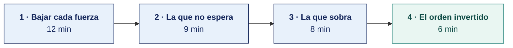

[Semana 02](README.md) · [Teoría](1-TEORIA.md) · **Dinámica de aula** · [Taller de laboratorio](3-TALLER.md)

# Dinámica de aula · La fuerza que no espera

**SI-886 · Planeamiento Estratégico de TI** · Semana 02 · Actividad en aula, **dentro de los 100 min de la sesión de teoría** · calificación **cognitiva**

> ¿Un término no le resulta claro? Está definido en el [glosario técnico del curso](../GLOSARIO.md).

---

## La pregunta

Su equipo recibe **cuatro fuerzas del entorno**, ya documentadas con su cifra y su fuente, que alcanzan a una organización concreta.

Solo una obliga a decidir algo **antes de doce meses**. Y una de las cuatro **no debe entrar al plan**.

Hay que decir cuáles son y sostenerlo.

## Lo que ya sabes de hoy

| De la teoría | Cómo se usa aquí |
|---|---|
| [Las nueve fuerzas que condicionan la estrategia de TI](1-TEORIA.md) | Las cuatro de su ficha salen de ahí. La tabla dice qué implicancia tiene cada una para el plan |
| [La regla del análisis de tendencias](1-TEORIA.md) | Las tres preguntas. La tercera —qué decisión obliga a tomar— es la que separa la fuerza que entra al plan de la que sobra |
| [Los niveles de la estrategia y dónde entra TI](1-TEORIA.md) | Una fuerza puede ser enorme en el nivel corporativo y no obligar a nada en el nivel de TI. Ese desnivel es lo que hace fallar el ejercicio |

## Cómo se desarrolla · 35 minutos

**Paso 1 · Bajar cada fuerza — 12 min.** Para las cuatro se recorre el mismo descenso. Qué está cambiando, cómo afecta **a esta organización** y qué decisión obliga a tomar. Se hace en una línea por fuerza. Si en la tercera línea no aparece un verbo de decisión —migrar, contratar, cifrar, presupuestar, retirar—, la fuerza no obliga a nada.

**Paso 2 · La que no espera — 9 min.** Se elige la única cuya decisión tiene **fecha propia**, impuesta desde fuera. Un fin de soporte, un plazo normativo, un contrato que vence. Se escribe la decisión y la fecha límite. Una urgencia sin fecha externa no es urgencia, es preferencia del equipo.

**Paso 3 · La que sobra — 8 min.** Se identifica la fuerza que **no debe entrar al plan** de esta organización, y se justifica. No porque sea poco importante en el mundo, sino porque aquí no obliga a ninguna decisión.

**Paso 4 · El orden invertido — 6 min.** Se responde qué le pasaría a la organización si atendiera primero otra de las cuatro y dejara la urgente para el año tres. La respuesta debe ser un daño concreto, no un retraso genérico.

## Qué entregas

| | |
|---|---|
| **Archivo** | `SI886-S02-DINAMICA-Grupo<N>.pdf` |
| **Plantilla obligatoria** | [SI886-PLANTILLA-DINAMICA.docx](../PLANTILLAS/SI886-PLANTILLA-DINAMICA.docx) |
| **Formato** | PDF exportado desde la plantilla en Word, con la carátula de la UPT y los apellidos, nombres y códigos de todos los integrantes |
| **Dónde se sube** | Aula virtual, tarea «Dinámica · Semana 02» |
| **Cuándo vence** | Antes de cerrar la sesión de teoría |
| **Exposición** | 10 minutos por grupo en la sesión de teoría de la Semana 03, con una o dos diapositivas hechas a partir de este documento |

> No se califica un trabajo entregado en `.docx`, sin carátula, sin los códigos de los integrantes o con la tabla del producto incompleta.

## Producto

**Un solo producto**, que va en la sección 2.1 de la plantilla.

**Fila superior — el descenso de las cuatro.**

| Fuerza | Cómo afecta a *esta* organización | Decisión que obliga | ¿Tiene fecha externa? |
|---|---|---|---|

**Fila inferior — las tres respuestas.**

| | Contenido |
|---|---|
| **La que no espera** | Cuál, la decisión concreta y **la fecha límite**, con lo que la impone |
| **La que sobra** | Cuál se retira del plan y por qué no obliga a nada en esta organización |
| **Si se invierte el orden** | Qué daño concreto sufre la organización, y cuándo |

## Ejemplo resuelto

*Esta ficha no es ninguna del anexo.*

> **Constructora regional · 70 trabajadores · TI 2 personas · S/ 180 000**
> **F1 · Transformación digital del Estado.** SUNAT exige el registro del Sistema Integrado de Registros Electrónicos para su categoría desde el ejercicio siguiente. *(SUNAT, resolución de superintendencia vigente.)*
> **F2 · Inteligencia artificial.** El 71 % de las empresas constructoras de la región declara no usar ninguna herramienta de IA. *(Estudio sectorial, año en curso.)*
> **F3 · Escasez de talento técnico.** El sueldo promedio del desarrollador en la macrorregión sur subió 18 % en dos años. La empresa tiene un único desarrollador, que mantiene el sistema de valorizaciones. *(MTPE, planilla electrónica.)*
> **F4 · Volatilidad macroeconómica.** El contrato del ERP está en dólares y vence en 14 meses. El tipo de cambio se movió 9 % en el último año. *(BCRP.)*

| | Contenido |
|---|---|
| **La que no espera** | **F1.** Decisión, adecuar la emisión y conservación al nuevo registro. Fecha límite, el inicio del ejercicio siguiente. **La fecha no la pone la empresa, la pone SUNAT** |
| **La que sobra** | **F2.** No obliga a ninguna decisión aquí. Con dos personas en TI y sin dato estructurado de obra, no hay decisión de IA que tomar este trienio. Mencionarla sería relleno |
| **Si se invierte el orden** | Si se atiende F3 primero y F1 al año tres, la empresa **no puede emitir comprobantes válidos** desde enero. No es un retraso del plan, es una parada de la facturación |

> **F3 y F4 son reales y quedan en el plan**, con decisión y fecha propia más adelante. La que se retira es F2, y retirarla es una decisión que hay que defender ante quien quería ponerla en la portada.

## Reglas

- 35 min en aula.
- La fuerza urgente debe tener **fecha impuesta desde fuera de la organización**. Sin eso, no es la urgente.
- La fuerza que se retira se retira **por escrito y con fundamento**. No basta con no mencionarla.
- El daño del orden invertido debe ser concreto y fechado.
- Exposición de 10 min en la Semana 03.

> **En varias fichas hay dos candidatas defendibles a fuerza urgente.** Gana la exposición que demuestra que su fecha es la más dura, no la que grita más fuerte.

## Rúbrica cognitiva (20 puntos)

| Criterio | 5 | 3 | 1 |
|---|---|---|---|
| **El descenso** | Las cuatro bajadas hasta una decisión con verbo, específicas de esta organización | Dos o tres bajan hasta la decisión; el resto queda en el sector | Se repite lo que dice la ficha, sin bajar a la organización |
| **La que no espera** | Identificada, con la decisión y la fecha externa que la impone | Identificada, con decisión, sin fecha externa | Elegida por impresión, sin fundamento |
| **La que sobra** | Retirada con fundamento, explicando por qué aquí no obliga a nada | Retirada sin fundamento sólido | No se retira ninguna, o se retira la que sí obligaba |
| **El orden invertido** | Daño concreto y fechado sobre la operación | Daño genérico | «Se retrasaría el plan» |

---

## Anexo · Fichas para repartir

Una por equipo. Las cuatro fuerzas de cada ficha ya vienen documentadas con su cifra y su fuente.

### Ficha 1 · Agroexportadora de aceituna y orégano · 142 trabajadores · TI 3 personas · S/ 486 000

> **F1 · Protección de datos personales.** El D. S. 016-2024-JUS rige desde el 31/03/2025 y exige registro de actividades de tratamiento. La empresa trata datos de 142 trabajadores y de sus compradores. No existe inventario. *(ANPD.)*
> **F2 · Ciberseguridad y ransomware.** El servidor de planta sufrió un cifrado en marzo y la última copia legible era de 14 días antes. *(Registro interno de incidentes.)*
> **F3 · Sostenibilidad y eficiencia energética.** Los compradores europeos incorporan requisitos de huella en sus auditorías de proveedor desde el próximo ciclo de certificación, en 9 meses. *(Comunicación del comprador principal.)*
> **F4 · Inteligencia artificial.** Existen modelos de predicción de rendimiento de cosecha. La empresa no registra datos de campo en formato estructurado. *(Documentación de proveedores.)*

### Ficha 2 · Clínica privada de 60 camas · 310 trabajadores · TI 6 personas · S/ 1 240 000

> **F1 · Protección de datos personales.** El dato de salud es sensible bajo la Ley 29733. En junio se detectó que 17 usuarios administrativos consultaron una historia clínica sin relación con su función. No se notificó a la autoridad. *(Bitácora del sistema clínico y ANPD.)*
> **F2 · Conectividad y penetración digital.** El 78 % de los pacientes de la clínica tiene teléfono con datos. Las citas en línea pasaron de 0 a 31 % en un año. *(INEI y registro propio.)*
> **F3 · Escasez de talento técnico.** Dos de los seis integrantes de TI renunciaron en el último año. El único que conoce la integración del sistema clínico lleva ocho meses. *(Planilla.)*
> **F4 · Computación en la nube.** El proveedor del sistema clínico anunció que la versión local deja de recibir actualizaciones en 20 meses. *(Comunicado del proveedor.)*

### Ficha 3 · Municipalidad distrital · 41 800 habitantes · TI 3 personas · S/ 520 000

> **F1 · Transformación digital del Estado.** El D. Leg. 1412 y la R. M. 119-2018-PCM exigen Comité y Líder de Gobierno Digital. La entidad no tiene ninguno de los dos y es materia de control gubernamental. *(PCM-SGTD y Contraloría.)*
> **F2 · Ciberseguridad y ransomware.** El sistema de trámite documentario cayó en abril tras un corte eléctrico y 1 340 expedientes quedaron sin estado recuperable. No hay UPS ni respaldo fuera de la sede. *(Informe interno.)*
> **F3 · Conectividad y penetración digital.** El 62 % de los hogares del distrito accede a internet, quince puntos por debajo del promedio regional. *(INEI, ENAHO.)*
> **F4 · Inteligencia artificial.** Otras municipalidades anuncian asistentes virtuales de atención al vecino. *(Notas de prensa institucionales.)*

### Ficha 4 · Cooperativa de ahorro y crédito · 18 400 socios · TI 7 personas · S/ 980 000

> **F1 · Ciberseguridad y ransomware.** La Resolución SBS sobre gestión de la seguridad de la información exige reporte de incidentes al supervisor dentro de plazo. La cooperativa no tiene procedimiento de reporte formalizado. *(SBS.)*
> **F2 · Conectividad y penetración digital.** El 41 % de los socios activos usa la aplicación móvil al menos una vez al mes, frente al 12 % de hace dos años. *(Registro del core.)*
> **F3 · Volatilidad macroeconómica.** El contrato del core financiero está en dólares y se renueva en 16 meses. El tipo de cambio se movió 9 % en el último año. *(BCRP y contrato.)*
> **F4 · Sostenibilidad y eficiencia energética.** El centro de datos propio consume el 11 % de la energía de la sede. *(Recibo de energía.)*

### Ficha 5 · Empresa de transporte de carga · 96 trabajadores · TI 2 personas · S/ 320 000

> **F1 · Transformación digital del Estado.** La guía de remisión electrónica es obligatoria para su operación y la empresa la emite mediante un intermediario cuyo contrato vence en 7 meses. *(SUNAT y contrato.)*
> **F2 · Escasez de talento técnico.** El sistema de flota lo mantiene una sola persona, sin documentación ni respaldo formado. El sueldo del perfil subió 18 % en dos años. *(MTPE y planilla.)*
> **F3 · Volatilidad macroeconómica.** El 64 % del costo operativo es combustible y repuestos con precio referenciado al dólar. *(Estados financieros.)*
> **F4 · Inteligencia autónoma en transporte.** Se anuncian pilotos de conducción asistida en carga pesada en otros mercados. *(Prensa sectorial.)*

### Ficha 6 · Distribuidora mayorista de consumo masivo · 157 trabajadores · TI 4 personas · S/ 742 000

> **F1 · Computación en la nube.** El proveedor del ERP, que también provee la app de ventas y la facturación electrónica, anunció fin de soporte de la versión local en 15 meses. *(Comunicado del proveedor.)*
> **F2 · Protección de datos personales.** Se tratan datos de 157 trabajadores y de los titulares de 8 400 bodegas. No existe inventario ni registro de tratamiento. *(ANPD y revisión interna.)*
> **F3 · Conectividad y penetración digital.** El 68 % de las bodegas atendidas tiene teléfono con datos. El portal de pedidos propio lo usa el 4 %. *(INEI y registro propio.)*
> **F4 · Sostenibilidad y eficiencia energética.** La normativa de residuos de aparatos eléctricos y electrónicos alcanza a la baja de equipos de cómputo. *(MINAM.)*

### Ficha 7 · Instituto de educación superior tecnológica · 2 100 estudiantes · TI 3 personas · S/ 410 000

> **F1 · Transformación digital del Estado.** El licenciamiento del instituto exige evidencia de gestión académica verificable, con la visita de renovación en 11 meses. Las actas se llevan en el sistema y se corrigen fuera de él. *(Normativa del sector educación.)*
> **F2 · Escasez de talento técnico.** El docente que administra el campus virtual es el mismo que dicta programación, con carga completa. No hay respaldo. *(Carga académica.)*
> **F3 · Inteligencia artificial.** Los estudiantes usan asistentes de IA en los trabajos. No existe política institucional sobre su uso ni criterio de evaluación. *(Actas del comité académico.)*
> **F4 · Conectividad y penetración digital.** El 84 % de los estudiantes accede a internet solo desde el teléfono. El campus virtual no es utilizable desde teléfono. *(Encuesta interna.)*

### Ficha 8 · Empresa prestadora de servicios de saneamiento · 68 000 conexiones · TI 5 personas · S/ 890 000

> **F1 · Transformación digital del Estado.** El regulador exige reporte mensual de indicadores de calidad con trazabilidad al dato origen. Catastro y facturación son dos bases que se concilian a mano. *(Regulador sectorial.)*
> **F2 · Ciberseguridad y ransomware.** Un cambio aplicado directamente sobre la base de producción provocó la emisión errónea de 11 400 recibos en mayo, con S/ 61 000 de costo de reemisión. No hay ambiente de pruebas. *(Informe interno.)*
> **F3 · Sostenibilidad y eficiencia energética.** El bombeo representa el 38 % del costo operativo y no hay telemetría de presión en las zonas críticas. *(Estados financieros.)*
> **F4 · Computación en la nube.** El sistema comercial corre en servidores propios con 7 años de antigüedad. El fabricante deja de dar soporte al modelo en 24 meses. *(Documentación del fabricante.)*

### Ficha 9 · Servicios de ingeniería para minería · 88 trabajadores · TI 4 personas · S/ 640 000

> **F1 · Ciberseguridad y ransomware.** Los clientes mineros incorporan cláusulas de seguridad de la información en sus contratos de servicio. La próxima renovación, que representa el 34 % de la facturación, es en 10 meses. *(Contratos vigentes.)*
> **F2 · Inteligencia artificial.** La plataforma de telemetría propia acumula dos años de lecturas. Existen modelos de detección de anomalía aplicables. *(Documentación técnica.)*
> **F3 · Escasez de talento técnico.** El desarrollador de telemetría es uno solo y tiene acceso directo a producción. El puesto se cotiza por encima de lo que la empresa paga. *(MTPE y planilla.)*
> **F4 · Volatilidad macroeconómica.** La instrumentación se importa y se paga en dólares. *(Órdenes de compra.)*

### Ficha 10 · Cadena regional de farmacias · 34 locales · TI 5 personas · S/ 560 000

> **F1 · Protección de datos personales.** El programa de cliente frecuente registra la compra de medicamentos, que es dato de salud y por tanto sensible. El área de marketing exporta la base completa a hoja de cálculo. *(Ley 29733 y revisión interna.)*
> **F2 · Transformación digital del Estado.** La receta electrónica avanza en el marco normativo del sector salud, con adecuación exigible a los establecimientos farmacéuticos. *(Sector salud.)*
> **F3 · Conectividad y penetración digital.** El 73 % de los clientes del programa tiene teléfono con datos. No existe canal digital de pedido. *(INEI y registro propio.)*
> **F4 · Volatilidad macroeconómica.** El 46 % del inventario es de proveedores con precio en dólares. *(Compras del periodo.)*

---

---

[Semana 02](README.md) · [Teoría](1-TEORIA.md) · **Dinámica de aula** · [Taller de laboratorio](3-TALLER.md)

---

**Docente** · Dr. Oscar Juan Jimenez Flores
[oscarjimenezflores@upt.pe](mailto:oscarjimenezflores@upt.pe) · [LinkedIn](https://www.linkedin.com/in/oscar-jimenez-flores/) · [CTI Vitae — CONCYTEC](https://ctivitae.concytec.gob.pe/appDirectorioCTI/VerDatosInvestigador.do?id_investigador=33398)

Escuela Profesional de Ingeniería de Sistemas · Universidad Privada de Tacna · Tacna, Perú
