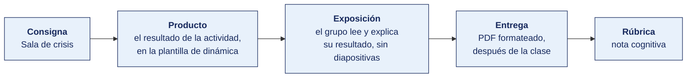

[Semana 02](README.md) · [Teoría](1-TEORIA.md) · **Dinámica de aula** · [Taller de laboratorio](3-TALLER.md)

# Dinámica de aula · Sala de crisis

**SI-886 · Planeamiento Estratégico de TI** · Semana 02 · Actividad en aula, **dentro de los 100 min de la sesión de teoría** · calificación **cognitiva**

> ¿Un término no le resulta claro? Está definido en el [glosario técnico del curso](../GLOSARIO.md).

---

## Cómo funciona la actividad

## Qué entregas

| | |
|---|---|
| **Archivo** | `SI886-S02-DINAMICA-Grupo<N>.pdf` |
| **Plantilla obligatoria** | [SI886-PLANTILLA-DINAMICA.docx](../PLANTILLAS/SI886-PLANTILLA-DINAMICA.docx) |
| **Formato** | PDF exportado desde la plantilla en Word, con la carátula de la UPT y los apellidos, nombres y códigos de todos los integrantes |
| **Dónde se sube** | Aula virtual, tarea «Dinámica · Semana 02» |
| **Cuándo vence** | Hasta 24 h después de la sesión de teoría. La tabla se resuelve en aula; el PDF se formatea y se sube después |
| **Exposición** | En la ronda de cierre de **esta misma sesión**. El grupo **lee y explica su resultado** ante el aula, con el documento a la vista. No se usan diapositivas |

> No se califica un trabajo entregado en `.docx`, sin carátula, sin los códigos de los integrantes o con la tabla del producto incompleta.

---

## Consigna

> **«Sala de crisis»**
> Su equipo es el comité de dirección de la organización. Están revisando el plan del año cuando entra una noticia del entorno que no puede esperar al próximo ciclo de planeamiento.

| | |
|---|---|
| **Su papel** | Cada integrante toma un cargo del comité — **gerencia general, TI, operaciones y comercial**. Se anuncia en voz alta antes de empezar |
| **Misión** | Decidir **qué hace la organización en los próximos 90 días** ante esa fuerza |
| **Restricción** | **Una sola decisión.** El comité no puede acordar «hacer todo». Y a mitad de la sesión entra una segunda noticia |

De la teoría de hoy. *La tendencia que no obliga a una decisión es información; la que obliga a una decisión es estrategia.* Hoy se comprueba cuál de las dos tenían delante.

## Cómo se desarrolla · 35 minutos

| | Bloque | Quién | Minutos |
|---|---|---|---|
| **1** | **Reparto de cargos y lectura.** Cada cargo dice **en una frase** qué le preocupa a él de esa fuerza | Equipo | 9 |
| **2** | **La decisión de los 90 días.** Una sola, con su responsable y el orden de magnitud de lo que cuesta | Equipo | 9 |
| **3** | **Entra la segunda noticia.** Se reparte por escrito. El comité revisa si su decisión sigue en pie | Equipo | 9 |
| **4** | **Ronda en aula.** Qué decisión se cayó con la segunda noticia y cuál aguantó | Todos | 8 |

## Material de trabajo

Una por equipo. Las cuatro fuerzas de cada ficha ya vienen documentadas con su cifra y su fuente.

### Ficha 1 · Agroexportadora de aceituna y orégano · 142 trabajadores · TI 3 personas · S/ 486 000

> **F1 · Protección de datos personales.** El D. S. 016-2024-JUS rige desde el 31/03/2025 y exige registro de actividades de tratamiento. La empresa trata datos de 142 trabajadores y de sus compradores. No existe inventario. *(ANPD.)*
> **F2 · Ciberseguridad y ransomware.** El servidor de planta sufrió un cifrado en marzo y la última copia legible era de 14 días antes. *(Registro interno de incidentes.)*
> **F3 · Sostenibilidad y eficiencia energética.** Los compradores europeos incorporan requisitos de huella en sus auditorías de proveedor desde el próximo ciclo de certificación, en 9 meses. *(Comunicación del comprador principal.)*
> **F4 · Inteligencia artificial.** Existen modelos de predicción de rendimiento de cosecha. La empresa no registra datos de campo en formato estructurado. *(Documentación de proveedores.)*

### Ficha 2 · Clínica privada de 60 camas · 310 trabajadores · TI 6 personas · S/ 1 240 000

> **F1 · Protección de datos personales.** El dato de salud es sensible bajo la Ley 29733. En junio se detectó que 17 usuarios administrativos consultaron una historia clínica sin relación con su función. No se notificó a la autoridad. *(Bitácora del sistema clínico y ANPD.)*
> **F2 · Conectividad y penetración digital.** El 78 % de los pacientes de la clínica tiene teléfono con datos. Las citas en línea pasaron de 0 a 31 % en un año. *(INEI y registro propio.)*
> **F3 · Escasez de talento técnico.** Dos de los seis integrantes de TI renunciaron en el último año. El único que conoce la integración del sistema clínico lleva ocho meses. *(Planilla.)*
> **F4 · Computación en la nube.** El proveedor del sistema clínico anunció que la versión local deja de recibir actualizaciones en 20 meses. *(Comunicado del proveedor.)*

### Ficha 3 · Municipalidad distrital · 41 800 habitantes · TI 3 personas · S/ 520 000

> **F1 · Transformación digital del Estado.** El D. Leg. 1412 y la R. M. 119-2018-PCM exigen Comité y Líder de Gobierno Digital. La entidad no tiene ninguno de los dos y es materia de control gubernamental. *(PCM-SGTD y Contraloría.)*
> **F2 · Ciberseguridad y ransomware.** El sistema de trámite documentario cayó en abril tras un corte eléctrico y 1 340 expedientes quedaron sin estado recuperable. No hay UPS ni respaldo fuera de la sede. *(Informe interno.)*
> **F3 · Conectividad y penetración digital.** El 62 % de los hogares del distrito accede a internet, quince puntos por debajo del promedio regional. *(INEI, ENAHO.)*
> **F4 · Inteligencia artificial.** Otras municipalidades anuncian asistentes virtuales de atención al vecino. *(Notas de prensa institucionales.)*

### Ficha 4 · Cooperativa de ahorro y crédito · 18 400 socios · TI 7 personas · S/ 980 000

> **F1 · Ciberseguridad y ransomware.** La Resolución SBS sobre gestión de la seguridad de la información exige reporte de incidentes al supervisor dentro de plazo. La cooperativa no tiene procedimiento de reporte formalizado. *(SBS.)*
> **F2 · Conectividad y penetración digital.** El 41 % de los socios activos usa la aplicación móvil al menos una vez al mes, frente al 12 % de hace dos años. *(Registro del core.)*
> **F3 · Volatilidad macroeconómica.** El contrato del core financiero está en dólares y se renueva en 16 meses. El tipo de cambio se movió 9 % en el último año. *(BCRP y contrato.)*
> **F4 · Sostenibilidad y eficiencia energética.** El centro de datos propio consume el 11 % de la energía de la sede. *(Recibo de energía.)*

### Ficha 5 · Empresa de transporte de carga · 96 trabajadores · TI 2 personas · S/ 320 000

> **F1 · Transformación digital del Estado.** La guía de remisión electrónica es obligatoria para su operación y la empresa la emite mediante un intermediario cuyo contrato vence en 7 meses. *(SUNAT y contrato.)*
> **F2 · Escasez de talento técnico.** El sistema de flota lo mantiene una sola persona, sin documentación ni respaldo formado. El sueldo del perfil subió 18 % en dos años. *(MTPE y planilla.)*
> **F3 · Volatilidad macroeconómica.** El 64 % del costo operativo es combustible y repuestos con precio referenciado al dólar. *(Estados financieros.)*
> **F4 · Inteligencia autónoma en transporte.** Se anuncian pilotos de conducción asistida en carga pesada en otros mercados. *(Prensa sectorial.)*

### Ficha 6 · Distribuidora mayorista de consumo masivo · 157 trabajadores · TI 4 personas · S/ 742 000

> **F1 · Computación en la nube.** El proveedor del ERP, que también provee la app de ventas y la facturación electrónica, anunció fin de soporte de la versión local en 15 meses. *(Comunicado del proveedor.)*
> **F2 · Protección de datos personales.** Se tratan datos de 157 trabajadores y de los titulares de 8 400 bodegas. No existe inventario ni registro de tratamiento. *(ANPD y revisión interna.)*
> **F3 · Conectividad y penetración digital.** El 68 % de las bodegas atendidas tiene teléfono con datos. El portal de pedidos propio lo usa el 4 %. *(INEI y registro propio.)*
> **F4 · Sostenibilidad y eficiencia energética.** La normativa de residuos de aparatos eléctricos y electrónicos alcanza a la baja de equipos de cómputo. *(MINAM.)*

### Ficha 7 · Instituto de educación superior tecnológica · 2 100 estudiantes · TI 3 personas · S/ 410 000

> **F1 · Transformación digital del Estado.** El licenciamiento del instituto exige evidencia de gestión académica verificable, con la visita de renovación en 11 meses. Las actas se llevan en el sistema y se corrigen fuera de él. *(Normativa del sector educación.)*
> **F2 · Escasez de talento técnico.** El docente que administra el campus virtual es el mismo que dicta programación, con carga completa. No hay respaldo. *(Carga académica.)*
> **F3 · Inteligencia artificial.** Los estudiantes usan asistentes de IA en los trabajos. No existe política institucional sobre su uso ni criterio de evaluación. *(Actas del comité académico.)*
> **F4 · Conectividad y penetración digital.** El 84 % de los estudiantes accede a internet solo desde el teléfono. El campus virtual no es utilizable desde teléfono. *(Encuesta interna.)*

### Ficha 8 · Empresa prestadora de servicios de saneamiento · 68 000 conexiones · TI 5 personas · S/ 890 000

> **F1 · Transformación digital del Estado.** El regulador exige reporte mensual de indicadores de calidad con trazabilidad al dato origen. Catastro y facturación son dos bases que se concilian a mano. *(Regulador sectorial.)*
> **F2 · Ciberseguridad y ransomware.** Un cambio aplicado directamente sobre la base de producción provocó la emisión errónea de 11 400 recibos en mayo, con S/ 61 000 de costo de reemisión. No hay ambiente de pruebas. *(Informe interno.)*
> **F3 · Sostenibilidad y eficiencia energética.** El bombeo representa el 38 % del costo operativo y no hay telemetría de presión en las zonas críticas. *(Estados financieros.)*
> **F4 · Computación en la nube.** El sistema comercial corre en servidores propios con 7 años de antigüedad. El fabricante deja de dar soporte al modelo en 24 meses. *(Documentación del fabricante.)*

### Ficha 9 · Servicios de ingeniería para minería · 88 trabajadores · TI 4 personas · S/ 640 000

> **F1 · Ciberseguridad y ransomware.** Los clientes mineros incorporan cláusulas de seguridad de la información en sus contratos de servicio. La próxima renovación, que representa el 34 % de la facturación, es en 10 meses. *(Contratos vigentes.)*
> **F2 · Inteligencia artificial.** La plataforma de telemetría propia acumula dos años de lecturas. Existen modelos de detección de anomalía aplicables. *(Documentación técnica.)*
> **F3 · Escasez de talento técnico.** El desarrollador de telemetría es uno solo y tiene acceso directo a producción. El puesto se cotiza por encima de lo que la empresa paga. *(MTPE y planilla.)*
> **F4 · Volatilidad macroeconómica.** La instrumentación se importa y se paga en dólares. *(Órdenes de compra.)*

### Ficha 10 · Cadena regional de farmacias · 34 locales · TI 5 personas · S/ 560 000

> **F1 · Protección de datos personales.** El programa de cliente frecuente registra la compra de medicamentos, que es dato de salud y por tanto sensible. El área de marketing exporta la base completa a hoja de cálculo. *(Ley 29733 y revisión interna.)*
> **F2 · Transformación digital del Estado.** La receta electrónica avanza en el marco normativo del sector salud, con adecuación exigible a los establecimientos farmacéuticos. *(Sector salud.)*
> **F3 · Conectividad y penetración digital.** El 73 % de los clientes del programa tiene teléfono con datos. No existe canal digital de pedido. *(INEI y registro propio.)*
> **F4 · Volatilidad macroeconómica.** El 46 % del inventario es de proveedores con precio en dólares. *(Compras del periodo.)*

## Producto

**El acta del comité.**

| | Contenido |
|---|---|
| **El comité** | Quién tomó cada cargo |
| **La fuerza que no espera** | Cuál de las de la ficha, y **el dato que prueba que no espera** |
| **La decisión de los 90 días** | Una sola, con su responsable por cargo y el orden de magnitud del costo |
| **Lo que cada cargo objetó** | La objeción de TI, de operaciones o de comercial que hubo que resolver |
| **Después de la segunda noticia** | La decisión se mantiene, se ajusta o se cae. Con la razón |

> **Dónde va.** Este producto se presenta en la **sección 2 de la [plantilla de dinámica](../PLANTILLAS/SI886-PLANTILLA-DINAMICA.docx)**, «El producto». No se copia la consigna ni la teoría. Solo el resultado y lo que lo sostiene.

## Ejemplo resuelto

*El caso de este ejemplo es distinto del que le toca a tu grupo. Sirve para que veas el nivel de detalle que se espera, no para copiarlo.*

**La ficha.** Cooperativa de ahorro y crédito de frontera.

> **La fuerza.** La SBS publica que el reglamento de autenticación reforzada entra en vigencia en ocho meses. La cooperativa tiene su aplicación móvil sin segundo factor.
> **La segunda noticia**, que entra a mitad de sesión. Un competidor acaba de lanzar apertura de cuentas 100 % remota en la misma provincia.

**El comité resolvió así.**

| | Contenido |
|---|---|
| **El comité** | Gerencia general · TI · Operaciones · Comercial |
| **La fuerza que no espera** | El reglamento de la SBS. El dato — **entra en vigencia en ocho meses** y el proyecto de segundo factor no está en el plan |
| **La decisión de los 90 días** | Implantar el segundo factor en la aplicación móvil. Responsable, TI. Orden de magnitud, S/ 120 000 |
| **Lo que cada cargo objetó** | Comercial objetó que el segundo factor añade fricción y bajará el uso de la app. Se resolvió aplicándolo solo a operaciones de dinero, no a la consulta de saldo |
| **Después de la segunda noticia** | **Se mantiene.** La apertura remota del competidor es más atractiva, pero sin segundo factor la cooperativa no puede ofrecerla, y además quedaría fuera de norma. El segundo factor es la condición de las dos cosas |

**La diferencia entre aprobar y no aprobar**

| Así no | Así sí |
|---|---|
| «La fuerza más importante es la competencia digital.» | «El reglamento de la SBS. Entra en vigencia en ocho meses y no estamos.» |
| «Decidimos fortalecer la seguridad y mejorar la app.» | «Implantar el segundo factor. Responsable, TI. S/ 120 000.» |
| «Con la segunda noticia cambiamos de prioridad.» | «Se mantiene: sin segundo factor no podemos abrir cuentas en remoto ni cumplir la norma.» |

## Reglas

- 35 min en aula, dentro de la sesión de teoría.
- **Un cargo por integrante.** Quien no tiene cargo no vota.
- **Una sola decisión.** Un comité que decide cuatro cosas no decidió ninguna.
- La segunda noticia **no se lee antes** de que el comité haya cerrado su primera decisión.
- Cambiar de decisión ante la segunda noticia **no baja la nota**. Sostener una decisión insostenible sí la baja.
- La exposición es la ronda de cierre de esta misma sesión. El grupo **lee y explica su resultado**. No se usan diapositivas.

## Rúbrica cognitiva (20 puntos)

| Criterio | 5 | 3 | 1 |
|---|---|---|---|
| **La urgencia probada** | Un dato de la ficha demuestra que la fuerza no espera al próximo ciclo | Se afirma la urgencia sin el dato | Se elige la fuerza más llamativa, no la más urgente |
| **La decisión** | Una sola, accionable en 90 días, con responsable y costo en orden de magnitud | Accionable pero sin responsable o sin costo | Un enunciado de intención, no una decisión |
| **El conflicto entre cargos** | Se recoge una objeción real de otro cargo y se explica cómo se resolvió | Se menciona que hubo desacuerdo | El comité coincidió en todo |
| **La reacción al cambio** | Revisa la decisión con criterio ante la segunda noticia y justifica mantenerla o cambiarla | Revisa sin justificar | Ignora la segunda noticia |

---

---

[Semana 02](README.md) · [Teoría](1-TEORIA.md) · **Dinámica de aula** · [Taller de laboratorio](3-TALLER.md)

---

**Docente** · Dr. Oscar Juan Jimenez Flores
[oscarjimenezflores@upt.pe](mailto:oscarjimenezflores@upt.pe) · [LinkedIn](https://www.linkedin.com/in/oscar-jimenez-flores/) · [CTI Vitae — CONCYTEC](https://ctivitae.concytec.gob.pe/appDirectorioCTI/VerDatosInvestigador.do?id_investigador=33398)

Escuela Profesional de Ingeniería de Sistemas · Universidad Privada de Tacna · Tacna, Perú
