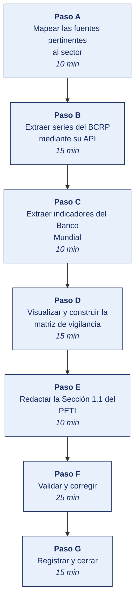

[Semana 02](README.md) · [Teoría](1-TEORIA.md) · [Dinámica de aula](2-DINAMICA.md) · **Taller de laboratorio**

# Taller de laboratorio 02 · Vigilancia estratégica con fuentes oficiales

**SI-886 · Planeamiento Estratégico de TI** · Semana 02 · Sesión 2 en laboratorio · 100 min · calificación **procedimental**

> ¿Un término no le resulta claro? Está definido en el [glosario técnico del curso](../GLOSARIO.md).

---

## Secuencia del taller



## Qué entregas

| | |
|---|---|
| **Archivo** | `SI886-S02-TALLER-Grupo<N>.pdf` |
| **Plantilla obligatoria** | [SI886-PLANTILLA-TALLER.docx](../PLANTILLAS/SI886-PLANTILLA-TALLER.docx) |
| **Formato** | PDF exportado desde la plantilla en Word, con la carátula de la UPT, el índice actualizado y las capturas numeradas |
| **Qué va dentro** | Las secciones de la plantilla. La **5. Resultados y evidencias** se califica contra la tabla de resultados esperados de esta guía, y **cada resultado necesita la evidencia que lo demuestre**. No se copian de aquí los objetivos, la duración ni los resultados de aprendizaje |
| **Dónde se sube** | Aula virtual, tarea «Taller · Semana 02» |
| **Cuándo vence** | 48 horas después de la sesión de laboratorio |

> No se califica un informe entregado en `.docx`, sin carátula, sin los códigos de los integrantes o con resultados declarados sin evidencia.

---

## El reto

| | |
|---|---|
| **Situación** | La gerencia pide saber qué del entorno puede afectar al negocio en los próximos tres años, y no acepta opiniones. |
| **Misión** | Sustentar tres fuerzas del entorno con series estadísticas oficiales, no con percepciones. |
| **Criterio de éxito** | Cada fuerza declarada tiene detrás una serie de una fuente oficial, con su año y su enlace, y alguien podría reproducir el dato. |

## 1. Información sobre el evento práctico

### 1.1. Objetivos

- Identificar y consultar las **fuentes oficiales** pertinentes al sector de la organización.
- Extraer series estadísticas reales de **INEI**, **BCRP**, **OSIPTEL** y **Datos Abiertos del Perú**.
- Procesar y **visualizar** las series para sustentar el análisis de tendencias.
- Construir la **matriz de vigilancia estratégica** con la trazabilidad de cada dato a su fuente.
- Redactar la **Sección 1.1** del PETI. Contexto y tendencias, con cada afirmación referenciada.
- Establecer un **procedimiento de actualización** de la vigilancia para la revisión anual del plan.

### 1.2. Recursos

| Recurso | Detalle |
|---|---|
| **INEI** | https://www.inei.gob.pe · Sistema de Información Regional https://systems.inei.gob.pe/SIRTOD/ |
| **BCRP — Estadísticas** | https://estadisticas.bcrp.gob.pe · **API pública** de series |
| **OSIPTEL** | https://www.osiptel.gob.pe · Punto de Intercambio de Datos |
| **MEF — Consulta Amigable** | https://apps5.mineco.gob.pe/transparencia/ |
| **Datos Abiertos del Perú** | https://www.datosabiertos.gob.pe |
| **Banco Mundial — API** | https://data.worldbank.org · https://api.worldbank.org/v2/ |
| **Python 3.11+** | `pandas`, `matplotlib`, `requests` |
| **Jupyter Lab** | `pip install jupyterlab` |
| **LibreOffice Calc** | Matriz de vigilancia |

### 1.3. Seguridad

1. Se consumen **APIs y descargas públicas**; no se realiza extracción automatizada masiva que pueda afectar la disponibilidad del servicio. Se respetan los términos de uso de cada portal.
2. Toda serie descargada se guarda con su **URL de origen, fecha de descarga y hash**, para garantizar la reproducibilidad del análisis.
3. Los datos oficiales se citan sin alterar. Cualquier transformación (deflactación, tasas, promedios móviles) se documenta explícitamente.
4. Está prohibido presentar como oficial un dato obtenido de una fuente secundaria sin verificar la primaria.

---

## 2. Procedimiento o Metodología

> **Documento del caso para esta semana.** La organización entrega **Relato del incidente del periodo**, en `CASOS/EMPRESA-<NN>-<slug>/documentos/incidente-detallado.md`. Es consistente con los datos de `datos/`. Las personas, usuarios y proveedores que menciona existen en los archivos. **No señala sus debilidades**; declara lo que la organización dice hacer.

### Paso A — Mapear las fuentes pertinentes al sector

`01_marco/VS01_fuentes.csv`:

| id | Fuerza del contexto | Fuente oficial | Institución | Serie o indicador | URL | Periodicidad | Última actualización |
|---|---|---|---|---|---|---|---|
| F-01 | Conectividad digital | ENAHO — Estadísticas TIC en hogares | INEI | % de hogares con acceso a internet, por región | | Trimestral | |
| F-02 | Volatilidad cambiaria | Series estadísticas | BCRP | Tipo de cambio interbancario, promedio mensual | | Diaria | |
| F-03 | Inflación | Series estadísticas | BCRP / INEI | Índice de precios al consumidor, variación anual | | Mensual | |
| F-04 | Penetración móvil | Indicadores del mercado | OSIPTEL | Líneas móviles por cada 100 habitantes | | Trimestral | |
| F-05 | Actividad del sector | Cuentas nacionales | INEI / BCRP | PBI (*Product Backlog Item*, elemento del Product Backlog) por sector económico, variación anual | | Mensual | |
| F-06 | Gasto público en TI | Consulta Amigable | MEF | Ejecución presupuestal en la genérica correspondiente | | Diaria | |
| F-07 | Empleo en el sector | ENAHO | INEI | Población ocupada por rama de actividad | | Trimestral | |

> **Criterio de selección.** Solo se incluyen fuerzas cuya evidencia pueda **descargarse y actualizarse** en la revisión anual del plan. Una tendencia sin serie disponible no puede monitorearse y por tanto no puede sostener un indicador.

### Paso B — Extraer series del BCRP mediante su API

**El programa está en [`HERRAMIENTAS/SEMANA-02/VS02_extraccion_bcrp.py`](../HERRAMIENTAS/SEMANA-02/VS02_extraccion_bcrp.py).** Se copia al repositorio del equipo como `01_marco/VS02_extraccion_bcrp.py` y **se edita con los datos de su organización**. El programa hace el cálculo, las cifras y su justificación son del equipo.

```bash
cp ../HERRAMIENTAS/SEMANA-02/VS02_extraccion_bcrp.py 01_marco/VS02_extraccion_bcrp.py
python3 01_marco/VS02_extraccion_bcrp.py
```

> **Si la API no responde**, se descarga manualmente la serie desde el portal del BCRP y se documenta el procedimiento en el papel de trabajo. **La reproducibilidad exige registrar cómo se obtuvo cada dato**, no solo el dato.

### Paso C — Extraer indicadores del Banco Mundial

**El programa está en [`HERRAMIENTAS/SEMANA-02/VS03_extraccion_bm.py`](../HERRAMIENTAS/SEMANA-02/VS03_extraccion_bm.py).** Se copia al repositorio del equipo como `01_marco/VS03_extraccion_bm.py` y **se edita con los datos de su organización**. El programa hace el cálculo, las cifras y su justificación son del equipo.

```bash
cp ../HERRAMIENTAS/SEMANA-02/VS03_extraccion_bm.py 01_marco/VS03_extraccion_bm.py
python3 01_marco/VS03_extraccion_bm.py
```

### Paso D — Visualizar y construir la matriz de vigilancia

**El programa está en [`HERRAMIENTAS/SEMANA-02/VS04_graficos.py`](../HERRAMIENTAS/SEMANA-02/VS04_graficos.py).** Se copia al repositorio del equipo como `01_marco/VS04_graficos.py` y **se edita con los datos de su organización**. El programa hace el cálculo, las cifras y su justificación son del equipo.

```bash
cp ../HERRAMIENTAS/SEMANA-02/VS04_graficos.py 01_marco/VS04_graficos.py
python3 01_marco/VS04_graficos.py
```

**Matriz de vigilancia estratégica** (`01_marco/VS05_matriz_vigilancia.csv`) — el producto que se incorpora al PETI:

| id | Fuerza | Evidencia (dato con cifra) | Fuente y año | Efecto sobre la organización | Tipo | Horizonte | **Decisión que obliga** | Sección del PETI donde se retoma |
|---|---|---|---|---|---|---|---|---|
| T-01 | Conectividad en el segmento de clientes | El __ % de hogares de la región tiene acceso a internet, frente al __ % del periodo anterior | INEI, ENAHO — última publicación | Viabiliza un canal de pedidos en línea para el __ % de los clientes | Oportunidad | 12–24 meses | Evaluar la inversión en canal digital | Sección 3.3 PESTEL, Sección 7.1 Portafolio |
| T-02 | Volatilidad cambiaria | El tipo de cambio varió __ % en los últimos 24 meses | BCRP, último dato disponible | El __ % de los contratos de TI está en dólares | Amenaza | Continuo | Cláusulas de cobertura cambiaria en contratos plurianuales | Sección 8 Riesgos |
| T-03 | | | | | | | | |

> **La columna decisiva es «Decisión que obliga».** Es la que convierte la vigilancia en insumo del plan. Una fila sin decisión asociada se retira de la matriz.

### Paso E — Redactar la Sección 1.1 del PETI

`01_marco/1.1_contexto_tendencias.md`:

```markdown
## 1.1 Contexto y tendencias

### 1.1.1 Contexto general
Descripción del entorno macroeconómico, sectorial y tecnológico relevante para la
organización, con datos de fuente oficial y su año de referencia.

### 1.1.2 Tendencias que representan oportunidad
| Tendencia | Evidencia y fuente | Efecto en la organización | Decisión que obliga | Horizonte |

### 1.1.3 Tendencias que representan amenaza
| Tendencia | Evidencia y fuente | Efecto en la organización | Decisión que obliga | Horizonte |

### 1.1.4 Posición de TI en la organización
Postura identificada —soporte, fábrica, giro estratégico o estratégica— con la
justificación que la sustenta y su implicancia para el alcance de este plan.

### 1.1.5 Procedimiento de actualización de la vigilancia
Series a monitorear, frecuencia de actualización, responsable y umbral de alerta que
obligaría a revisar el plan antes de su ciclo anual.

### 1.1.6 Fuentes consultadas
Listado con institución, publicación, año y URL de cada fuente utilizada.
```

### Paso F — Validar y corregir (25 min)

El resultado no vale por estar hecho, sino por resistir una comprobación. Se ejecutan estas tres y **se corrige lo que falle antes de cerrar la sesión**.

1. Tomar una de las tres fuerzas y rehacer la consulta desde cero, para comprobar que la serie se obtiene igual.
2. Verificar que cada serie trae fuente, periodo y unidad, y que la unidad es la que dice ser.
3. Comprobar que ninguna fuerza se sostiene solo con una noticia de prensa.

> Lo que no se pueda corregir hoy se anota en la sección **Problemas y mejoras** de la evidencia, con lo que faltó y por qué. Un resultado parcial documentado con honestidad vale más que uno declarado sin prueba.

### Paso G — Registrar la evidencia y cerrar (15 min)

Se versiona lo producido, se anota la URL de cada resultado y se responde en dos frases la pregunta de transferencia — **qué riesgo correría una organización real si esto se hiciera mal**.

```bash
sha256sum evidencias/VS_*.csv >> evidencias/HASHES.txt
git add . && git commit -m "S02: vigilancia estrategica con fuentes oficiales y seccion 1.1 del PETI"
git tag -a v0.2 -m "PETI v0.2 — contexto y tendencias"
```

---

## 3. Resultados

> **Evidencia obligatoria en GitHub.** Todo resultado de este taller se versiona en el repositorio del equipo. El informe **no consigna capturas sueltas**. Consigna la **URL** del artefacto en GitHub. Una captura no permite verificar autoría, fecha ni contenido; un enlace sí.
>
> | Qué se entrega | Dónde vive | Qué se escribe en el informe |
> |---|---|---|
> | Código y archivos de configuración | Rama del taller, fusionada a `develop` vía Pull Request | URL del Pull Request |
> | Documentos y matrices | `docs/`, en formato de texto versionable | URL del archivo en la rama |
> | Capturas y videos que el taller exija | `docs/evidencias/S02/` | URL del archivo |
> | Salida de comandos | `docs/evidencias/S02/salidas/*.txt` | URL del archivo |
>
> **Etiqueta del taller.** Al cerrar el taller se crea la etiqueta `taller-02` sobre el commit entregado:
>
> ```bash
> git tag -a taller-02 -m "Taller 02 · SI886"
> git push origin taller-02
> ```
>
> La URL que se consigna en el informe apunta a esa etiqueta:
> `https://github.com/<organizacion>/<repositorio>/tree/taller-02`
>
> **El informe es lo que se califica; el repositorio es lo que lo prueba.** Cada resultado de la sección 3 del informe lleva la URL con la que se verifica, y **un resultado sin su URL se califica como no logrado**, por bien redactado que esté. Lo que no se puede abrir no se puede dar por hecho.

### 3.1. Los tres resultados que se califican

Son los que la rúbrica evalúa. El resto de la lista tiene que existir, pero no se califica fila por fila.

| Resultado | Qué demuestra | Dónde está |
|---|---|---|
| **Las tres fuerzas sustentadas** | Cada una con su serie oficial, su periodo y su enlace | Tabla de vigilancia |
| **La lectura del dato** | Qué dice la serie sobre el negocio, no qué dice la serie | Sección redactada |
| **La reproducibilidad** | Otro equipo obtiene la misma cifra siguiendo el procedimiento | Script o pasos documentados |

### 3.2. Lista de comprobación del taller

Todo esto debe existir al cerrar la sesión.

| # | Resultado esperado | Verificación |
|---|---|---|
| 1 | Matriz de fuentes con **al menos 7 fuerzas** y su fuente oficial identificada | `VS01_fuentes.csv` |
| 2 | Series del BCRP descargadas, con URL de origen, fecha de descarga y hash | `VS_series_bcrp.csv` |
| 3 | Indicadores del Banco Mundial con **comparación regional** | `VS_series_banco_mundial.csv` |
| 4 | Al menos una serie de INEI, OSIPTEL o Datos Abiertos pertinente al sector | `evidencias/` |
| 5 | Gráfico de contexto generado con serie nacional y comparación regional | `VS_contexto.png` |
| 6 | Matriz de vigilancia con **decisión que obliga** en cada fila | `VS05_matriz_vigilancia.csv` |
| 7 | **Cero filas sin decisión asociada** en la matriz | Revisión de la matriz |
| 8 | Al menos **tres oportunidades y tres amenazas** documentadas con cifra y fuente | Sección 1.1 |
| 9 | **Postura de TI** identificada y justificada | Sección 1.1.4 |
| 10 | Procedimiento de actualización de la vigilancia con responsable y umbral de alerta | Sección 1.1.5 |
| 11 | Sección 1.1 redactada, con todas las fuentes listadas | `1.1_contexto_tendencias.md` |
| 12 | Etiqueta `v0.2` en Git y hashes registrados | `git tag`, `HASHES.txt` |

## Rúbrica procedimental (20 puntos)

Se aplica sobre el informe entregado y la evidencia enlazada en el repositorio. **Cada criterio se califica de forma independiente.**

| Criterio | 4 — Logrado | 2 — En proceso | 0 — Insuficiente |
|---|---|---|---|
| **El criterio de éxito** | Se cumple tal como lo pide el reto de esta sesión | Se cumple con reservas que el equipo declara | No se cumple, o se afirma cumplido sin prueba |
| **Las tres fuerzas sustentadas** | Completo y correcto, con la evidencia que lo respalda | Completo con errores menores, o correcto sin toda la evidencia | Incompleto o sin evidencia |
| **La lectura del dato** | Completo y correcto, con la evidencia que lo respalda | Completo con errores menores, o correcto sin toda la evidencia | Incompleto o sin evidencia |
| **La reproducibilidad** | Completo y correcto, con la evidencia que lo respalda | Completo con errores menores, o correcto sin toda la evidencia | Incompleto o sin evidencia |
| **La validación** | Las tres comprobaciones ejecutadas, y lo que falló quedó corregido o documentado | Ejecutadas sin corregir lo que falló | No se validó nada |

| Puntaje | Equivalencia |
|---|---|
| 18 – 20 | Destacado |
| 14 – 17 | Logrado |
| 6 – 13 | En proceso |
| 0 – 5 | Insuficiente |

> **Un resultado declarado sin evidencia enlazada no se califica**, aunque el trabajo se haya hecho. La tabla de la sección 3.1 es la lista de cotejo; esta rúbrica es lo que determina la nota.

## 4. Conclusiones

Mínimo tres. Líneas argumentales esperadas:

1. Una tendencia solo pertenece a un plan estratégico si puede evidenciarse con una serie oficial actualizable y si obliga a una decisión concreta; lo demás es contenido de divulgación.
2. La comparación regional sitúa la posición de la organización y de su mercado, y evita el error de asumir que una tendencia global se manifiesta con la misma intensidad en el contexto local.
3. Identificar la postura de TI —soporte, fábrica, giro estratégico o estratégica— antes de formular objetivos evita que el plan proponga capacidades desproporcionadas para el papel que la tecnología cumple en esa organización.

## 5. Referencias Bibliográficas

- Rodríguez Bermúdez, J. R. (2015). *Planificación y dirección estratégica de sistemas de información*. Editorial UOC. https://elibro.net/es/lc/bibliotecaupt/titulos/57875
- Rodríguez Bermúdez, J. R. (2015). *Usos estratégicos de las TIC*. Editorial UOC. https://elibro.net/es/lc/bibliotecaupt/titulos/57677
- González Millán, J. (2020). *Manual práctico de planeación estratégica*. Ediciones Díaz de Santos. https://elibro.net/es/lc/bibliotecaupt/titulos/129291
- Porter, M. E. (1996). What is strategy? *Harvard Business Review*, 74(6), 61–78.
- Instituto Nacional de Estadística e Informática. *Estadísticas de las Tecnologías de Información y Comunicación en los Hogares*. https://www.inei.gob.pe
- Banco Central de Reserva del Perú. *Series estadísticas*. https://estadisticas.bcrp.gob.pe
- OSIPTEL. *Indicadores del mercado de telecomunicaciones*. https://www.osiptel.gob.pe
- Ministerio de Economía y Finanzas. *Consulta Amigable de ejecución presupuestal*. https://apps5.mineco.gob.pe/transparencia/
- Plataforma Nacional de Datos Abiertos. https://www.datosabiertos.gob.pe
- Banco Mundial. *World Development Indicators*. https://data.worldbank.org
- Decreto Supremo 085-2023-PCM, Política Nacional de Transformación Digital al 2030. https://busquedas.elperuano.pe/dispositivo/NL/2200457-5
- ISO/IEC 42001:2023. *Artificial intelligence — Management system*. https://www.iso.org/standard/81230.html

## 6. Anexos

- `anexo_A_matriz_vigilancia.xlsx`
- `anexo_B_series_descargadas.zip` — con su archivo de hashes
- `anexo_C_graficos_contexto.png`
- `anexo_D_seccion_1_1.pdf`

---

---

[Semana 02](README.md) · [Teoría](1-TEORIA.md) · [Dinámica de aula](2-DINAMICA.md) · **Taller de laboratorio**

---

**Docente** · Dr. Oscar Juan Jimenez Flores
[oscarjimenezflores@upt.pe](mailto:oscarjimenezflores@upt.pe) · [LinkedIn](https://www.linkedin.com/in/oscar-jimenez-flores/) · [CTI Vitae — CONCYTEC](https://ctivitae.concytec.gob.pe/appDirectorioCTI/VerDatosInvestigador.do?id_investigador=33398)

Escuela Profesional de Ingeniería de Sistemas · Universidad Privada de Tacna · Tacna, Perú
