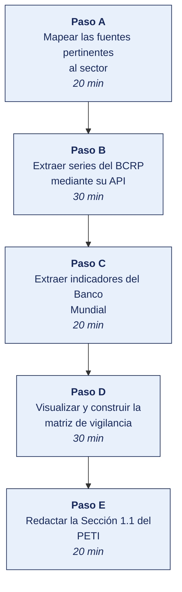

[Semana 02](README.md) · [Teoría](1-TEORIA.md) · [Dinámica de aula](2-DINAMICA.md) · **Taller de laboratorio**

# Taller de laboratorio 02 · Vigilancia estratégica con fuentes oficiales

**SI-886 · Planeamiento Estratégico de TI** · Semana 02 · Sesión 2 en laboratorio · 2 h · calificación **procedimental**

---

## Secuencia del taller



## Qué entregas

| | |
|---|---|
| **Archivo** | `SI886-S02-TALLER-Grupo<N>.pdf` |
| **Plantilla obligatoria** | [SI886-PLANTILLA-TALLER.docx](../PLANTILLAS/SI886-PLANTILLA-TALLER.docx) |
| **Formato** | PDF exportado desde la plantilla en Word, con la carátula de la UPT, el índice actualizado y las capturas numeradas |
| **Qué va dentro** | Las siete secciones del formato EPIS. La sección **3. Resultados** se califica contra la tabla de resultados esperados de esta guía, y cada resultado necesita su evidencia |
| **Dónde se sube** | Aula virtual, tarea «Taller · Semana 02» |
| **Cuándo vence** | 48 horas después de la sesión de laboratorio |

> No se califica un informe entregado en `.docx`, sin carátula, sin los códigos de los integrantes o con resultados declarados sin evidencia.

---

## 1. Información sobre el evento práctico

### 1.1. Título del evento práctico

Construcción del análisis de contexto y tendencias del PETI mediante extracción, procesamiento y visualización de datos de fuentes estadísticas oficiales peruanas e internacionales.

### 1.2. Objetivos

- Identificar y consultar las **fuentes oficiales** pertinentes al sector de la organización.
- Extraer series estadísticas reales de **INEI**, **BCRP**, **OSIPTEL** y **Datos Abiertos del Perú**.
- Procesar y **visualizar** las series para sustentar el análisis de tendencias.
- Construir la **matriz de vigilancia estratégica** con la trazabilidad de cada dato a su fuente.
- Redactar la **Sección 1.1** del PETI. Contexto y tendencias, con cada afirmación referenciada.
- Establecer un **procedimiento de actualización** de la vigilancia para la revisión anual del plan.

### 1.3. Tiempo de duración

**02 horas.**

### 1.4. Resultados de Aprendizaje (RA)

- **RA1** Aplica la dirección estratégica, definiendo la misión y visión.
- **RA2** Desarrolla el análisis FODA.

### 1.5. Recursos

| Recurso | Detalle |
|---|---|
| **INEI** | https://www.inei.gob.pe · Sistema de Información Regional https://systems.inei.gob.pe/SIRTOD/ |
| **BCRP — Estadísticas** | https://estadisticas.bcrp.gob.pe · **API pública** de series |
| **OSIPTEL** | https://www.osiptel.gob.pe · Punto de Intercambio de Datos |
| **MEF — Consulta Amigable** | https://apps5.mineco.gob.pe/transparencia/ |
| **Datos Abiertos del Perú** | https://www.datosabiertos.gob.pe |
| **Banco Mundial — API** | https://data.worldbank.org · https://api.worldbank.org/v2/ |
| **Python 3.11+** | `pandas`, `matplotlib`, `requests` |
| **Jupyter Lab** | `pip install jupyterlab` |
| **LibreOffice Calc** | Matriz de vigilancia |

### 1.6. Seguridad

1. Se consumen **APIs y descargas públicas**; no se realiza extracción automatizada masiva que pueda afectar la disponibilidad del servicio. Se respetan los términos de uso de cada portal.
2. Toda serie descargada se guarda con su **URL de origen, fecha de descarga y hash**, para garantizar la reproducibilidad del análisis.
3. Los datos oficiales se citan sin alterar. Cualquier transformación (deflactación, tasas, promedios móviles) se documenta explícitamente.
4. Está prohibido presentar como oficial un dato obtenido de una fuente secundaria sin verificar la primaria.

---

## 2. Procedimiento o Metodología

### Paso A — Mapear las fuentes pertinentes al sector (20 min)

`01_marco/VS01_fuentes.csv`:

| id | Fuerza del contexto | Fuente oficial | Institución | Serie o indicador | URL | Periodicidad | Última actualización |
|---|---|---|---|---|---|---|---|
| F-01 | Conectividad digital | ENAHO — Estadísticas TIC en hogares | INEI | % de hogares con acceso a internet, por región | | Trimestral | |
| F-02 | Volatilidad cambiaria | Series estadísticas | BCRP | Tipo de cambio interbancario, promedio mensual | | Diaria | |
| F-03 | Inflación | Series estadísticas | BCRP / INEI | Índice de precios al consumidor, variación anual | | Mensual | |
| F-04 | Penetración móvil | Indicadores del mercado | OSIPTEL | Líneas móviles por cada 100 habitantes | | Trimestral | |
| F-05 | Actividad del sector | Cuentas nacionales | INEI / BCRP | PBI por sector económico, variación anual | | Mensual | |
| F-06 | Gasto público en TI | Consulta Amigable | MEF | Ejecución presupuestal en la genérica correspondiente | | Diaria | |
| F-07 | Empleo en el sector | ENAHO | INEI | Población ocupada por rama de actividad | | Trimestral | |

> **Criterio de selección.** Solo se incluyen fuerzas cuya evidencia pueda **descargarse y actualizarse** en la revisión anual del plan. Una tendencia sin serie disponible no puede monitorearse y por tanto no puede sostener un indicador.

### Paso B — Extraer series del BCRP mediante su API (30 min)

```python
# 01_marco/VS02_extraccion_bcrp.py
import requests, pandas as pd, hashlib, json
from datetime import date

BASE = "https://estadisticas.bcrp.gob.pe/estadisticas/series/api"

# Rango relativo: siempre los últimos N años respecto de la fecha de ejecución.
# Así el script no envejece con el material.
HOY   = date.today()
DESDE = f"{HOY.year - 6}-1"
HASTA = f"{HOY.year}-{HOY.month}"

SERIES = {
    "PN01207PM": "Tipo de cambio interbancario (S/ por US$) — promedio del periodo",
    "PN01273PM": "IPC de Lima Metropolitana — variación % de los últimos 12 meses",
    "PN01770AM": "Producto bruto interno — índice 2007 = 100",
}

def serie_bcrp(codigo, desde=DESDE, hasta=HASTA):
    url = f"{BASE}/{codigo}/json/{desde}/{hasta}/esp"
    r = requests.get(url, timeout=30); r.raise_for_status()
    d = r.json()
    df = pd.DataFrame([{"periodo": p["name"], "valor": p["values"][0]} for p in d["periods"]])
    df["valor"] = pd.to_numeric(df["valor"], errors="coerce")
    df["codigo"] = codigo
    df["url_origen"] = url
    df["fecha_descarga"] = date.today().isoformat()
    df["hash_respuesta"] = hashlib.sha256(r.content).hexdigest()[:16]
    return df

frames = []
for cod, nombre in SERIES.items():
    try:
        s = serie_bcrp(cod); s["indicador"] = nombre
        frames.append(s)
        print(f"✔ {cod}: {len(s)} observaciones — {nombre}")
    except Exception as e:
        print(f"✗ {cod}: {e}  → registrar como limitación en el papel de trabajo")

datos = pd.concat(frames, ignore_index=True)

# Transformación documentada. El BCRP publica el PBI como índice, no como tasa:
# la variación interanual se calcula aquí y se registra identificada como cálculo
# propio, nunca como si fuera el dato original de la fuente.
pbi = datos[datos.codigo == "PN01770AM"].copy()
pbi["valor"] = pbi["valor"].pct_change(12) * 100
pbi["codigo"] = "PN01770AM/var12"
pbi["indicador"] = "Producto bruto interno — variación % interanual (cálculo propio)"
datos = pd.concat([datos, pbi.dropna(subset=["valor"])], ignore_index=True)

datos.to_csv("../evidencias/VS_series_bcrp.csv", index=False)
print(datos.groupby("indicador").valor.agg(["count","min","max","last"]).to_string())
```

> **Si la API no responde**, se descarga manualmente la serie desde el portal del BCRP y se documenta el procedimiento en el papel de trabajo. **La reproducibilidad exige registrar cómo se obtuvo cada dato**, no solo el dato.

### Paso C — Extraer indicadores del Banco Mundial (20 min)

```python
# 01_marco/VS03_extraccion_bm.py
import requests, pandas as pd
from datetime import date

DESDE_ANIO, HASTA_ANIO = date.today().year - 10, date.today().year

IND = {
    "IT.NET.USER.ZS":  "Personas que usan internet (% de la población)",
    "IT.CEL.SETS.P2":  "Suscripciones a telefonía móvil (por cada 100 personas)",
    "NY.GDP.PCAP.CD":  "PBI per cápita (US$ a precios actuales)",
    "GB.XPD.RSDV.GD.ZS": "Gasto en investigación y desarrollo (% del PBI)",
}
PAISES = "PER;CHL;COL;MEX;BRA"     # comparación regional

frames = []
for cod, nombre in IND.items():
    url = (f"https://api.worldbank.org/v2/country/{PAISES}/indicator/{cod}"
           f"?format=json&date={DESDE_ANIO}:{HASTA_ANIO}&per_page=500")
    r = requests.get(url, timeout=30); r.raise_for_status()
    payload = r.json()
    if len(payload) < 2 or not payload[1]:
        print(f"✗ {cod}: sin datos"); continue
    df = pd.DataFrame([{"pais": x["country"]["value"], "año": int(x["date"]),
                        "valor": x["value"]} for x in payload[1]])
    df["indicador"] = nombre; df["codigo"] = cod; df["url_origen"] = url
    df["fecha_descarga"] = date.today().isoformat()
    frames.append(df)
    print(f"✔ {cod}: {len(df)} observaciones")

bm = pd.concat(frames, ignore_index=True).dropna(subset=["valor"])
bm.to_csv("../evidencias/VS_series_banco_mundial.csv", index=False)

# Posición del Perú frente a la región en el último año disponible
ult = bm.sort_values("año").groupby(["indicador","pais"]).last().reset_index()
print(ult.pivot(index="indicador", columns="pais", values="valor").round(1).to_string())
```

### Paso D — Visualizar y construir la matriz de vigilancia (30 min)

```python
# 01_marco/VS04_graficos.py
import pandas as pd, matplotlib.pyplot as plt

AZUL_UPT, AZUL_EPIS, CIAN = "#16285C", "#174380", "#0EA5E9"

bcrp = pd.read_csv("../evidencias/VS_series_bcrp.csv")
bm   = pd.read_csv("../evidencias/VS_series_banco_mundial.csv")

fig, ax = plt.subplots(1, 2, figsize=(14,5))

# Serie nacional: tipo de cambio
tc = bcrp[bcrp.codigo == "PN01207PM"]
ax[0].plot(range(len(tc)), tc.valor, color=AZUL_UPT, linewidth=2)
ax[0].set_title("Tipo de cambio bancario venta (S/ por US$)\nFuente: BCRP", fontsize=11)
ax[0].set_xticks(range(0, len(tc), max(1, len(tc)//8)))
ax[0].set_xticklabels(tc.periodo.iloc[::max(1, len(tc)//8)], rotation=45, ha="right", fontsize=8)
ax[0].grid(alpha=.3)

# Comparación regional: uso de internet
uso = bm[bm.codigo == "IT.NET.USER.ZS"]
for pais, g in uso.groupby("pais"):
    g = g.sort_values("año")
    ax[1].plot(g.año, g.valor, marker="o", markersize=3,
               linewidth=2.5 if pais == "Peru" else 1.2,
               color=AZUL_UPT if pais == "Peru" else "#9CA3AF", label=pais)
ax[1].set_title("Personas que usan internet (% de la población)\nFuente: Banco Mundial", fontsize=11)
ax[1].legend(fontsize=8); ax[1].grid(alpha=.3); ax[1].set_ylabel("%")

plt.tight_layout(); plt.savefig("../graficos/VS_contexto.png", dpi=140)
print("Gráfico generado: graficos/VS_contexto.png")
```

**Matriz de vigilancia estratégica** (`01_marco/VS05_matriz_vigilancia.csv`) — el producto que se incorpora al PETI:

| id | Fuerza | Evidencia (dato con cifra) | Fuente y año | Efecto sobre la organización | Tipo | Horizonte | **Decisión que obliga** | Sección del PETI donde se retoma |
|---|---|---|---|---|---|---|---|---|
| T-01 | Conectividad en el segmento de clientes | El __ % de hogares de la región tiene acceso a internet, frente al __ % del periodo anterior | INEI, ENAHO — última publicación | Viabiliza un canal de pedidos en línea para el __ % de los clientes | Oportunidad | 12–24 meses | Evaluar la inversión en canal digital | Sección 3.3 PESTEL, Sección 7.1 Portafolio |
| T-02 | Volatilidad cambiaria | El tipo de cambio varió __ % en los últimos 24 meses | BCRP, último dato disponible | El __ % de los contratos de TI está en dólares | Amenaza | Continuo | Cláusulas de cobertura cambiaria en contratos plurianuales | Sección 8 Riesgos |
| T-03 | | | | | | | | |

> **La columna decisiva es «Decisión que obliga».** Es la que convierte la vigilancia en insumo del plan. Una fila sin decisión asociada se retira de la matriz.

### Paso E — Redactar la Sección 1.1 del PETI (20 min)

`01_marco/1.1_contexto_tendencias.md`:

```markdown
## 1.1 Contexto y tendencias

### 1.1.1 Contexto general
Descripción del entorno macroeconómico, sectorial y tecnológico relevante para la
organización, con datos de fuente oficial y su año de referencia.

### 1.1.2 Tendencias que representan oportunidad
| Tendencia | Evidencia y fuente | Efecto en la organización | Decisión que obliga | Horizonte |

### 1.1.3 Tendencias que representan amenaza
| Tendencia | Evidencia y fuente | Efecto en la organización | Decisión que obliga | Horizonte |

### 1.1.4 Posición de TI en la organización
Postura identificada —soporte, fábrica, giro estratégico o estratégica— con la
justificación que la sustenta y su implicancia para el alcance de este plan.

### 1.1.5 Procedimiento de actualización de la vigilancia
Series a monitorear, frecuencia de actualización, responsable y umbral de alerta que
obligaría a revisar el plan antes de su ciclo anual.

### 1.1.6 Fuentes consultadas
Listado con institución, publicación, año y URL de cada fuente utilizada.
```

```bash
sha256sum evidencias/VS_*.csv >> evidencias/HASHES.txt
git add . && git commit -m "S02: vigilancia estrategica con fuentes oficiales y seccion 1.1 del PETI"
git tag -a v0.2 -m "PETI v0.2 — contexto y tendencias"
```

---

## 3. Resultados

| # | Resultado esperado | Verificación |
|---|---|---|
| 1 | Matriz de fuentes con **al menos 7 fuerzas** y su fuente oficial identificada | `VS01_fuentes.csv` |
| 2 | Series del BCRP descargadas, con URL de origen, fecha de descarga y hash | `VS_series_bcrp.csv` |
| 3 | Indicadores del Banco Mundial con **comparación regional** | `VS_series_banco_mundial.csv` |
| 4 | Al menos una serie de INEI, OSIPTEL o Datos Abiertos pertinente al sector | `evidencias/` |
| 5 | Gráfico de contexto generado con serie nacional y comparación regional | `VS_contexto.png` |
| 6 | Matriz de vigilancia con **decisión que obliga** en cada fila | `VS05_matriz_vigilancia.csv` |
| 7 | **Cero filas sin decisión asociada** en la matriz | Revisión de la matriz |
| 8 | Al menos **tres oportunidades y tres amenazas** documentadas con cifra y fuente | Sección 1.1 |
| 9 | **Postura de TI** identificada y justificada | Sección 1.1.4 |
| 10 | Procedimiento de actualización de la vigilancia con responsable y umbral de alerta | Sección 1.1.5 |
| 11 | Sección 1.1 redactada, con todas las fuentes listadas | `1.1_contexto_tendencias.md` |
| 12 | Etiqueta `v0.2` en Git y hashes registrados | `git tag`, `HASHES.txt` |

## 4. Conclusiones

Mínimo tres. Líneas argumentales esperadas:

1. Una tendencia solo pertenece a un plan estratégico si puede evidenciarse con una serie oficial actualizable y si obliga a una decisión concreta; lo demás es contenido de divulgación.
2. La comparación regional sitúa la posición de la organización y de su mercado, y evita el error de asumir que una tendencia global se manifiesta con la misma intensidad en el contexto local.
3. Identificar la postura de TI —soporte, fábrica, giro estratégico o estratégica— antes de formular objetivos evita que el plan proponga capacidades desproporcionadas para el papel que la tecnología cumple en esa organización.

## 5. Cuestionario

1. Diferencia **estrategia** de **dirección estratégica** e indica en qué momento del proceso se ubica la formulación de un PETI.
2. ¿Por qué una estrategia que no renuncia a nada no es una estrategia? Ilustra con una decisión concreta de tu organización.
3. Identifica la **postura de TI** de tu organización entre las cuatro presentadas, con dos evidencias que la sustenten, y explica qué implica para el alcance de tu plan.
4. La serie del BCRP muestra una depreciación del __ % en 24 meses. ¿Qué decisión de planeamiento obliga si el 60 % del presupuesto de TI está denominado en dólares?
5. Explica por qué debe registrarse la URL, la fecha de descarga y el hash de cada serie utilizada.
6. Una tendencia relevante no tiene serie estadística disponible. ¿La incluye en el plan? Fundamenta y propón cómo se monitorearía.
7. Redacta el umbral de alerta de una de sus series. ¿Qué valor obligaría a revisar el PETI antes de su ciclo anual?

## 6. Referencias Bibliográficas

- Rodríguez Bermúdez, J. R. (2015). *Planificación y dirección estratégica de sistemas de información*. Editorial UOC. https://elibro.net/es/lc/bibliotecaupt/titulos/57875
- Rodríguez Bermúdez, J. R. (2015). *Usos estratégicos de las TIC*. Editorial UOC. https://elibro.net/es/lc/bibliotecaupt/titulos/57677
- González Millán, J. (2020). *Manual práctico de planeación estratégica*. Ediciones Díaz de Santos. https://elibro.net/es/lc/bibliotecaupt/titulos/129291
- Porter, M. E. (1996). What is strategy? *Harvard Business Review*, 74(6), 61–78.
- Instituto Nacional de Estadística e Informática. *Estadísticas de las Tecnologías de Información y Comunicación en los Hogares*. https://www.inei.gob.pe
- Banco Central de Reserva del Perú. *Series estadísticas*. https://estadisticas.bcrp.gob.pe
- OSIPTEL. *Indicadores del mercado de telecomunicaciones*. https://www.osiptel.gob.pe
- Ministerio de Economía y Finanzas. *Consulta Amigable de ejecución presupuestal*. https://apps5.mineco.gob.pe/transparencia/
- Plataforma Nacional de Datos Abiertos. https://www.datosabiertos.gob.pe
- Banco Mundial. *World Development Indicators*. https://data.worldbank.org
- Decreto Supremo 085-2023-PCM, Política Nacional de Transformación Digital al 2030. https://busquedas.elperuano.pe/dispositivo/NL/2200457-5
- ISO/IEC 42001:2023. *Artificial intelligence — Management system*. https://www.iso.org/standard/81230.html

## 7. Anexos

- `anexo_A_matriz_vigilancia.xlsx`
- `anexo_B_series_descargadas.zip` — con su archivo de hashes
- `anexo_C_graficos_contexto.png`
- `anexo_D_seccion_1_1.pdf`

---

---

[Semana 02](README.md) · [Teoría](1-TEORIA.md) · [Dinámica de aula](2-DINAMICA.md) · **Taller de laboratorio**

---

**Docente** · Dr. Oscar Juan Jimenez Flores
[oscarjimenezflores@upt.pe](mailto:oscarjimenezflores@upt.pe) · [LinkedIn](https://www.linkedin.com/in/oscar-jimenez-flores/) · [CTI Vitae — CONCYTEC](https://ctivitae.concytec.gob.pe/appDirectorioCTI/VerDatosInvestigador.do?id_investigador=33398)

Escuela Profesional de Ingeniería de Sistemas · Universidad Privada de Tacna · Tacna, Perú
