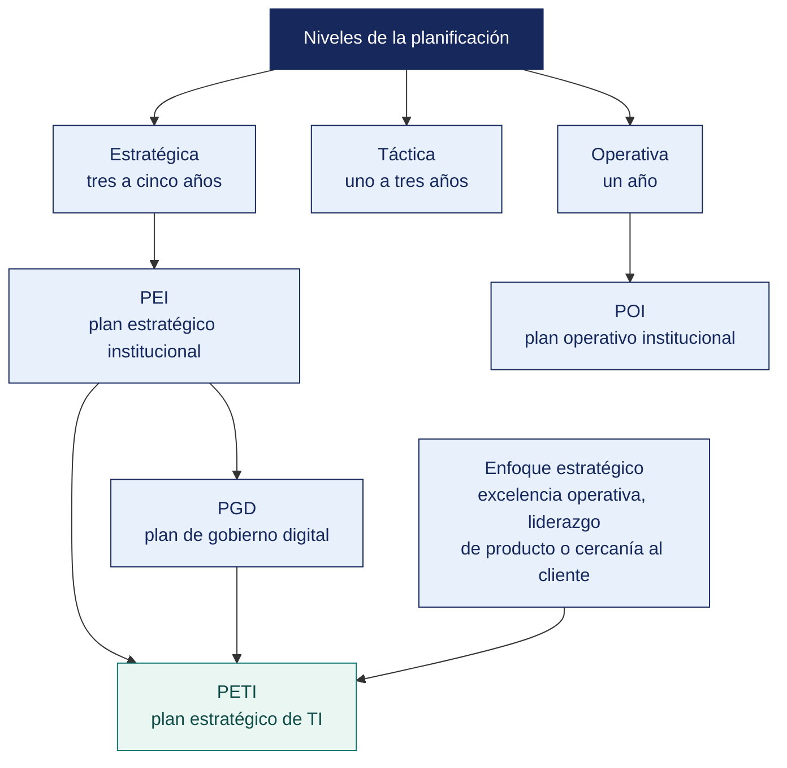

[Semana 03](README.md) · **Teoría** · [Dinámica de aula](2-DINAMICA.md) · [Taller de laboratorio](3-TALLER.md)

# Teoría · La Planificación · El Planeamiento Estratégico · El Enfoque Estratégico

**SI-886 · Planeamiento Estratégico de TI** · Semana 03 · Sesión 1 en aula · 2 horas académicas, 100 min, con la dinámica incluida

> ¿Un término no le resulta claro? Está definido en el [glosario técnico del curso](../GLOSARIO.md).

---

## La pregunta de esta sesión

Una municipalidad publica su Plan de Gobierno Digital 2023-2027. Está aprobado por resolución, tiene sus objetivos y su cartera de proyectos.

La resolución que lo aprueba es de noviembre de 2024. El plan cubre desde 2023, de modo que **no orientó ninguna decisión durante sus dos primeros años**. Y no consta ninguna evaluación anual, que la norma exige.

> **La pregunta que ordena esta sesión.** *¿Qué hace que un plan aprobado sea exigible a alguien, y cómo se comprueba?*

## Antes de empezar

| Lo que necesita traer | De dónde sale |
|---|---|
| Qué es un PETI y a qué se ancla | Semana 01 |
| Los niveles de la estrategia y la postura de TI | Semana 02 |
| Nociones de administración pública y de acto administrativo | Conocimiento general |
| Ningún instrumento de planeamiento en particular | Se introducen hoy |

> **Exploración (5 min), antes de cualquier definición.** El aula responde antes de la teoría y se anota. *¿Ese plan sirve para algo? ¿Qué le pediría usted a la entidad para comprobarlo? ¿Sería distinto si fuera una empresa privada?* No se corrige nada todavía.

## Distribución del tiempo

| Momento | Minutos |
|---|---|
| El caso del plan aprobado tarde y la exploración inicial | 8 |
| **Bloque 1.** Los niveles de la planificación | 12 |
| **Bloque 2.** Qué es planeamiento estratégico · con su microaplicación | 18 |
| **Bloque 3.** Los instrumentos PEI, POI, PEGE, PGD y PETI | 17 |
| **Bloque 4.** El enfoque estratégico de la entidad | 5 |
| Cierre, respuesta a la pregunta de la sesión y puente a la dinámica | 5 |
| **Total de la sesión de aula** | **65** |

## Mapa de la sesión



---

## Bloque 1 · Los niveles de la planificación

> **La pregunta del bloque.** *¿Cuánto detalle debe tener un plan a tres años sin volverse inútil?*

Planificar es decidir **hoy** qué se hará **mañana** y con qué recursos. La distinción entre niveles determina el horizonte, el detalle y quién decide:

| Nivel | Horizonte | Pregunta | Quién decide | Producto | Detalle |
|---|---|---|---|---|---|
| **Estratégica** | 3–5 años | ¿Hacia dónde vamos y por qué? | Directorio y alta dirección | Plan estratégico, PETI | Bajo objetivos y líneas de acción |
| **Táctica** | 1–3 años | ¿Cómo llegamos? | Gerencias funcionales | Plan operativo, hoja de ruta | **Medio.** Programas y proyectos |
| **Operativa** | Días a 1 año | ¿Qué hacemos esta semana? | Jefaturas y equipos | Cronogramas, backlog, presupuesto anual | **Alto.** Tareas y responsables |
| **Contingente** | Ante el evento | ¿Qué hacemos si falla? | Comité de crisis | Plan de continuidad y contingencia | Procedimientos accionables |

**El error de nivel más costoso.** Un PETI con el detalle de un plan operativo —fechas exactas para 40 proyectos a tres años, listado de modelos de servidor— envejece en un trimestre y su revisión se vuelve inviable. Un PETI con el detalle de una declaración de intenciones no permite presupuestar. **El nivel correcto. Objetivos medibles, proyectos identificados con orden de magnitud de esfuerzo, y secuencia por semestre.**

> **El error frecuente del bloque.** Escribir el plan estratégico con detalle de plan operativo. Fechas exactas para cuarenta proyectos a tres años producen un documento que **envejece en un trimestre**, y su revisión cuesta tanto que se abandona. El error inverso —una declaración de intenciones— impide presupuestar.

## Bloque 2 · Qué es planeamiento estratégico

> **La pregunta del bloque.** *¿Qué seis atributos separan un planeamiento que funciona de uno que se archiva?*

**Definición.** Proceso sistemático y participativo mediante el cual una organización define su rumbo de largo plazo, sobre la base del análisis de su entorno y de sus capacidades, y establece cómo asignará recursos para alcanzarlo.

**Los seis atributos de un planeamiento estratégico que funciona.**

| Atributo | Qué significa | Consecuencia de su ausencia |
|---|---|---|
| **Prospectivo** | Mira el futuro deseado, no proyecta el pasado | El plan repite lo que ya se hacía |
| **Participativo** | Involucra a quienes ejecutarán y a quienes se verán afectados | Resistencia en la implantación |
| **Basado en evidencia** | Diagnóstico con datos, no con percepciones | Estrategias que responden a problemas inexistentes |
| **Selectivo** | Elige y descarta explícitamente | Portafolio inejecutable |
| **Medible** | Objetivos con indicador, línea base y meta | No se puede demostrar avance ni corregir |
| **Adaptativo** | Se revisa periódicamente ante cambios del entorno | El plan se vuelve obsoleto y se abandona |

**Modelos de proceso.** Todos comparten la misma columna vertebral:

```
   ¿Quiénes somos?          → Misión, valores, cultura
   ¿Dónde estamos?          → Diagnóstico interno y externo
   ¿Hacia dónde vamos?      → Visión y objetivos estratégicos
   ¿Cómo llegamos?          → Estrategias, proyectos, recursos
   ¿Cómo sabemos que        → Indicadores, metas, supervisión
    lo estamos logrando?
```

**Planeamiento estratégico institucional en el sector público peruano.** El **CEPLAN** rige el Sistema Nacional de Planeamiento Estratégico. Sus instrumentos se articulan en cascada, y el PETI o el Plan de Gobierno Digital debe articularse con esa cascada:

```
   Visión del Perú al 2050
         │
   Plan Estratégico de Desarrollo Nacional (PEDN)
         │
   Políticas Nacionales  ──►  Política Nacional de Transformación Digital
         │                     al 2030 (D. S. 085-2023-PCM)
   Planes Estratégicos Sectoriales Multianuales (PESEM)
         │
   Planes de Desarrollo Concertado (regional y local)
         │
   Plan Estratégico Institucional (PEI)     ← objetivos y acciones de la entidad
         │
   Plan Operativo Institucional (POI)       ← actividades y presupuesto anual
         │
   ╔══════════════════════════════════════════════╗
   ║  PLAN DE GOBIERNO DIGITAL / PETI             ║  ← se articula al PEI
   ╚══════════════════════════════════════════════╝
```

> **Regla de articulación.** Cada objetivo del PETI debe poder rastrearse a un **objetivo estratégico institucional** o, en el sector privado, a un objetivo de negocio. Un objetivo de TI sin ancla superior es un objetivo del área, no de la organización, y perderá la disputa presupuestal.

## Bloque 3 · Los instrumentos PEI, POI, PEGE, PGD y PETI

> **La pregunta del bloque.** *¿Cuál de estos instrumentos es exigible por norma y cuál proviene de la práctica?*

| Instrumento | Qué es | Ámbito | Base normativa o práctica |
|---|---|---|---|
| **PEI** — Plan Estratégico Institucional | Objetivos y acciones estratégicas de la entidad a 3 años o más | Entidad pública | CEPLAN, *Guía para el Planeamiento Institucional* |
| **POI** — Plan Operativo Institucional | Actividades operativas y presupuesto del año | Entidad pública | CEPLAN |
| **PEGE** — Plan Estratégico de Gobierno Electrónico | Antecedente histórico del PGD; instrumento de planeamiento de gobierno electrónico | Entidad pública | ONGEI (antecesora de la SGTD) |
| **PGD** — Plan de Gobierno Digital | **Instrumento único de gestión y planificación del gobierno digital**, aprobado por el titular de la entidad por un periodo **mínimo de tres años**, con **actualización y evaluación anual** | Entidad pública | RSGD 005-2018-PCM/SEGDI (Lineamientos, Anexo I); D. Leg. 1412; D. S. 029-2021-PCM; RM 119-2018-PCM (Comité y Líder de Gobierno Digital) |
| **PETI** — Plan Estratégico de Tecnologías de Información | Plan de TI de la organización, con portafolio y hoja de ruta | Pública o privada | Práctica profesional; guías de referencia (p. ej. MINTIC Colombia) |

**Relación entre PGD y PETI.** En una entidad pública peruana, el **PGD es el instrumento exigible** y su contenido corresponde en gran medida al de un PETI, con el acento puesto en gobierno digital, interoperabilidad, servicios digitales y seguridad de la información. En este curso se construye un **PETI completo** que, cuando la organización es pública, **satisface la estructura del PGD**.

**Estructura del Plan de Gobierno Digital según los Lineamientos** —el índice que el equipo debe conocer:

1. Introducción y marco normativo
2. **Situación actual**. Análisis interno y externo de la entidad
3. **Alineamiento estratégico**. Articulación con el PEI, las políticas nacionales y la Política Nacional de Transformación Digital
4. **Objetivos de gobierno digital**
5. **Portafolio de proyectos** de gobierno digital
6. **Gestión de riesgos**
7. **Cronograma e implementación**
8. **Supervisión y evaluación** del plan
9. Anexos

> **Comparación con la estructura de este curso.** Las diez secciones del PETI del curso cubren íntegramente los nueve puntos del PGD y agregan arquitectura empresarial, marcos de gestión y madurez de procesos, que refuerzan la calidad del diagnóstico.

**Comité de Gobierno Digital y Líder de Gobierno Digital.** La Resolución Ministerial 119-2018-PCM estableció la conformación del **Comité de Gobierno Digital** en cada entidad y la figura del **Líder de Gobierno Digital**, responsables de formular, aprobar y supervisar el plan. **La existencia y el funcionamiento efectivo de ese comité es lo primero que se verifica en el diagnóstico**. Un plan sin comité que lo sostenga no se ejecuta.

**Ejemplo trabajado — el mismo objetivo bajando por los instrumentos.** Municipalidad distrital.

| Instrumento | Qué dice sobre el mismo asunto | Horizonte | Quién lo aprueba |
|---|---|---|---|
| **PEI** | OE-04: «Mejorar la calidad del servicio al ciudadano» | 4 años | Concejo Municipal |
| **POI** | Actividad 04.3: «Atender 12 000 trámites presenciales en el año», con su presupuesto | 1 año | Gerencia Municipal |
| **PGD** | Objetivo de gobierno digital: «Habilitar la mesa de partes virtual y el trámite en línea» | 3 años | Comité de Gobierno Digital |
| **PETI** | Proyecto P-02: «Módulo de trámite en línea integrado al sistema documentario», S/ 180 000, 8 meses | 3 años | Alta dirección |

> **La trazabilidad es de abajo hacia arriba, y se exige.** Si el proyecto P-02 no se puede rastrear hasta un objetivo del PEI, **no debería estar en el PETI**. Significa que TI decidió por su cuenta en qué invertir.

**El proyecto huérfano.** Al proyecto que no se puede rastrear hasta ningún objetivo del **instrumento superior** —el PEI, el plan de negocio o el que corresponda— se le llama **huérfano**. No entra al PETI, por bueno que sea técnicamente. La única excepción son los **no negociables**, obligación legal o continuidad del servicio, que no se retiran pero tampoco compiten en la priorización, y por eso se declaran aparte.

**El error más común.** Formular objetivos de TI que no existen en el plan institucional, y luego justificar el plan institucional con ellos. Es circular.

> **Microaplicación (5 min) · el atributo que falta.** Con el caso del inicio delante, el aula identifica en parejas **cuál de los seis atributos incumple ese plan de forma más grave** y qué consecuencia produce. Se recogen dos respuestas antes de continuar.

| Caso | Qué debe contener una buena respuesta |
|---|---|
| ¿Qué hace una empresa privada que no tiene PEI ni POI? | Usa su plan de negocio, su presupuesto anual y las actas de directorio. **La lógica no cambia.** El proyecto se rastrea hasta un objetivo del negocio |
| ¿Puede un proyecto de TI no responder a ningún objetivo institucional? | **Solo los no negociables.** Obligación legal o continuidad. Se declaran aparte y no compiten en la priorización |
| Si el PEI vence el próximo año, ¿se espera al nuevo para hacer el PETI? | No. Se alinea al vigente y se declara la fecha de revisión al aprobarse el siguiente |
> **El error frecuente del bloque.** Aplicar el marco del sector público a una empresa privada. Citar el plan institucional, el operativo, el organismo rector del planeamiento y la figura del líder de gobierno digital en una sociedad anónima es un error de régimen, y descalifica el capítulo normativo entero. **El régimen de la organización decide qué instrumentos la alcanzan.**

## Bloque 4 · El enfoque estratégico de la entidad

> **La pregunta del bloque.** *¿A qué se ancla un objetivo de TI cuando la organización no tiene plan institucional?*

**Definición.** El enfoque estratégico es la **declaración sintética de cómo la organización pretende crear valor** y qué papel juega la tecnología en esa creación. Es lo que da coherencia al resto del plan.

**Los cuatro enfoques dominantes y su traducción tecnológica.**

| Enfoque | Cómo crea valor | Prioridad tecnológica | Indicador característico |
|---|---|---|---|
| **Excelencia operativa** | Costo bajo, proceso confiable, sin fricción | Automatización, integración, estandarización, analítica de eficiencia | Costo por transacción; tiempo de ciclo |
| **Cercanía al cliente** | Solución adaptada, relación de largo plazo | CRM, segmentación, canales, personalización, datos del cliente | Retención; valor del cliente en el tiempo |
| **Liderazgo de producto** | Innovación y ser el primero | Plataformas flexibles, tiempo de salida al mercado, experimentación | Ingresos de productos nuevos; tiempo de lanzamiento |
| **Servicio público de calidad** *(entidades)* | Acceso, oportunidad y transparencia del servicio al ciudadano | Servicios digitales, interoperabilidad, datos abiertos, accesibilidad | Trámites digitalizados; tiempo de atención; satisfacción |

**Cómo se determina el enfoque de una organización real.** No se pregunta. Se **infiere** de tres fuentes contrastadas —lo que la organización **dice** (documentos), lo que **hace** (procesos y decisiones) y lo que **financia** (presupuesto)—. Cuando las tres no coinciden, **prevalece lo que financia**, y la discrepancia es en sí misma un hallazgo del diagnóstico.

**La declaración de enfoque estratégico** que se incorpora al PETI tiene esta forma:

> *«<Organización> crea valor mediante <enfoque dominante>, dirigido a <segmento o población>, sostenido en <capacidad distintiva>. En este marco, la tecnología de información cumple un rol <soporte / fábrica / giro estratégico / estratégico>, y este plan concentra sus esfuerzos en <dos o tres focos>, postergando explícitamente <lo que no se abordará en este horizonte>.»*

La última cláusula —**lo que no se abordará**— es la que convierte la declaración en una decisión estratégica.

## Cierre · qué se lleva de aquí

**La respuesta a la pregunta con la que abrimos.** Un plan es exigible cuando **fue aprobado por quien tiene competencia, antes de iniciar el periodo que cubre, y se evalúa con la periodicidad que la norma manda**. El del caso cumple la forma y falla las tres condiciones de fondo. Comprobarlo no exige leer sus objetivos — exige mirar la fecha de la resolución, quién la firma y si existe la evaluación anual.

**Las tres ideas que deben quedar.**

| Idea | Por qué importa en el ejercicio profesional |
|---|---|
| El nivel del plan determina su vida útil | Demasiado detalle envejece en un trimestre; demasiado poco impide presupuestar |
| Cada instrumento de planeamiento tiene su ámbito y su base normativa | Citar el instrumento equivocado invalida el capítulo normativo del plan |
| Todo objetivo del plan de TI se rastrea a un objetivo superior | Sin ancla, es un objetivo del área y perderá la disputa presupuestal |

**Volviendo a la exploración del inicio.** Se releen las respuestas del inicio. Casi todo el mundo propone leer los objetivos del plan para juzgarlo. Las tres preguntas que lo descalifican —cuándo se aprobó, quién firmó y si se evaluó— no exigen abrirlo.

**Lo que sigue.** La [dinámica de esta sesión](2-DINAMICA.md) entrega documentos de planeamiento reales y pide verificar su articulación. El primer paso no es de trámite — **produce el primer hallazgo del informe**, y es exactamente el del caso de hoy.

---

---

[Semana 03](README.md) · **Teoría** · [Dinámica de aula](2-DINAMICA.md) · [Taller de laboratorio](3-TALLER.md)

---

**Docente** · Dr. Oscar Juan Jimenez Flores
[oscarjimenezflores@upt.pe](mailto:oscarjimenezflores@upt.pe) · [LinkedIn](https://www.linkedin.com/in/oscar-jimenez-flores/) · [CTI Vitae — CONCYTEC](https://ctivitae.concytec.gob.pe/appDirectorioCTI/VerDatosInvestigador.do?id_investigador=33398)

Escuela Profesional de Ingeniería de Sistemas · Universidad Privada de Tacna · Tacna, Perú
