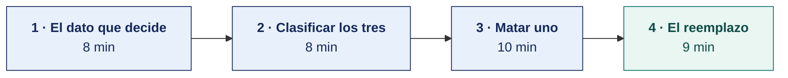

[Semana 03](README.md) · [Teoría](1-TEORIA.md) · **Dinámica de aula** · [Taller de laboratorio](3-TALLER.md)

# Dinámica de aula · El proyecto que no se ejecutará

**SI-886 · Planeamiento Estratégico de TI** · Semana 03 · Actividad en aula, **dentro de los 100 min de la sesión de teoría** · calificación **cognitiva**

> ¿Un término no le resulta claro? Está definido en el [glosario técnico del curso](../GLOSARIO.md).

---

## La pregunta

El área de TI de su organización propone **tres proyectos** para el próximo plan. Uno de los tres **no se va a ejecutar**, aunque se apruebe.

Su equipo debe decir **cuál**, demostrar por qué con un solo dato, y proponer con qué se reemplaza.

## Lo que ya sabes de hoy

| De la teoría | Cómo se usa aquí |
|---|---|
| [Los cuatro enfoques y su traducción tecnológica](1-TEORIA.md) | Cada proyecto propuesto pertenece a un enfoque. El que no coincide con el enfoque real es el candidato a morir |
| [Prevalece lo que financia](1-TEORIA.md) | Es la regla que decide cuando lo declarado y lo ejecutado se contradicen |
| [Los instrumentos PEI, POI, PEGE, PGD y PETI](1-TEORIA.md) | El proyecto que sobrevive debe engancharse a un objetivo del instrumento superior, o tampoco se sostiene |

## Cómo se desarrolla · 35 minutos

**Paso 1 · El dato que decide — 8 min.** La ficha trae lo que la organización dice, lo que hace y lo que financia. El equipo determina el enfoque real y **subraya un solo dato** como prueba. No una lista de indicios, uno. Si hacen falta tres datos para sostenerlo, el enfoque todavía no está claro.

**Paso 2 · Clasificar los tres proyectos — 8 min.** Cada proyecto propuesto se asigna a uno de los cuatro enfoques. La pregunta que lo clasifica es qué mejora si el proyecto sale bien. Menos costo por transacción, más retención del cliente, más productos nuevos o más acceso al servicio.

**Paso 3 · Matar uno — 10 min.** Se elige el proyecto que no se ejecutará y se escribe **qué le va a pasar realmente**. Un proyecto no muere porque alguien lo cancele; muere porque se aprueba y luego se le recorta el presupuesto, se le retira el responsable o se entrega y nadie lo usa. Hay que decir cuál de esas tres muertes le espera y por qué.

**Paso 4 · El reemplazo — 9 min.** Se propone el proyecto que el enfoque real sí sostiene, con su objetivo del instrumento superior. Debe poder financiarse con el dinero del proyecto que se retira.

## Qué entregas

| | |
|---|---|
| **Archivo** | `SI886-S03-DINAMICA-Grupo<N>.pdf` |
| **Plantilla obligatoria** | [SI886-PLANTILLA-DINAMICA.docx](../PLANTILLAS/SI886-PLANTILLA-DINAMICA.docx) |
| **Formato** | PDF exportado desde la plantilla en Word, con la carátula de la UPT y los apellidos, nombres y códigos de todos los integrantes |
| **Dónde se sube** | Aula virtual, tarea «Dinámica · Semana 03» |
| **Cuándo vence** | Antes de cerrar la sesión de teoría |
| **Exposición** | 10 minutos por grupo en la sesión de teoría de la Semana 04, con una o dos diapositivas hechas a partir de este documento |

> No se califica un trabajo entregado en `.docx`, sin carátula, sin los códigos de los integrantes o con la tabla del producto incompleta.

## Producto

**Un solo producto**, que va en la sección 2.1 de la plantilla, con estas cuatro filas.

| | Contenido |
|---|---|
| **Enfoque real** | Cuál de los cuatro, y **el único dato** que lo prueba, transcrito de la ficha |
| **Los tres proyectos clasificados** | Cada uno con el enfoque al que pertenece |
| **El que no se ejecutará** | Cuál, cómo va a morir —recorte, orfandad o desuso— y qué dato de la ficha lo anticipa |
| **El reemplazo** | Qué proyecto entra, a qué objetivo del instrumento superior se articula y con qué presupuesto |

## Ejemplo resuelto

*Este caso no es ninguno de los del anexo. Sirve para ver el nivel exigido.*

**La ficha.** Imprenta y editorial regional, 90 trabajadores, TI de 3 personas.

> **Dice.** Sección 2 «seremos la imprenta de referencia por la calidad y la personalización de cada proyecto editorial». OE-01 «elevar la satisfacción del cliente al 90 %», sin línea base.
> **Hace.** Acta 041-2025 del 12/03. Se elimina el ejecutivo de cuenta y se centraliza la atención en una central con guion único. Tarifas de lista, sin negociación. El único indicador del comité semanal es el costo por millar impreso.
> **Financia.** S/ 240 000. Operación 92 %, Inversión 8 %. Las tres inversiones cerradas del año fueron máquina, licencias y servidores, las tres con beneficio medido «No se midió».
> **Lo que TI propone.** ① Portal de clientes con seguimiento personalizado del proyecto editorial, S/ 96 000. ② Integración de presupuesto y orden de producción, S/ 54 000. ③ Tablero de costo por millar en tiempo real, S/ 22 000.

**El producto.**

| | Contenido |
|---|---|
| **Enfoque real** | **Excelencia operativa.** El dato que lo prueba es el acta 041-2025. Eliminar al ejecutivo de cuenta es una decisión estructural contra la personalización que el plan declara. Lo demás son indicios; esto es una renuncia firmada |
| **Los tres clasificados** | ① Cercanía al cliente · ② Excelencia operativa · ③ Excelencia operativa |
| **El que no se ejecutará** | **El ①.** Muere por **desuso**. Se aprobará, porque suena a lo que el plan declara, y se entregará. Nadie lo usará, porque no queda nadie que dé seguimiento personalizado a un proyecto editorial. La organización ya despidió a esa persona |
| **El reemplazo** | Ampliar el ② al ciclo completo hasta facturación, con los S/ 96 000 liberados. Se articula al Plan Estratégico 2024-2028, OE-02, «reducir el tiempo promedio de atención en 20 %», que es el único objetivo que la organización mide hoy |

**La diferencia entre aprobar y no aprobar.**

| Así no | Así sí |
|---|---|
| «El enfoque es excelencia operativa porque financia más operación.» | «El acta 041-2025 elimina el ejecutivo de cuenta. Es una decisión estructural, no un gasto.» |
| «El proyecto 1 no se alinea con el enfoque.» | «El proyecto 1 muere por desuso. No queda quién ejecute el seguimiento personalizado que el portal expone.» |
| «Proponemos un tablero de indicadores.» | «Ampliar el proyecto 2 hasta facturación con los S/ 96 000 liberados, articulado al OE-02, único objetivo que hoy se mide.» |

## Reglas

- 35 min en aula.
- **Un solo dato** sostiene el enfoque real. Una lista de indicios no puntúa.
- La muerte del proyecto debe nombrarse. Recorte de presupuesto, pérdida de responsable o entrega sin uso.
- El reemplazo debe caber en el presupuesto que libera el proyecto retirado.
- Exposición de 10 min en la Semana 04.

> **Los equipos van a discrepar, y esa es la clase.** En varias fichas hay dos proyectos defendibles como candidatos a morir. Gana la exposición que sostiene su elección con el dato más difícil de rebatir, no la que elige el proyecto más obvio.

## Rúbrica cognitiva (20 puntos)

| Criterio | 5 | 3 | 1 |
|---|---|---|---|
| **El dato que decide** | Un solo dato, transcrito, y es el más fuerte disponible en la ficha | Un dato válido, pero débil frente a otro que estaba en la ficha | Una lista de indicios, o una afirmación sin transcribir |
| **Clasificación de los tres** | Los tres bien asignados, con el criterio de qué mejora cada uno | Dos bien asignados | Clasificación sin criterio explícito |
| **La muerte del proyecto** | Nombra el mecanismo y lo anticipa con un dato de la ficha | Nombra el mecanismo sin sostenerlo en la ficha | Dice que «no se alinea», sin explicar qué le ocurrirá |
| **El reemplazo** | Proyecto viable, articulado a un objetivo del instrumento superior, dentro del presupuesto liberado | Proyecto viable sin articulación o sin cuadrar el presupuesto | Propuesta genérica, aplicable a cualquier organización |

---

## Anexo · Fichas para repartir

Una por equipo.

### Ficha 1 · Agroexportadora de aceituna y orégano · 142 trabajadores · TI 3 personas

> **Dice.** Sección 2 «ser reconocidos por la calidad y la trazabilidad de nuestro producto, con acompañamiento personalizado a cada cliente internacional». OE-01 «elevar la satisfacción del cliente al 95 %», sin línea base.
> **Hace.** Acta 12-2025 del 04/03. Se elimina el ejecutivo de exportación y el contacto pasa a una casilla de correo compartida. El único indicador del comité semanal es el costo por tonelada procesada. La trazabilidad se lleva en hojas de cálculo del jefe de planta.
> **Financia.** S/ 486 000. Operación 94 %, Inversión 6 %. Inversiones cerradas del año, balanza automática de línea S/ 128 000, licencias S/ 74 000, servidor de planta S/ 96 000. Beneficio medido en las tres, «No se midió».
> **Lo que TI propone.** ① Portal del cliente internacional con trazabilidad del lote en línea, S/ 112 000. ② Digitalización de la trazabilidad de planta, hoy en hojas de cálculo, S/ 68 000. ③ Tablero de costo por tonelada en tiempo real, S/ 24 000.

### Ficha 2 · Clínica privada de 60 camas · 310 trabajadores · TI 6 personas

> **Dice.** Sección 2 «atención centrada en la persona, con acompañamiento del paciente y su familia durante todo el proceso». OE-02 «reducir el tiempo de espera en consulta externa en 30 %».
> **Hace.** Existe un área de Experiencia del Paciente con 3 personas, creada en 2024. Se mide y se publica cada mes el tiempo de espera. La historia clínica no está integrada con laboratorio, y el paciente lleva sus resultados impresos entre pisos. Acta 07-2025 del 19/05. Se posterga por segundo año la integración de laboratorio.
> **Financia.** S/ 1 240 000. Operación 78 %, Inversión 22 %. Inversiones cerradas, portal de citas en línea S/ 186 000 con beneficio medido «las citas en línea pasaron de 0 a 31 %», equipamiento de imágenes S/ 240 000.
> **Lo que TI propone.** ① Integración de historia clínica y laboratorio, S/ 210 000. ② Aplicación móvil de resultados para el paciente, S/ 96 000. ③ Sistema de gestión de camas y ocupación, S/ 140 000.

### Ficha 3 · Municipalidad distrital · 41 800 habitantes · TI 3 personas

> **Dice.** Plan de Desarrollo Local Concertado sección 3 «un municipio moderno, transparente y cercano al vecino, con trámites simples y en línea». Le es exigible la Política Nacional de Transformación Digital al 2030.
> **Hace.** No existe Comité de Gobierno Digital ni Líder designado, pese a ser exigible. El Plan de Gobierno Digital nunca se formuló. La mesa de partes virtual es un formulario que termina en presentación física del expediente. El sistema de rentas tiene el soporte vencido desde 2023. La jefatura de TI rotó tres veces en cuatro años.
> **Financia.** S/ 520 000, el 1.67 % del presupuesto institucional. Operación 96 %, Inversión 4 %. La partida de proyectos nuevos ejecutó el 38 % de lo planificado. La partida más ejecutada del año fue renovación de equipos de oficina.
> **Lo que TI propone.** ① Aplicación móvil del vecino con notificaciones y reportes de incidencias, S/ 148 000. ② Pago en línea del impuesto predial integrado a rentas, S/ 96 000. ③ Constitución del Comité y formulación del Plan de Gobierno Digital, S/ 24 000.

### Ficha 4 · Cooperativa de ahorro y crédito · 18 400 socios · TI 7 personas

> **Dice.** Sección 2 «ser la cooperativa que mejor conoce a su socio, con productos ajustados a la realidad del comerciante de frontera». OE-01 «incrementar la colocación por socio activo en 18 %».
> **Hace.** Se creó en 2024 la unidad de Analítica de Socio, con 2 analistas. Se segmentó la cartera en cinco perfiles y se lanzaron dos productos de crédito por perfil. El comité de créditos usa el puntaje interno construido con el historial del socio. La aplicación móvil permite consulta y pago, no apertura de productos.
> **Financia.** S/ 980 000. Operación 66 %, Inversión 34 %. Inversiones cerradas, motor de puntaje interno S/ 214 000 con beneficio medido «la mora a 30 días bajó de 4.1 % a 2.9 %», aplicación móvil S/ 168 000 con beneficio medido «el 41 % de los socios activos la usa al menos una vez al mes».
> **Lo que TI propone.** ① Apertura de productos desde la aplicación móvil, con firma digital, S/ 240 000. ② Migración del core a una versión más reciente del mismo proveedor, S/ 380 000. ③ Motor de recomendación de producto por perfil de socio, S/ 130 000.

### Ficha 5 · Empresa de transporte de carga · 96 trabajadores · TI 2 personas

> **Dice.** Plan de Negocio sección 4 «seremos el operador logístico de referencia por la calidad y la personalización de nuestro servicio al cliente». Portal web, sección Nosotros, «soluciones a la medida de cada cliente».
> **Hace.** Se eliminó el año pasado el puesto de ejecutivo de cuenta y se centralizó la atención en una central telefónica con guion único. Las tarifas son de lista, sin negociación por cliente. El indicador del comité semanal es el costo por tonelada-kilómetro. El seguimiento de la carga se informa por teléfono cuando el cliente llama.
> **Financia.** S/ 320 000. Operación 88 %, Inversión 12 %. De la inversión de los últimos dos años, el 78 % fue a renovación de flota y a optimización de rutas. El 4 % fue a la plataforma de atención al cliente, y correspondió a renovación de licencias.
> **Lo que TI propone.** ① Portal de seguimiento de carga para el cliente, S/ 74 000. ② Integración del sistema de flota con facturación, S/ 58 000. ③ Aplicación de registro de entrega con firma del receptor, S/ 42 000.

### Ficha 6 · Distribuidora mayorista de consumo masivo · 157 trabajadores · TI 4 personas

> **Dice.** Sección 3 «consolidarnos como una organización moderna, eficiente y sostenible al servicio de la comunidad». OE-04 «modernizar la infraestructura tecnológica», meta de avance 100 %, sin línea base.
> **Hace.** Acta 088-2025, observación de la propia Gerencia. «El objetivo de modernización está en el plan desde su aprobación, pero nunca se desagregó en proyectos ni se le asignó presupuesto específico.» El módulo de almacén del ERP se dejó de usar y se opera en hojas de cálculo. El portal de pedidos está sin soporte desde 2022 y lo usa el 4 % de las 8 400 bodegas atendidas.
> **Financia.** S/ 742 000, el 1.08 % de la facturación. Operación 92 %, Inversión 8 %. La partida de proyectos nuevos ejecutó el 66 % de lo planificado. Las tres inversiones cerradas del año fueron respaldo, licencias y servidores, todas con beneficio medido «No se midió».
> **Lo que TI propone.** ① Portal de autoservicio con recomendación de surtido por bodega, S/ 186 000. ② Reactivación del módulo de almacén con rediseño del proceso, S/ 94 000. ③ Tablero de rotación e inventario para la gerencia, S/ 38 000.

### Ficha 7 · Instituto de educación superior tecnológica · 2 100 estudiantes · TI 3 personas

> **Dice.** Sección 2 «formación innovadora, con metodologías activas y tecnología de punta al servicio del aprendizaje». OE-03 «implementar el campus virtual en el 100 % de las carreras».
> **Hace.** El campus virtual se usa como repositorio de archivos. Las evaluaciones siguen siendo presenciales en papel. No hay analítica de deserción, pese a que la deserción del primer ciclo es el problema declarado en tres actas del último año. El área de TI depende de Administración y no participa en el comité académico.
> **Financia.** S/ 410 000. Operación 90 %, Inversión 10 %. La inversión cerrada del año fue la ampliación del laboratorio de cómputo, S/ 285 000, con beneficio declarado «mejorar la formación» y beneficio medido «No se midió». Ninguna inversión en plataforma de aprendizaje ni en analítica.
> **Lo que TI propone.** ① Plataforma de evaluación en línea con banco de preguntas, S/ 120 000. ② Sistema de alerta temprana de deserción sobre el dato de asistencia y notas, S/ 86 000. ③ Renovación del segundo laboratorio de cómputo, S/ 240 000.

### Ficha 8 · Empresa prestadora de servicios de saneamiento · 68 000 conexiones · TI 5 personas

> **Dice.** Plan Maestro Optimizado sección 2 «garantizar la continuidad y la calidad del servicio de agua potable, con atención oportuna al usuario». OE-01 «reducir el tiempo de atención de reclamos de 15 a 5 días hábiles».
> **Hace.** Se implantó en 2024 el registro único de reclamos y se publica cada mes el tiempo de atención, que bajó de 15 a 9 días. La lectura de medidores se hace con aplicación móvil desde 2023. La facturación y el catastro comercial son dos bases distintas que se concilian a mano cada mes.
> **Financia.** S/ 890 000. Operación 91 %, Inversión 9 %. La inversión del año fue íntegra a los equipos de lectura móvil, S/ 78 000, con beneficio medido «los errores de lectura bajaron de 3.4 % a 0.9 %». La integración de catastro y facturación está en el plan desde 2022 y no tiene presupuesto asignado.
> **Lo que TI propone.** ① Integración de catastro comercial y facturación, S/ 165 000. ② Portal del usuario con consulta de recibo y estado del reclamo, S/ 92 000. ③ Telemetría de presión en las cinco zonas críticas de la red, S/ 310 000.

### Ficha 9 · Servicios de ingeniería para minería · 88 trabajadores · TI 4 personas

> **Dice.** Sección 2 «resolver problemas de ingeniería que nadie más en la región resuelve, con equipos propios de instrumentación y análisis». OE-02 «desarrollar dos servicios nuevos por año».
> **Hace.** Se lanzaron tres servicios nuevos en dos años, dos de ellos basados en instrumentación desarrollada internamente. El 30 % del tiempo del equipo técnico está asignado a desarrollo de nuevas capacidades por directiva escrita. Los proyectos se ejecutan con equipos mixtos de ingeniería y sistemas.
> **Financia.** S/ 640 000. Operación 54 %, Inversión 46 %. Inversiones cerradas, plataforma de telemetría propia S/ 208 000 con beneficio medido «dos contratos nuevos atribuibles», laboratorio de análisis de datos S/ 94 000 con beneficio medido «el informe técnico bajó de 12 a 4 días».
> **Lo que TI propone.** ① Laboratorio de ensayo de sensores para dos líneas nuevas, S/ 260 000. ② Migración del ERP administrativo a la nube del proveedor, S/ 180 000. ③ Portal de cliente con acceso a la telemetría de sus equipos, S/ 145 000.

### Ficha 10 · Cadena regional de farmacias · 34 locales · TI 5 personas

> **Dice.** Sección 2 «acompañar la salud de nuestras familias con atención cercana y consejo farmacéutico en cada local». OE-01 «elevar la recompra del cliente frecuente en 25 %».
> **Hace.** El programa de cliente frecuente registra la compra y no se explota. No existe historial de compra consultable por el químico farmacéutico en el mostrador. El indicador que se revisa a diario es el margen por local y la rotura de stock. Acta 22-2025 del 08/04. Se aprueba estandarizar el surtido de los 34 locales, eliminando el surtido diferenciado por zona.
> **Financia.** S/ 560 000. Operación 86 %, Inversión 14 %. Inversiones cerradas, sistema de reposición automática S/ 142 000 con beneficio medido «la rotura de stock bajó de 7.2 % a 3.1 %», programa de fidelización S/ 18 000, que correspondió a renovación de licencia del módulo, con beneficio medido «No se midió».
> **Lo que TI propone.** ① Historial de compra del cliente en el mostrador, para consejo farmacéutico, S/ 88 000. ② Reposición predictiva por local sobre el histórico de rotación, S/ 124 000. ③ Aplicación de pedido y retiro en local, S/ 156 000.

---

---

[Semana 03](README.md) · [Teoría](1-TEORIA.md) · **Dinámica de aula** · [Taller de laboratorio](3-TALLER.md)

---

**Docente** · Dr. Oscar Juan Jimenez Flores
[oscarjimenezflores@upt.pe](mailto:oscarjimenezflores@upt.pe) · [LinkedIn](https://www.linkedin.com/in/oscar-jimenez-flores/) · [CTI Vitae — CONCYTEC](https://ctivitae.concytec.gob.pe/appDirectorioCTI/VerDatosInvestigador.do?id_investigador=33398)

Escuela Profesional de Ingeniería de Sistemas · Universidad Privada de Tacna · Tacna, Perú
