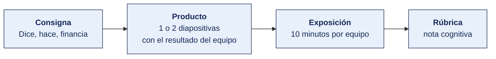

[Semana 03](README.md) · [Teoría](1-TEORIA.md) · **Dinámica de aula** · [Taller de laboratorio](3-TALLER.md)

# Dinámica de aula · Dice, hace, financia

**SI-886 · Planeamiento Estratégico de TI** · Semana 03 · Actividad en aula, **dentro de los 100 min de la sesión de teoría** · calificación **cognitiva**

> ¿Un término no le resulta claro? Está definido en el [glosario técnico del curso](../GLOSARIO.md).

---

## Cómo funciona la actividad

## Qué entregas

| | |
|---|---|
| **Archivo** | `SI886-S03-DINAMICA-Grupo<N>.pdf` |
| **Plantilla obligatoria** | [SI886-PLANTILLA-DINAMICA.docx](../PLANTILLAS/SI886-PLANTILLA-DINAMICA.docx) |
| **Formato** | PDF exportado desde la plantilla en Word, con la carátula de la UPT y los apellidos, nombres y códigos de todos los integrantes |
| **Qué va dentro** | Lo que el grupo resolvió en aula. Las tablas de la sección **Producto** van completas, con los textos redactados, y cada decisión va justificada |
| **Dónde se sube** | Aula virtual, tarea «Dinámica · Semana 03» |
| **Cuándo vence** | Antes de cerrar la sesión de teoría |
| **Exposición** | 10 minutos por grupo en la sesión de teoría de la Semana 04 |

> No se califica un trabajo entregado en `.docx`, sin carátula, sin los códigos de los integrantes o con las tablas del producto vacías.

---

## Consigna

> **«Dice, hace, financia»**
> Cada equipo debe **determinar el enfoque estratégico real** de su organización contrastando tres fuentes: lo que **dice** (documentos institucionales), lo que **hace** (procesos y decisiones observadas) y lo que **financia** (presupuesto o inversión), y redactar la declaración de enfoque estratégico del PETI.

## Producto

**Diapositiva 1 — El contraste.**

| Fuente | Evidencia concreta | Enfoque que sugiere |
|---|---|---|
| **Dice** — plan institucional, misión, comunicación externa | Cita textual con documento y página | |
| **Hace** — procesos, estructura, decisiones recientes | Hecho observado con fecha y fuente | |
| **Financia** — presupuesto, inversiones de los últimos 2 años | Cifra o porcentaje con fuente | |
| **Conclusión** | ¿Coinciden? Si no, ¿qué revela la discrepancia? | |

**Diapositiva 2 — La declaración.** El párrafo de enfoque estratégico completo, con la cláusula de lo que **no** se abordará, más la identificación del instrumento de planeamiento al que se articulará el PETI (PEI, plan de negocio o el que corresponda) y el objetivo específico de ese instrumento con el que engancha.

## Ejemplo resuelto

*El caso de este ejemplo es distinto del que le toca a tu grupo. Sirve para que veas el nivel de detalle que se espera, no para copiarlo.*

**Un contraste bien resuelto.** La organización del ejemplo es una empresa de transporte de carga.

| Fuente | Evidencia concreta | Enfoque que sugiere |
|---|---|---|
| **Dice** | Plan de negocio, página 4: «seremos el operador logístico de referencia por la calidad y personalización de nuestro servicio al cliente». Portal web, sección Nosotros: «soluciones a la medida de cada cliente». | Cercanía al cliente |
| **Hace** | La empresa eliminó el año pasado el puesto de ejecutivo de cuenta y centralizó la atención en una central telefónica con guion único. Las tarifas son de lista, sin negociación por cliente. El indicador que se revisa en el comité semanal es el costo por tonelada-kilómetro. | Excelencia operativa |
| **Financia** | De la inversión de los últimos dos años, el 78 % fue a renovación de flota y a un sistema de optimización de rutas. El 4 % fue a la plataforma de atención al cliente, y correspondió a una renovación de licencias, no a nuevas capacidades. | Excelencia operativa |
| **Conclusión** | No coinciden. La discrepancia revela que la organización **declara** cercanía al cliente pero **opera y financia** excelencia operativa. Para el PETI esto es decisivo: si el plan se formulara sobre lo declarado, propondría inversión en personalización que la organización no financiará. | Excelencia operativa es el enfoque real |

*La declaración de enfoque estratégico*

> La organización opera bajo un enfoque de **excelencia operativa**. Su ventaja se construye sobre el costo por tonelada-kilómetro y la confiabilidad del plazo de entrega, y así lo reflejan tanto sus decisiones de estructura como la asignación del 78 % de su inversión reciente. En consecuencia, este Plan Estratégico de Tecnologías de Información prioriza las capacidades de optimización de la operación, integración de la flota y automatización del ciclo de pedido a facturación.
>
> **Este plan no aborda** la personalización del servicio por cliente ni la construcción de capacidades de gestión de la relación con el cliente más allá del registro transaccional. La declaración institucional de «servicio a la medida» no se sostiene en la operación ni en la inversión observadas, y adoptarla como premisa produciría un portafolio que la organización no ejecutaría.
>
> **Instrumento al que se articula.** Plan de negocio institucional, objetivo específico 2, «reducir el costo operativo por tonelada-kilómetro en 12 % en tres años».

**La diferencia entre aprobar y no aprobar.**

| Así no | Así sí |
|---|---|
| «La empresa dice que se enfoca en el cliente.» | Cita textual con documento y página: «seremos el operador logístico de referencia por la calidad y personalización» (plan de negocio, p. 4). |
| «Financia tecnología.» | «78 % de la inversión de dos años a flota y optimización de rutas; 4 % a atención al cliente, y fue renovación de licencias.» |
| «Hay cierta inconsistencia.» | «Declara cercanía al cliente pero opera y financia excelencia operativa. Formular sobre lo declarado produciría un portafolio que no se ejecutará.» |

## Reglas

- 35 min en aula. Entrega como `S03_<equipo>_enfoque.pdf`.
- Las tres fuentes deben tener **evidencia citable**; la percepción del equipo no es fuente.
- La declaración **debe** incluir lo que no se abordará. Sin esa cláusula no puntúa.
- Debe identificarse el objetivo institucional o de negocio al que se articula el plan.
- Exposición de 10 min en la Semana 04.

## Rúbrica cognitiva (20 puntos)

| Criterio | 5 | 3 | 1 |
|---|---|---|---|
| **Evidencia por fuente** | Las tres con evidencia citable y verificable | Dos con evidencia | Solo declaraciones del equipo |
| **Análisis del contraste** | Identifica la discrepancia y explica qué revela | Señala que hay discrepancia | Asume que las tres coinciden sin verificar |
| **Declaración de enfoque** | Completa, específica, con la cláusula de exclusión explícita | Completa sin exclusión | Genérica, aplicable a cualquier organización |
| **Articulación** | Identifica el instrumento superior y el objetivo específico de enganche | Identifica el instrumento | No articula |

---

---

[Semana 03](README.md) · [Teoría](1-TEORIA.md) · **Dinámica de aula** · [Taller de laboratorio](3-TALLER.md)

---

**Docente** · Dr. Oscar Juan Jimenez Flores
[oscarjimenezflores@upt.pe](mailto:oscarjimenezflores@upt.pe) · [LinkedIn](https://www.linkedin.com/in/oscar-jimenez-flores/) · [CTI Vitae — CONCYTEC](https://ctivitae.concytec.gob.pe/appDirectorioCTI/VerDatosInvestigador.do?id_investigador=33398)

Escuela Profesional de Ingeniería de Sistemas · Universidad Privada de Tacna · Tacna, Perú
