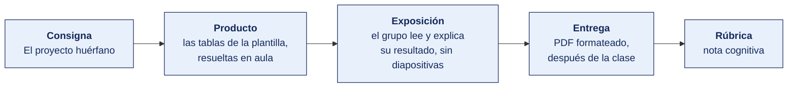

[Semana 03](README.md) · [Teoría](1-TEORIA.md) · **Dinámica de aula** · [Taller de laboratorio](3-TALLER.md)

# Dinámica de aula · El proyecto huérfano

**SI-886 · Planeamiento Estratégico de TI** · Semana 03 · Actividad en aula, **dentro de los 100 min de la sesión de teoría** · calificación **cognitiva**

> ¿Un término no le resulta claro? Está definido en el [glosario técnico del curso](../GLOSARIO.md).

---

## Cómo funciona la actividad

## Qué entregas

| | |
|---|---|
| **Archivo** | `SI886-S03-DINAMICA-Grupo<N>.pdf` |
| **Plantilla obligatoria** | [SI886-PLANTILLA-DINAMICA.docx](../PLANTILLAS/SI886-PLANTILLA-DINAMICA.docx) |
| **Formato** | PDF exportado desde la plantilla en Word, con la carátula de la UPT y los apellidos, nombres y códigos de todos los integrantes |
| **Qué va dentro** | Lo que el grupo resolvió en aula. Las tablas de la sección **Producto** van completas, con los textos redactados, y cada decisión va justificada |
| **Dónde se sube** | Aula virtual, tarea «Dinámica · Semana 03» |
| **Cuándo vence** | Hasta 24 h después de la sesión de teoría. La tabla se resuelve en aula; el PDF se formatea y se sube después |
| **Exposición** | En la ronda de cierre de **esta misma sesión**. El grupo **lee y explica su resultado** ante el aula, con el documento a la vista. No se usan diapositivas |

> No se califica un trabajo entregado en `.docx`, sin carátula, sin los códigos de los integrantes o con las tablas del producto vacías.

---

## Consigna

> **«El proyecto huérfano»**
> El área de TI de la organización de su ficha propone **tres proyectos** para el PETI. Su equipo debe decir **a qué objetivo del plan institucional engancha cada uno** y señalar el que no engancha a ninguno: el **huérfano**, que no debería entrar al plan.

Es la regla que se acaba de ver en la teoría. *Cada proyecto del PETI (Plan Estratégico de Tecnologías de Información) debe poder rastrearse hasta un objetivo del instrumento superior, y si no se puede, es que TI decidió por su cuenta en qué invertir.* Aquí se aplica esa regla a un caso concreto, y nada más.

**Cuidado con las dos trampas.** Un proyecto que no engancha puede ser un **no negociable** —obligación legal o continuidad del servicio—, y esos no se retiran: se declaran aparte y no compiten en la priorización. Y puede que en su ficha los tres enganchen y **no haya huérfano**; si es así, dígalo y sosténgalo.

## Cómo se desarrolla · 35 minutos

| | Bloque | Quién | Minutos |
|---|---|---|---|
| **0** | **El docente resuelve un caso en la pizarra.** El del ejemplo, de cinco líneas. Nadie lee en silencio: se resuelve a la vista de todos | Docente | 7 |
| **1** | **El enfoque real.** El equipo lee su ficha y subraya **un solo dato** que pruebe cómo crea valor la organización. Un dato, no una lista | Equipo | 5 |
| **2** | **La cadena.** Para cada uno de los tres proyectos, a qué objetivo del plan engancha, **citándolo por su código**. Si no engancha a ninguno, se escribe «ninguno» | Equipo | 12 |
| **3** | **La decisión.** Cuál sale del PETI por huérfano, cuál se declara aparte por no negociable, cuánto dinero se libera | Equipo | 5 |
| **4** | **Ronda en aula.** Tres equipos que elige el docente leen su tabla en voz alta y responden una repregunta. Cierre del docente | Todos | 6 |

## Material de trabajo

Cada equipo recibe **una ficha de organización**. Todas caben en media página y traen lo mismo — lo que la organización **dice**, lo que **hace**, lo que **financia**, los **objetivos de su plan institucional** —que son el instrumento superior— y los **tres proyectos** que su área de TI propone para el PETI.

**Reparto.** Una ficha por equipo, asignada por el docente. No se reparte la misma dos veces.

**Aviso.** En una de las diez fichas los tres proyectos enganchan y **no hay huérfano**. Si es la suya, dígalo: un portafolio bien articulado también es un resultado, y sostenerlo vale lo mismo que encontrar al huérfano.

### Ficha 1 · Agroexportadora de aceituna y orégano · 142 trabajadores · TI 3 personas

> **Dice.** «Calidad y trazabilidad, con acompañamiento personalizado a cada cliente internacional.»
> **Hace.** Acta 12-2025 del 04/03: se elimina el puesto de ejecutivo de exportación y el contacto pasa a una casilla de correo compartida. El único indicador del comité semanal es el costo por tonelada procesada.
> **Financia.** S/ 486 000 · 94 % operación. Las tres inversiones del año fueron balanza de línea, licencias y servidor de planta.
> **Objetivos del Plan Estratégico 2024-2027.** **OE-01** reducir 12 % el costo por tonelada procesada · **OE-02** certificar la trazabilidad del lote que exige el comprador europeo.
> **Lo que TI propone.** ① Portal del cliente internacional con seguimiento personalizado del pedido · S/ 112 000 ② Digitalización de la trazabilidad de planta, hoy en hojas de cálculo · S/ 68 000 ③ Tablero de costo por tonelada en tiempo real · S/ 24 000

### Ficha 2 · Clínica privada de 60 camas · 310 trabajadores · TI 6 personas

> **Dice.** «Atención centrada en la persona, con acompañamiento del paciente y su familia.»
> **Hace.** Creó en 2024 el área de Experiencia del Paciente, con 3 personas. Publica cada mes el tiempo de espera, que bajó de 42 a 28 minutos. El paciente lleva sus resultados de laboratorio impresos de un piso a otro.
> **Financia.** S/ 1 240 000 · 22 % inversión. El portal de citas en línea, S/ 186 000, llevó las citas en línea de 0 % a 31 %.
> **Objetivos del PEI (Plan Estratégico Institucional).** **OE-01** reducir 30 % el tiempo de espera en consulta externa · **OE-02** que el 60 % de los actos de atención no exijan papel al paciente.
> **Lo que TI propone.** ① Integración de historia clínica y laboratorio · S/ 210 000 ② Renovación de los servidores del centro de datos, fuera de soporte del fabricante desde 2024 · S/ 150 000 ③ Sistema de gestión de camas y ocupación hospitalaria · S/ 140 000

### Ficha 3 · Municipalidad distrital · 41 800 habitantes · TI 3 personas

> **Dice.** Plan de Desarrollo Local Concertado: «un municipio moderno, transparente y cercano al vecino, con trámites simples y en línea.» Le es exigible la Política Nacional de Transformación Digital al 2030.
> **Hace.** No existe Comité de Gobierno Digital ni Líder designado, pese a exigirlo la RM 119-2018-PCM. El Plan de Gobierno Digital nunca se formuló. La mesa de partes virtual es un formulario que termina en presentación física del expediente.
> **Financia.** S/ 520 000 · 96 % operación. La partida de proyectos nuevos ejecutó el 38 % de lo planificado.
> **Objetivos del PEI.** **OEI-01** reducir de 12 a 5 días el plazo de atención del trámite más demandado · **OEI-02** elevar 15 % la recaudación del impuesto predial.
> **Lo que TI propone.** ① Aplicación móvil del vecino con notificaciones y reporte de incidencias · S/ 148 000 ② Pago en línea del impuesto predial integrado al sistema de rentas · S/ 96 000 ③ Constitución del Comité de Gobierno Digital y formulación del PGD · S/ 24 000

### Ficha 4 · Cooperativa de ahorro y crédito · 18 400 socios · TI 7 personas

> **Dice.** «Ser la cooperativa que mejor conoce a su socio, con productos ajustados a la realidad del comerciante de frontera.»
> **Hace.** Creó en 2024 la unidad de Analítica de Socio, con 2 analistas. Segmentó la cartera en cinco perfiles y lanzó dos productos de crédito por perfil. El motor de puntaje interno bajó la mora a 30 días de 4.1 % a 2.9 %.
> **Financia.** S/ 980 000 · 34 % inversión, casi toda en analítica y en canales de atención al socio.
> **Objetivos del Plan Estratégico.** **OE-01** incrementar 18 % la colocación por socio activo · **OE-02** que el 50 % de las operaciones del socio se hagan por la aplicación móvil.
> **Lo que TI propone.** ① Apertura de productos desde la aplicación móvil, con firma digital · S/ 240 000 ② Migración del core, cuya versión sale de soporte del proveedor en diciembre · S/ 380 000 ③ Portal de transparencia con las memorias anuales en PDF · S/ 130 000

### Ficha 5 · Empresa de transporte de carga · 96 trabajadores · TI 2 personas

> **Dice.** Plan de Negocio: «seremos el operador logístico de referencia por la calidad y la personalización de nuestro servicio al cliente.»
> **Hace.** Eliminó el año pasado el puesto de ejecutivo de cuenta y centralizó la atención en una central telefónica con guion único. Las tarifas son de lista, sin negociación por cliente. El indicador del comité semanal es el costo por tonelada-kilómetro.
> **Financia.** S/ 320 000 · 88 % operación. El 78 % de la inversión de los últimos dos años fue a renovación de flota y a optimización de rutas.
> **Objetivos del Plan de Negocio.** **OE-01** reducir 8 % el costo por tonelada-kilómetro · **OE-02** bajar de 6 % a 2 % las entregas con incidencia.
> **Lo que TI propone.** ① Portal de seguimiento de carga con ejecutivo asignado por cliente · S/ 74 000 ② Integración del sistema de flota con facturación · S/ 58 000 ③ Aplicación de registro de entrega con firma del receptor · S/ 42 000

### Ficha 6 · Distribuidora mayorista de consumo masivo · 157 trabajadores · TI 4 personas

> **Dice.** «Consolidarnos como una organización moderna, eficiente y sostenible al servicio de la comunidad.»
> **Hace.** Acta 088-2025, observación de la propia Gerencia: «el objetivo de modernización está en el plan desde su aprobación, pero nunca se desagregó en proyectos ni se le asignó presupuesto». El módulo de almacén del ERP se dejó de usar y se opera en hojas de cálculo. El portal de pedidos lo usa el 4 % de las 8 400 bodegas atendidas.
> **Financia.** S/ 742 000 · 92 % operación. La partida de proyectos nuevos ejecutó el 66 % de lo planificado.
> **Objetivos del Plan Estratégico.** **OE-01** reducir el quiebre de stock de 5.8 % a 2 % · **OE-02** elevar de 4 % a 30 % el pedido autoatendido por la bodega.
> **Lo que TI propone.** ① Reactivación del módulo de almacén con rediseño del proceso · S/ 94 000 ② Rediseño del portal de pedidos de la bodega · S/ 186 000 ③ Tablero de sostenibilidad con la huella de carbono de la flota · S/ 38 000

### Ficha 7 · Instituto de educación superior tecnológica · 2 100 estudiantes · TI 3 personas

> **Dice.** «Formación innovadora, con metodologías activas y tecnología de punta al servicio del aprendizaje.»
> **Hace.** El campus virtual se usa como repositorio de archivos y las evaluaciones siguen siendo en papel. La deserción del primer ciclo, 31 %, es el problema declarado en tres actas del último año. El área de TI depende de Administración y no participa en el comité académico.
> **Financia.** S/ 410 000 · 90 % operación. La única inversión del año fue la ampliación del laboratorio de cómputo, S/ 285 000, con beneficio medido «no se midió».
> **Objetivos del PEI.** **OE-01** reducir la deserción del primer ciclo de 31 % a 20 % · **OE-02** que el 100 % de las carreras entregue y califique trabajos por el campus virtual.
> **Lo que TI propone.** ① Alerta temprana de deserción sobre el dato de asistencia y notas · S/ 86 000 ② Módulo de entrega y calificación de trabajos en el campus virtual · S/ 120 000 ③ Renovación del segundo laboratorio de cómputo · S/ 240 000

### Ficha 8 · Empresa prestadora de servicios de saneamiento · 68 000 conexiones · TI 5 personas

> **Dice.** Plan Maestro Optimizado: «garantizar la continuidad y la calidad del servicio de agua potable, con atención oportuna al usuario.»
> **Hace.** Implantó en 2024 el registro único de reclamos y publica cada mes el tiempo de atención, que bajó de 15 a 9 días. La lectura de medidores se hace con aplicación móvil desde 2023. La facturación y el catastro comercial son dos bases distintas que se concilian a mano cada mes.
> **Financia.** S/ 890 000 · 91 % operación. La inversión del año fue íntegra a equipos de lectura móvil, S/ 78 000, con los errores de lectura bajando de 3.4 % a 0.9 %.
> **Objetivos del PEI.** **OEI-01** reducir el plazo de atención de reclamos de 9 a 5 días hábiles · **OEI-02** bajar del 12 % al 5 % la facturación observada por error de catastro.
> **Lo que TI propone.** ① Integración del catastro comercial con facturación · S/ 165 000 ② Portal del usuario con consulta de recibo y estado del reclamo · S/ 92 000 ③ Telemetría de presión en las cinco zonas críticas de la red · S/ 310 000

### Ficha 9 · Servicios de ingeniería para minería · 88 trabajadores · TI 4 personas

> **Dice.** «Resolver problemas de ingeniería que nadie más en la región resuelve, con equipos propios de instrumentación y análisis.»
> **Hace.** Lanzó tres servicios nuevos en dos años, dos de ellos con instrumentación desarrollada internamente. Por directiva escrita, el 30 % del tiempo del equipo técnico está asignado a desarrollar nuevas capacidades.
> **Financia.** S/ 640 000 · 46 % inversión. La plataforma de telemetría propia, S/ 208 000, trajo dos contratos nuevos atribuibles.
> **Objetivos del Plan Estratégico.** **OE-01** desarrollar dos servicios nuevos por año · **OE-02** bajar de 12 a 4 días la entrega del informe técnico al cliente.
> **Lo que TI propone.** ① Laboratorio de ensayo de sensores para dos líneas nuevas · S/ 260 000 ② Automatización del informe técnico a partir de la telemetría · S/ 145 000 ③ Migración del ERP administrativo, cuya versión sale de soporte en marzo · S/ 180 000

### Ficha 10 · Cadena regional de farmacias · 34 locales · TI 5 personas

> **Dice.** «Acompañar la salud de nuestras familias con atención cercana y consejo farmacéutico en cada local.»
> **Hace.** Acta 22-2025 del 08/04: se aprueba estandarizar el surtido de los 34 locales, eliminando el surtido diferenciado por zona. El indicador que se revisa a diario es el margen por local y la rotura de stock. El programa de cliente frecuente registra la compra y no se explota.
> **Financia.** S/ 560 000 · 86 % operación. La reposición automática, S/ 142 000, bajó la rotura de stock de 7.2 % a 3.1 %.
> **Objetivos del Plan Estratégico.** **OE-01** bajar la rotura de stock de 3.1 % a 1.5 % · **OE-02** reducir 10 % el capital inmovilizado en inventario.
> **Lo que TI propone.** ① Historial de compra del cliente en mostrador, para el consejo farmacéutico · S/ 88 000 ② Reposición predictiva por local sobre el histórico de rotación · S/ 124 000 ③ Tablero de inventario y antigüedad de stock por local · S/ 38 000

## Producto

**Una sola tabla.** Va en la sección 2.1 de la plantilla.

| | Contenido |
|---|---|
| **Enfoque real** | Cuál de los cuatro, y **el único dato** de la ficha que lo prueba, transcrito |
| **Proyecto ①** | Objetivo al que engancha, **citado por su código**, o «ninguno» |
| **Proyecto ②** | Objetivo al que engancha, **citado por su código**, o «ninguno» |
| **Proyecto ③** | Objetivo al que engancha, **citado por su código**, o «ninguno» |
| **Decisión** | Cuál sale del PETI por huérfano · cuál se declara aparte por no negociable · cuánto se libera |

## Ejemplo resuelto

*El caso de este ejemplo es distinto del que le toca a tu grupo. Sirve para que veas el nivel de detalle que se espera, no para copiarlo.*

**La ficha.** Panificadora regional · 40 trabajadores · TI 1 persona.

> **Dice.** «Pan artesanal, cerca del barrio.»
> **Hace.** Cerró sus dos tiendas propias en 2024 y hoy vende solo a 300 bodegas. El comité revisa a diario el costo por bolsa.
> **Financia.** S/ 120 000 · 90 % operación. La única inversión del año fue una amasadora.
> **Objetivos del Plan de Negocio.** **OE-01** reducir 10 % el costo por bolsa · **OE-02** llegar de 300 a 400 bodegas.
> **Lo que TI propone.** ① App de fidelidad para el cliente del barrio · S/ 45 000 ② Ruteo del reparto a bodegas · S/ 30 000 ③ Renovar el antivirus, vencido hace ocho meses · S/ 8 000

**Paso 1 · El enfoque real.** **Excelencia operativa.** El dato: *cerró sus dos tiendas propias y hoy vende solo a bodegas*. Se elige ese y no el «90 % operación», porque cerrar un canal es una decisión de estructura y un porcentaje de gasto se explica de muchas maneras.

**Paso 2 · La cadena de cada proyecto.**

| Proyecto | ¿A qué objetivo del plan engancha? | Veredicto |
|---|---|---|
| ① App de fidelidad del cliente del barrio | A ninguno. Ni el OE-01 ni el OE-02 hablan del cliente final, y ese canal se cerró en 2024 | **Huérfano** |
| ② Ruteo del reparto a bodegas | Al OE-01, menos kilómetros por bolsa, y al OE-02, más bodegas con la misma flota | Engancha |
| ③ Renovar el antivirus | A ninguno, pero es continuidad del servicio | **No negociable** |

**Paso 3 · La decisión.** El **①** sale del PETI: es huérfano y libera S/ 45 000. El **③** no sale, pero **no compite**: se declara aparte como no negociable, según la regla de la teoría. El plan queda con el ② y el ③.

**La diferencia entre aprobar y no aprobar**

| Así no | Así sí |
|---|---|
| «El enfoque es excelencia operativa porque gasta más en operación.» | «Cerró sus dos tiendas propias y hoy vende solo a bodegas.» |
| «El ① no se alinea con el enfoque.» | «El ① no engancha ni al OE-01 ni al OE-02. Es huérfano.» |
| «El ③ también hay que eliminarlo, no engancha.» | «El ③ es continuidad. Se declara aparte y no compite en la priorización.» |

## Reglas

- 35 min en aula, dentro de la sesión de teoría.
- **Un solo dato** sostiene el enfoque real. Una lista de indicios no puntúa.
- El objetivo se cita **por su código** —OE-01, OEI-02, el que traiga la ficha—. «Se alinea con la estrategia» no es una cita.
- Si un proyecto no engancha, hay que decir si es **huérfano** o **no negociable**. No es lo mismo y no se resuelven igual.
- Si en su ficha no hay huérfano, se declara y se sostiene. Forzar uno resta.
- La exposición es la ronda del paso 4, en esta misma sesión. El grupo **lee y explica su tabla**. No se usan diapositivas.

## Rúbrica cognitiva (20 puntos)

| Criterio | 5 | 3 | 1 |
|---|---|---|---|
| **El dato que decide** | Un solo dato, transcrito de la ficha, y es una decisión de estructura o de dinero, no una opinión | Un dato válido pero débil, habiendo otro más fuerte en la ficha | Una lista de indicios, o una afirmación sin transcribir |
| **La cadena** | Los tres proyectos con su objetivo citado por código, o con «ninguno» correctamente declarado | Dos de los tres | Enganches afirmados sin citar el objetivo |
| **Huérfano y no negociable** | Distingue correctamente los dos casos y explica por qué el no negociable no compite | Identifica el huérfano pero trata el no negociable como uno más | Retira un proyecto solo porque «no se alinea» |
| **Defensa en la ronda** | Lee su tabla y responde la repregunta sosteniendo el dato | Responde con dudas pero sin cambiar de criterio | No sostiene su propia tabla |

---

---

[Semana 03](README.md) · [Teoría](1-TEORIA.md) · **Dinámica de aula** · [Taller de laboratorio](3-TALLER.md)

---

**Docente** · Dr. Oscar Juan Jimenez Flores
[oscarjimenezflores@upt.pe](mailto:oscarjimenezflores@upt.pe) · [LinkedIn](https://www.linkedin.com/in/oscar-jimenez-flores/) · [CTI Vitae — CONCYTEC](https://ctivitae.concytec.gob.pe/appDirectorioCTI/VerDatosInvestigador.do?id_investigador=33398)

Escuela Profesional de Ingeniería de Sistemas · Universidad Privada de Tacna · Tacna, Perú
