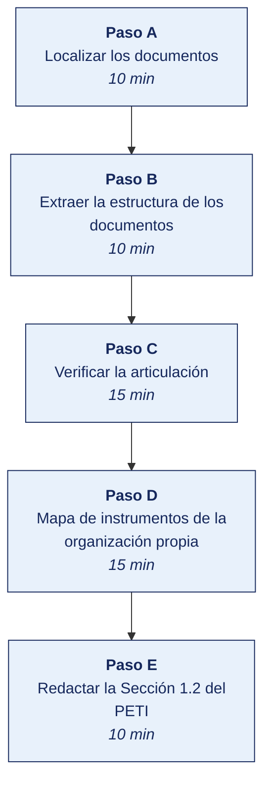

[Semana 03](README.md) · [Teoría](1-TEORIA.md) · [Dinámica de aula](2-DINAMICA.md) · **Taller de laboratorio**

# Taller de laboratorio 03 · Análisis comparado del PEI y del Plan de Gobierno Digital de una entidad real

**SI-886 · Planeamiento Estratégico de TI** · Semana 03 · Sesión 2 en laboratorio · 60 min de taller + 40 de avance · calificación **procedimental**

> ¿Un término no le resulta claro? Está definido en el [glosario técnico del curso](../GLOSARIO.md).

---

## Secuencia del taller



## Qué entregas

| | |
|---|---|
| **Archivo** | `SI886-S03-TALLER-Grupo<N>.pdf` |
| **Plantilla obligatoria** | [SI886-PLANTILLA-TALLER.docx](../PLANTILLAS/SI886-PLANTILLA-TALLER.docx) |
| **Formato** | PDF exportado desde la plantilla en Word, con la carátula de la UPT, el índice actualizado y las capturas numeradas |
| **Qué va dentro** | Las siete secciones del formato EPIS. La sección **3. Resultados** se califica contra la tabla de resultados esperados de esta guía, y cada resultado necesita su evidencia |
| **Dónde se sube** | Aula virtual, tarea «Taller · Semana 03» |
| **Cuándo vence** | 48 horas después de la sesión de laboratorio |

> No se califica un informe entregado en `.docx`, sin carátula, sin los códigos de los integrantes o con resultados declarados sin evidencia.

---

## 1. Información sobre el evento práctico

### 1.1. Título del evento práctico

Análisis documental comparado del Plan Estratégico Institucional y del Plan de Gobierno Digital de una entidad pública peruana, con verificación de su articulación y construcción del mapa de instrumentos de planeamiento aplicable a la organización objeto de estudio.

### 1.2. Objetivos

- Localizar y descargar el **PEI** y el **PGD** vigentes de una entidad pública peruana, ambos documentos públicos.
- Verificar la **articulación** entre ambos. Rastrear cada objetivo del PGD hasta un objetivo del PEI.
- Evaluar el PGD contra la **estructura exigida por los Lineamientos** de la RSGD 005-2018-PCM/SEGDI.
- Construir el **mapa de instrumentos de planeamiento** aplicable a la organización objeto de estudio.
- Determinar el **objetivo superior de enganche** del PETI (Plan Estratégico de Tecnologías de Información) que se está construyendo.
- Redactar la **Sección 1.2** del PETI. Marco de planeamiento y articulación.

### 1.3. Tiempo de duración

**100 minutos:** 60 de taller guiado y 40 de avance asistido.

### 1.4. Resultados de Aprendizaje (RA)

- **RA1** Aplica la dirección estratégica, definiendo la misión y visión.
- **RA2** Desarrolla el análisis FODA.

### 1.5. Recursos

| Recurso | Detalle |
|---|---|
| **Portal del Estado Peruano** | https://www.gob.pe — sección de transparencia de cada entidad |
| **CEPLAN** | https://www.gob.pe/ceplan — *Guía para el Planeamiento Institucional* |
| **Lineamientos del PGD** | https://cdn.www.gob.pe/uploads/document/file/356863/Anexo_I_Lineamientos_PGD.pdf |
| **Normativa de gobierno digital** | https://www.gob.pe/institucion/pcm/colecciones/147-normativa-sobre-gobierno-digital |
| **Python 3.11+** con `pdfplumber`, `pandas` | Extracción de texto de los PDF |
| **draw.io** | Mapa de instrumentos |
| **LibreOffice Calc** | Matriz de articulación |

### 1.6. Seguridad

1. Los PEI y PGD son **documentos públicos**; se descargan de los portales institucionales de transparencia. Se registra la URL y la fecha de descarga.
2. El análisis se realiza sobre el documento **vigente**; si existe más de una versión, se trabaja con la aprobada por resolución y se cita esa resolución.
3. El análisis es **académico y metodológico**. Se evalúa la estructura y la articulación del documento, no se emiten juicios sobre la gestión de la entidad ni sobre personas.
4. La documentación de la organización objeto de estudio se mantiene bajo el acuerdo de confidencialidad.

---

## 2. Procedimiento o Metodología

> **Documento del caso para esta semana.** La organización entrega **Extracto del plan institucional y actas**, en `CASOS/EMPRESA-<NN>-<slug>/documentos/plan-institucional-extracto.md`. Es consistente con los datos de `datos/`: las personas, usuarios y proveedores que menciona existen en los archivos. **No señala sus debilidades**; declara lo que la organización dice hacer.


### Paso A — Localizar los documentos

Se selecciona una entidad pública peruana con ambos documentos publicados (ministerio, gobierno regional, municipalidad provincial, universidad pública, organismo público).

**Este paso no es de trámite: produce el primer hallazgo del informe.** Cada columna existe porque su respuesta puede descalificar al documento como plan. Se registra en `01_marco/MP01_documentos.csv`:

| Documento | Entidad y periodo que cubre | Resolución que lo aprueba, con su fecha | ¿Se aprobó antes de iniciar el periodo? | ¿Sigue vigente hoy? | ¿Propone proyectos con presupuesto? |
|---|---|---|---|---|---|
| PEI | | | | | |
| PGD | | | | | |
| POI (opcional) | | | | | |

**Qué hallazgo produce cada columna**

| Columna | El hallazgo que puede producir |
|---|---|
| **Resolución que lo aprueba** | Un plan sin resolución **no es exigible a nadie**: es un borrador. La teoría de esta semana lo dice del PGD — lo aprueba el titular de la entidad. Verifique además que quien firma tenga competencia para hacerlo |
| **¿Se aprobó antes de iniciar el periodo?** | Un plan 2023-2027 aprobado en noviembre de 2024 **no orientó los dos primeros años**. Es de los hallazgos más frecuentes y de los más difíciles de rebatir |
| **¿Sigue vigente hoy?** | El PGD se aprueba por un **mínimo de tres años** y se **actualiza y evalúa cada año**. Un plan vencido, o vigente pero sin ninguna evaluación anual publicada, es incumplimiento de la norma, no un descuido |
| **¿Propone proyectos con presupuesto?** | Es la prueba de que el documento es un **plan** y no una declaración de intenciones. Un documento que no llega a proyectos con costo no permite presupuestar y por eso no se ejecuta |

> **La URL y la fecha en que se consultó cada documento** van en la sección **6. Referencias** del informe, no en esta tabla. Un documento publicado puede cambiar o desaparecer, y la fecha de consulta fija la versión sobre la que usted concluyó.

> Si la entidad elegida no publica su PGD, es en sí un hallazgo relevante: la obligación de contar con el plan y de mantenerlo actualizado deriva del marco de gobierno digital. Se documenta y se elige otra entidad para el análisis comparado.

### Paso B — Extraer la estructura de los documentos

```python
# 01_marco/MP02_extraccion.py
import pdfplumber, re, pandas as pd

def estructura(ruta, patron_titulo=r"^\s*(\d+(?:\.\d+)*)\s+([A-ZÁÉÍÓÚÑ][^\n]{4,90})$"):
    """Extrae el índice real del documento a partir de sus encabezados numerados."""
    filas = []
    with pdfplumber.open(ruta) as pdf:
        for n, pagina in enumerate(pdf.pages, 1):
            texto = pagina.extract_text() or ""
            for linea in texto.split("\n"):
                m = re.match(patron_titulo, linea.strip())
                if m:
                    filas.append({"pagina": n, "numeral": m.group(1),
                                  "titulo": m.group(2).strip(),
                                  "nivel": m.group(1).count(".") + 1})
    return pd.DataFrame(filas).drop_duplicates(subset=["numeral","titulo"])

pei = estructura("../evidencias/PEI.pdf")
pgd = estructura("../evidencias/PGD.pdf")
pei.to_csv("MP02_estructura_pei.csv", index=False)
pgd.to_csv("MP02_estructura_pgd.csv", index=False)
print("=== ESTRUCTURA DEL PEI ===\n", pei[pei.nivel <= 2].to_string(index=False))
print("\n=== ESTRUCTURA DEL PGD ===\n", pgd[pgd.nivel <= 2].to_string(index=False))
```

```python
# 01_marco/MP03_objetivos.py — localizar los objetivos declarados
import pdfplumber, re, pandas as pd

def objetivos(ruta, patrones):
    encontrados = []
    with pdfplumber.open(ruta) as pdf:
        for n, p in enumerate(pdf.pages, 1):
            t = p.extract_text() or ""
            for pat in patrones:
                for m in re.finditer(pat, t):
                    encontrados.append({"pagina": n, "codigo": m.group(1).strip(),
                                        "texto": m.group(2).strip()[:180]})
    return pd.DataFrame(encontrados).drop_duplicates(subset=["codigo"])

PAT_PEI = [r"(OEI\s*\.?\s*\d+)\s*[:.\-]?\s*(.{20,200})",
           r"(AEI\s*\.?\s*[\d.]+)\s*[:.\-]?\s*(.{20,200})"]
PAT_PGD = [r"(O\.?\s?G\.?D\.?\s*\d+|OGD\s*\d+|Objetivo\s+\d+)\s*[:.\-]?\s*(.{20,200})"]

obj_pei = objetivos("../evidencias/PEI.pdf", PAT_PEI)
obj_pgd = objetivos("../evidencias/PGD.pdf", PAT_PGD)
obj_pei.to_csv("MP03_objetivos_pei.csv", index=False)
obj_pgd.to_csv("MP03_objetivos_pgd.csv", index=False)
print(f"Objetivos identificados — PEI: {len(obj_pei)} | PGD: {len(obj_pgd)}")
print(obj_pei.to_string(index=False)); print(obj_pgd.to_string(index=False))
```

> Los patrones deben ajustarse a la nomenclatura de la entidad. La **verificación manual del resultado es obligatoria**: la extracción automática es un acelerador, no una fuente.

### Paso C — Verificar la articulación

`01_marco/MP04_articulacion.csv` — la matriz que responde la pregunta central del laboratorio:

| Objetivo del PGD | ¿Declara articulación con el PEI? | Objetivo del PEI al que se articula | ¿La articulación es **verificable** en el texto? | ¿Tiene indicador? | ¿Tiene línea base? | ¿Tiene meta anual? | Proyectos asociados |
|---|---|---|---|---|---|---|---|
| OGD 1 | Sí / No | OEI 03 | Sí / No / Declarada sin sustento | | | | |

**Análisis de calidad de la articulación:**

```python
# 01_marco/MP05_calidad.py
import pandas as pd
a = pd.read_csv("MP04_articulacion.csv")

n = len(a)
print(f"Objetivos del PGD analizados            : {n}")
print(f"Declaran articulación con el PEI        : {(a.iloc[:,1]=='Sí').sum()} ({(a.iloc[:,1]=='Sí').mean():.0%})")
print(f"Articulación VERIFICABLE en el texto    : {(a.iloc[:,3]=='Sí').sum()} ({(a.iloc[:,3]=='Sí').mean():.0%})")
print(f"Con indicador                           : {(a.iloc[:,4]=='Sí').sum()}")
print(f"Con línea base                          : {(a.iloc[:,5]=='Sí').sum()}")
print(f"Con meta anual                          : {(a.iloc[:,6]=='Sí').sum()}")
print(f"Con proyectos asociados                 : {a.iloc[:,7].notna().sum()}")

completos = a[(a.iloc[:,3]=='Sí') & (a.iloc[:,4]=='Sí') & (a.iloc[:,5]=='Sí') & (a.iloc[:,6]=='Sí')]
print(f"\nObjetivos COMPLETOS (articulados, con indicador, línea base y meta): "
      f"{len(completos)} de {n} ({len(completos)/n:.0%})")
print("\nInterpretación: el porcentaje de objetivos completos es el mejor predictor")
print("de que el plan pueda evaluarse al final del periodo.")
```

**Evaluación contra la estructura de los Lineamientos** (`01_marco/MP06_estructura_lineamientos.csv`):

| Componente exigido por los Lineamientos | ¿Presente en el PGD analizado? | Sección y página | Calidad (completo / parcial / declarativo) | Observación |
|---|---|---|---|---|
| 1. Introducción y marco normativo | | | | |
| 2. Situación actual: análisis interno y externo | | | | |
| 3. Alineamiento estratégico con el PEI y las políticas nacionales | | | | |
| 4. Objetivos de gobierno digital | | | | |
| 5. Portafolio de proyectos | | | | |
| 6. Gestión de riesgos | | | | |
| 7. Cronograma e implementación | | | | |
| 8. Supervisión y evaluación | | | | |
| 9. Anexos | | | | |
| **Adicional:** ¿se identifica al Líder de Gobierno Digital? | | | | |
| **Adicional:** ¿se evidencia el Comité de Gobierno Digital? | | | | |
| **Adicional:** ¿el periodo cubre al menos 3 años? | | | | |
| **Adicional:** ¿hay evidencia de actualización anual? | | | | |

### Paso D — Mapa de instrumentos de la organización propia

Se construye en draw.io el mapa aplicable a **la organización objeto de estudio**, distinguiendo si es pública o privada:

**Si es pública:**

```
Política Nacional de Transformación Digital al 2030 (D.S. 085-2023-PCM)
                     │
            PESEM del sector / PDC regional
                     │
        Plan Estratégico Institucional (PEI) ── vigente hasta ____
                     │
        Plan Operativo Institucional (POI) ──── año ____
                     │
  ╔═════════════════════════════════════════════════╗
  ║  PETI / Plan de Gobierno Digital Año 1 – Año 3      ║  ← este trabajo
  ║  Se articula al OEI ___ y a la AEI ___          ║
  ╚═════════════════════════════════════════════════╝
```

**Si es privada:**

```
        Visión y estrategia de negocio ──── documento: ____
                     │
        Plan de negocio / plan comercial ── vigente hasta ____
                     │
        Presupuesto anual ───────────────── año ____
                     │
  ╔═════════════════════════════════════════════════╗
  ║  PETI Año 1 – Año 3                                 ║  ← este trabajo
  ║  Se articula al objetivo de negocio: ____       ║
  ╚═════════════════════════════════════════════════╝
```

**Tabla de instrumentos de la organización** (`01_marco/MP07_instrumentos_organizacion.csv`):

| Instrumento | ¿Existe? | Vigencia | ¿Está aprobado formalmente? | ¿Se evalúa periódicamente? | Objetivo relevante para el PETI | Observación |
|---|---|---|---|---|---|---|

> **Si la organización no tiene ningún instrumento de planeamiento vigente**, ese es el primer hallazgo del diagnóstico y condiciona el PETI: el plan deberá **derivar los objetivos de negocio de las entrevistas con la gerencia** y documentar explícitamente esa limitación metodológica.

### Paso E — Redactar la Sección 1.2 del PETI

`01_marco/1.2_marco_planeamiento.md`:

```markdown
## 1.2 Marco de planeamiento y articulación de instrumentos

### 1.2.1 Instrumentos de planeamiento de la organización
Tabla de instrumentos existentes, su vigencia y su estado de aprobación.

### 1.2.2 Mapa de articulación
Diagrama del mapa de instrumentos, con la posición de este PETI.

### 1.2.3 Objetivo superior de enganche
Objetivo institucional o de negocio al que se articula este plan, citado textualmente
con su fuente, y justificación de la elección.

### 1.2.4 Enfoque estratégico de la organización
Declaración de enfoque estratégico, sustentada en el contraste «dice, hace, financia»
de la dinámica de aula, incluida la cláusula de lo que este plan NO abordará.

### 1.2.5 Marco normativo de planeamiento aplicable
Para entidades públicas: D. Leg. 1412, D. S. 029-2021-PCM, RSGD 005-2018-PCM/SEGDI,
RM 119-2018-PCM, D. S. 085-2023-PCM y la guía del CEPLAN.
Para organizaciones privadas: marcos de referencia adoptados voluntariamente.

### 1.2.6 Referencia metodológica: análisis comparado
Síntesis de lo aprendido del análisis del PEI y PGD de <entidad analizada>: qué se
replica en este plan y qué defecto observado se evita deliberadamente.
```

```bash
git add . && git commit -m "S03: marco de planeamiento, articulacion de instrumentos y seccion 1.2 del PETI"
git tag -a v0.3 -m "PETI v0.3 — marco de planeamiento"
```

---


### Avance asistido · Avance del PETI asistido

Los últimos 40 minutos del laboratorio son del equipo. **El docente no dirige.** Queda disponible para consultas y observa el reparto real del trabajo.

| | |
|---|---|
| **Qué se trabaja** | las secciones del PETI que la semana requiere, según el plan de trabajo de la Semana 01 |
| **Quién decide qué hacer** | El equipo. El docente no asigna tareas en este tramo |
| **Dónde se registra** | el tablero de avance del equipo, con cada elemento asignado a una persona |
| **Para qué sirve la presencia del docente** | Resolver bloqueos en el momento, no revisar entregables |

> **Se registra la contribución individual.** Lo trabajado en este tramo queda en el repositorio con su autoría. Es la evidencia del atributo **AG-I03 Trabajo Individual y en Equipo** que se mide en las semanas de cierre de unidad.

## 3. Resultados

> **Evidencia obligatoria en GitHub.** Todo resultado de este taller se versiona en el repositorio del equipo. El informe **no consigna capturas sueltas**: consigna la **URL** del artefacto en GitHub. Una captura no permite verificar autoría, fecha ni contenido; un enlace sí.
>
> | Qué se entrega | Dónde vive | Qué se escribe en el informe |
> |---|---|---|
> | Código y archivos de configuración | Rama del taller, fusionada a `develop` vía Pull Request | URL del Pull Request |
> | Documentos y matrices | `docs/`, en formato de texto versionable | URL del archivo en la rama |
> | Capturas y videos que el taller exija | `docs/evidencias/S03/` | URL del archivo |
> | Salida de comandos | `docs/evidencias/S03/salidas/*.txt` | URL del archivo |
>
> **Etiqueta del taller.** Al cerrar el taller se crea la etiqueta `taller-03` sobre el commit entregado:
>
> ```bash
> git tag -a taller-03 -m "Taller 03 · SI886"
> git push origin taller-03
> ```
>
> La URL que se consigna en el informe apunta a esa etiqueta:
> `https://github.com/<organizacion>/<repositorio>/tree/taller-03`
>
> **Sin la URL, el resultado no se califica.** El docente evalúa sobre el repositorio, no sobre el PDF.

### 3.1. Tabla de resultados


| # | Resultado esperado | Verificación |
|---|---|---|
| 1 | PEI y PGD localizados, con su resolución de aprobación y el veredicto de vigencia y de suficiencia | `MP01_documentos.csv` |
| 2 | Estructura de ambos documentos extraída y **verificada manualmente** | `MP02_estructura_*.csv` |
| 3 | Objetivos del PEI y del PGD identificados con su código y texto | `MP03_objetivos_*.csv` |
| 4 | Matriz de articulación completa, con la distinción entre articulación **declarada** y **verificable** | `MP04_articulacion.csv` |
| 5 | Porcentaje de **objetivos completos** (articulados, con indicador, línea base y meta) calculado | Salida de `MP05_calidad.py` |
| 6 | Evaluación del PGD contra los 9 componentes de los Lineamientos más los 4 adicionales | `MP06_estructura_lineamientos.csv` |
| 7 | Mapa de instrumentos de la organización propia, en diagrama | `graficos/mapa_instrumentos.png` |
| 8 | Tabla de instrumentos de la organización, con su estado de aprobación y evaluación | `MP07_instrumentos_organizacion.csv` |
| 9 | **Objetivo superior de enganche identificado y citado textualmente** | Sección 1.2.3 |
| 10 | Declaración de enfoque estratégico con la cláusula de exclusión | Sección 1.2.4 |
| 11 | Sección 1.2 redactada, incluida la lección del análisis comparado | `1.2_marco_planeamiento.md` |
| 12 | Etiqueta `v0.3` en Git | `git tag` |


## Rúbrica procedimental (20 puntos)

Se aplica sobre el informe entregado y la evidencia enlazada en el repositorio. **Cada criterio se califica de forma independiente.**

| Criterio | 4 — Logrado | 2 — En proceso | 0 — Insuficiente |
|---|---|---|---|
| **Verificar la articulación** | Completo y correcto, con la evidencia que lo respalda | Completo con errores menores, o correcto pero sin toda la evidencia | Incompleto, o entregado sin ejecutar |
| **Mapa de instrumentos de la organización propia** | Completo y correcto, con la evidencia que lo respalda | Completo con errores menores, o correcto pero sin toda la evidencia | Incompleto, o entregado sin ejecutar |
| **Evidencia verificable en el repositorio** | Cada resultado tiene su URL sobre la etiqueta `taller-NN`, y el enlace abre lo que dice | La mayoría tiene URL; alguna evidencia es una captura suelta | Se declaran resultados sin enlace, o el enlace no corresponde |
| **Fundamento de las decisiones** | Cada criterio, peso o supuesto está justificado y su fuente citada | Justificados en su mayoría, con supuestos sin declarar | Se presentan cifras sin origen ni justificación |
| **Informe en formato EPIS** | Las seis secciones completas; la sección del PETI queda redactada y versionada | Secciones completas con la redacción del PETI incompleta | Faltan secciones o no se produjo la sección del plan |

| Puntaje | Equivalencia |
|---|---|
| 18 – 20 | Destacado |
| 14 – 17 | Logrado |
| 6 – 13 | En proceso |
| 0 – 5 | Insuficiente |

> **Un resultado declarado sin evidencia enlazada no puntúa**, aunque el trabajo se haya hecho. La tabla de la sección 3.1 es la lista de cotejo; esta rúbrica es lo que determina la nota.

## 4. Conclusiones

Mínimo tres. Líneas argumentales esperadas:

1. La articulación entre planes se declara con frecuencia y se verifica pocas veces; medir el porcentaje de objetivos con articulación verificable, indicador, línea base y meta expone la calidad real de un plan mucho mejor que su extensión.
2. Un objetivo de TI sin ancla en un objetivo institucional o de negocio compite por presupuesto sin argumento, y es el primero que se recorta cuando los recursos escasean.
3. El enfoque estratégico real de una organización se revela en lo que financia, no en lo que declara; construir el PETI sobre el enfoque declarado cuando el financiado es otro produce un plan que la organización no ejecutará.

## 5. Referencias Bibliográficas

- Resolución de Secretaría de Gobierno Digital 005-2018-PCM/SEGDI — *Lineamientos para la formulación del Plan de Gobierno Digital*, Anexo I. https://cdn.www.gob.pe/uploads/document/file/356863/Anexo_I_Lineamientos_PGD.pdf
- Resolución Ministerial 119-2018-PCM — Comité de Gobierno Digital y Líder de Gobierno Digital.
- Decreto Legislativo 1412, Ley de Gobierno Digital. https://www.gob.pe/institucion/pcm/colecciones/147-normativa-sobre-gobierno-digital
- Decreto Supremo 029-2021-PCM, Reglamento de la Ley de Gobierno Digital. https://www.gob.pe/13326-reglamento-de-la-ley-de-gobierno-digital
- Decreto Supremo 085-2023-PCM, Política Nacional de Transformación Digital al 2030. https://busquedas.elperuano.pe/dispositivo/NL/2200457-5
- CEPLAN. *Guía para el Planeamiento Institucional*. https://www.gob.pe/ceplan
- Rodríguez Bermúdez, J. R. (2015). *Planificación y dirección estratégica de sistemas de información*. Editorial UOC. https://elibro.net/es/lc/bibliotecaupt/titulos/57875
- González Millán, J. (2020). *Manual práctico de planeación estratégica*. Ediciones Díaz de Santos. https://elibro.net/es/lc/bibliotecaupt/titulos/129291
- Treacy, M. y Wiersema, F. (1995). *The Discipline of Market Leaders*. Addison-Wesley.
- MINTIC Colombia. *Guía para la construcción del PETI*. https://www.mintic.gov.co/arquitecturati/630/w3-propertyvalue-8114.html

## 6. Anexos

- `anexo_A_matriz_articulacion.xlsx`
- `anexo_B_evaluacion_lineamientos.xlsx`
- `anexo_C_mapa_instrumentos.png`
- `anexo_D_seccion_1_2.pdf`
- `anexo_E_documentos_analizados.txt` — URL, resolución y fecha de descarga

---

---

[Semana 03](README.md) · [Teoría](1-TEORIA.md) · [Dinámica de aula](2-DINAMICA.md) · **Taller de laboratorio**

---

**Docente** · Dr. Oscar Juan Jimenez Flores
[oscarjimenezflores@upt.pe](mailto:oscarjimenezflores@upt.pe) · [LinkedIn](https://www.linkedin.com/in/oscar-jimenez-flores/) · [CTI Vitae — CONCYTEC](https://ctivitae.concytec.gob.pe/appDirectorioCTI/VerDatosInvestigador.do?id_investigador=33398)

Escuela Profesional de Ingeniería de Sistemas · Universidad Privada de Tacna · Tacna, Perú
