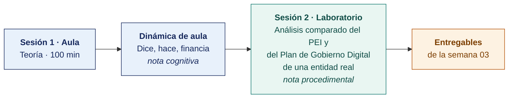

  
  &nbsp;&nbsp;&nbsp;&nbsp;&nbsp;&nbsp;
  

  <strong>Universidad Privada de Tacna</strong> 
  Facultad de Ingeniería · Escuela Profesional de Ingeniería de Sistemas

<h1 align="center">Semana 03 · La Planificación · El Planeamiento Estratégico · El Enfoque Estratégico</h1>

  <strong>SI-886 · Planeamiento Estratégico de TI</strong> 
  4 horas académicas de 50 min · aula: teoría 60 + dinámica 35 + cierre 5 · laboratorio: taller 60 + avance asistido 40

---

## Datos de la asignatura

| | |
|---|---|
| **Asignatura** | SI-886 · Planeamiento Estratégico de TI |
| **Escuela** | Escuela Profesional de Ingeniería de Sistemas |
| **Ciclo** | VIII · 04 horas semanales · 03 créditos · Obligatorio |
| **Unidad** | I — Fundamentos de Planeamiento Estratégico |
| **Semana** | 03 de 17 |
| **Duración** | 4 horas académicas de 50 min · aula: teoría 60 + dinámica 35 + cierre 5 · laboratorio: taller 60 + avance asistido 40 |
| **Resultados de aprendizaje** | **RA1** Aplica la dirección estratégica, definiendo la misión y visión · **RA2** Desarrolla el análisis FODA |

### Lo que indica el sílabo

**Contenido conceptual.** La planificación, Planificación estratégica. ¿Qué es Planeamiento Estratégico? Enfoque estratégico.

**Contenido procedimental.** Investiga los conceptos tratados en clase. Revisar el PETI, PEGE y el PGD de una organización. Define el enfoque estratégico de la entidad.

## Materiales de esta semana

| | Documento | Qué encontrarás | Dónde y cuánto dura |
|---|---|---|---|
| 1 | **[Teoría](1-TEORIA.md)** | Los niveles de la planificación · Qué es planeamiento estratégico · Los instrumentos PEI, POI, PEGE, PGD y PETI | Aula · 100 min |
| 2 | **[Dinámica de aula](2-DINAMICA.md)** | Dice, hace, financia, con su material, su ejemplo resuelto y su rúbrica | Aula · dentro de los 100 min de la sesión de teoría |
| 3 | **[Taller de laboratorio](3-TALLER.md)** | Análisis comparado del PEI y del Plan de Gobierno Digital de una entidad real | Laboratorio · 100 min |

## Ruta de la semana

## Entregables

| Entregable | Formato y nombre del archivo | Vence |
|---|---|---|
| **Dinámica de aula** · Dice, hace, financia | PDF desde la [plantilla de dinámica](../PLANTILLAS/SI886-PLANTILLA-DINAMICA.docx) · `SI886-S03-DINAMICA-Grupo<N>.pdf` | Antes de cerrar la sesión de teoría |
| **Informe del taller de laboratorio N.º 03** | PDF en formato EPIS desde la [plantilla de taller](../PLANTILLAS/SI886-PLANTILLA-TALLER.docx) · `SI886-S03-TALLER-Grupo<N>.pdf` | 48 h después del taller |
| Sección 1.2 del PETI · etiqueta `v0.3` | Commit en Git | 48 h después del laboratorio |

> Ambos se entregan en **PDF**, con la carátula de la UPT y los códigos de todos los integrantes. Las plantillas obligatorias están en [`PLANTILLAS/`](../PLANTILLAS/).

## Cómo se evalúa

| Criterio | Instrumento | Peso |
|---|---|---|
| Cognitivo | Rúbrica de «Dice, hace, financia» + exposición de 10 min en la Semana 04 | 25 % |
| Procedimental | Lista de cotejo de los 12 resultados del laboratorio | 35 % |
| Actitudinal | Objetividad en el análisis documental, sin juicios sobre personas ni gestión | 15 % |

## Preparación para la Semana 04

- **Confirmar la Entrevista 1 con la gerencia** de la organización. Es el insumo obligatorio de la Semana 04. Preparar la solicitud formal con la agenda de temas.
- **Leer.** González Millán, *Manual práctico de planeación estratégica* — capítulo sobre misión y visión.
- Recopilar las declaraciones de misión y visión **actuales** de la organización, si existen, con su documento y fecha de aprobación.
- Recopilar la misión y visión de **tres organizaciones comparables** del mismo sector, para el ejercicio de referencia.

---

**Docente** · Dr. Oscar Juan Jimenez Flores
[oscarjimenezflores@upt.pe](mailto:oscarjimenezflores@upt.pe) · [LinkedIn](https://www.linkedin.com/in/oscar-jimenez-flores/) · [CTI Vitae — CONCYTEC](https://ctivitae.concytec.gob.pe/appDirectorioCTI/VerDatosInvestigador.do?id_investigador=33398)

Escuela Profesional de Ingeniería de Sistemas · Universidad Privada de Tacna · Tacna, Perú
