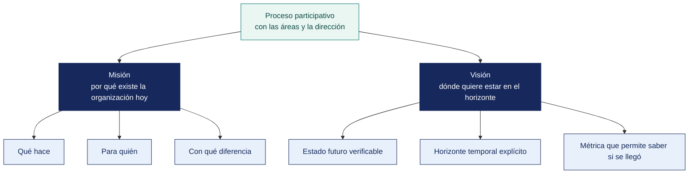

[Semana 04](README.md) · **Teoría** · [Dinámica de aula](2-DINAMICA.md) · [Taller de laboratorio](3-TALLER.md)

# Teoría · Misión y Visión · Construcción y Evaluación

**SI-886 · Planeamiento Estratégico de TI** · Semana 04 · Sesión 1 en aula · 2 horas académicas, 100 min, con la dinámica incluida

> ¿Un término no le resulta claro? Está definido en el [glosario técnico del curso](../GLOSARIO.md).

---

## Qué se trabaja en esta sesión

- La misión y por qué existe la organización.
- La visión y hacia dónde va la organización.
- El proceso participativo de formulación.

## Distribución del tiempo

| Bloque | Minutos |
|---|---|
| La misión y por qué existe la organización | 20 |
| La visión y hacia dónde va la organización | 20 |
| El proceso participativo de formulación | 20 |
| Cierre | 5 |
| **Total de la sesión de aula** | **65** |

## Mapa de la sesión

---

## La misión y por qué existe la organización

**Definición.** La misión declara la **razón de ser actual** de la organización: qué hace, para quién y con qué propósito. Responde a la pregunta *«si mañana desapareciéramos, ¿qué dejaría de existir y quién lo notaría?»*.

**Los cinco componentes de una misión completa:**

| Componente | Pregunta | Ejemplo de contenido |
|---|---|---|
| **Qué hacemos** | ¿Cuál es la actividad esencial? | «Distribuimos productos de consumo masivo» |
| **Para quién** | ¿Quién es el destinatario? | «a bodegas y minoristas del sur del Perú» |
| **Cómo** | ¿Qué nos distingue en el cómo? | «con entrega en 24 horas y crédito adaptado a su ciclo de caja» |
| **Para qué** | ¿Qué valor genera? | «para que el pequeño comerciante compita en surtido y precio» |
| **Con qué compromiso** | ¿Qué principios lo rigen? | «con trato equitativo y transparencia en las condiciones» |

**Los siete defectos de las declaraciones de misión reales:**

| Defecto | Ejemplo | Por qué falla |
|---|---|---|
| **Intercambiable** | «Ser una empresa líder que brinda productos de calidad con excelencia y compromiso» | Sirve para cualquier organización del planeta |
| **Confunde misión con visión** | «Ser la empresa número uno del país» | Eso es aspiración futura, no razón de ser actual |
| **Enumera valores** | «Honestidad, respeto, trabajo en equipo, innovación» | Los valores son otra sección |
| **Omite al destinatario** | «Producir bienes de alta calidad» | ¿Para quién? |
| **Extensión desmedida** | Un párrafo de 180 palabras | Nadie la recuerda ni la usa |
| **Contradice la práctica** | «Priorizamos al cliente» en una organización sin canal de atención | Destruye la credibilidad del plan completo |
| **Escrita por una sola persona** | Redactada por el consultor o por el gerente | Nadie más la reconoce como propia |

**Prueba de calidad de una misión** —tres verificaciones rápidas:

1. **Prueba de sustitución.** Si se reemplaza el nombre de la organización por el de un competidor y la declaración sigue siendo válida, la misión no dice nada.
2. **Prueba de la decisión.** ¿Ha servido alguna vez para descartar una alternativa? Una misión que nunca ayudó a decir «no» es decorativa.
3. **Prueba del reconocimiento.** ¿Puede un trabajador de la organización enunciar su sentido con sus propias palabras? Si no, la misión no existe operativamente.

**Ejemplo trabajado — tres misiones y por qué dos no sirven.**

| Misión | Diagnóstico |
|---|---|
| «Brindar productos y servicios de calidad que satisfagan las necesidades de nuestros clientes, con personal comprometido y tecnología adecuada, contribuyendo al desarrollo de la región» | **No sirve.** Sirve para cualquier organización del país. No dice qué hace, para quién ni qué la distingue |
| «Somos líderes en innovación y excelencia, comprometidos con la calidad total» | **No sirve.** Es una aspiración, no una razón de ser. Además «líderes» pertenece a la visión |
| «Acopiamos, procesamos y exportamos aceituna y derivados del olivo del valle de Tacna, cumpliendo los estándares sanitarios y de trazabilidad que exigen los mercados de destino, con productores asociados de la zona» | **Sirve.** Dice qué hace, con qué, para quién y bajo qué restricción |

**Las cuatro preguntas que una misión debe responder:**

| Pregunta | En la tercera misión |
|---|---|
| ¿Qué hace? | Acopia, procesa y exporta |
| ¿Para quién? | Mercados de destino con exigencia sanitaria |
| ¿Con qué? | Productores asociados del valle |
| ¿Qué la restringe o distingue? | Estándares sanitarios y trazabilidad exigidos por el comprador |

> **Por qué importa en un PETI.** Si la misión menciona trazabilidad exigida por el comprador, el proyecto de trazabilidad deja de ser «una mejora de TI» y pasa a ser **la condición para seguir existiendo**. La misión da o quita fuerza a la cartera.

**Preguntas para la sesión**

| Pregunta | Qué debe contener una buena respuesta |
|---|---|
| ¿Puede el equipo reformular la misión de la organización? | No. Puede evaluarla y señalar sus defectos, y proponer una versión para que la organización decida. Cambiarla es decisión de su alta dirección |
| ¿Qué se hace si la misión es genérica? | Se declara la limitación y se apoya el alineamiento en los objetivos del plan y en las actas, que sí suelen ser concretos |
| ¿Sirve una visión sin fecha? | No. Sin horizonte no se puede medir avance ni saber si se alcanzó |
## La visión y hacia dónde va la organización

**Definición.** La visión describe el **estado futuro deseado y alcanzable** en un horizonte definido. Debe ser lo bastante ambiciosa para movilizar y lo bastante concreta para orientar decisiones.

**Los cinco atributos de una visión útil:**

| Atributo | Qué significa | Contraejemplo |
|---|---|---|
| **Temporalmente acotada** | Declara el horizonte | «Ser líderes» sin decir cuándo |
| **Verificable** | Contiene o implica una métrica | «Ser reconocidos por nuestra excelencia» |
| **Ambiciosa pero alcanzable** | Exige esfuerzo real sin ser fantasía | Una empresa de 40 personas que aspira a operar en 12 países en 3 años |
| **Específica del negocio** | Describe cómo será *esta* organización | «Ser una empresa moderna y competitiva» |
| **Movilizadora** | Alguien puede reconocerse en ella y actuar en consecuencia | Una declaración que nadie entiende |

**Estructura recomendada:**

> *«Al año <horizonte>, <organización> será <posición o estado deseado> en <ámbito o mercado>, reconocida por <atributo distintivo verificable>, habiendo logrado <resultado medible>.»*

**Ejemplo contrastado:**

| Versión | Evaluación |
|---|---|
| «Ser la empresa líder e innovadora del sector, reconocida por su excelencia y compromiso con el cliente» | Falla los cinco atributos |
| «Al cierre del horizonte del plan, Distribuidora Andina del Sur será el distribuidor con mayor cobertura de bodegas en la macrorregión sur, atendiendo al menos al 60 % de los puntos de venta de Tacna, Moquegua y Arequipa, con el 80 % de sus pedidos originados en canal digital y entrega en menos de 24 horas» | Cumple los cinco: horizonte, ámbito, atributo distintivo y tres métricas verificables |

**La visión de TI.** Además de la visión organizacional, el PETI (Plan Estratégico de Tecnologías de Información) incorpora una **visión de la función de TI**, derivada de la anterior y de la postura de TI identificada en la Semana 02:

> *«Al cierre del horizonte del plan, la función de TI de <organización> habrá pasado de <estado actual> a <estado objetivo>, sosteniendo <la capacidad de negocio que habilita>, con <nivel de servicio o capacidad medible>.»*

## El proceso participativo de formulación

**Por qué no se redacta en un escritorio.** Una misión que el personal no reconoce como propia no orienta decisiones. Ni una redactada por el consultor ni una redactada por el equipo del curso. **El equipo formulador facilita el proceso; la organización decide el contenido.**

**Proceso de cuatro pasos:**

| Paso | Actividad | Instrumento | Producto |
|---|---|---|---|
| **1. Recuperar** | Obtener la misión y visión actuales, su fecha de aprobación y evaluarlas con las pruebas de la sección 1.2 | Revisión documental | Diagnóstico de las declaraciones vigentes |
| **2. Escuchar** | Entrevistar a la gerencia y encuestar a una muestra del personal y de los clientes | Entrevista semiestructurada y encuesta | Insumos en las palabras de la organización |
| **3. Formular** | Construir dos o tres alternativas con los cinco componentes | Taller de redacción | Alternativas contrastables |
| **4. Validar** | Someter las alternativas a evaluación por rúbrica y a consulta con los interesados | Rúbrica y encuesta de preferencia | Declaración seleccionada y sustentada |

**Preguntas de la entrevista a la gerencia** —diseñadas para que las respuestas sean insumo de redacción, no opiniones sobre la redacción:

1. Si la organización cerrara mañana, ¿qué perdería concretamente su cliente o usuario? ¿Adónde iría?
2. ¿Qué hace su organización que un competidor no puede replicar en seis meses?
3. Descríbame el cliente para el que su organización es claramente la mejor opción. Y el cliente para el que no lo es.
4. ¿Qué oportunidad de negocio han rechazado en los últimos dos años y por qué?
5. Imagine la organización dentro de cinco años en su mejor escenario realista — ¿cuántas personas tiene, qué vende, dónde opera y qué hace distinto?
6. ¿Qué tendría que ser verdad dentro de cinco años para que tú considerara exitoso este periodo? Deme una cifra.
7. ¿Qué papel debería cumplir la tecnología para que eso ocurra?

> **La pregunta 4 es la más reveladora.** Lo que una organización rechaza define su estrategia con más precisión que lo que persigue.

## Cierre

**Pregunta de cierre.** *¿la misión actual de la organización ha servido alguna vez para rechazar una oportunidad?* Si nadie recuerda un caso, la organización tiene una declaración, no una misión, y el PETI debe partir de reconstruirla.

---

---

[Semana 04](README.md) · **Teoría** · [Dinámica de aula](2-DINAMICA.md) · [Taller de laboratorio](3-TALLER.md)

---

**Docente** · Dr. Oscar Juan Jimenez Flores
[oscarjimenezflores@upt.pe](mailto:oscarjimenezflores@upt.pe) · [LinkedIn](https://www.linkedin.com/in/oscar-jimenez-flores/) · [CTI Vitae — CONCYTEC](https://ctivitae.concytec.gob.pe/appDirectorioCTI/VerDatosInvestigador.do?id_investigador=33398)

Escuela Profesional de Ingeniería de Sistemas · Universidad Privada de Tacna · Tacna, Perú
