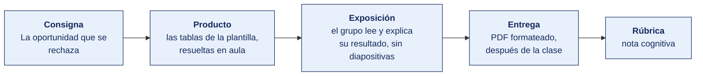

[Semana 04](README.md) · [Teoría](1-TEORIA.md) · **Dinámica de aula** · [Taller de laboratorio](3-TALLER.md)

# Dinámica de aula · La mesa de la oportunidad

**SI-886 · Planeamiento Estratégico de TI** · Semana 04 · Actividad en aula, **dentro de los 100 min de la sesión de teoría** · calificación **cognitiva**

> ¿Un término no le resulta claro? Está definido en el [glosario técnico del curso](../GLOSARIO.md).

---

## Cómo funciona la actividad

## Qué entregas

| | |
|---|---|
| **Archivo** | `SI886-S04-DINAMICA-Grupo<N>.pdf` |
| **Plantilla obligatoria** | [SI886-PLANTILLA-DINAMICA.docx](../PLANTILLAS/SI886-PLANTILLA-DINAMICA.docx) |
| **Formato** | PDF exportado desde la plantilla en Word, con la carátula de la UPT y los apellidos, nombres y códigos de todos los integrantes |
| **Qué va dentro** | Lo que el grupo resolvió en aula. Las tablas de la sección **Producto** van completas, con los textos redactados, y cada decisión va justificada |
| **Dónde se sube** | Aula virtual, tarea «Dinámica · Semana 04» |
| **Cuándo vence** | Hasta 24 h después de la sesión de teoría. La tabla se resuelve en aula; el PDF se formatea y se sube después |
| **Exposición** | En la ronda de cierre de **esta misma sesión**. El grupo **lee y explica su resultado** ante el aula, con el documento a la vista. No se usan diapositivas |

> No se califica un trabajo entregado en `.docx`, sin carátula, sin los códigos de los integrantes o con las tablas del producto vacías.

---

## Consigna

> **«La mesa de la oportunidad»**
> El gerente comercial trae tres oportunidades de negocio a la mesa. La gerencia general tiene que rechazar una, y decírselo a la cara con la misión de la organización en la mano.

| | |
|---|---|
| **Su papel** | Una mitad del equipo es **gerencia general**, guardiana de la misión. La otra es **gerencia comercial**, que trae las oportunidades y quiere las tres |
| **Misión** | Reescribir la misión para que sirva de verdad, y usarla para rechazar **una** oportunidad |
| **Restricción** | La misión reescrita no puede pasar de **45 palabras** ni inventar capacidades que la organización no tiene |

La prueba está en la teoría y hoy es la única que importa. *Una misión que nunca ha servido para decir que no es decorativa.* Si la misión reescrita no rechaza nada, todavía no sirve.

## Cómo se desarrolla · 35 minutos

| | Bloque | Quién | Minutos |
|---|---|---|---|
| **1** | **Diagnóstico y reescritura.** Los defectos de la misión vigente, con su nombre, y la nueva en 45 palabras con los cinco componentes señalados | Equipo | 10 |
| **2** | **El comercial elige.** Gerencia comercial toma **la oportunidad más rentable** de las tres y la defiende en una frase | Equipo | 9 |
| **3** | **El rechazo.** Gerencia general rechaza una citando **la parte exacta** de la misión nueva que la deja fuera. Y le pone cifra a la visión | Equipo | 8 |
| **4** | **Ronda en aula.** Un equipo lee **solo su misión reescrita**. El aula adivina qué oportunidad se cae | Todos | 8 |

## Material de trabajo

Cada equipo recibe **una ficha** con la **misión y la visión vigentes** de una organización y **tres oportunidades** que esa organización tiene sobre la mesa. Son las mismas diez organizaciones de la Semana 03, así que ya conoce a la suya.

**Reparto.** Una ficha por equipo, la misma que le tocó la semana pasada. Las declaraciones son del tipo que se encuentra en portales y planes reales.

### Ficha 1 · Agroexportadora de aceituna y orégano

> **Misión vigente.** «Somos una empresa comprometida con la excelencia y la calidad total, orientada a la satisfacción de nuestros clientes y al desarrollo sostenible de la región, con personal altamente capacitado.»
> **Visión vigente.** «Ser líderes del sector agroexportador, reconocidos por nuestra excelencia.»
> **Oportunidades sobre la mesa.** ① Exportar palta a Europa con un socio que aporta el fruto y la cámara de frío ② Envasar aceituna al vacío para supermercados nacionales ③ Alquilar la planta a terceros en temporada baja

### Ficha 2 · Clínica privada de 60 camas

> **Misión vigente.** «Brindar servicios de salud de calidad con tecnología de punta y personal comprometido, contribuyendo al bienestar de la comunidad.»
> **Visión vigente.** «Ser la clínica más moderna de la región.»
> **Oportunidades sobre la mesa.** ① Abrir consultorios de especialidades en un distrito vecino ② Convenio con una aseguradora para atención ambulatoria ③ Abrir un gimnasio y spa en el tercer piso, hoy vacío

### Ficha 3 · Municipalidad distrital

> **Misión vigente.** «Promover el desarrollo integral y sostenible del distrito, brindando servicios de calidad con transparencia y participación ciudadana.»
> **Visión vigente.** «Ser un municipio moderno y competitivo.»
> **Oportunidades sobre la mesa.** ① Digitalizar la licencia de funcionamiento ② Administrar un terminal terrestre interprovincial como negocio propio del municipio ③ Convenio con la EPS para atender juntos los reclamos de agua

### Ficha 4 · Cooperativa de ahorro y crédito

> **Misión vigente.** «Somos una institución financiera solidaria que brinda productos y servicios de calidad, con responsabilidad social y compromiso con nuestros socios.»
> **Visión vigente.** «Ser la cooperativa líder del sur del país.»
> **Oportunidades sobre la mesa.** ① Crédito hipotecario a 20 años para vivienda en Lima ② Crédito de campaña a 90 días para el comerciante de frontera ③ Seguro de desgravamen para los socios con crédito vigente

### Ficha 5 · Empresa de transporte de carga

> **Misión vigente.** «Brindar servicios de transporte con calidad, seguridad y puntualidad, satisfaciendo las necesidades de nuestros clientes.»
> **Visión vigente.** «Ser la empresa de transporte líder del sur.»
> **Oportunidades sobre la mesa.** ① Transporte refrigerado para los agroexportadores del valle ② Almacén de tránsito en la frontera ③ Mudanzas domiciliarias para familias

### Ficha 6 · Distribuidora mayorista de consumo masivo

> **Misión vigente.** «Distribuir productos de calidad, generando valor para nuestros clientes, colaboradores y accionistas, con eficiencia y responsabilidad.»
> **Visión vigente.** «Ser la distribuidora más moderna y eficiente de la región.»
> **Oportunidades sobre la mesa.** ① Distribuir una línea de limpieza además de la de alimentos ② Abrir tiendas propias de venta al público en las capitales de provincia ③ Ampliar la cobertura a 2 000 bodegas más de la macrorregión

### Ficha 7 · Instituto de educación superior tecnológica

> **Misión vigente.** «Formar profesionales técnicos competentes, con valores y calidad educativa, para el desarrollo del país.»
> **Visión vigente.** «Ser el instituto líder en formación técnica.»
> **Oportunidades sobre la mesa.** ① Alquilar las aulas los fines de semana a una academia preuniversitaria ② Abrir Enfermería Técnica, la carrera más demandada de la región ③ Programa de titulación para egresados que nunca se titularon

### Ficha 8 · Empresa prestadora de servicios de saneamiento

> **Misión vigente.** «Brindar servicios de saneamiento con calidad y eficiencia, contribuyendo a la salud y el bienestar de la población.»
> **Visión vigente.** «Ser una EPS modelo a nivel nacional.»
> **Oportunidades sobre la mesa.** ① Ampliar la red a dos asentamientos que hoy no tienen conexión ② Micromedición en la zona de mayor pérdida de agua ③ Embotellar y vender agua de mesa con marca propia

### Ficha 9 · Servicios de ingeniería para minería

> **Misión vigente.** «Brindar servicios de ingeniería de calidad, con profesionales altamente calificados y tecnología de vanguardia.»
> **Visión vigente.** «Ser reconocidos como líderes en servicios de ingeniería.»
> **Oportunidades sobre la mesa.** ① Monitoreo de vibraciones para dos mineras, con instrumentación propia ② Supervisión de obra civil para el gobierno regional ③ Laboratorio de calibración de sensores para el mercado local

### Ficha 10 · Cadena regional de farmacias

> **Misión vigente.** «Comercializar productos farmacéuticos de calidad al mejor precio, con atención personalizada y compromiso con la salud.»
> **Visión vigente.** «Ser la cadena de farmacias preferida por las familias.»
> **Oportunidades sobre la mesa.** ① Vender electrodomésticos pequeños y juguetes en los 34 locales ② Toma de presión y glucosa en local, a cargo del químico farmacéutico ③ Reparto a domicilio en dos horas

## Producto

**El acta de la mesa.**

| | Contenido |
|---|---|
| **Defectos de la misión vigente** | Hasta tres, con el nombre que les da la teoría y la frase donde está cada uno |
| **Las dos pruebas** | La **prueba de sustitución** y la **prueba de la decisión**, con su resultado y una línea de sustento |
| **Misión reescrita** | Máximo 45 palabras, y dónde está cada uno de los cinco componentes |
| **La visión** | Qué atributo de los cinco le falta y **qué cifra** habría que ponerle |
| **La oportunidad rechazada** | Cuál, **qué parte exacta** de la misión nueva la deja fuera, y qué respondió gerencia comercial |

> **Dónde va.** Este producto se presenta en la **sección 2 de la [plantilla de dinámica](../PLANTILLAS/SI886-PLANTILLA-DINAMICA.docx)**, «El producto». No se copia la consigna ni la teoría. Solo el resultado y lo que lo sostiene.

## Ejemplo resuelto

*El caso de este ejemplo es distinto del que le toca a tu grupo. Sirve para que veas el nivel de detalle que se espera, no para copiarlo.*

**La ficha.** Academia preuniversitaria de Tacna · 28 trabajadores.

> **Misión vigente.** «Somos una institución líder comprometida con la excelencia educativa y la mejora continua, formando jóvenes de calidad para el desarrollo del país.»
> **Visión vigente.** «Ser la academia número uno de la región.»
> **Oportunidades.** ① Preparar para el examen de admisión con simulacros semanales ② Un programa de inglés para adultos que trabajan ③ Abrir una sede en Moquegua

**El acta de la mesa.**

| | Contenido |
|---|---|
| **Defectos** | **Intercambiable** — cámbiele el nombre por el de un instituto de cocina y sigue valiendo. **Confunde misión con visión** — «líder» es aspiración. **Omite al destinatario** — «jóvenes» no dice cuáles |
| **Las dos pruebas** | *Sustitución*, no la pasa. *Decisión*, tampoco — con esta misión las tres oportunidades son igual de defendibles |
| **Misión reescrita** | «Preparamos a egresados de secundaria de Tacna para el examen de admisión de la universidad pública de la región, con simulacros semanales sobre el temario oficial y seguimiento individual del puntaje, para que ingresen en su primera postulación.» · 38 palabras |
| **La visión** | Le falta ser **temporalmente acotada** y **verificable**. La cifra — «al 2029, cuatro de cada diez ingresantes a la universidad pública habrán estudiado aquí» |
| **La oportunidad rechazada** | La **②**. La misión dice *egresados de secundaria* y *examen de admisión*. El adulto que quiere inglés no rinde admisión. Comercial respondió que es el segmento más rentable, y la mesa contestó que rentable no es lo mismo que propio |

**La ③ no se rechaza.** Mismo destinatario, otro lugar.

**La diferencia entre aprobar y no aprobar**

| Así no | Así sí |
|---|---|
| «Es muy general.» | «Cámbiele el nombre por el de un instituto de cocina y sigue funcionando.» |
| «Rechazamos la ② porque no es nuestro giro.» | «La ② se cae porque el adulto que quiere inglés no rinde examen de admisión, que es lo que la misión dice que hacemos.» |

## Reglas

- 35 min en aula, dentro de la sesión de teoría.
- La misión reescrita **no pasa de 45 palabras**.
- El defecto se nombra con el término de la teoría. «Es muy general» no es un diagnóstico.
- Se rechaza **una** oportunidad, no dos. Si su misión rechaza dos, dejó fuera algo que la organización sí hace.
- La visión necesita una **cifra concreta**, no «ser reconocidos».
- En la ronda, el equipo **no explica** su misión. Solo la lee. Si el aula no adivina qué se cae, la misión todavía no decide.
- La exposición es la ronda de cierre de esta misma sesión. El grupo **lee y explica su resultado**. No se usan diapositivas.

## Rúbrica cognitiva (20 puntos)

| Criterio | 5 | 3 | 1 |
|---|---|---|---|
| **Diagnóstico** | Los defectos nombrados con el término de la teoría y localizados en la frase concreta | Defectos correctos sin localizarlos | «Es muy general», sin nombrar el defecto |
| **Misión reescrita** | Los cinco componentes presentes, dentro de las 45 palabras, verosímil para esa organización | Cuatro componentes, o excede el límite sin perder contenido | Sigue siendo intercambiable |
| **El rechazo sostenido** | Cita la parte de la misión que deja fuera la oportunidad y responde a la objeción del comercial | Rechaza la correcta sin citar la parte | Rechaza por «no es nuestro giro» |
| **La prueba del aula** | El aula acierta qué oportunidad se cae oyendo solo la misión | El aula duda entre dos | El aula no puede deducirlo |

---

---

[Semana 04](README.md) · [Teoría](1-TEORIA.md) · **Dinámica de aula** · [Taller de laboratorio](3-TALLER.md)

---

**Docente** · Dr. Oscar Juan Jimenez Flores
[oscarjimenezflores@upt.pe](mailto:oscarjimenezflores@upt.pe) · [LinkedIn](https://www.linkedin.com/in/oscar-jimenez-flores/) · [CTI Vitae — CONCYTEC](https://ctivitae.concytec.gob.pe/appDirectorioCTI/VerDatosInvestigador.do?id_investigador=33398)

Escuela Profesional de Ingeniería de Sistemas · Universidad Privada de Tacna · Tacna, Perú
