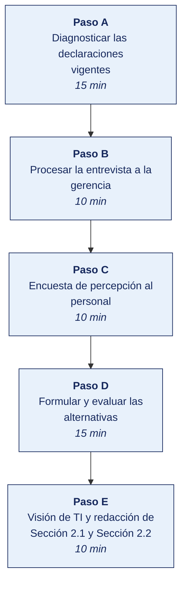

[Semana 04](README.md) · [Teoría](1-TEORIA.md) · [Dinámica de aula](2-DINAMICA.md) · **Taller de laboratorio**

# Taller de laboratorio 04 · Formulación y validación de la misión y la visión

**SI-886 · Planeamiento Estratégico de TI** · Semana 04 · Sesión 2 en laboratorio · 60 min de taller + 40 de avance · calificación **procedimental**

> ¿Un término no le resulta claro? Está definido en el [glosario técnico del curso](../GLOSARIO.md).

---

## Secuencia del taller



## Qué entregas

| | |
|---|---|
| **Archivo** | `SI886-S04-TALLER-Grupo<N>.pdf` |
| **Plantilla obligatoria** | [SI886-PLANTILLA-TALLER.docx](../PLANTILLAS/SI886-PLANTILLA-TALLER.docx) |
| **Formato** | PDF exportado desde la plantilla en Word, con la carátula de la UPT, el índice actualizado y las capturas numeradas |
| **Qué va dentro** | Las siete secciones del formato EPIS. La sección **3. Resultados** se califica contra la tabla de resultados esperados de esta guía, y cada resultado necesita su evidencia |
| **Dónde se sube** | Aula virtual, tarea «Taller · Semana 04» |
| **Cuándo vence** | 48 horas después de la sesión de laboratorio |

> No se califica un informe entregado en `.docx`, sin carátula, sin los códigos de los integrantes o con resultados declarados sin evidencia.

---

## 1. Información sobre el evento práctico

### 1.1. Título del evento práctico

Formulación participativa de la misión, la visión organizacional y la visión de la función de TI para la organización objeto de estudio, con evaluación por rúbrica y validación mediante consulta a los interesados.

### 1.2. Objetivos

- Diagnosticar las **declaraciones vigentes** de la organización con las pruebas de calidad.
- Procesar los insumos de la **entrevista a la gerencia** y extraer el material de redacción.
- Diseñar y aplicar una **encuesta de percepción** a una muestra del personal.
- Formular **tres alternativas** de misión y tres de visión con los cinco componentes.
- **Evaluar las alternativas con una rúbrica ponderada** y validarlas por consulta.
- Derivar la **visión de la función de TI** a partir de la visión organizacional.
- Redactar las secciones **Sección 2.1** y **Sección 2.2** del PETI (Plan Estratégico de Tecnologías de Información).

### 1.3. Tiempo de duración

**100 minutos:** 60 de taller guiado y 40 de avance asistido.

### 1.4. Resultados de Aprendizaje (RA)

- **RA1** Aplica la dirección estratégica, definiendo la misión y visión.
- **RA2** Desarrolla el análisis FODA.

### 1.5. Recursos

| Recurso | Detalle |
|---|---|
| **Grabación o notas de la Entrevista 1** con la gerencia | Insumo obligatorio |
| **LimeSurvey** (Docker) o Google Forms | Encuesta de percepción |
| **Python 3.11+** con `pandas`, `matplotlib` | Procesamiento de la encuesta y de la rúbrica |
| **LibreOffice Writer** | Redacción y control de cambios |
| Declaraciones de tres organizaciones comparables | Ejercicio de referencia |
| **draw.io** | Mapa de componentes |

### 1.6. Seguridad

1. La entrevista se graba **solo con consentimiento expreso y escrito**. Sin consentimiento, se trabaja con notas.
2. La grabación se almacena cifrada, se transcribe y **se elimina al cierre del semestre**, dejando registro.
3. La encuesta al personal es **anónima**. No se solicitan datos que permitan identificar al respondiente. Se informa el propósito y el uso de los resultados.
4. Las respuestas individuales no se comparten con la gerencia; solo resultados agregados. **Este compromiso es lo que hace confiables las respuestas.**
5. Aplica el marco de la Ley 29733 y su Reglamento D. S. 016-2024-JUS si se recogiera cualquier dato personal.

---

## 2. Procedimiento o Metodología

> **Documento del caso para esta semana.** La organización entrega **Misión, visión y objetivos vigentes**, en `CASOS/EMPRESA-<NN>-<slug>/documentos/plan-institucional-extracto.md`. Es consistente con los datos de `datos/`: las personas, usuarios y proveedores que menciona existen en los archivos. **No señala sus debilidades**; declara lo que la organización dice hacer.


### Paso A — Diagnosticar las declaraciones vigentes

`02_identidad/MV01_diagnostico_actual.md`:

| Campo | Contenido |
|---|---|
| Misión vigente (texto literal) | |
| Documento y fecha de aprobación | |
| ¿Está publicada? ¿Dónde? | |
| **Prueba de sustitución** | ¿Sigue siendo válida con el nombre de un competidor? Sí / No |
| **Prueba de la decisión** | ¿La gerencia recuerda un caso en que sirvió para descartar algo? |
| **Prueba del reconocimiento** | ¿El personal encuestado la reconoce? (se responde tras el Paso C) |
| Defectos identificados (de los siete) | |
| Componentes presentes de los cinco | |
| Visión vigente (texto literal) | |
| Horizonte declarado | ¿Ya venció? |
| Atributos presentes de los cinco | |
| **Veredicto** | Se conserva / Se ajusta / Se reformula |

### Paso B — Procesar la entrevista a la gerencia

Se transcribe y se codifica el material por componente. `02_identidad/MV02_insumos_entrevista.csv`:

| Pregunta | Cita textual del entrevistado | Componente que alimenta | Palabra clave rescatable |
|---|---|---|---|
| P1 — ¿Qué perdería el cliente? | «Perderían el crédito a 30 días; ningún mayorista de la zona se los da» | Para qué (valor) · Cómo (distintivo) | crédito, acceso |
| P2 — ¿Qué no puede replicar un competidor? | «La red de 8 400 bodegas construida en 15 años» | Cómo (distintivo) | cobertura, red |
| P4 — ¿Qué oportunidad rechazaron? | «Vender a supermercados; el margen no compensa y nos desviaría del servicio a la bodega» | **Delimitación del alcance** | foco en el pequeño comerciante |
| P6 — ¿Qué cifra definiría el éxito? | «Que el 80 % de los pedidos entre solo» | Visión — métrica | canal digital |
| P7 — Rol de la tecnología | | Visión de TI | |

> **Las palabras del entrevistado son el material de redacción.** Una misión construida con el vocabulario de la organización se reconoce; una construida con vocabulario de consultoría, no.

### Paso C — Encuesta de percepción al personal

**Diseño del instrumento** (`02_identidad/MV03_encuesta.md`), máximo 8 preguntas, anónima:

| # | Pregunta | Tipo |
|---|---|---|
| 1 | ¿En qué área trabaja? | Selección (sin identificar a la persona) |
| 2 | ¿Cuántos años lleva en la organización? | Rango |
| 3 | **Con sus propias palabras, ¿a qué se dedica esta organización y para quién?** | Abierta |
| 4 | ¿Conoce la misión declarada de la organización? | Sí / No / No estoy seguro |
| 5 | De estas cuatro frases, ¿cuál describe mejor lo que hace especial a la organización? | Selección de 4 opciones + otra |
| 6 | ¿Dónde le gustaría ver a la organización dentro de cinco años? | Abierta |
| 7 | ¿Qué debería mejorar la organización para llegar ahí? | Abierta |
| 8 | ¿Qué papel debería cumplir la tecnología en ese futuro? | Abierta |

```bash
# LimeSurvey local (opcional)
docker run -d --name peti_survey -p 127.0.0.1:8086:8080 \
  -e LIMESURVEY_ADMIN_USER=admin -e LIMESURVEY_ADMIN_PASSWORD=peti_lab \
  martialblog/limesurvey:6-apache
```

**Procesamiento** (`02_identidad/MV04_procesa_encuesta.py`):

```python
import pandas as pd, re
from collections import Counter

r = pd.read_csv("../evidencias/encuesta_personal.csv")
print(f"Respuestas: {len(r)} | Áreas representadas: {r.area.nunique()}")
print(r.area.value_counts().to_string())

VACIAS = set("""de la el los las y o a en un una que para con por su sus es son
del al se lo como más muy nos nuestra nuestro este esta ser""".split())

def nube(col, n=15):
    txt = " ".join(r[col].dropna().astype(str)).lower()
    pal = [w for w in re.findall(r"[a-záéíóúñ]{4,}", txt) if w not in VACIAS]
    return Counter(pal).most_common(n)

print("\n=== P3 · Cómo describe el personal a la organización ===")
for p, n in nube("p3_a_que_se_dedica"): print(f"   {p:20s} {n}")
print("\n=== P6 · Futuro deseado por el personal ===")
for p, n in nube("p6_futuro"): print(f"   {p:20s} {n}")
print("\n=== P8 · Papel esperado de la tecnología ===")
for p, n in nube("p8_tecnologia"): print(f"   {p:20s} {n}")

conoce = r.p4_conoce_mision.value_counts(normalize=True)
print(f"\n=== PRUEBA DEL RECONOCIMIENTO ===")
print(conoce.round(3).to_string())
print(f"→ Si menos del 50 % conoce la misión declarada, la misión no existe operativamente.")
```

### Paso D — Formular y evaluar las alternativas

Se redactan **tres alternativas de misión** y **tres de visión**, cada una construida con el vocabulario de las respuestas.

**Evaluación por rúbrica ponderada** (`02_identidad/MV05_evaluacion.py`):

```python
import pandas as pd

CRITERIOS = {   # criterio: (peso, descripción)
 "componentes":   (.25, "Contiene los 5 componentes: qué, para quién, cómo, para qué, compromiso"),
 "especificidad": (.25, "No pasa la prueba de sustitución: es propia de ESTA organización"),
 "veracidad":     (.20, "Describe capacidades que la organización realmente tiene"),
 "concision":     (.15, "≤ 50 palabras, memorizable"),
 "vocabulario":   (.15, "Usa las palabras de la organización, no jerga de consultoría"),
}
assert abs(sum(p for p, _ in CRITERIOS.values()) - 1) < 1e-9

ALT = {  # alternativa: calificación 1–5 por criterio, en el orden de CRITERIOS
 "Misión A": [5, 4, 5, 3, 4],
 "Misión B": [4, 5, 5, 5, 5],
 "Misión C": [5, 3, 4, 4, 3],
 "Visión A": [4, 5, 4, 4, 4],
 "Visión B": [5, 4, 3, 5, 4],
 "Visión C": [3, 3, 5, 5, 5],
}
filas = []
for alt, cal in ALT.items():
    total = sum(c * p for c, (p, _) in zip(cal, CRITERIOS.values()))
    filas.append({"alternativa": alt,
                  **{k: v for k, v in zip(CRITERIOS, cal)},
                  "puntaje": round(total, 2)})
ev = pd.DataFrame(filas).sort_values("puntaje", ascending=False)
ev.to_csv("MV05_evaluacion_alternativas.csv", index=False)
print(ev.to_string(index=False))
print("\nGanadora de misión:", ev[ev.alternativa.str.startswith("Misión")].iloc[0].alternativa)
print("Ganadora de visión:", ev[ev.alternativa.str.startswith("Visión")].iloc[0].alternativa)
```

**Validación por consulta.** Las tres alternativas se someten a una **votación de preferencia** entre el personal encuestado y la contraparte de la organización. Se registra el resultado y **la razón declarada de la preferencia**, que suele revelar más que el conteo.

> **Regla de decisión.** Si la alternativa mejor puntuada por la rúbrica no es la preferida por la organización, **prevalece la preferencia de la organización**, y el equipo documenta la discrepancia. Es su misión, no la del equipo formulador.

### Paso E — Visión de TI y redacción de sección 2.1 y Sección 2.2

**Derivación de la visión de TI.** Se construye la tabla que enlaza la visión organizacional con la capacidad tecnológica que la habilita:

| Elemento de la visión organizacional | Capacidad de negocio requerida | Capacidad de TI que la habilita | Estado actual | Estado objetivo |
|---|---|---|---|---|
| «80 % de pedidos en canal digital» | Autoservicio del cliente | Portal B2B estable, integrado al ERP y a inventario en tiempo real | Portal sin integración, disponibilidad no medida | Portal integrado con 99,5 % de disponibilidad |
| «Cobertura del 60 % de puntos de venta» | Gestión territorial de la fuerza de ventas | Movilidad, geolocalización, datos de cobertura | Sin herramienta móvil | Aplicación de fuerza de ventas con datos en línea |
| «Entrega en menos de 24 horas» | Planificación de rutas y control de despacho | Integración WMS–transporte, trazabilidad | Integración por archivo nocturno | Integración en línea |

`02_identidad/2.1_mision.md` y `02_identidad/2.2_vision.md`:

```markdown
## 2.1 Misión

### 2.1.1 Misión de la organización
> «<Declaración final seleccionada>»

### 2.1.2 Componentes de la declaración
| Componente | Contenido en la declaración |

### 2.1.3 Proceso de formulación
Diagnóstico de la declaración vigente, insumos de la entrevista a la gerencia,
resultados de la encuesta al personal (N = ___), alternativas evaluadas y criterio
de selección. Discrepancias entre la rúbrica y la preferencia, si las hubo.

### 2.1.4 Verificación de calidad
Resultado de las pruebas de sustitución, de la decisión y del reconocimiento.

---

## 2.2 Visión

### 2.2.1 Visión de la organización al cierre del horizonte del plan
> «<Declaración final seleccionada>»

### 2.2.2 Métricas implícitas en la visión
| Métrica | Valor actual (línea base) | Valor implícito en la visión | Fuente del dato |

### 2.2.3 Visión de la función de TI al cierre del horizonte del plan
> «<Declaración derivada>»

### 2.2.4 Capacidades de TI que la visión exige
Tabla de derivación: elemento de la visión → capacidad de negocio → capacidad de TI
→ estado actual → estado objetivo. **Esta tabla es el insumo directo de la
arquitectura objetivo (Sección 5) y del portafolio de proyectos (Sección 7).**
```

```bash
git add . && git commit -m "S04: mision, vision organizacional y vision de TI — secciones 2.1 y 2.2"
git tag -a v0.4 -m "PETI v0.4 — identidad estrategica"
```

---


### Avance asistido · Avance del PETI asistido

Los últimos 40 minutos del laboratorio son del equipo. **El docente no dirige.** Queda disponible para consultas y observa el reparto real del trabajo.

| | |
|---|---|
| **Qué se trabaja** | las secciones del PETI que la semana requiere, según el plan de trabajo de la Semana 01 |
| **Quién decide qué hacer** | El equipo. El docente no asigna tareas en este tramo |
| **Dónde se registra** | el tablero de avance del equipo, con cada elemento asignado a una persona |
| **Para qué sirve la presencia del docente** | Resolver bloqueos en el momento, no revisar entregables |

> **Se registra la contribución individual.** Lo trabajado en este tramo queda en el repositorio con su autoría. Es la evidencia del atributo **AG-I03 Trabajo Individual y en Equipo** que se mide en las semanas de cierre de unidad.

## 3. Resultados

> **Evidencia obligatoria en GitHub.** Todo resultado de este taller se versiona en el repositorio del equipo. El informe **no consigna capturas sueltas**: consigna la **URL** del artefacto en GitHub. Una captura no permite verificar autoría, fecha ni contenido; un enlace sí.
>
> | Qué se entrega | Dónde vive | Qué se escribe en el informe |
> |---|---|---|
> | Código y archivos de configuración | Rama del taller, fusionada a `develop` vía Pull Request | URL del Pull Request |
> | Documentos y matrices | `docs/`, en formato de texto versionable | URL del archivo en la rama |
> | Capturas y videos que el taller exija | `docs/evidencias/S04/` | URL del archivo |
> | Salida de comandos | `docs/evidencias/S04/salidas/*.txt` | URL del archivo |
>
> **Etiqueta del taller.** Al cerrar el taller se crea la etiqueta `taller-04` sobre el commit entregado:
>
> ```bash
> git tag -a taller-04 -m "Taller 04 · SI886"
> git push origin taller-04
> ```
>
> La URL que se consigna en el informe apunta a esa etiqueta:
> `https://github.com/<organizacion>/<repositorio>/tree/taller-04`
>
> **Sin la URL, el resultado no se califica.** El docente evalúa sobre el repositorio, no sobre el PDF.

### 3.1. Tabla de resultados


| # | Resultado esperado | Verificación |
|---|---|---|
| 1 | Diagnóstico de las declaraciones vigentes con las tres pruebas de calidad | `MV01_diagnostico_actual.md` |
| 2 | Entrevista a la gerencia realizada, con **consentimiento documentado** | `evidencias/` |
| 3 | Insumos de la entrevista codificados por componente, con citas textuales | `MV02_insumos_entrevista.csv` |
| 4 | Encuesta aplicada a **al menos 10 personas o al 30 % del personal**, lo que sea mayor | `encuesta_personal.csv` |
| 5 | Procesamiento de la encuesta con las tres nubes de términos | Salida de `MV04_procesa_encuesta.py` |
| 6 | **Prueba del reconocimiento** cuantificada: % del personal que conoce la misión | Salida del script |
| 7 | **Tres alternativas** de misión y **tres** de visión formuladas | `02_identidad/` |
| 8 | Evaluación por rúbrica ponderada con pesos que suman 1 | `MV05_evaluacion_alternativas.csv` |
| 9 | Validación por consulta, con el resultado y **la razón declarada de la preferencia** | Papel de trabajo |
| 10 | Discrepancia rúbrica-preferencia documentada, si la hubo | Sección 2.1.3 |
| 11 | Misión final de **≤ 50 palabras** con los cinco componentes identificados | Sección 2.1 |
| 12 | Visión final con horizonte y **al menos dos métricas verificables** | Sección 2.2 |
| 13 | **Visión de TI derivada** y tabla de capacidades con estado actual y objetivo | Sección 2.2.3 y Sección 2.2.4 |
| 14 | Etiqueta `v0.4` en Git | `git tag` |


## Rúbrica procedimental (20 puntos)

Se aplica sobre el informe entregado y la evidencia enlazada en el repositorio. **Cada criterio se califica de forma independiente.**

| Criterio | 4 — Logrado | 2 — En proceso | 0 — Insuficiente |
|---|---|---|---|
| **Diagnosticar las declaraciones vigentes** | Completo y correcto, con la evidencia que lo respalda | Completo con errores menores, o correcto pero sin toda la evidencia | Incompleto, o entregado sin ejecutar |
| **Formular y evaluar las alternativas** | Completo y correcto, con la evidencia que lo respalda | Completo con errores menores, o correcto pero sin toda la evidencia | Incompleto, o entregado sin ejecutar |
| **Evidencia verificable en el repositorio** | Cada resultado tiene su URL sobre la etiqueta `taller-NN`, y el enlace abre lo que dice | La mayoría tiene URL; alguna evidencia es una captura suelta | Se declaran resultados sin enlace, o el enlace no corresponde |
| **Fundamento de las decisiones** | Cada criterio, peso o supuesto está justificado y su fuente citada | Justificados en su mayoría, con supuestos sin declarar | Se presentan cifras sin origen ni justificación |
| **Informe en formato EPIS** | Las seis secciones completas; la sección del PETI queda redactada y versionada | Secciones completas con la redacción del PETI incompleta | Faltan secciones o no se produjo la sección del plan |

| Puntaje | Equivalencia |
|---|---|
| 18 – 20 | Destacado |
| 14 – 17 | Logrado |
| 6 – 13 | En proceso |
| 0 – 5 | Insuficiente |

> **Un resultado declarado sin evidencia enlazada no puntúa**, aunque el trabajo se haya hecho. La tabla de la sección 3.1 es la lista de cotejo; esta rúbrica es lo que determina la nota.

## 4. Conclusiones

Mínimo tres. Líneas argumentales esperadas:

1. Una misión formulada con el vocabulario de la organización se reconoce y se usa; una formulada con vocabulario de consultoría se archiva, por correcta que sea su estructura.
2. La prueba del reconocimiento —cuánta gente puede enunciar la misión con sus propias palabras— es el único indicador que distingue una misión operativa de una declaración publicada.
3. La visión solo es útil para el PETI si sus elementos pueden derivarse en capacidades de TI con estado actual y objetivo; esa derivación es lo que convierte una aspiración en un portafolio de proyectos.

## 5. Referencias Bibliográficas

- González Millán, J. (2020). *Manual práctico de planeación estratégica*. Ediciones Díaz de Santos. https://elibro.net/es/lc/bibliotecaupt/titulos/129291
- García Sánchez, E. y Valencia Velazco, M. L. *Planeación estratégica: teoría y práctica*. Trillas.
- Rodríguez Bermúdez, J. R. (2015). *Planificación y dirección estratégica de sistemas de información*. Editorial UOC. https://elibro.net/es/lc/bibliotecaupt/titulos/57875
- Collins, J. y Porras, J. (1996). Building your company's vision. *Harvard Business Review*, 74(5), 65–77.
- CEPLAN. *Guía para el Planeamiento Institucional* — formulación de la misión institucional. https://www.gob.pe/ceplan
- Resolución de Secretaría de Gobierno Digital 005-2018-PCM/SEGDI — Anexo I. https://cdn.www.gob.pe/uploads/document/file/356863/Anexo_I_Lineamientos_PGD.pdf
- Ley 29733 y D. S. 016-2024-JUS — tratamiento de datos en encuestas y entrevistas. https://www.gob.pe/institucion/anpd
- LimeSurvey Project. *LimeSurvey Manual*. https://www.limesurvey.org/manual

## 6. Anexos

- `anexo_A_transcripcion_entrevista.pdf` — con el consentimiento adjunto
- `anexo_B_instrumento_encuesta.pdf`
- `anexo_C_resultados_encuesta.xlsx`
- `anexo_D_evaluacion_alternativas.xlsx`
- `anexo_E_secciones_2_1_2_2.pdf`

---

---

[Semana 04](README.md) · [Teoría](1-TEORIA.md) · [Dinámica de aula](2-DINAMICA.md) · **Taller de laboratorio**

---

**Docente** · Dr. Oscar Juan Jimenez Flores
[oscarjimenezflores@upt.pe](mailto:oscarjimenezflores@upt.pe) · [LinkedIn](https://www.linkedin.com/in/oscar-jimenez-flores/) · [CTI Vitae — CONCYTEC](https://ctivitae.concytec.gob.pe/appDirectorioCTI/VerDatosInvestigador.do?id_investigador=33398)

Escuela Profesional de Ingeniería de Sistemas · Universidad Privada de Tacna · Tacna, Perú
