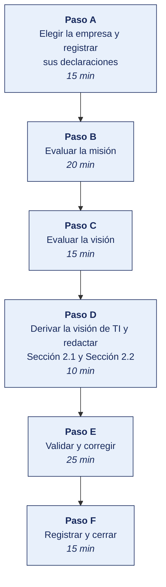

[Semana 04](README.md) · [Teoría](1-TEORIA.md) · [Dinámica de aula](2-DINAMICA.md) · **Taller de laboratorio**

# Taller de laboratorio 04 · Formulación y validación de la misión y la visión

**SI-886 · Planeamiento Estratégico de TI** · Semana 04 · Sesión 2 en laboratorio · 100 min · calificación **procedimental**

> ¿Un término no le resulta claro? Está definido en el [glosario técnico del curso](../GLOSARIO.md).

---

## Secuencia del taller



## Qué entregas

| | |
|---|---|
| **Archivo** | `SI886-S04-TALLER-Grupo<N>.pdf` |
| **Plantilla obligatoria** | [SI886-PLANTILLA-TALLER.docx](../PLANTILLAS/SI886-PLANTILLA-TALLER.docx) |
| **Formato** | PDF exportado desde la plantilla en Word, con la carátula de la UPT, el índice actualizado y las capturas numeradas |
| **Qué va dentro** | Las secciones de la plantilla. La **5. Resultados y evidencias** se califica contra la tabla de resultados esperados de esta guía, y **cada resultado necesita la evidencia que lo demuestre**. No se copian de aquí los objetivos, la duración ni los resultados de aprendizaje |
| **Dónde se sube** | Aula virtual, tarea «Taller · Semana 04» |
| **Cuándo vence** | 48 horas después de la sesión de laboratorio |

> No se califica un informe entregado en `.docx`, sin carátula, sin los códigos de los integrantes o con resultados declarados sin evidencia.

---

## El reto

| | |
|---|---|
| **Situación** | Una empresa real del sector tecnológico publica su misión y su visión. Nadie las ha evaluado, y de ellas salen las secciones 2.1 y 2.2 del PETI (Plan Estratégico de Tecnologías de Información). |
| **Misión** | A partir de una empresa real del sector tecnológico, deberá ubicar y registrar las dos declaraciones, evaluarlas con los instrumentos de la teoría y derivar de ahí la visión de la función de TI. |
| **Criterio de éxito** | Cada defecto señalado lleva su nombre técnico y la prueba que lo demuestra, y cada capacidad de la visión de TI sale de un elemento concreto de la visión de la empresa. |

## 1. Información sobre el evento práctico

### 1.1. Objetivos

- Elegir una **empresa real del sector tecnológico** y registrar su misión y su visión literales, con su fuente.
- Evaluar la misión con los **cinco componentes**, los **siete defectos** y las **tres pruebas de calidad**.
- Evaluar la visión con los **cinco atributos** y extraer sus **métricas implícitas**.
- Derivar la **visión de la función de TI**.
- Redactar las secciones **Sección 2.1** y **Sección 2.2** del PETI.

### 1.2. Recursos

| Recurso | Detalle |
|---|---|
| **Navegador con acceso a internet** | Sitio oficial de la empresa o su memoria anual |
| [`MV01_diagnostico_declaraciones.py`](../HERRAMIENTAS/SEMANA-04/MV01_diagnostico_declaraciones.py) | Aplica los instrumentos de la teoría y emite el veredicto |
| **Python 3.11+** con `matplotlib` | Ejecución del diagnóstico |
| **draw.io** | Mapa de derivación de la visión de TI |
| **LibreOffice Writer** | Redacción de las dos secciones |

### 1.3. Seguridad

1. La misión y la visión se copian **literalmente**, con la dirección de la página y la fecha de consulta.
2. Son textos de la empresa que los publica. Se citan entre comillas y se le atribuyen a ella.
3. Solo se consultan **páginas públicas** de la empresa.
4. Si la declaración está en otro idioma, se registra el original y la traducción se marca como tal.

---

## 2. Procedimiento o Metodología

### Paso A — Elegir la empresa y registrar sus declaraciones

1. Elijan **una empresa real del sector tecnológico**. Puede ser global, latinoamericana o peruana.
2. Busquen su misión y su visión en el sitio oficial, en «Quiénes somos», «Nosotros», «About us» o en la memoria anual.
3. Copien **el texto literal**, sin resumir.
4. Llenen la ficha.

`02_identidad/MV01_declaraciones.md`:

| Campo | Contenido |
|---|---|
| Empresa | |
| Actividad y país | |
| Dirección de la página | |
| Fecha de consulta | |
| Misión, texto literal | |
| Visión, texto literal | |
| ¿Publica visión? | |

> **Si la empresa no publica visión, eso ya es un hallazgo.** Se registra así y el taller continúa con la misión.

### Paso B — Evaluar la misión

1. Para cada uno de los cinco componentes, copien el **fragmento literal** que lo porta, o márquenlo como ausente.
2. Revisen los siete defectos y señalen los que la declaración tenga. Cada uno con **su nombre técnico** y la evidencia que lo prueba. «Es muy general» no es un diagnóstico.
3. Apliquen las tres pruebas de calidad — la de sustitución con el nombre de tres competidores reales, la de la decisión y la del reconocimiento.
4. Copien el programa, edítenlo con los datos de su empresa y ejecútenlo.

| Componente | Pregunta que responde | Fragmento literal que lo porta |
|---|---|---|
| Qué hacemos | ¿Cuál es la actividad esencial? | |
| Para quién | ¿Quién es el destinatario? | |
| Cómo nos distingue | ¿Qué la distingue en el cómo? | |
| Para qué | ¿Qué valor genera? | |
| Con qué compromiso | ¿Qué principios lo rigen? | |

```bash
cp ../HERRAMIENTAS/SEMANA-04/MV01_diagnostico_declaraciones.py 02_identidad/MV01_diagnostico_declaraciones.py
python3 02_identidad/MV01_diagnostico_declaraciones.py | tee ../evidencias/S04/diagnostico.txt
```

> **El veredicto sale de las reglas de la teoría, no de una opinión.** Si la misión sobrevive a la sustitución del nombre, se reformula. Si porta tres componentes o menos, se reformula. Con cuatro, o con algún defecto señalable, se ajusta. Solo con los cinco componentes y las tres pruebas superadas se conserva.

### Paso C — Evaluar la visión

1. Evalúen los cinco atributos, cada uno con la evidencia del juicio.
2. Lleven a la segunda tabla toda cifra que la visión declare o suponga, con su línea base y la fuente del dato.

| Atributo | ¿Cumple? | Con qué se sustenta |
|---|---|---|
| Temporalmente acotada | | El año que declara, o su ausencia |
| Verificable | | La cifra que contiene, o su ausencia |
| Ambiciosa pero alcanzable | | Contrastada con el tamaño real de la empresa |
| Específica del negocio | | Qué la distingue de otra empresa del mismo rubro |
| Movilizadora | | Qué decisión concreta permite tomar |

| Métrica que la visión implica | Valor actual, con su fuente | Valor que la visión exige |
|---|---|---|

### Paso D — Derivar la visión de TI y redactar Sección 2.1 y Sección 2.2

1. Tomen cada elemento de la visión de la empresa y escriban la **capacidad de negocio** que exige.
2. Para cada capacidad de negocio, escriban la **capacidad de TI** que la habilita, con su estado actual y su estado objetivo.
3. Redacten la visión de TI con la estructura de la teoría.
4. Redacten las dos secciones del PETI.

> *«Al cierre del horizonte del plan, la función de TI de <empresa> habrá pasado de <estado actual> a <estado objetivo>, sosteniendo <la capacidad de negocio que habilita>, con <nivel de servicio o capacidad medible>.»*

| Elemento de la visión de la empresa | Capacidad de negocio requerida | Capacidad de TI que la habilita | Estado actual | Estado objetivo |
|---|---|---|---|---|
| «80 % de pedidos en canal digital» | Autoservicio del cliente | Portal de venta integrado al ERP y al inventario | Portal sin integración, disponibilidad no medida | Portal integrado con 99,5 % de disponibilidad |
| «Cobertura del 60 % de puntos de venta» | Gestión territorial de la fuerza de ventas | Movilidad, geolocalización y datos de cobertura | Sin herramienta móvil | Aplicación de fuerza de ventas con datos en línea |
| «Entrega en menos de 24 horas» | Planificación de rutas y control de despacho | Integración entre almacén y transporte, con trazabilidad | Integración por archivo nocturno | Integración en línea |

`02_identidad/2.1_mision.md` y `02_identidad/2.2_vision.md`:

```markdown
## 2.1 Misión

### 2.1.1 Misión vigente de la empresa
> «<Texto literal, con la dirección de la página y la fecha de consulta>»

### 2.1.2 Diagnóstico de la declaración
| Componente | Fragmento que lo porta | Defecto señalado y su prueba |

### 2.1.3 Resultado de las tres pruebas de calidad
Sustitución con tres competidores reales, prueba de la decisión y prueba del
reconocimiento, cada una con su evidencia. Veredicto.

### 2.1.4 Versión propuesta
> «<Declaración propuesta>»
El equipo evalúa y propone. **Adoptarla es decisión de la alta dirección de la empresa.**

---

## 2.2 Visión

### 2.2.1 Visión vigente y su evaluación
> «<Texto literal>»
Los cinco atributos con la evidencia de cada juicio.

### 2.2.2 Métricas implícitas en la visión
| Métrica | Valor actual (línea base) | Valor implícito en la visión | Fuente del dato |

### 2.2.3 Visión de la función de TI al cierre del horizonte del plan
> «<Declaración derivada>»

### 2.2.4 Capacidades de TI que la visión exige
Tabla de derivación: elemento de la visión → capacidad de negocio → capacidad de TI
→ estado actual → estado objetivo. **Esta tabla es el insumo directo de la
arquitectura objetivo (Sección 5) y del portafolio de proyectos (Sección 7).**
```

### Paso E — Validar y corregir (25 min)

El resultado no vale por estar hecho, sino por resistir una comprobación. Se ejecutan estas tres y **se corrige lo que falle antes de cerrar la sesión**.

1. Apliquen la prueba de sustitución con el nombre de un competidor real de la empresa. Si la declaración sobrevive, no dice nada, y así se declara en el diagnóstico.
2. Comprueben que cada métrica de la visión tiene su línea base con la fuente que la respalda, y no una cifra supuesta.
3. Comprueben que cada fila de la tabla de derivación sale de un elemento concreto de la visión de la empresa, y no de una idea del equipo.

> Lo que no se pueda corregir hoy se anota en la sección **Problemas y mejoras** de la evidencia, con lo que faltó y por qué. Un resultado parcial documentado con honestidad vale más que uno declarado sin prueba.
### Paso F — Registrar la evidencia y cerrar (15 min)

Se versiona lo producido, se anota la URL de cada resultado y se responde en dos frases la pregunta de transferencia — **qué riesgo correría una organización real si esto se hiciera mal**.

```bash
git add . && git commit -m "S04: diagnostico de mision y vision, y vision de TI — secciones 2.1 y 2.2"
git tag -a v0.4 -m "PETI v0.4 — identidad estrategica"
```

---

## 3. Resultados

> **Evidencia obligatoria en GitHub.** Todo resultado de este taller se versiona en el repositorio del equipo. El informe **no consigna capturas sueltas**. Consigna la **URL** del artefacto en GitHub. Una captura no permite verificar autoría, fecha ni contenido; un enlace sí.
>
> | Qué se entrega | Dónde vive | Qué se escribe en el informe |
> |---|---|---|
> | Código y archivos de configuración | Rama del taller, fusionada a `develop` vía Pull Request | URL del Pull Request |
> | Documentos y matrices | `docs/`, en formato de texto versionable | URL del archivo en la rama |
> | Capturas y videos que el taller exija | `docs/evidencias/S04/` | URL del archivo |
> | Salida de comandos | `docs/evidencias/S04/salidas/*.txt` | URL del archivo |
>
> **Etiqueta del taller.** Al cerrar el taller se crea la etiqueta `taller-04` sobre el commit entregado:
>
> ```bash
> git tag -a taller-04 -m "Taller 04 · SI886"
> git push origin taller-04
> ```
>
> La URL que se consigna en el informe apunta a esa etiqueta:
> `https://github.com/<organizacion>/<repositorio>/tree/taller-04`
>
> **El informe es lo que se califica; el repositorio es lo que lo prueba.** Cada resultado de la sección 3 del informe lleva la URL con la que se verifica, y **un resultado sin su URL se califica como no logrado**, por bien redactado que esté. Lo que no se puede abrir no se puede dar por hecho.

### 3.1. Los tres resultados que se califican

Son los que la rúbrica evalúa. El resto de la lista tiene que existir, pero no se califica fila por fila.

| Resultado | Qué demuestra | Dónde está |
|---|---|---|
| **El registro de las declaraciones** | Misión y visión literales, con la dirección de la página y la fecha de consulta | `MV01_declaraciones.md` |
| **El diagnóstico de la misión** | Los componentes citados, los defectos nombrados con el término técnico y las tres pruebas ejecutadas | Sección 2.1 |
| **La visión de TI derivada** | Capacidades con estado actual y estado objetivo, salidas de la visión de la empresa | Sección 2.2.3 y Sección 2.2.4 |

### 3.2. Lista de comprobación del taller

Todo esto debe existir al cerrar la sesión.

| # | Resultado esperado | Verificación |
|---|---|---|
| 1 | Empresa del sector tecnológico elegida, con su actividad y su país | `MV01_declaraciones.md` |
| 2 | Misión y visión transcritas **literalmente**, con dirección y fecha de consulta | `MV01_declaraciones.md` |
| 3 | Los cinco componentes de la misión, cada presente con su **fragmento literal** | Sección 2.1 |
| 4 | Los siete defectos revisados, y los señalados **con su nombre técnico y su prueba** | Salida del programa |
| 5 | **Prueba de sustitución** ejecutada con tres competidores reales | Salida del programa |
| 6 | **Prueba de la decisión** y **prueba del reconocimiento** respondidas, o declaradas como no comprobables | Sección 2.1 |
| 7 | Veredicto de la misión y de la visión, con la regla que lo produce | Salida del programa |
| 8 | Los cinco atributos de la visión evaluados con su evidencia | Sección 2.2 |
| 9 | Métricas implícitas de la visión con su **línea base y su fuente** | Sección 2.2.2 |
| 10 | Versión propuesta de la misión, con la constancia de que adoptarla decide la empresa | Sección 2.1.4 |
| 11 | **Visión de TI derivada** con la estructura de la teoría | Sección 2.2.3 |
| 12 | Tabla de derivación con estado actual y estado objetivo por capacidad | Sección 2.2.4 |
| 13 | Etiqueta `v0.4` en Git | `git tag` |

## Rúbrica procedimental (20 puntos)

Se aplica sobre el informe entregado y la evidencia enlazada en el repositorio. **Cada criterio se califica de forma independiente.**

| Criterio | 4 — Logrado | 2 — En proceso | 0 — Insuficiente |
|---|---|---|---|
| **El criterio de éxito** | Se cumple tal como lo pide el reto de esta sesión | Se cumple con reservas que el equipo declara | No se cumple, o se afirma cumplido sin prueba |
| **El registro de las declaraciones** | Texto literal de las dos, con dirección y fecha de consulta | Registradas sin fecha, o con el texto resumido | Sin fuente, o parafraseadas |
| **El diagnóstico de la misión** | Completo y correcto, con la evidencia que lo respalda | Completo con errores menores, o correcto sin toda la evidencia | Incompleto, o con defectos descritos en vez de nombrados |
| **La visión de TI derivada** | Completo y correcto, con la evidencia que lo respalda | Completo con errores menores, o correcto sin toda la evidencia | Incompleto, o sin relación con la visión de la empresa |
| **La validación** | Las tres comprobaciones ejecutadas, y lo que falló quedó corregido o documentado | Ejecutadas sin corregir lo que falló | No se validó nada |

| Puntaje | Equivalencia |
|---|---|
| 18 – 20 | Destacado |
| 14 – 17 | Logrado |
| 6 – 13 | En proceso |
| 0 – 5 | Insuficiente |

> **Un resultado declarado sin evidencia enlazada no se califica**, aunque el trabajo se haya hecho. La tabla de la sección 3.1 es la lista de cotejo; esta rúbrica es lo que determina la nota.

## 4. Conclusiones

Mínimo tres. Líneas argumentales esperadas:

1. Una misión que sobrevive a la sustitución del nombre no ha servido nunca para rechazar nada, y el plan de TI que se apoya en ella hereda esa debilidad.
2. El defecto se nombra con el término técnico y se prueba con evidencia. «Es muy general» describe una impresión y no sostiene una recomendación ante la alta dirección.
3. La visión solo mueve inversión cuando cada uno de sus elementos se traduce en una capacidad de TI con estado actual y estado objetivo; esa tabla es lo que después ordena la cartera de proyectos.

## 5. Referencias Bibliográficas

- González Millán, J. (2020). *Manual práctico de planeación estratégica*. Ediciones Díaz de Santos. https://elibro.net/es/lc/bibliotecaupt/titulos/129291
- García Sánchez, E. y Valencia Velazco, M. L. *Planeación estratégica: teoría y práctica*. Trillas.
- Rodríguez Bermúdez, J. R. (2015). *Planificación y dirección estratégica de sistemas de información*. Editorial UOC. https://elibro.net/es/lc/bibliotecaupt/titulos/57875
- Collins, J. y Porras, J. (1996). Building your company's vision. *Harvard Business Review*, 74(5), 65–77.
- Bart, C. K. (1997). Sex, lies, and mission statements. *Business Horizons*, 40(6), 9–18.
- CEPLAN. *Guía para el Planeamiento Institucional* — formulación de la misión institucional. https://www.gob.pe/ceplan
- Resolución de Secretaría de Gobierno Digital 005-2018-PCM/SEGDI — Anexo I. https://cdn.www.gob.pe/uploads/document/file/356863/Anexo_I_Lineamientos_PGD.pdf

## 6. Anexos

- `anexo_A_declaraciones.pdf` — captura de la página con la dirección y la fecha
- `anexo_B_salida_diagnostico.txt`
- `anexo_C_grafico_diagnostico.png`
- `anexo_D_secciones_2_1_2_2.pdf`

---

---

[Semana 04](README.md) · [Teoría](1-TEORIA.md) · [Dinámica de aula](2-DINAMICA.md) · **Taller de laboratorio**

---

**Docente** · Dr. Oscar Juan Jimenez Flores
[oscarjimenezflores@upt.pe](mailto:oscarjimenezflores@upt.pe) · [LinkedIn](https://www.linkedin.com/in/oscar-jimenez-flores/) · [CTI Vitae — CONCYTEC](https://ctivitae.concytec.gob.pe/appDirectorioCTI/VerDatosInvestigador.do?id_investigador=33398)

Escuela Profesional de Ingeniería de Sistemas · Universidad Privada de Tacna · Tacna, Perú
