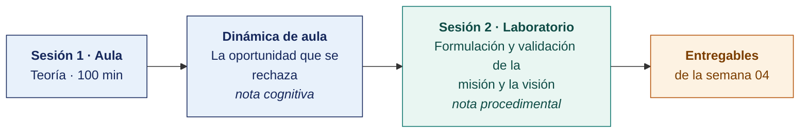

  
  &nbsp;&nbsp;&nbsp;&nbsp;&nbsp;&nbsp;
  

  <strong>Universidad Privada de Tacna</strong> 
  Facultad de Ingeniería · Escuela Profesional de Ingeniería de Sistemas

<h1 align="center">Semana 04 · Misión y Visión · Construcción y Evaluación</h1>

  <strong>SI-886 · Planeamiento Estratégico de TI</strong> 
  4 horas académicas de 50 min · 100 min de teoría con la dinámica incluida en aula · 100 min de taller en laboratorio

---

## Datos de la asignatura

| | |
|---|---|
| **Asignatura** | SI-886 · Planeamiento Estratégico de TI |
| **Escuela** | Escuela Profesional de Ingeniería de Sistemas |
| **Ciclo** | VIII · 04 horas semanales · 03 créditos · Obligatorio |
| **Unidad** | I — Fundamentos de Planeamiento Estratégico |
| **Semana** | 04 de 17 |
| **Duración** | 4 horas académicas de 50 min · 100 min de teoría con la dinámica incluida en aula · 100 min de taller en laboratorio |
| **Resultados de aprendizaje** | **RA1** Aplica la dirección estratégica, definiendo la misión y visión · **RA2** Desarrolla el análisis FODA |

### Lo que indica el sílabo

**Contenido conceptual.** Misión y Visión.

**Contenido procedimental.** Formula Misión y Visión del PETI (Plan Estratégico de Tecnologías de Información) revisado.

## Materiales de esta semana

| | Documento | Qué encontrarás | Dónde y cuánto dura |
|---|---|---|---|
| 1 | **[Teoría](1-TEORIA.md)** | La misión y por qué existe la organización · La visión y hacia dónde va la organización · El proceso participativo de formulación | Aula · 100 min |
| 2 | **[Dinámica de aula](2-DINAMICA.md)** | La mesa de la oportunidad, con su material, su ejemplo resuelto y su rúbrica | Aula · dentro de los 100 min de la sesión de teoría |
| 3 | **[Taller de laboratorio](3-TALLER.md)** | Evaluación de la misión y la visión de una empresa real del sector tecnológico, y derivación de la visión de TI | Laboratorio · 100 min |

## Ruta de la semana

## Entregables

| Entregable | Formato y nombre del archivo | Vence |
|---|---|---|
| **Dinámica de aula** · La mesa de la oportunidad | PDF desde la [plantilla de dinámica](../PLANTILLAS/SI886-PLANTILLA-DINAMICA.docx) · `SI886-S04-DINAMICA-Grupo<N>.pdf` | Hasta 24 h después de la sesión de teoría |
| **Informe del taller de laboratorio N.º 04** | PDF en formato EPIS desde la [plantilla de taller](../PLANTILLAS/SI886-PLANTILLA-TALLER.docx) · `SI886-S04-TALLER-Grupo<N>.pdf` | 48 h después del taller |
| Secciones 2.1 y 2.2 del PETI · etiqueta `v0.4` | Commit en Git | 48 h después del laboratorio |

> Ambos se entregan en **PDF**, con la carátula de la UPT y los códigos de todos los integrantes. Las plantillas obligatorias están en [`PLANTILLAS/`](../PLANTILLAS/).

## Cómo se evalúa

| Criterio | Instrumento | Peso |
|---|---|---|
| Cognitivo | Rúbrica de «Cirugía de misión» + exposición de 10 min en la Semana 05 | 25 % |
| Procedimental | Lista de cotejo de los 13 resultados del laboratorio | 35 % |
| Actitudinal | Cita literal de las declaraciones con su fuente y su fecha, y respeto por la decisión de la empresa sobre su propia identidad | 15 % |

## Preparación para la Semana 05

- **Leer.** López Posada, *Cultura organizacional: entre el individualismo y el colectivismo* — capítulos iniciales.
- Revisar el **Competing Values Framework** de Cameron y Quinn. Los cuatro tipos de cultura organizacional.
- Revisar quién decide y cómo se decide en la organización, a partir de sus documentos y de su estructura. La Semana 05 parte de ahí para diagnosticar la cultura.
- Recopilar los valores declarados de la organización, si existen, con su documento de aprobación.

---

**Docente** · Dr. Oscar Juan Jimenez Flores
[oscarjimenezflores@upt.pe](mailto:oscarjimenezflores@upt.pe) · [LinkedIn](https://www.linkedin.com/in/oscar-jimenez-flores/) · [CTI Vitae — CONCYTEC](https://ctivitae.concytec.gob.pe/appDirectorioCTI/VerDatosInvestigador.do?id_investigador=33398)

Escuela Profesional de Ingeniería de Sistemas · Universidad Privada de Tacna · Tacna, Perú
