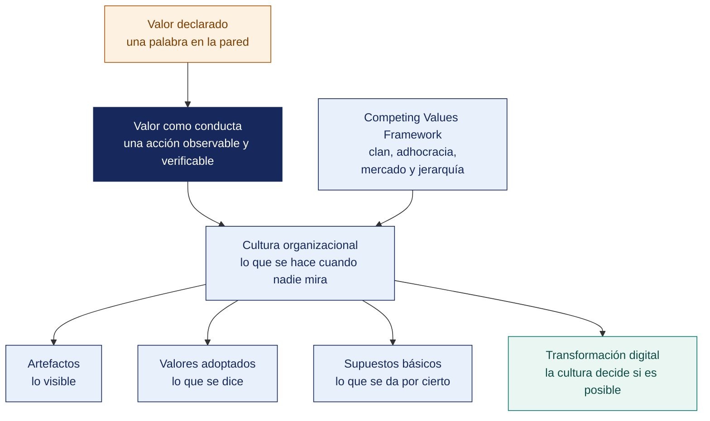

[Semana 05](README.md) · **Teoría** · [Dinámica de aula](2-DINAMICA.md) · [Taller de laboratorio](3-TALLER.md)

# Teoría · Valores Organizacionales · Cultura Organizacional

**SI-886 · Planeamiento Estratégico de TI** · Semana 05 · Sesión 1 en aula · 2 horas académicas, 100 min, con la dinámica incluida

> ¿Un término no le resulta claro? Está definido en el [glosario técnico del curso](../GLOSARIO.md).

---

## La pregunta de esta sesión

Una organización declara la innovación entre sus valores. Lo tiene en su web, en la recepción y en la inducción del personal.

En los últimos tres años, dos jefes fueron sancionados por errores en proyectos nuevos y ninguno fue reconocido por intentarlos. Todo el mundo lo sabe y nadie lo dice. El plan de transformación digital que se acaba de aprobar asume que el personal adoptará las herramientas nuevas con entusiasmo.

> **La pregunta que ordena esta sesión.** *¿Por qué un plan técnicamente correcto puede fracasar por completo en la implantación?*

## Antes de empezar

| Lo que necesita traer | De dónde sale |
|---|---|
| La misión, la visión y sus pruebas de calidad | Semana 04 |
| La postura de TI y los niveles de la estrategia | Semana 02 |
| Los instrumentos de planeamiento de la organización | Semana 03 |
| Ningún modelo de cultura organizacional | Se introduce hoy |

> **Exploración (5 min), antes de cualquier definición.** El aula responde antes de la teoría y se anota. *¿Se adoptarán las herramientas nuevas? ¿Qué gobierna en esa organización, lo que declara o lo que hace? ¿Cómo lo comprobaría usted?* No se corrige nada todavía.

## Distribución del tiempo

| Momento | Minutos |
|---|---|
| El caso del valor declarado y la exploración inicial | 8 |
| **Bloque 1.** De los valores declarados a la conducta observable · con su microaplicación | 20 |
| **Bloque 2.** La cultura organizacional y la conducta real | 17 |
| **Bloque 3.** Cultura y transformación digital | 10 |
| Exposición de avance de la Unidad I | 5 |
| Cierre, respuesta a la pregunta de la sesión y puente a la dinámica | 5 |
| **Total de la sesión de aula** | **65** |

## Mapa de la sesión



---

## Bloque 1 · De los valores declarados a la conducta observable

> **La pregunta del bloque.** *¿Qué convierte una palabra en un valor que orienta decisiones?*

**El problema de los valores declarados.** Prácticamente todas las organizaciones declaran los mismos — honestidad, respeto, trabajo en equipo, innovación, compromiso, excelencia. Al ser universales, **no orientan ninguna decisión**. Un valor que nadie podría rechazar públicamente no distingue nada.

**Qué convierte una palabra en un valor operativo.** Un valor sirve cuando cumple tres condiciones:

| Condición | Qué significa | Prueba |
|---|---|---|
| **Es costoso** | Sostenerlo implica renunciar a algo | ¿Alguna vez perdimos dinero por sostenerlo? |
| **Es conductual** | Se expresa como conducta observable, no como sustantivo | ¿Puedo describir qué hace alguien que lo cumple y qué hace alguien que lo viola? |
| **Es exigible** | Su incumplimiento tiene consecuencia | ¿Alguien fue corregido o desvinculado por violarlo? |

**Reformulación de sustantivo a conducta.**

| Valor declarado (sustantivo) | Reformulación conductual (operativa) |
|---|---|
| Honestidad | «Informamos al cliente el retraso apenas lo conocemos, aunque perdamos la venta» |
| Transparencia | «Publicamos nuestros precios y condiciones sin diferenciarlos por cliente» |
| Innovación | «Reservamos el 10 % del tiempo del equipo técnico a experimentar, aunque el mes esté cargado» |
| Trabajo en equipo | «Ningún proyecto se aprueba sin el visto bueno del área que lo operará» |
| Compromiso con el cliente | «Respondemos toda solicitud en 24 horas, incluso para decir que no podemos» |
| Seguridad de la información | «No se despliega a producción sin revisión de un segundo par de ojos, aunque sea urgente» |

**Los valores en el contexto de TI.** El PETI (Plan Estratégico de Tecnologías de Información) necesita valores que gobiernen las decisiones tecnológicas, porque son las que generan tensión entre velocidad y control:

| Tensión típica | Valor que la resuelve |
|---|---|
| Salir rápido vs. salir seguro | «Ninguna funcionalidad llega a producción sin prueba de seguridad, aunque retrase el lanzamiento» |
| Comprar vs. construir | «Compramos lo que no nos diferencia; construimos solo lo que sí» |
| Dato como activo vs. dato como propiedad del área | «Los datos son de la organización; ningún área los retiene» |
| Comodidad del usuario vs. protección del dato personal | «Recogemos el mínimo dato necesario para el servicio, y lo justificamos» |
| Dependencia de proveedor vs. costo | «Toda decisión tecnológica debe tener una salida documentada» |

> **El error frecuente del bloque.** Aceptar los valores declarados como insumo del plan. Honestidad, respeto, trabajo en equipo, innovación y compromiso los declara casi todo el mundo, y por ser universales **no orientan ninguna decisión**. Un valor que nadie podría rechazar en público no distingue nada y no sirve para resolver una tensión tecnológica.

## Bloque 2 · La cultura organizacional y la conducta real

> **La pregunta del bloque.** *Cuando lo declarado y lo real se contradicen, ¿qué gobierna?*

**Definición.** La cultura es el conjunto de **supuestos básicos compartidos** que un grupo aprendió al resolver sus problemas, que funcionaron lo bastante bien para considerarse válidos y que se enseñan a los nuevos como la manera correcta de percibir, pensar y sentir.

**Los tres niveles de Schein** —el modelo que explica por qué cambiar la cultura es difícil:

| Nivel | Qué es | Visibilidad | Ejemplos |
|---|---|---|---|
| **Artefactos** | Lo observable — oficinas, vestimenta, rituales, lenguaje, tecnología | Visible pero difícil de descifrar | Sala de reuniones, herramientas usadas, cómo se llaman entre sí |
| **Valores adoptados** | Lo que la organización declara creer | Semiconsciente | Misión publicada, código de conducta |
| **Supuestos básicos** | Lo que se da por evidente y nadie discute | Invisible, inconsciente | «Aquí las decisiones las toma el dueño», «pedir permiso es más seguro que pedir perdón» |

> **La brecha reveladora.** Cuando los valores adoptados y los supuestos básicos se contradicen, **gobiernan los supuestos**. Una organización que declara «innovación» pero cuyo supuesto básico es «el error se castiga» no innovará, por muchos talleres que realice. **Detectar esa brecha es el objetivo del diagnóstico de cultura del PETI.**

**El Competing Values Framework (Cameron y Quinn).** Clasifica la cultura en cuatro tipos según dos ejes. **Flexibilidad vs. control** y **foco interno vs. foco externo**.

```
                      FLEXIBILIDAD
                            │
         CLAN               │           ADHOCRACIA
   Colaborar                │        Crear
   Familia extendida        │        Emprendedora, dinámica
   Cohesión, desarrollo     │        Innovación, riesgo
   de las personas          │        Ser el primero
                            │
  FOCO INTERNO ─────────────┼───────────────── FOCO EXTERNO
                            │
       JERARQUÍA            │           MERCADO
   Controlar                │        Competir
   Estructurada, formal     │        Orientada a resultados
   Procedimientos,          │        Metas, competitividad
   estabilidad, eficiencia  │        Cuota, rentabilidad
                            │
                        CONTROL
```

**Consecuencia para el PETI** —esta es la razón por la que el diagnóstico de cultura pertenece al plan:

| Cultura dominante | Cómo se comporta ante un proyecto de TI | Qué debe hacer el PETI |
|---|---|---|
| **Clan** | Adopta si el equipo participa en la decisión; rechaza lo impuesto | Diseñar cocreación, pilotos con usuarios líderes, comunicación temprana |
| **Adhocracia** | Adopta rápido, abandona rápido; múltiples herramientas paralelas | Establecer gobierno del dato y estándares; capitalizar el apetito de cambio |
| **Jerarquía** | Adopta si está normado y aprobado; el cambio informal no prospera | Formalizar por directiva, procedimiento documentado y capacitación obligatoria |
| **Mercado** | Adopta si el caso de negocio muestra resultado medible | Presentar cada proyecto con retorno, competencia y métrica de resultado |

> **El error más costoso de un PETI.** Diseñar la implantación ignorando la cultura. Un plan técnicamente impecable presentado en cultura de **jerarquía** sin directiva de respaldo, o en cultura de **clan** sin participación del equipo, fracasa en la implantación aunque el diagnóstico y la arquitectura sean correctos.

**Ejemplo trabajado — el valor declarado y la conducta observable.**

| Valor declarado | Qué se observa | Qué revela sobre la cultura | Consecuencia para el PETI |
|---|---|---|---|
| «Trabajo en equipo» | Cada área tiene su propia hoja de cálculo con los mismos datos y no los comparte | Cultura de silos | Un proyecto de integración de datos fracasará por resistencia, no por tecnología |
| «Innovación» | El último sistema nuevo se implantó en 2016 | La innovación se declara y no se financia | Los proyectos nuevos necesitarán padrino de alta dirección |
| «Orientación al cliente» | Las quejas se atienden por teléfono y no se registran | No hay medición de la experiencia | El proyecto de portal de autoservicio no tendrá línea base para demostrar mejora |
| «Transparencia» | Las decisiones de compra se toman sin acta | Concentración informal de la decisión | El modelo de priorización del PETI será resistido: quita discrecionalidad |

> **Diagnosticar cultura no es opinar sobre las personas.** Es contrastar el valor declarado con un **hecho observable y verificable**. «Aquí la gente es reacia al cambio» no es diagnóstico; «tres de los últimos cuatro proyectos se abandonaron después del piloto, según las actas» sí lo es.

> **Microaplicación (5 min) · de sustantivo a conducta.** Cada pareja toma **un valor declarado de su propia organización** y lo reformula como conducta observable, en una sola frase que empiece con un verbo. Se leen dos y se comprueba si superan las tres condiciones.

| Caso | Qué debe contener una buena respuesta |
|---|---|
| ¿Por qué un PETI debe incluir un diagnóstico de cultura? | Porque la mayoría de planes no fracasan por la tecnología. Fracasan porque la organización no adopta lo que se implanta. Eso es previsible y se mitiga |
| ¿Cómo se evidencia la cultura sin encuestas? | Con hechos actas, tasa de abandono de proyectos, existencia de procedimientos escritos, si las decisiones dejan rastro |
| Si la cultura es adversa al cambio, ¿se recomienda no hacer el proyecto? | No. Se recomienda gestión del cambio como parte del proyecto, con presupuesto propio, y se ajusta el plazo con realismo |
> **El error frecuente del bloque.** Creer que la cultura se cambia con comunicación. Cuando los valores adoptados y los supuestos básicos se contradicen, **gobiernan los supuestos**, y estos no se modifican con talleres ni con carteles. Detectar esa brecha es el objetivo del diagnóstico de cultura, no cerrarla durante el semestre.

## Bloque 3 · Cultura y transformación digital

> **La pregunta del bloque.** *¿Cómo cambia el plan según el tipo de cultura que tenga la organización?*

**Los cinco supuestos básicos que bloquean cualquier PETI**, y cómo se detectan:

| Supuesto bloqueante | Cómo se manifiesta | Señal detectable en el diagnóstico |
|---|---|---|
| «Los datos son de mi área» | Cada área tiene su base y no la comparte | Múltiples fuentes de verdad para el mismo dato |
| «Si funciona, no se toca» | Sistemas fuera de soporte en producción | Alta antigüedad promedio de los sistemas críticos |
| «TI es el área que arregla impresoras» | TI no participa en decisiones de negocio | TI ausente en comités; presupuesto asignado por Administración |
| «El error se castiga» | Nadie propone cambios ni reporta incidentes | Registro de incidentes anormalmente bajo |
| «Aquí las cosas se hacen así» | Los procesos no se documentan porque «todos saben» | Ausencia de procedimientos; dependencia de personas |

**Cultura digital. Los rasgos que habilitan.** No se trata de que la gente use tecnología, sino de cinco rasgos observables — **decisión basada en datos** (se pide el dato antes de opinar), **iteración** (se prueba en pequeño antes de escalar), **colaboración transversal** (los equipos cruzan áreas), **orientación al usuario final** (se pregunta a quien usará el sistema) y **tolerancia al error controlado** (se reporta el incidente sin temor).

**Gestión del cambio.** Todo proyecto del portafolio (Sección 7) debe incluir su componente de cambio — **quién pierde algo** con este proyecto —poder, control, rutina, tiempo— es la pregunta que anticipa la resistencia. Un proyecto sin perdedores identificados suele ser un proyecto mal analizado.

## Exposición de avance de la Unidad I

Cada equipo expone el avance de su producto ante el aula y el docente. **6 minutos por equipo**, 10 equipos, sin margen. Se corta al minuto seis.

| Momento | Duración | Qué se muestra |
|---|---|---|
| Qué se propuso el equipo para esta unidad | 1 min | El objetivo declarado al inicio de la unidad |
| **Lo construido, funcionando** | 3 min | Producto real, no diapositivas de lo que se piensa hacer |
| Lo que no se logró y por qué | 1 min | Con honestidad. Ocultarlo cuesta más que declararlo |
| Preguntas | 1 min | Del docente |

> **Se evalúa el avance verificable, no la presentación.** Un equipo que muestra poco pero real puntúa por encima de uno que muestra mucho y no lo tiene.

> **Por qué se expone en la Semana 05 y no en la 06.** El sílabo asigna a la Semana 06 contenido propio, y sus 100 minutos de aula se reparten entre esa teoría y el examen teórico de la unidad. La exposición de avance se adelanta una semana.

## Cierre · qué se lleva de aquí

**La respuesta a la pregunta con la que abrimos.** Porque el plan supuso una conducta que la organización no tiene. El valor declarado decía innovación y el supuesto básico decía que **el error se castiga**, y ante esa contradicción gobierna el supuesto. Un plan de transformación digital que no diagnostica la cultura está apostando a que las personas se comporten como dice el cartel de la recepción.

**Las tres ideas que deben quedar.**

| Idea | Por qué importa en el ejercicio profesional |
|---|---|
| Un valor sirve cuando es costoso, conductual y exigible | Sin las tres condiciones es una palabra que no resuelve ninguna tensión de decisión |
| Cuando lo declarado y lo real se contradicen, gobiernan los supuestos básicos | Y por eso el diagnóstico de cultura busca la brecha, no la declaración |
| El tipo de cultura determina cómo se implanta el plan, no si se implanta | Una cultura jerárquica adopta por directiva y una de clan por participación; ignorarlo es planificar el rechazo |

**Volviendo a la exploración del inicio.** Se releen las respuestas del inicio. La mayoría predice que las herramientas no se adoptarán, y acierta. Lo que casi nadie explicita es **cómo lo comprobaría antes de escribir el plan**, y esa es la parte que el diagnóstico de cultura convierte en método.

**Lo que sigue.** La [dinámica de esta sesión](2-DINAMICA.md) trabaja sobre la distancia entre lo que la organización declara y lo que hace. Y esta semana se expone el avance de la Unidad I, con el producto real a la vista.


**Pregunta de cierre.** *¿cuál es el supuesto básico de esta organización que ningún proyecto del PETI logrará cambiar en tres años?* Reconocerlo y diseñar el plan **alrededor** de él es más eficaz que ignorarlo y chocar con él.
---

---

[Semana 05](README.md) · **Teoría** · [Dinámica de aula](2-DINAMICA.md) · [Taller de laboratorio](3-TALLER.md)

---

**Docente** · Dr. Oscar Juan Jimenez Flores
[oscarjimenezflores@upt.pe](mailto:oscarjimenezflores@upt.pe) · [LinkedIn](https://www.linkedin.com/in/oscar-jimenez-flores/) · [CTI Vitae — CONCYTEC](https://ctivitae.concytec.gob.pe/appDirectorioCTI/VerDatosInvestigador.do?id_investigador=33398)

Escuela Profesional de Ingeniería de Sistemas · Universidad Privada de Tacna · Tacna, Perú
