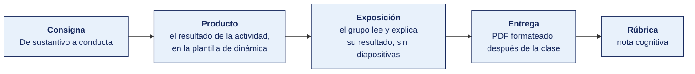

[Semana 05](README.md) · [Teoría](1-TEORIA.md) · **Dinámica de aula** · [Taller de laboratorio](3-TALLER.md)

# Dinámica de aula · El valor que llegó a los titulares

**SI-886 · Planeamiento Estratégico de TI** · Semana 05 · Actividad en aula, **dentro de los 100 min de la sesión de teoría** · calificación **cognitiva**

> ¿Un término no le resulta claro? Está definido en el [glosario técnico del curso](../GLOSARIO.md).

---

## Cómo funciona la actividad

## Qué entregas

| | |
|---|---|
| **Archivo** | `SI886-S05-DINAMICA-Grupo<N>.pdf` |
| **Plantilla obligatoria** | [SI886-PLANTILLA-DINAMICA.docx](../PLANTILLAS/SI886-PLANTILLA-DINAMICA.docx) |
| **Formato** | PDF exportado desde la plantilla en Word, con la carátula de la UPT y los apellidos, nombres y códigos de todos los integrantes |
| **Qué va dentro** | Lo que el grupo resolvió en aula. Las tablas de la sección **Producto** van completas, con los textos redactados, y cada decisión va justificada |
| **Dónde se sube** | Aula virtual, tarea «Dinámica · Semana 05» |
| **Cuándo vence** | Hasta 24 h después de la sesión de teoría. La tabla se resuelve en aula; el PDF se formatea y se sube después |
| **Exposición** | En la ronda de cierre de **esta misma sesión**. El grupo **lee y explica su resultado** ante el aula, con el documento a la vista. No se usan diapositivas |

> No se califica un trabajo entregado en `.docx`, sin carátula, sin los códigos de los integrantes o con las tablas del producto vacías.

---

## Consigna

> **«El valor que llegó a los titulares»**
> Una empresa tecnológica declara un valor en su portal. Una decisión de producto suya terminó afectando a personas que no son sus clientes ni sus trabajadores. El directorio pide explicaciones.

| | |
|---|---|
| **Su papel** | Comité de dirección de esa empresa. **Un integrante representa a los afectados** que no son clientes ni trabajadores, y tiene derecho a hablar en cada bloque |
| **Misión** | Determinar **hasta dónde llega de verdad esa tecnología**, dentro y fuera del país, y decidir si el valor declarado se sostiene, se reescribe o se retira |
| **Restricción** | Todo alcance que se afirme va **con una cifra**. Y hay que nombrar a alguien afectado que **no sea cliente ni trabajador**, o el análisis no está completo |

De la teoría de hoy. Un valor no es un sustantivo en una pared, es **una conducta observable que cuesta algo**. Y una tecnología no termina en su usuario — llega a terceros que nunca la eligieron.

> **Esta dinámica es evidencia de acreditación.** Con ella se mide el atributo **AG-I01 · El Profesional y el Mundo**, criterio **CD1**, sobre el PDF que el grupo sube al aula virtual. Se califica con la rúbrica institucional de 1 a 4, que está al final de esta página, y **no afecta la nota del curso**.

## Cómo se desarrolla · 35 minutos

| | Bloque | Quién | Minutos |
|---|---|---|---|
| **1** | **El alcance.** A quién llega esa tecnología **en el país** y a quién **fuera**. Dos cifras, tomadas de la ficha | Equipo | 9 |
| **2** | **El tercero.** Quién resultó afectado sin ser cliente ni trabajador, y qué perdió. Aquí habla el integrante que los representa | Equipo | 9 |
| **3** | **El valor frente a lo ocurrido.** Se contrasta lo que la empresa declara con lo que hizo, y el comité decide si el valor se sostiene, se reescribe o se retira | Equipo | 9 |
| **4** | **Ronda en aula.** Tres equipos leen a quién afectó su tecnología sin que esa persona la eligiera | Todos | 8 |

## Material de trabajo

Cada equipo recibe **una ficha de empresa tecnológica**. Todas traen lo mismo — qué declara la empresa, qué opera, a cuánta gente llega dentro y fuera del país, qué decisión tomó y a quién terminó afectando.

**Los casos están tipificados**, construidos sobre situaciones que se repiten en el sector. No se nombra ninguna empresa real, y las cifras son de orden de magnitud verosímil.

**Reparto.** Una ficha por equipo, asignada al empezar. No se reparte la misma dos veces.

### Ficha 1 · Plataforma de reparto a domicilio

> **Declara.** «Conectamos personas y oportunidades con tecnología que dignifica el trabajo.»
> **Opera.** Aplicación de reparto en 14 ciudades del país y en 6 países de la región.
> **Alcance.** 380 000 usuarios activos en el país · 41 000 repartidores registrados · 4,2 millones de usuarios en la región.
> **La decisión.** El algoritmo de asignación pasó a priorizar por tiempo de respuesta. Los repartidores con moto propia reciben el 78 % de los pedidos; los de bicicleta, el 22 %.
> **Lo que ocurrió.** Los repartidores en bicicleta, que son el 40 % del padrón, vieron caer su ingreso a la mitad en dos meses. No son trabajadores de la empresa, son independientes registrados.

### Ficha 2 · Fintech de crédito por evaluación automática

> **Declara.** «Democratizamos el acceso al crédito con inteligencia artificial.»
> **Opera.** Evaluación crediticia automática para créditos de hasta S/ 8 000, sin historial bancario.
> **Alcance.** 210 000 créditos otorgados en el país · presencia en 3 países · el modelo se entrena con datos de los 3.
> **La decisión.** El modelo incorporó la zona de residencia como variable, porque mejoraba la predicción de mora.
> **Lo que ocurrió.** Las solicitudes de tres distritos periféricos pasaron a ser rechazadas en el 71 % de los casos, frente al 34 % del promedio. Los rechazados no reciben explicación, porque el modelo no la produce.

### Ficha 3 · Sistema de reconocimiento facial para control de acceso

> **Declara.** «Seguridad para todos, sin fricción.»
> **Opera.** Control de acceso por rostro en centros comerciales, condominios y una universidad.
> **Alcance.** 96 instalaciones en el país · el proveedor del modelo es extranjero y los rostros se procesan en servidores fuera del país.
> **La decisión.** Se activó la comparación contra una lista de personas vetadas, compartida entre todos los clientes del sistema.
> **Lo que ocurrió.** Una persona quedó vetada en los 96 recintos por un incidente en uno solo. No hay procedimiento para saber quién la incluyó ni para salir de la lista.

### Ficha 4 · Plataforma educativa con analítica de aprendizaje

> **Declara.** «Ponemos la tecnología al servicio del aprendizaje de cada estudiante.»
> **Opera.** Aula virtual con seguimiento de actividad para 40 instituciones educativas.
> **Alcance.** 118 000 estudiantes en el país · la plataforma es de una casa matriz con 9 millones de usuarios en el mundo.
> **La decisión.** Se habilitó un tablero que muestra a cada docente el tiempo de conexión de cada estudiante y su hora de actividad.
> **Lo que ocurrió.** Los estudiantes que estudian de madrugada porque trabajan de día empezaron a recibir observaciones por «hábitos irregulares». El dato también lo ven las familias.

### Ficha 5 · Marketplace de comercio local

> **Declara.** «Impulsamos al pequeño comerciante peruano.»
> **Opera.** Catálogo en línea con 22 000 vendedores y logística propia.
> **Alcance.** 1,8 millones de compradores en el país · la matriz opera en 8 países.
> **La decisión.** El buscador pasó a ordenar por probabilidad de compra, calculada con el histórico de la plataforma en los 8 países.
> **Lo que ocurrió.** Los vendedores nuevos y los de provincia, sin histórico, dejaron de aparecer en las tres primeras pantallas. El 60 % de las ventas ocurre en esas tres pantallas.

### Ficha 6 · Aplicación de salud con teleconsulta

> **Declara.** «Salud accesible para todos, en cualquier lugar.»
> **Opera.** Teleconsulta y receta digital, con convenio con dos aseguradoras.
> **Alcance.** 74 000 consultas al año en el país · la infraestructura de video es de un proveedor global.
> **La decisión.** La receta digital solo se acepta en las farmacias de la cadena aliada.
> **Lo que ocurrió.** Los pacientes de distritos donde esa cadena no tiene local reciben una receta que ninguna botica de su zona acepta. Son 11 de los 43 distritos atendidos.

### Ficha 7 · Sistema municipal de videovigilancia con analítica

> **Declara.** «Ciudades más seguras con datos abiertos y transparencia.»
> **Opera.** 340 cámaras con detección automática de aglomeraciones y de placas.
> **Alcance.** Un distrito de 180 000 habitantes · el software es de un proveedor extranjero que retiene una copia de los eventos para mejorar su modelo.
> **La decisión.** Se activó la alerta automática por aglomeración, que notifica al serenazgo.
> **Lo que ocurrió.** Las alertas se concentran en dos zonas de comercio ambulante. Los comerciantes ambulantes no son vecinos registrados ni usuarios del sistema, y nadie les informó de la analítica.

### Ficha 8 · Plataforma de gestión de residuos con ruteo optimizado

> **Declara.** «Tecnología para una ciudad sostenible.»
> **Opera.** Optimización de rutas de recolección para tres municipalidades.
> **Alcance.** 420 000 habitantes cubiertos · el motor de optimización es un servicio en la nube facturado por consulta.
> **La decisión.** El algoritmo optimiza kilómetros recorridos y combustible.
> **Lo que ocurrió.** Las rutas se reordenaron y tres asentamientos en pendiente, de acceso difícil, pasaron de recolección diaria a dos veces por semana. Reducen kilómetros, y ahí vive gente.

### Ficha 9 · Software de gestión agrícola con imágenes satelitales

> **Declara.** «Ponemos la agricultura de precisión al alcance del pequeño productor.»
> **Opera.** Recomendación de riego y fertilización a partir de imágenes satelitales.
> **Alcance.** 2 400 productores en el país · las imágenes y el modelo provienen de un consorcio internacional.
> **La decisión.** El servicio pasó a requerir un lote mínimo de 5 hectáreas para que la recomendación fuera fiable.
> **Lo que ocurrió.** El 68 % de los productores de la zona tiene menos de 3 hectáreas y quedó fuera. La empresa sigue anunciándose como servicio para el pequeño productor.

### Ficha 10 · Pasarela de pagos con verificación de identidad

> **Declara.** «Inclusión financiera sin barreras.»
> **Opera.** Cobros en línea con verificación de identidad por documento y selfi.
> **Alcance.** 9 600 comercios en el país · la verificación la resuelve un proveedor con operación en 30 países.
> **La decisión.** Se elevó el umbral de coincidencia del rostro para reducir el fraude.
> **Lo que ocurrió.** Las personas adultas mayores y quienes tienen el documento deteriorado fallan la verificación en el 23 % de los intentos, frente al 4 % del resto. No hay canal alternativo.

## Producto

**El acta del comité.** Es la evidencia que se sube al aula virtual.

| | Contenido |
|---|---|
| **Alcance local** | A quién llega la tecnología en el Perú o en la región, **con una cifra de la ficha** |
| **Alcance global** | A quién llega fuera del país, **con una cifra de la ficha** |
| **El tercero afectado** | Quién resultó afectado sin ser cliente ni trabajador, y qué perdió concretamente |
| **El marco que aplica** | La norma o el derecho que entra en juego, nombrado. Si no hay ninguno, se dice y eso también es un hallazgo |
| **El valor frente a lo ocurrido** | La frase declarada, lo que la empresa hizo, y en qué se contradicen |
| **La decisión del comité** | Se sostiene, se reescribe o se retira. Si se sostiene o se reescribe, **con su conducta observable** |
| **Nuestros tres valores** | Para la organización del equipo. **Uno de los tres compromete una dimensión social**, y dice a qué renuncia la organización al sostenerlo |

> **Dónde va.** Este producto se presenta en la **sección 2 de la [plantilla de dinámica](../PLANTILLAS/SI886-PLANTILLA-DINAMICA.docx)**, «El producto». No se copia la consigna ni la teoría. Solo el resultado y lo que lo sostiene.

## Ejemplo resuelto

*El caso de este ejemplo es distinto del que le toca a tu grupo. Sirve para que veas el nivel de detalle que se espera, no para copiarlo.*

**La ficha.** Aplicación de transporte urbano por conductores independientes.

> **Declara.** «Movemos la ciudad de forma justa para todos.»
> **Opera.** Aplicación de viajes en 9 ciudades del país y en 4 países de la región.
> **Alcance.** 640 000 pasajeros activos en el país · 52 000 conductores independientes · 7 millones de pasajeros en la región.
> **La decisión.** Se activó el precio dinámico por demanda, con un tope de 3,5 veces la tarifa base.
> **Lo que ocurrió.** En las dos noches de un paro de transporte público, la tarifa llegó al tope en los distritos periféricos, donde no había alternativa. En el centro, con buses circulando, se mantuvo baja.

**El acta del comité.**

| | Contenido |
|---|---|
| **Alcance local** | 640 000 pasajeros y 52 000 conductores en 9 ciudades del país |
| **Alcance global** | 7 millones de pasajeros en 4 países de la región, con el mismo algoritmo de precio |
| **El tercero afectado** | **El vecino del distrito periférico que no usa la aplicación.** Cuando el paro dejó sin buses su zona, quien no tenía la app ni tarjeta pagó en efectivo a un informal, o no se movió. No es cliente y la decisión le cambió el precio de moverse |
| **El marco que aplica** | El Código de Protección y Defensa del Consumidor, en lo relativo a información previa del precio. No existe norma sectorial que regule el precio dinámico en transporte por aplicación, **y esa ausencia es parte del hallazgo** |
| **El valor frente a lo ocurrido** | Declara *«de forma justa para todos»*. El algoritmo cobró más justamente donde había menos alternativas. La justicia declarada opera al revés de como se anuncia |
| **La decisión del comité** | **Se reescribe.** Conducta observable — *«el multiplicador se congela en 1,0 en los distritos donde el transporte público esté interrumpido, desde la primera hora del evento»*. Cuesta el ingreso de esas noches, que es exactamente el precio del valor |
| **Nuestros tres valores** | Para la distribuidora del equipo. ① «Ningún pedido se cierra sin que la bodega vea el precio final antes de confirmar» ② «El dato de la bodega no se comparte con terceros, ni siquiera agregado» ③ **Social** — «La ruta de reparto cubre las zonas de acceso difícil con la misma frecuencia que el resto, aunque el kilómetro salga más caro». **A qué renunciamos**, a unos S/ 30 000 anuales de ahorro en combustible |

**Por qué el tercero no es el conductor.** El conductor está registrado en la plataforma y acepta sus condiciones. El vecino que no tiene la aplicación **nunca la eligió** y aun así la decisión de esa empresa le cambió lo que le cuesta llegar a su casa. Ese es el alcance que el atributo pide reconocer.

**La diferencia entre aprobar y no aprobar**

| Así no | Así sí |
|---|---|
| «La app llega a muchos usuarios en varios países.» | «640 000 pasajeros en el país y 7 millones en la región, con el mismo algoritmo.» |
| «Afecta a los conductores.» | «Afecta al vecino sin la app, que nunca la eligió y pagó más por moverse.» |
| «El valor no se cumple.» | «Declara justicia para todos y el algoritmo cobró más donde había menos alternativas.» |
| «Nuestro valor es la responsabilidad social.» | «La ruta cubre las zonas de acceso difícil con la misma frecuencia, y eso nos cuesta S/ 30 000 al año.» |

## Reglas

- 35 min en aula, dentro de la sesión de teoría.
- **Todo alcance va con cifra.** «Llega a mucha gente» no es un alcance.
- El tercero afectado **no puede ser cliente ni trabajador** de la empresa. Si el equipo no encuentra ninguno, tiene que decir por qué no lo hay.
- Una conducta observable se reconoce porque **alguien podría verificar que ocurrió**. «Ser responsables» no se verifica.
- Los tres valores propios **no se copian** del caso.
- La exposición es la ronda de cierre de esta misma sesión. El grupo **lee y explica su resultado**. No se usan diapositivas.

## Rúbrica cognitiva (20 puntos)

**Se califica dos veces, y son independientes.** Abajo, la rúbrica del curso, que da la nota. Y la **rúbrica institucional AG-I01**, que **no afecta la nota** y solo alimenta el registro de acreditación.

| Criterio | 5 | 3 | 1 |
|---|---|---|---|
| **El alcance con cifras** | Local y global, ambos con su cifra tomada de la ficha | Uno de los dos con cifra | Alcance afirmado sin cifra |
| **El tercero afectado** | Identificado, con lo que perdió y el marco legal o el derecho que entra en juego | Identificado sin marco ni pérdida concreta | No se sale del cliente y el trabajador |
| **La contradicción** | Se cita la frase declarada y el hecho que la contradice, sin adorno | Se señala la contradicción sin citar | Se acepta el valor tal como está declarado |
| **Los valores propios** | Los tres como conducta observable, y uno compromete una dimensión social con su renuncia declarada | Dos completos | Sustantivos sin conducta |

### Rúbrica institucional AG-I01 · CD1 · escala 1 a 4

Se aplica sobre el mismo PDF, sin trabajo adicional para el grupo.

| 1 · Inicio | 2 · En proceso | 3 · Logrado | 4 · Destacado |
|---|---|---|---|
| No identifica el alcance local ni global de la tecnología en la sociedad | Identifica el alcance de forma parcial o imprecisa, o solo en una de las dos escalas | **Explica el alcance local y global con cifras, e identifica a un tercero afectado que no es cliente ni trabajador** | Además relaciona el alcance con el marco legal o el derecho aplicable, y lo traslada a los valores de su propia organización |

> **El nivel de logro esperado** es que **al menos el 65 % de los estudiantes** alcance nivel 3 o superior.

---

---

[Semana 05](README.md) · [Teoría](1-TEORIA.md) · **Dinámica de aula** · [Taller de laboratorio](3-TALLER.md)

---

**Docente** · Dr. Oscar Juan Jimenez Flores
[oscarjimenezflores@upt.pe](mailto:oscarjimenezflores@upt.pe) · [LinkedIn](https://www.linkedin.com/in/oscar-jimenez-flores/) · [CTI Vitae — CONCYTEC](https://ctivitae.concytec.gob.pe/appDirectorioCTI/VerDatosInvestigador.do?id_investigador=33398)

Escuela Profesional de Ingeniería de Sistemas · Universidad Privada de Tacna · Tacna, Perú
