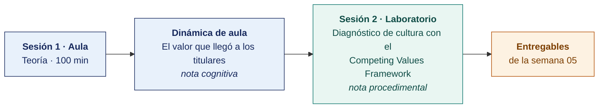

  
  &nbsp;&nbsp;&nbsp;&nbsp;&nbsp;&nbsp;
  

  <strong>Universidad Privada de Tacna</strong> 
  Facultad de Ingeniería · Escuela Profesional de Ingeniería de Sistemas

<h1 align="center">Semana 05 · Valores Organizacionales · Cultura Organizacional</h1>

  <strong>SI-886 · Planeamiento Estratégico de TI</strong> 
  4 horas académicas de 50 min · 100 min de teoría con la dinámica incluida en aula · 100 min de taller en laboratorio

---

## Datos de la asignatura

| | |
|---|---|
| **Asignatura** | SI-886 · Planeamiento Estratégico de TI |
| **Escuela** | Escuela Profesional de Ingeniería de Sistemas |
| **Ciclo** | VIII · 04 horas semanales · 03 créditos · Obligatorio |
| **Unidad** | I — Fundamentos de Planeamiento Estratégico |
| **Semana** | 05 de 17 |
| **Duración** | 4 horas académicas de 50 min · 100 min de teoría con la dinámica incluida en aula · 100 min de taller en laboratorio |
| **Resultados de aprendizaje** | **RA1** Aplica la dirección estratégica, definiendo la misión y visión · **RA2** Desarrolla el análisis FODA |

### Lo que indica el sílabo

**Contenido conceptual.** Valores organizacionales. Cultura organizacional.

**Contenido procedimental.** Revisa el plan estratégico institucional, relaciona con los planes y analiza su estructura. Redacción de valores en empresas tecnológicas.

## Materiales de esta semana

| | Documento | Qué encontrarás | Dónde y cuánto dura |
|---|---|---|---|
| 1 | **[Teoría](1-TEORIA.md)** | De los valores declarados a la conducta observable · La cultura organizacional y la conducta real · Cultura y transformación digital | Aula · 100 min |
| 2 | **[Dinámica de aula](2-DINAMICA.md)** | El valor que llegó a los titulares, con su material, su ejemplo resuelto y su rúbrica | Aula · dentro de los 100 min de la sesión de teoría |
| 3 | **[Taller de laboratorio](3-TALLER.md)** | Diagnóstico de cultura con el Competing Values Framework | Laboratorio · 100 min |

## Ruta de la semana

## Entregables

| Entregable | Formato y nombre del archivo | Vence |
|---|---|---|
| **Dinámica de aula** · El valor que llegó a los titulares | PDF desde la [plantilla de dinámica](../PLANTILLAS/SI886-PLANTILLA-DINAMICA.docx) · `SI886-S05-DINAMICA-Grupo<N>.pdf` | Antes de cerrar la sesión de teoría |
| **Informe del taller de laboratorio N.º 05** | PDF en formato EPIS desde la [plantilla de taller](../PLANTILLAS/SI886-PLANTILLA-TALLER.docx) · `SI886-S05-TALLER-Grupo<N>.pdf` | 48 h después del taller |
| Secciones Sección 2.3 y Sección 2.4 del PETI (Plan Estratégico de Tecnologías de Información) · etiqueta `v0.5` | Commit en Git | 48 h después del laboratorio |

> Ambos se entregan en **PDF**, con la carátula de la UPT y los códigos de todos los integrantes. Las plantillas obligatorias están en [`PLANTILLAS/`](../PLANTILLAS/).

## Cómo se evalúa

| Criterio | Instrumento | Peso |
|---|---|---|
| Cognitivo | Rúbrica de «El valor que llegó a los titulares» + exposición de 10 min en la Semana 06 | 25 % |
| Procedimental | Lista de cotejo de los 14 resultados del laboratorio | 35 % |
| Actitudinal | Anonimato del instrumento, agregación de resultados y ausencia de juicios sobre personas | 15 % |

## Medición del Atributo del Graduado

> Esta semana la Escuela recoge evidencia para el **Plan de Assessment**. La rúbrica del atributo se aplica sobre el mismo entregable que ya produces. **No modifica tu calificación** ni añade trabajo adicional.

| | |
|---|---|
| **Atributo** | **AG-I01 · El Profesional y el Mundo** |
| **Criterio medido** | **CD1** · Comprende el alcance local y global de TICs/SI en la integración de la sociedad y las organizaciones |
| **Alineación con el sílabo** | **RA1** Aplica la dirección estratégica · Contenido conceptual del sílabo: «Valores y cultura organizacional». La dinámica evalúa el alcance local y global de una tecnología real y obliga a comprometer una dimensión social en los valores propios |
| **Evidencia que se lee** | `SI886-S05-DINAMICA-Grupo<N>.pdf` · el análisis del caso y los valores redactados con su conducta observable |
| **Instrumento** | [Rúbrica AG-I01, escala 1–4](../ASSESSMENT/RUBRICAS-AG.md#ag-i01) |
| **Tipo de medición** | **Captura 1 · formativa** · grupal |
| **Se registra en** | [`ASSESSMENT/REGISTRO-AG-SI886.csv`](../ASSESSMENT/REGISTRO-AG-SI886.csv) |

**Qué mira el evaluador.** Si el equipo distingue el plano local del global al analizar el impacto de la tecnología del caso, y si los valores que redacta para su propia organización comprometen una dimensión social con conducta observable, en lugar de quedarse en un sustantivo.

Mapa completo en [`ASSESSMENT/MAPA-AG.md`](../ASSESSMENT/MAPA-AG.md).

## Preparación para la Semana 06

- **Leer.** Rodríguez Bermúdez, *Usos estratégicos de las TIC* — capítulos sobre análisis interno y capacidades.
- Revisar el modelo de **cadena de valor de Porter** y el marco **VRIO** de Barney.
- Solicitar a la organización — **organigrama vigente, mapa de procesos si existe, presupuesto de TI de los dos últimos ejercicios e inventario de sistemas**.
- Preparar la lista de personas a entrevistar por área para el levantamiento de la cadena de valor.

---

**Docente** · Dr. Oscar Juan Jimenez Flores
[oscarjimenezflores@upt.pe](mailto:oscarjimenezflores@upt.pe) · [LinkedIn](https://www.linkedin.com/in/oscar-jimenez-flores/) · [CTI Vitae — CONCYTEC](https://ctivitae.concytec.gob.pe/appDirectorioCTI/VerDatosInvestigador.do?id_investigador=33398)

Escuela Profesional de Ingeniería de Sistemas · Universidad Privada de Tacna · Tacna, Perú
