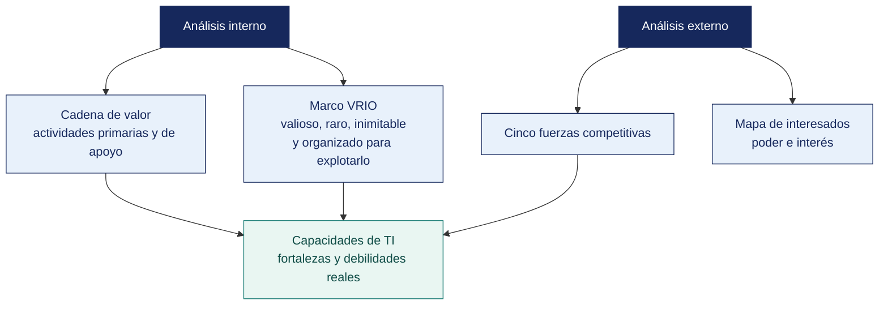

[Semana 06](README.md) · **Teoría** · [Dinámica de aula](2-DINAMICA.md) · [Taller de laboratorio](3-TALLER.md)

# Teoría · Análisis Interno y Análisis Externo de la Organización

**SI-886 · Planeamiento Estratégico de TI** · Semana 06 · Sesión 1 en aula · 2 horas académicas, 100 min, con la dinámica incluida

> ¿Un término no le resulta claro? Está definido en el [glosario técnico del curso](../GLOSARIO.md).

---

## La pregunta de esta sesión

Una distribuidora tiene quince años de historial de compras de 8 400 bodegas. Sabe qué compra cada una, cuándo, en qué cantidad y qué dejó de comprar. Ningún competidor tiene ese dato y ninguno podría reconstruirlo, porque tardaría quince años.

Nadie en la empresa lo usa para nada. Está en el sistema, se respalda todas las noches y no alimenta ninguna decisión.

> **La pregunta que ordena esta sesión.** *¿Puede una organización poseer el activo más valioso de su sector y no obtener ninguna ventaja de él?*

## Antes de empezar

| Lo que necesita traer | De dónde sale |
|---|---|
| La misión, la visión y los valores de la organización | Semanas 04 y 05 |
| El diagnóstico de cultura y la brecha entre lo declarado y lo real | Semana 05 |
| La postura de TI de la organización | Semana 02 |
| Los datos de la organización — procesos, sistemas y presupuesto | Trabajo acumulado de la unidad |

> **Exploración (5 min), antes de cualquier definición.** El aula responde antes de la teoría y se anota. *¿Es ese historial una ventaja o no lo es? ¿Qué le falta a la empresa para que lo sea? ¿Cómo se decide en qué invertir cuando todo parece importante?* No se corrige nada todavía.

## Distribución del tiempo

| Momento | Minutos |
|---|---|
| El caso del activo inexplotado y la exploración inicial | 8 |
| **Bloque 1.** El análisis interno con la cadena de valor · con su microaplicación | 18 |
| **Bloque 2.** Recursos y capacidades con el marco VRIO · con su microaplicación | 18 |
| **Bloque 3.** El análisis externo con las cinco fuerzas y los interesados | 13 |
| Examen teórico de Unidad I | 40 |
| Cierre, respuesta a la pregunta de la sesión y puente a la dinámica | 3 |
| **Total de la sesión de aula** | **100** |

## Mapa de la sesión



---

## Bloque 1 · El análisis interno · la cadena de valor

> **La pregunta del bloque.** *¿Dónde crea valor la organización y dónde lo pierde?*

**Propósito.** Identificar dónde la organización **crea valor** y dónde lo pierde, para determinar qué capacidades sostienen la ventaja y cuáles la erosionan.

**La cadena de valor de Porter**, adaptada al análisis con foco en TI:

```
   ACTIVIDADES DE APOYO
 ┌─────────────────────────────────────────────────────────────────┐
 │ Infraestructura de la empresa (dirección, finanzas, legal)      │
 ├─────────────────────────────────────────────────────────────────┤
 │ Gestión de recursos humanos                                     │
 ├─────────────────────────────────────────────────────────────────┤
 │ Desarrollo tecnológico  ◄── AQUÍ VIVE TI, y atraviesa todo      │
 ├─────────────────────────────────────────────────────────────────┤
 │ Abastecimiento                                                  │
 ├──────────┬──────────┬──────────┬──────────┬──────────┬──────────┤
 │ Logística│Operacio- │ Logística│Marketing │ Servicio │ MARGEN   │
 │ interna  │  nes     │ externa  │ y ventas │ posventa │          │
 └──────────┴──────────┴──────────┴──────────┴──────────┴──────────┘
   ACTIVIDADES PRIMARIAS
```

**Cómo se analiza cada actividad** —seis preguntas por eslabón:

| Pregunta | Qué revela | Dato que se busca |
|---|---|---|
| ¿Qué se hace exactamente? | El proceso real, no el documentado | Descripción del flujo con volúmenes |
| ¿Cuánto cuesta? | Dónde se concentra el gasto | Costo del proceso o su proporción del total |
| ¿Cuánto tarda? | Dónde está la fricción | Tiempo de ciclo y tiempo de espera |
| ¿Qué sistema lo soporta? | La cobertura tecnológica real | Nombre del sistema o «hoja de cálculo» o «papel» |
| ¿Dónde se rompe? | El cuello de botella | Reprocesos, errores, quejas, horas extra |
| ¿Qué lo hace mejor que el competidor? | La fuente de ventaja | Capacidad distintiva, si existe |

> **El hallazgo característico.** La actividad que concentra el mayor costo o la mayor fricción casi nunca es la que tiene mejor soporte tecnológico. La inversión histórica en TI suele seguir la urgencia, no el valor.

**Actividades de apoyo y el papel de TI.** El desarrollo tecnológico atraviesa toda la cadena, y por eso el análisis debe responder, para cada eslabón. **¿TI habilita, sostiene o estorba esta actividad?** Un sistema que obliga a doble digitación en logística interna no es soporte. Es un costo adicional disfrazado de sistema.

> **El error frecuente del bloque.** Analizar el proceso documentado en lugar del real. El manual describe lo que debería ocurrir; el flujo real incluye la hoja de cálculo intermedia, la llamada telefónica y el reproceso que nadie escribió. **La cadena de valor se levanta preguntando qué se hace, no leyendo qué está escrito.**

## Bloque 2 · El análisis interno · recursos y capacidades con VRIO

> **La pregunta del bloque.** *¿Por qué tener un recurso valioso no basta?*

**La distinción fundamental.** Un **recurso** es algo que la organización posee (una base de datos de clientes, un almacén, un equipo técnico). Una **capacidad** es lo que sabe hacer con él (segmentar y anticipar la demanda). La ventaja competitiva **no viene de los recursos, sino de las capacidades**.

**El marco VRIO** de Barney evalúa cada recurso o capacidad con cuatro preguntas secuenciales:

| Pregunta | Si la respuesta es NO | Si es SÍ, se pasa a la siguiente |
|---|---|---|
| **V** — ¿Es **valioso**? ¿Permite aprovechar una oportunidad o neutralizar una amenaza? | **Desventaja competitiva** | ↓ |
| **R** — ¿Es **raro**? ¿Pocos competidores lo tienen? | **Paridad competitiva** | ↓ |
| **I** — ¿Es difícil de **imitar** o sustituir? | **Ventaja competitiva temporal** | ↓ |
| **O** — ¿La **organización** está preparada para explotarlo? | Ventaja no capturada | **Ventaja competitiva sostenible** |

**Aplicación a los activos de TI** —el análisis que revela dónde invertir:

| Recurso o capacidad | V | R | I | O | Implicancia | Decisión del PETI |
|---|---|---|---|---|---|---|
| Licencias del ERP estándar | Sí | No | — | — | **Paridad.** Todos lo tienen | Optimizar costo, no invertir en diferenciación |
| Base histórica de 15 años de compras de 8 400 bodegas | Sí | **Sí** | **Sí** | **No** | **Ventaja no capturada** | **Proyecto de analítica: es el activo más valioso y está inexplotado** |
| Servidor propio en oficina | Sí | No | No | Sí | Paridad, con riesgo | Evaluar migración por continuidad, no por ventaja |
| Conocimiento del desarrollador único sobre el portal | Sí | Sí | Sí | **No** | **Riesgo crítico de dependencia** | Documentar, formar respaldo, reducir el factor bus |
| Portal B2B con 4 % de adopción | Sí | No | No | **No** | Recurso subutilizado | Proyecto de adopción, no de reemplazo |

> **La columna «O» es la que más se subestima.** Una organización puede poseer el recurso más valioso del sector y no capturar ninguna ventaja porque carece de la estructura, los procesos o las competencias para explotarlo. **Ese es el hallazgo que más proyectos genera en un PETI.**

> **El error frecuente del bloque.** Confundir recurso con capacidad. Un recurso es algo que la organización posee; una capacidad es lo que sabe hacer con él. **La ventaja competitiva no viene de los recursos sino de las capacidades**, y por eso enumerar sistemas y licencias no produce ningún hallazgo estratégico.

## Bloque 3 · El análisis externo · las cinco fuerzas y los interesados

> **La pregunta del bloque.** *¿Cuánto puede invertir esta organización, y quién lo decide desde fuera?*

**Las cinco fuerzas de Porter** — determinan la rentabilidad estructural del sector y, con ello, cuánto puede invertir la organización:

| Fuerza | Qué evaluar | Implicancia tecnológica |
|---|---|---|
| **Rivalidad entre competidores** | Número, concentración, diferenciación, crecimiento del mercado | Si la rivalidad es por precio, TI se orienta a costo; si es por servicio, a experiencia |
| **Amenaza de nuevos entrantes** | **Barreras de entrada.** Capital, regulación, escala, marca, tecnología | La tecnología puede crear barreras (red, datos) o destruirlas (plataformas) |
| **Poder de negociación de proveedores** | Concentración, costo de cambio, integración hacia adelante | **Los proveedores de TI son proveedores críticos**. El bloqueo tecnológico es poder de negociación |
| **Poder de negociación de clientes** | Concentración, sensibilidad al precio, costo de cambio | El canal digital modifica el costo de cambio del cliente en ambos sentidos |
| **Amenaza de sustitutos** | Alternativas que cumplen la misma función | La sustitución digital suele venir de fuera del sector |

**Análisis de interesados.** Determina quién puede facilitar u obstaculizar el plan. Se clasifica en la matriz **poder × interés**:

```
        ALTO PODER
             │
  Mantener   │   GESTIONAR
  satisfecho │   DE CERCA
             │   (clave para el plan)
  ───────────┼───────────────  ALTO INTERÉS
             │
  Monitorear │   Mantener
             │   informado
             │
        BAJO PODER
```

Para cada interesado se registra **qué espera del plan**, **qué teme**, **qué puede aportar** y **qué puede bloquear**. Los interesados del cuadrante «gestionar de cerca» condicionan la estrategia de implantación (sección 10).

**Interesados típicos de un PETI.** Gerencia general, gerencias de área, jefatura de TI, personal usuario, clientes o ciudadanos, proveedores de tecnología, entes reguladores, auditoría interna y, en entidades públicas, el Comité de Gobierno Digital y la Contraloría.

## Material de estudio de la unidad

> **No se dicta en clase.** Los 100 minutos de aula de esta semana se reparten entre la exposición de avance y el examen teórico. Este material —85 minutos de desarrollo— **se estudia por cuenta propia antes de la sesión y entra en el examen teórico de la Unidad I**. Está aquí completo, no resumido. Es el mismo desarrollo que tendría en aula.

### Análisis interno · la cadena de valor

**Propósito.** Identificar dónde la organización **crea valor** y dónde lo pierde, para determinar qué capacidades sostienen la ventaja y cuáles la erosionan.

**La cadena de valor de Porter**, adaptada al análisis con foco en TI:

```
   ACTIVIDADES DE APOYO
 ┌─────────────────────────────────────────────────────────────────┐
 │ Infraestructura de la empresa (dirección, finanzas, legal)      │
 ├─────────────────────────────────────────────────────────────────┤
 │ Gestión de recursos humanos                                     │
 ├─────────────────────────────────────────────────────────────────┤
 │ Desarrollo tecnológico  ◄── AQUÍ VIVE TI, y atraviesa todo      │
 ├─────────────────────────────────────────────────────────────────┤
 │ Abastecimiento                                                  │
 ├──────────┬──────────┬──────────┬──────────┬──────────┬──────────┤
 │ Logística│Operacio- │ Logística│Marketing │ Servicio │ MARGEN   │
 │ interna  │  nes     │ externa  │ y ventas │ posventa │          │
 └──────────┴──────────┴──────────┴──────────┴──────────┴──────────┘
   ACTIVIDADES PRIMARIAS
```

**Cómo se analiza cada actividad** —seis preguntas por eslabón:

| Pregunta | Qué revela | Dato que se busca |
|---|---|---|
| ¿Qué se hace exactamente? | El proceso real, no el documentado | Descripción del flujo con volúmenes |
| ¿Cuánto cuesta? | Dónde se concentra el gasto | Costo del proceso o su proporción del total |
| ¿Cuánto tarda? | Dónde está la fricción | Tiempo de ciclo y tiempo de espera |
| ¿Qué sistema lo soporta? | La cobertura tecnológica real | Nombre del sistema o «hoja de cálculo» o «papel» |
| ¿Dónde se rompe? | El cuello de botella | Reprocesos, errores, quejas, horas extra |
| ¿Qué lo hace mejor que el competidor? | La fuente de ventaja | Capacidad distintiva, si existe |

> **El hallazgo característico.** La actividad que concentra el mayor costo o la mayor fricción casi nunca es la que tiene mejor soporte tecnológico. La inversión histórica en TI suele seguir la urgencia, no el valor.

**Actividades de apoyo y el papel de TI.** El desarrollo tecnológico atraviesa toda la cadena, y por eso el análisis debe responder, para cada eslabón. **¿TI habilita, sostiene o estorba esta actividad?** Un sistema que obliga a doble digitación en logística interna no es soporte. Es un costo adicional disfrazado de sistema.

**Ejemplo trabajado — la cadena de valor de una distribuidora mayorista.** Distribuidora Andina del Sur S.A.C. — 157 trabajadores, S/ 68.4 millones de facturación, presupuesto de TI de S/ 742 000. Se recorre eslabón por eslabón con las seis preguntas:

| Eslabón | Qué sistema lo soporta | Dónde se rompe | Costo de la fricción |
|---|---|---|---|
| **Logística interna** | Módulo de almacén del ERP **abandonado**; se opera en hojas de cálculo | Las ubicaciones no se registran en el ERP | Diferencia promedio de **4.7 %** entre inventario contable y físico |
| **Operaciones** | ERP comercial, con soporte vigente | Sin ruptura relevante | — |
| **Logística externa** | ERP más planillas de reparto en papel | La confirmación de entrega vuelve a digitarse | Doble digitación en 100 % de las guías |
| **Marketing y ventas** | App de fuerza de ventas del proveedor | Sin ruptura relevante | — |
| **Servicio posventa** | Portal de pedidos propio, **sin soporte desde 2022** | Las incidencias se atienden por teléfono y no quedan registradas | No hay línea base de reclamos |

> **El eslabón peor soportado es el que concentra la pérdida.** La logística interna, que produce la diferencia de inventario de 4.7 %, es la única actividad primaria cuyo sistema **existe y se dejó de usar**. El proyecto que corresponde no es comprar un WMS. Es entender por qué el módulo pagado se abandonó, porque la misma causa hará fracasar al reemplazo.

> **Microaplicación (5 min) · el eslabón peor soportado.** Cada pareja identifica, en su propia organización, **el eslabón que concentra más costo o más fricción** y dice qué sistema lo soporta. La coincidencia entre ambos es la excepción, no la regla.

| Caso | Qué debe contener una buena respuesta |
|---|---|
| ¿Por qué se analiza el proceso real y no el documentado? | Porque el PETI se implanta sobre el proceso real. Un plan diseñado sobre el manual resuelve un problema que nadie tiene |
| ¿Qué dato convierte «el almacén funciona mal» en un hallazgo? | Uno medible y trazable a una fuente. 4.7 % de diferencia entre inventario contable y físico, tomado del cierre del periodo |
| ¿Basta con reemplazar el sistema del eslabón que falla? | No. Un módulo pagado que se abandona indica causa organizativa —capacitación, incentivos, rediseño del proceso—, y esa causa sobrevive al reemplazo |

### Análisis interno · recursos y capacidades — el marco VRIO

**La distinción fundamental.** Un **recurso** es algo que la organización posee (una base de datos de clientes, un almacén, un equipo técnico). Una **capacidad** es lo que sabe hacer con él (segmentar y anticipar la demanda). La ventaja competitiva **no viene de los recursos, sino de las capacidades**.

**El marco VRIO** de Barney evalúa cada recurso o capacidad con cuatro preguntas secuenciales:

| Pregunta | Si la respuesta es NO | Si es SÍ, se pasa a la siguiente |
|---|---|---|
| **V** — ¿Es **valioso**? ¿Permite aprovechar una oportunidad o neutralizar una amenaza? | **Desventaja competitiva** | ↓ |
| **R** — ¿Es **raro**? ¿Pocos competidores lo tienen? | **Paridad competitiva** | ↓ |
| **I** — ¿Es difícil de **imitar** o sustituir? | **Ventaja competitiva temporal** | ↓ |
| **O** — ¿La **organización** está preparada para explotarlo? | Ventaja no capturada | **Ventaja competitiva sostenible** |

**Aplicación a los activos de TI** —el análisis que revela dónde invertir:

| Recurso o capacidad | V | R | I | O | Implicancia | Decisión del PETI |
|---|---|---|---|---|---|---|
| Licencias del ERP estándar | Sí | No | — | — | **Paridad.** Todos lo tienen | Optimizar costo, no invertir en diferenciación |
| Base histórica de 15 años de compras de 8 400 bodegas | Sí | **Sí** | **Sí** | **No** | **Ventaja no capturada** | **Proyecto de analítica: es el activo más valioso y está inexplotado** |
| Servidor propio en oficina | Sí | No | No | Sí | Paridad, con riesgo | Evaluar migración por continuidad, no por ventaja |
| Conocimiento del desarrollador único sobre el portal | Sí | Sí | Sí | **No** | **Riesgo crítico de dependencia** | Documentar, formar respaldo, reducir el factor bus |
| Portal B2B con 4 % de adopción | Sí | No | No | **No** | Recurso subutilizado | Proyecto de adopción, no de reemplazo |

> **La columna «O» es la que más se subestima.** Una organización puede poseer el recurso más valioso del sector y no capturar ninguna ventaja porque carece de la estructura, los procesos o las competencias para explotarlo. **Ese es el hallazgo que más proyectos genera en un PETI.**

### Análisis externo · las cinco fuerzas y los interesados

**Las cinco fuerzas de Porter** — determinan la rentabilidad estructural del sector y, con ello, cuánto puede invertir la organización:

| Fuerza | Qué evaluar | Implicancia tecnológica |
|---|---|---|
| **Rivalidad entre competidores** | Número, concentración, diferenciación, crecimiento del mercado | Si la rivalidad es por precio, TI se orienta a costo; si es por servicio, a experiencia |
| **Amenaza de nuevos entrantes** | **Barreras de entrada.** Capital, regulación, escala, marca, tecnología | La tecnología puede crear barreras (red, datos) o destruirlas (plataformas) |
| **Poder de negociación de proveedores** | Concentración, costo de cambio, integración hacia adelante | **Los proveedores de TI son proveedores críticos**. El bloqueo tecnológico es poder de negociación |
| **Poder de negociación de clientes** | Concentración, sensibilidad al precio, costo de cambio | El canal digital modifica el costo de cambio del cliente en ambos sentidos |
| **Amenaza de sustitutos** | Alternativas que cumplen la misma función | La sustitución digital suele venir de fuera del sector |

**Análisis de interesados.** Determina quién puede facilitar u obstaculizar el plan. Se clasifica en la matriz **poder × interés**:

```
        ALTO PODER
             │
  Mantener   │   GESTIONAR
  satisfecho │   DE CERCA
             │   (clave para el plan)
  ───────────┼───────────────  ALTO INTERÉS
             │
  Monitorear │   Mantener
             │   informado
             │
        BAJO PODER
```

Para cada interesado se registra **qué espera del plan**, **qué teme**, **qué puede aportar** y **qué puede bloquear**. Los interesados del cuadrante «gestionar de cerca» condicionan la estrategia de implantación (sección 10).

**Interesados típicos de un PETI (Plan Estratégico de Tecnologías de Información).** Gerencia general, gerencias de área, jefatura de TI, personal usuario, clientes o ciudadanos, proveedores de tecnología, entes reguladores, auditoría interna y, en entidades públicas, el Comité de Gobierno Digital y la Contraloría.

**Ejemplo trabajado — las cinco fuerzas de la misma distribuidora, y lo que cada una exige de TI.**

| Fuerza | Situación observada | Intensidad | Qué obliga a poner en el PETI |
|---|---|---|---|
| **Rivalidad** | Cuatro distribuidoras compiten en Tacna y Moquegua; la diferenciación es el nivel de servicio, no el precio | Alta | Trazabilidad de la entrega y disponibilidad en línea. La competencia es por cumplimiento |
| **Nuevos entrantes** | **Barrera baja.** Basta capital de trabajo y un almacén alquilado | Media-alta | La barrera defendible es el dato histórico de compra por bodega, hoy inexplotado |
| **Poder de proveedores** | El ERP, la app de ventas y la facturación electrónica son del **mismo proveedor** | **Alta** | Salida documentada del proveedor y propiedad de los datos por contrato, antes de ampliar el alcance |
| **Poder de clientes** | 8 400 bodegas atomizadas, con costo de cambio bajo | Media | El portal de pedidos eleva el costo de cambio, pero hoy está sin soporte. Es riesgo, no ventaja |
| **Sustitutos** | Marcas que venden directo a la bodega saltándose al distribuidor | **Alta** | El valor a defender es la capilaridad y el dato de demanda, no la intermediación |

> **La fuerza más intensa se convierte en restricción del plan, no en un párrafo del diagnóstico.** Aquí, la concentración en un solo proveedor de TI aparece en la Sección 6 como riesgo y en la Sección 7 como proyecto con presupuesto. Un análisis de cinco fuerzas que no cambia ninguna decisión del PETI **no era necesario hacerlo**.

> **Microaplicación (6 min) · las cuatro preguntas sobre un activo propio.** Con el caso del inicio delante, el aula aplica en parejas **las cuatro preguntas del marco VRIO al historial de compras** y dice en qué letra se rompe. La respuesta es siempre la misma y conviene que la descubran ellos.

| Caso | Qué debe contener una buena respuesta |
|---|---|
| ¿Para qué sirve el análisis externo en un plan de TI? | Para fijar cuánto y en qué se puede invertir. Un sector de margen estrecho no financia una arquitectura de sector de margen amplio |
| Un interesado tiene alto poder y bajo interés. ¿Qué se hace? | Se lo mantiene satisfecho. Informes breves y sin sobrecarga. Ignorarlo es el error; saturarlo también |
| ¿Cómo se documenta un interesado que puede bloquear el plan? | Registrando qué espera, qué teme, qué aporta y qué puede bloquear, y llevando esa mitigación a la estrategia de implantación de la sección 10 |

---

## Examen teórico de Unidad I

**Últimos 40 minutos de la sesión.** Preguntas de alternativas sobre el material de las Semanas 01 a 06 — dirección estratégica, instrumentos de planeamiento, misión y visión, valores y cultura, análisis interno y análisis externo.

**Materiales permitidos.** Apuntes propios. **No** se permite internet, asistentes de inteligencia artificial ni el repositorio.

> **La exposición de avance de la Unidad I se hace en la Semana 05.** Esta sesión no tiene espacio. El sílabo le asigna a la Semana 06 contenido propio —análisis interno y análisis externo— y esos 60 minutos más los 40 del examen agotan el aula.

> El examen **práctico** de la unidad es distinto y se rinde en el laboratorio, con inteligencia artificial permitida.

## Cierre · qué se lleva de aquí

**La respuesta a la pregunta con la que abrimos.** Sí, y es el hallazgo que más proyectos genera en un plan de TI. El historial del caso es valioso, raro e inimitable, y falla en la cuarta pregunta — **la organización no está preparada para explotarlo**. Eso no es una desventaja competitiva, es una ventaja no capturada, y se corrige con un proyecto, no con una compra.

**Las tres ideas que deben quedar.**

| Idea | Por qué importa en el ejercicio profesional |
|---|---|
| La cadena de valor se levanta sobre el proceso real, no sobre el documentado | Es donde aparecen las hojas de cálculo y los reprocesos que ningún manual recoge |
| La ventaja viene de las capacidades, no de los recursos | Cambia por completo qué se inventaría en el diagnóstico y qué se concluye de él |
| La letra O del marco VRIO es la que más se subestima | Una organización puede tener el mejor recurso del sector y no capturar nada; ahí nacen los proyectos del plan |

**Volviendo a la exploración del inicio.** Se releen las respuestas del inicio. La mayoría llama ventaja al historial sin más. Reconocer que **una ventaja no capturada no es una ventaja** es lo que convierte el análisis interno en una lista de proyectos y no en una lista de elogios.

**Lo que sigue.** La [dinámica de esta sesión](2-DINAMICA.md) se prepara durante la semana y se entrega antes de la sesión, porque el aula la dedica a la teoría y al examen. Pide encontrar, en la organización propia, **el activo que está desperdiciado**.

---

---

[Semana 06](README.md) · **Teoría** · [Dinámica de aula](2-DINAMICA.md) · [Taller de laboratorio](3-TALLER.md)

---

**Docente** · Dr. Oscar Juan Jimenez Flores
[oscarjimenezflores@upt.pe](mailto:oscarjimenezflores@upt.pe) · [LinkedIn](https://www.linkedin.com/in/oscar-jimenez-flores/) · [CTI Vitae — CONCYTEC](https://ctivitae.concytec.gob.pe/appDirectorioCTI/VerDatosInvestigador.do?id_investigador=33398)

Escuela Profesional de Ingeniería de Sistemas · Universidad Privada de Tacna · Tacna, Perú
