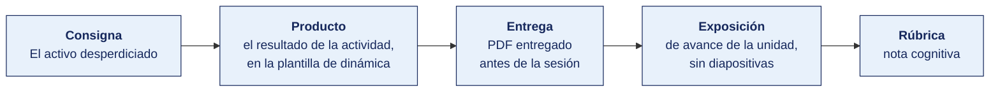

[Semana 06](README.md) · [Teoría](1-TEORIA.md) · **Dinámica de aula** · [Taller de laboratorio](3-TALLER.md)

# Dinámica de aula · Caza del activo desperdiciado

**SI-886 · Planeamiento Estratégico de TI** · Semana 06 · **Trabajo previo a la sesión** · calificación **cognitiva**

> ¿Un término no le resulta claro? Está definido en el [glosario técnico del curso](../GLOSARIO.md).

---

> **Esta actividad no se resuelve en aula.** La semana de cierre de unidad dedica sus 100 minutos de aula a la **exposición de avance (60 min)** y al **examen teórico (40 min)**. La dinámica se prepara durante la semana y **se entrega antes de la sesión**. Es el insumo con el que el equipo arma su exposición.

## Cómo funciona la actividad

## Qué entregas

| | |
|---|---|
| **Archivo** | `SI886-S06-DINAMICA-Grupo<N>.pdf` |
| **Plantilla obligatoria** | [SI886-PLANTILLA-DINAMICA.docx](../PLANTILLAS/SI886-PLANTILLA-DINAMICA.docx) |
| **Formato** | PDF exportado desde la plantilla en Word, con la carátula de la UPT y los apellidos, nombres y códigos de todos los integrantes |
| **Qué va dentro** | Lo que el grupo resolvió en aula. Las tablas de la sección **Producto** van completas, con los textos redactados, y cada decisión va justificada |
| **Dónde se sube** | Aula virtual, tarea «Dinámica · Semana 06» |
| **Cuándo vence** | Hasta 24 h después de la sesión de teoría. La tabla se resuelve en aula; el PDF se formatea y se sube después |
| **Exposición** | En la exposición de avance de la Unidad I, dentro de esta misma sesión |

> No se califica un trabajo entregado en `.docx`, sin carátula, sin los códigos de los integrantes o con las tablas del producto vacías.

---

## Consigna

> **«Caza del activo desperdiciado»**
> Toda organización tiene algo valioso que no está explotando. Hoy cada equipo busca el suyo y le pone cifra a lo que se está perdiendo.

| | |
|---|---|
| **Su papel** | Equipo de estrategia de la organización. **Compiten por el hallazgo mejor sustentado del aula** |
| **Misión** | Encontrar el recurso valioso, raro y difícil de imitar que la organización **no explota**, y estimar cuánto vale lo que se pierde |
| **Restricción** | Cada V, R o I necesita **evidencia de que el recurso existe**. Un recurso afirmado sin evidencia no entra a la matriz |

Gana el activo **mejor sustentado como desperdiciado**, no el más grande, y lo resuelve el docente con la matriz VRIO delante. Un recurso enorme que la organización ya explota no vale nada en esta caza.

## Cómo se desarrolla · 35 minutos

| | Bloque | Quién | Minutos |
|---|---|---|---|
| **1** | **Los cinco recursos.** Situados en **la cadena de valor** —actividad primaria o de apoyo—, distinguiendo **recurso de capacidad**, cada uno con la evidencia de que existe | Equipo | 9 |
| **2** | **La matriz.** V, R, I y O aplicadas a los cinco, con su implicancia competitiva | Equipo | 9 |
| **3** | **El activo desperdiciado.** El de mayor brecha en «O», la barrera concreta que lo bloquea y el **beneficio perdido en orden de magnitud** | Equipo | 9 |
| **4** | **La ronda de presentaciones.** Cada equipo presenta su activo en **60 segundos**. El aula puntúa de 1 a 3 y se anuncia el más desperdiciado | Todos | 8 |

## Producto

**La ficha del activo.**

| # | Recurso o capacidad | ¿Actividad primaria o de apoyo? | Evidencia de que existe | V | R | I | O | Implicancia |
|---|---|---|---|---|---|---|---|---|

**Y el caso del activo desperdiciado**, con estas cinco líneas.

| | Contenido |
|---|---|
| **El recurso** | Cuál, y por qué es valioso, raro y difícil de imitar |
| **La barrera** | Qué impide explotarlo. Concreta — estructura, competencia, proceso o tecnología |
| **Lo que se pierde** | Orden de magnitud, **con el supuesto declarado** |
| **Qué haría falta** | Para capturarlo |
| **Puntaje del aula** | El que le dio el aula en la ronda |

> **Dónde va.** Este producto se presenta en la **sección 2 de la [plantilla de dinámica](../PLANTILLAS/SI886-PLANTILLA-DINAMICA.docx)**, «El producto». No se copia la consigna ni la teoría. Solo el resultado y lo que lo sostiene.

## Ejemplo resuelto

*El caso de este ejemplo es distinto del que le toca a tu grupo. Sirve para que veas el nivel de detalle que se espera, no para copiarlo.*

**La organización del ejemplo.** Distribuidora mayorista de consumo masivo · 157 trabajadores.

| # | Recurso o capacidad | Evidencia de que existe | V | R | I | O | Implicancia |
|---|---|---|---|---|---|---|---|
| 1 | Flota propia de 22 unidades | Activo fijo en el balance | Sí | No | No | Sí | Paridad competitiva |
| 2 | **Histórico de 6 años de rotación de 8 400 bodegas** | Base del ERP, 14 millones de líneas | Sí | **Sí** | **Sí** | **No** | **Ventaja no explotada** |
| 3 | Relación personal de los 18 vendedores con el bodeguero | Rotación del equipo de ventas del 4 % anual | Sí | Sí | Sí | Sí | Ventaja sostenida |
| 4 | Almacén con cámara de frío | Factura de 2022 | Sí | No | No | Sí | Paridad |
| 5 | Licencias del ERP | Contrato vigente | Sí | No | No | Sí | Paridad |

**El caso del activo desperdiciado.**

| | Contenido |
|---|---|
| **El recurso** | El histórico de rotación por bodega. Valioso porque predice el quiebre de stock; raro porque ningún competidor lleva seis años atendiendo a las mismas 8 400 bodegas; difícil de imitar porque el tiempo no se compra |
| **La barrera** | No hay nadie en la organización con competencia en análisis de datos. El dato se usa solo para facturar |
| **Lo que se pierde** | El quiebre de stock está en 5,8 %. Bajarlo a 3 % son unos S/ 410 000 al año. **Supuesto** — margen del 11 % sobre la venta perdida |
| **Qué haría falta** | Un analista y el modelo de reposición predictiva. Es el proyecto ② de la cartera |
| **Puntaje del aula** | 3 de 3 |

**Por qué gana este y no la flota.** La flota vale, pero cualquiera la alquila mañana. El histórico no lo tiene nadie más y la empresa lo está usando para imprimir facturas.

## Reglas

- 35 min en aula, dentro de la sesión de teoría.
- **Sin evidencia no hay recurso.** «Tenemos buen clima laboral» no entra si nadie puede demostrarlo.
- La barrera tiene que ser **concreta**. «Falta de cultura» no es una barrera; «no hay nadie con competencia en análisis de datos» sí.
- La cifra del beneficio perdido **puede ser estimada**, pero el supuesto se declara.
- Sesenta segundos de presentación. Pasado ese tiempo se cierra la intervención.
- La exposición es la ronda de cierre de esta misma sesión. El grupo **lee y explica su resultado**. No se usan diapositivas.

## Rúbrica cognitiva (20 puntos)

| Criterio | 5 | 3 | 1 |
|---|---|---|---|
| **La evidencia del recurso** | Los cinco recursos con evidencia verificable de que existen | Tres o cuatro con evidencia | Recursos afirmados sin sustento |
| **La matriz VRIO** | Las cuatro dimensiones bien aplicadas, situadas en la cadena de valor y con la implicancia competitiva correcta | Errores menores en una dimensión | Confunde raro con valioso |
| **La barrera** | Concreta, nombrable y verificable | Concreta pero genérica | «Falta de cultura» o equivalente |
| **La cifra** | Orden de magnitud con el supuesto declarado y coherente con el tamaño de la organización | Cifra sin supuesto | Sin cifra |

---

---

[Semana 06](README.md) · [Teoría](1-TEORIA.md) · **Dinámica de aula** · [Taller de laboratorio](3-TALLER.md)

---

**Docente** · Dr. Oscar Juan Jimenez Flores
[oscarjimenezflores@upt.pe](mailto:oscarjimenezflores@upt.pe) · [LinkedIn](https://www.linkedin.com/in/oscar-jimenez-flores/) · [CTI Vitae — CONCYTEC](https://ctivitae.concytec.gob.pe/appDirectorioCTI/VerDatosInvestigador.do?id_investigador=33398)

Escuela Profesional de Ingeniería de Sistemas · Universidad Privada de Tacna · Tacna, Perú
