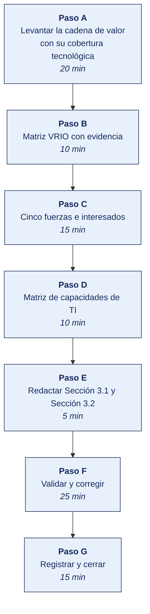

[Semana 06](README.md) · [Teoría](1-TEORIA.md) · [Dinámica de aula](2-DINAMICA.md) · **Taller de laboratorio**

# Taller de laboratorio 06 · Cadena de valor, VRIO y evaluación de capacidades de TI

**SI-886 · Planeamiento Estratégico de TI** · Semana 06 · Sesión 2 en laboratorio · 100 min · calificación **procedimental**

> ¿Un término no le resulta claro? Está definido en el [glosario técnico del curso](../GLOSARIO.md).

---

## Secuencia del taller



## Qué entregas

| | |
|---|---|
| **Archivo** | `SI886-S06-TALLER-Grupo<N>.pdf` |
| **Plantilla obligatoria** | [SI886-PLANTILLA-TALLER.docx](../PLANTILLAS/SI886-PLANTILLA-TALLER.docx) |
| **Formato** | PDF exportado desde la plantilla en Word, con la carátula de la UPT, el índice actualizado y las capturas numeradas |
| **Qué va dentro** | Las secciones de la plantilla. La **5. Resultados y evidencias** se califica contra la tabla de resultados esperados de esta guía, y **cada resultado necesita la evidencia que lo demuestre**. No se copian de aquí los objetivos, la duración ni los resultados de aprendizaje |
| **Dónde se sube** | Aula virtual, tarea «Taller · Semana 06» |
| **Cuándo vence** | 48 horas después de la sesión de laboratorio de la semana, se desarrolle el taller dentro de ella o fuera de ella |

> No se califica un informe entregado en `.docx`, sin carátula, sin los códigos de los integrantes o con resultados declarados sin evidencia.

---

## El reto

| | |
|---|---|
| **Situación** | La gerencia cree saber en qué es buena la organización, pero nadie ha mirado dónde se crea el valor ni qué actividades no tienen soporte tecnológico. |
| **Misión** | Levantar la cadena de valor con datos de costo, tiempo y volumen, y señalar los eslabones sin soporte o con soporte deficiente. |
| **Criterio de éxito** | Cada eslabón de la cadena tiene al menos un dato numérico, y la cobertura tecnológica está marcada actividad por actividad. |

## 1. Información sobre el evento práctico

### 1.1. Objetivos

- Levantar la **cadena de valor** de la organización con datos de costo, tiempo y volumen por eslabón.
- Mapear la **cobertura tecnológica** de cada actividad y detectar los eslabones sin soporte o con soporte deficiente.
- Evaluar los **recursos y capacidades** con VRIO, sustentado en evidencia.
- Analizar las **cinco fuerzas** del sector con datos de fuente verificable.
- Construir la **matriz de interesados** poder × interés con sus expectativas y temores.
- Elaborar la **matriz de capacidades de TI** con nivel actual y requerido.
- Redactar las secciones **Sección 3.1** y **Sección 3.2** del PETI (Plan Estratégico de Tecnologías de Información).

### 1.2. Recursos

| Recurso | Detalle |
|---|---|
| Documentación de la organización | Organigrama, mapa de procesos, presupuesto de TI, inventario de sistemas |
| **Bizagi Modeler** (gratuito) o **bpmn.io** | Modelado de procesos en BPMN 2.0 |
| **draw.io** | Cadena de valor y matriz de interesados |
| **Python 3.11+** con `pandas`, `matplotlib` | Matrices y visualizaciones |
| **LibreOffice Calc** | Matriz VRIO y de capacidades |
| Fuentes sectoriales oficiales | INEI, gremios, SMV (memorias anuales de empresas listadas) |

### 1.3. Seguridad

1. Los datos de costo y volumen de la organización son **Confidenciales**. En el documento se presentan agregados o como porcentaje del total cuando el detalle no es necesario.
2. Las entrevistas por área se realizan con consentimiento y se registran por **cargo**, nunca por nombra.
3. El análisis de las cinco fuerzas usa información pública del sector; no se solicita ni se difunde información confidencial de competidores.
4. Cualquier debilidad tecnológica identificada (sistemas fuera de soporte, dependencias críticas) se trata como información sensible. Puede ser útil a un atacante.

---

## 2. Procedimiento o Metodología

### Paso A — Levantar la cadena de valor con su cobertura tecnológica

`03_diagnostico/AI01_cadena_valor.csv`:

| id | Tipo | Actividad | Descripción del proceso real | Volumen mensual | Tiempo de ciclo | % del costo operativo | Sistema que lo soporta | Nivel de soporte | Dónde se rompe | ¿Ventaja distintiva? |
|---|---|---|---|---|---|---|---|---|---|---|
| CV-01 | Primaria | Logística interna | Recepción, verificación y ubicación de mercadería | 340 recepciones | 4 h | 12 % | ERP Inventarios + **papel** | Parcial | Conteo manual; 3 % de diferencias | No |
| CV-02 | Primaria | Operaciones | Preparación y consolidación de pedidos | 6 200 pedidos | 2 h | 18 % | WMS + escáner | Bueno | Picos de fin de mes | Parcial |
| CV-03 | Primaria | Logística externa | Ruteo y despacho | 6 200 despachos | 6 h | 22 % | **Hoja de cálculo** | **Deficiente** | Ruteo manual; 14 % de reentregas | No |
| CV-04 | Primaria | Marketing y ventas | Toma de pedidos en campo | 6 200 pedidos | — | 15 % | Teléfono + **papel** + portal (4 %) | **Deficiente** | Errores de transcripción | No |
| CV-05 | Primaria | Servicio posventa | Atención de reclamos y devoluciones | 180 casos | 48 h | 4 % | Correo | **Deficiente** | Sin trazabilidad | No |
| CV-06 | Apoyo | Desarrollo tecnológico | Mantenimiento y desarrollo de sistemas | — | — | 6 % | — | — | Dependencia de una persona | No |
| CV-07 | Apoyo | Abastecimiento | Compra a proveedores | 47 proveedores | — | 8 % | ERP Compras | Bueno | — | Parcial |
| CV-08 | Apoyo | RR. HH. | Selección, planilla, capacitación | 64 personas | — | 9 % | Sistema de planilla externo | Parcial | Sin integración | No |
| CV-09 | Apoyo | Infraestructura | Dirección, finanzas, contabilidad | — | — | 6 % | ERP Contabilidad + hojas de cálculo | Parcial | Consolidación manual | No |

**El programa está en [`HERRAMIENTAS/SEMANA-06/AI02_analisis_cadena.py`](../HERRAMIENTAS/SEMANA-06/AI02_analisis_cadena.py).** Se copia al repositorio del equipo como `03_diagnostico/AI02_analisis_cadena.py` y **se edita con los datos de su organización**. El programa hace el cálculo, las cifras y su justificación son del equipo.

```bash
cp ../HERRAMIENTAS/SEMANA-06/AI02_analisis_cadena.py 03_diagnostico/AI02_analisis_cadena.py
python3 03_diagnostico/AI02_analisis_cadena.py
```

### Paso B — Matriz VRIO con evidencia

`03_diagnostico/AI03_vrio.csv`:

| id | Recurso o capacidad | Tipo | Evidencia de su existencia | V | Justificación V | R | Justificación R | I | Justificación I | O | Justificación O | Implicancia | Proyecto candidato |
|---|---|---|---|---|---|---|---|---|---|---|---|---|---|

```python
# 03_diagnostico/AI04_vrio.py
import pandas as pd
v = pd.read_csv("AI03_vrio.csv")

def implicancia(r):
    if r.V != "Sí":  return "Desventaja competitiva"
    if r.R != "Sí":  return "Paridad competitiva"
    if r.I != "Sí":  return "Ventaja competitiva temporal"
    if r.O != "Sí":  return "VENTAJA NO CAPTURADA"
    return "Ventaja competitiva sostenible"

v["implicancia_calculada"] = v.apply(implicancia, axis=1)
v.to_csv("AI04_vrio_evaluado.csv", index=False)
print(v.implicancia_calculada.value_counts().to_string())
print("\n=== VENTAJAS NO CAPTURADAS — máxima prioridad del portafolio ===")
print(v[v.implicancia_calculada == "VENTAJA NO CAPTURADA"]
      [["id","Recurso o capacidad","Justificación O","Proyecto candidato"]].to_string(index=False))
print("\n=== DESVENTAJAS COMPETITIVAS — riesgo de continuidad ===")
print(v[v.implicancia_calculada == "Desventaja competitiva"]
      [["id","Recurso o capacidad","Justificación V"]].to_string(index=False))
```

### Paso C — Cinco fuerzas e interesados

`03_diagnostico/AE01_cinco_fuerzas.csv`:

| Fuerza | Indicadores evaluados | Evidencia y fuente | Intensidad (1–5) | Implicancia estratégica | Implicancia tecnológica |
|---|---|---|---|---|---|
| Rivalidad | N.º de competidores, crecimiento del mercado, diferenciación | | | | |
| Nuevos entrantes | Barreras de capital, regulación, escala | | | | |
| **Poder de proveedores** | Concentración; **incluye proveedores de TI y costo de cambio** | | | | |
| Poder de clientes | Concentración, sensibilidad al precio, costo de cambio | | | | |
| Sustitutos | Alternativas funcionales, incluidas las digitales | | | | |

> **Regla de análisis.** Cada intensidad se justifica con **al menos un dato de fuente verificable** (estadística sectorial, memoria anual de una empresa listada en la SMV, informe de gremio, registro público). La percepción del equipo no califica una fuerza.

`03_diagnostico/AE02_interesados.csv`:

| id | Interesado (cargo o grupo) | Poder (1–5) | Interés (1–5) | Cuadrante | **Qué espera del plan** | **Qué teme** | Qué puede aportar | Qué puede bloquear | Estrategia de gestión |
|---|---|---|---|---|---|---|---|---|---|
| I-01 | Gerencia General | 5 | 4 | Gestionar de cerca | Reducción de costo operativo | Inversión sin retorno visible | Presupuesto y respaldo político | Toda la aprobación | Caso de negocio con retorno y cifras |
| I-02 | Jefatura de TI | 3 | 5 | Gestionar de cerca | Recursos y reconocimiento | Que el plan lo exponga | Conocimiento del entorno actual | Información y ejecución | Involucrar en la formulación |
| I-03 | Fuerza de ventas | 2 | 4 | Mantener informado | Herramientas que faciliten su trabajo | Control sobre su actividad | Adopción del canal digital | La adopción real | Piloto con vendedores líderes |
| I-04 | Analista de hojas de cálculo comerciales | 2 | 5 | Mantener informado | Reconocimiento de su rol | **Perder el control de la información** | Conocimiento del negocio | Resistencia pasiva a la integración | Incorporarla como dueña del dato |

> **La columna «qué teme» es la que anticipa la resistencia.** Un interesado que teme perder control no se convence con argumentos técnicos. Se convence redefiniendo su rol en el nuevo escenario.

### Paso D — Matriz de capacidades de TI

`03_diagnostico/AI05_capacidades_ti.csv`:

| Dominio | Capacidad de TI | Evidencia del nivel actual | Nivel actual (1–5) | Nivel requerido por la visión | Brecha | Criticidad | Proyecto candidato |
|---|---|---|---|---|---|---|---|
| Gestión de la demanda | Priorización formal de solicitudes de las áreas | Sin comité ni backlog priorizado | 1 | 3 | 2 | Alta | Comité de TI y backlog único |
| Arquitectura | Definición y control de la arquitectura de aplicaciones | Sin documentación de arquitectura | 1 | 3 | 2 | Media | Levantamiento y gobierno de arquitectura |
| Desarrollo | Capacidad de construir y mantener software propio | Un desarrollador, sin control de versiones formal | 2 | 3 | 1 | **Crítica** | Reducción de dependencia y gestión de configuración |
| Datos y analítica | Explotación de la información para decidir | Reportes manuales en hojas de cálculo | 1 | 4 | **3** | **Crítica** | Gobierno del dato y tablero de gestión |
| Integración | Interoperabilidad entre sistemas | Integración por archivo plano nocturno | 2 | 4 | 2 | Alta | Capa de integración |
| Infraestructura | Disponibilidad y escalabilidad | Servidor único, sin redundancia | 2 | 3 | 1 | Alta | Continuidad de la infraestructura |
| Seguridad | Protección de la información y cumplimiento | Sin SGSI (Sistema de Gestión de Seguridad de la Información) ni inventario de datos personales | 1 | 3 | 2 | **Crítica** | Programa de seguridad y cumplimiento |
| Servicio y soporte | Atención a usuarios con nivel de servicio | Atención informal, sin registro | 1 | 3 | 2 | Media | Mesa de servicio |
| Gestión de proveedores | Contratos con nivel de servicio medible | Contrato de ERP vencido | 1 | 3 | 2 | Alta | Gestión contractual de TI |

**El programa está en [`HERRAMIENTAS/SEMANA-06/AI06_capacidades.py`](../HERRAMIENTAS/SEMANA-06/AI06_capacidades.py).** Se copia al repositorio del equipo como `03_diagnostico/AI06_capacidades.py` y **se edita con los datos de su organización**. El programa hace el cálculo, las cifras y su justificación son del equipo.

```bash
cp ../HERRAMIENTAS/SEMANA-06/AI06_capacidades.py 03_diagnostico/AI06_capacidades.py
python3 03_diagnostico/AI06_capacidades.py
```

### Paso E — Redactar Sección 3.1 y Sección 3.2

```markdown
## 3.1 Análisis interno
### 3.1.1 Cadena de valor y cobertura tecnológica
### 3.1.2 Concentración del costo y brecha de soporte
### 3.1.3 Recursos y capacidades — evaluación VRIO
### 3.1.4 Ventajas no capturadas y desventajas competitivas
### 3.1.5 Matriz de capacidades de TI · nivel actual y requerido
### 3.1.6 Síntesis · fortalezas y debilidades   ← insumo directo del FODA (Sección 3.4)

## 3.2 Análisis externo
### 3.2.1 Análisis de las cinco fuerzas del sector
### 3.2.2 Análisis de interesados · poder, interés, expectativas y temores
### 3.2.3 Síntesis · oportunidades y amenazas   ← insumo directo del FODA (Sección 3.4)
```

### Paso F — Validar y corregir (25 min)

El resultado no vale por estar hecho, sino por resistir una comprobación. Se ejecutan estas tres y **se corrige lo que falle antes de cerrar la sesión**.

1. Comprobar que ningún eslabón queda sin dato de costo, tiempo o volumen.
2. Verificar que la evaluación VRIO de cada capacidad de TI trae la evidencia que la sostiene.
3. Contrastar el eslabón peor cubierto con un problema real que la organización ya sufre.

> Lo que no se pueda corregir hoy se anota en la sección **Problemas y mejoras** de la evidencia, con lo que faltó y por qué. Un resultado parcial documentado con honestidad vale más que uno declarado sin prueba.

### Paso G — Registrar la evidencia y cerrar (15 min)

Se versiona lo producido, se anota la URL de cada resultado y se responde en dos frases la pregunta de transferencia — **qué riesgo correría una organización real si esto se hiciera mal**.

```bash
git add . && git commit -m "S06: analisis interno y externo — secciones 3.1 y 3.2"
git tag -a v0.6 -m "PETI v0.6 — diagnostico base completo (cierre de Unidad I)"
```

---

## 3. Resultados

> **Evidencia obligatoria en GitHub.** Todo resultado de este taller se versiona en el repositorio del equipo. El informe **no consigna capturas sueltas**. Consigna la **URL** del artefacto en GitHub. Una captura no permite verificar autoría, fecha ni contenido; un enlace sí.
>
> | Qué se entrega | Dónde vive | Qué se escribe en el informe |
> |---|---|---|
> | Código y archivos de configuración | Rama del taller, fusionada a `develop` vía Pull Request | URL del Pull Request |
> | Documentos y matrices | `docs/`, en formato de texto versionable | URL del archivo en la rama |
> | Capturas y videos que el taller exija | `docs/evidencias/S06/` | URL del archivo |
> | Salida de comandos | `docs/evidencias/S06/salidas/*.txt` | URL del archivo |
>
> **Etiqueta del taller.** Al cerrar el taller se crea la etiqueta `taller-06` sobre el commit entregado:
>
> ```bash
> git tag -a taller-06 -m "Taller 06 · SI886"
> git push origin taller-06
> ```
>
> La URL que se consigna en el informe apunta a esa etiqueta:
> `https://github.com/<organizacion>/<repositorio>/tree/taller-06`
>
> **El informe es lo que se califica; el repositorio es lo que lo prueba.** Cada resultado de la sección 3 del informe lleva la URL con la que se verifica, y **un resultado sin su URL se califica como no logrado**, por bien redactado que esté. Lo que no se puede abrir no se puede dar por hecho.

### 3.1. Los tres resultados que se califican

Son los que la rúbrica evalúa. El resto de la lista tiene que existir, pero no se califica fila por fila.

| Resultado | Qué demuestra | Dónde está |
|---|---|---|
| **La cadena con datos** | Cada eslabón con costo, tiempo o volumen, no solo con nombre | Diagrama y tabla |
| **La cobertura tecnológica** | Marcada por actividad, con el eslabón crítico identificado | Matriz de cobertura |
| **Las capacidades VRIO** | Evaluadas con evidencia, con la implicancia competitiva | Sección 3.1 |

### 3.2. Lista de comprobación del taller

Todo esto debe existir al cerrar la sesión.

| # | Resultado esperado | Verificación |
|---|---|---|
| 1 | Cadena de valor con **las 9 actividades** y datos de volumen, tiempo y costo | `AI01_cadena_valor.csv` |
| 2 | **Nivel de soporte tecnológico** asignado a cada actividad, con su evidencia | Misma tabla |
| 3 | Análisis de la brecha costo-soporte, con las 5 actividades de mayor brecha | Salida de `AI02_analisis_cadena.py` |
| 4 | Gráfico de la cadena de valor con el nivel de soporte por color | `AI_cadena_valor.png` |
| 5 | Matriz VRIO con **al menos 8 recursos o capacidades**, cada dimensión justificada | `AI03_vrio.csv` |
| 6 | **Al menos una ventaja no capturada** identificada con su barrera concreta | Salida de `AI04_vrio.py` |
| 7 | Cinco fuerzas analizadas, cada intensidad con **al menos un dato de fuente verificable** | `AE01_cinco_fuerzas.csv` |
| 8 | Matriz de interesados con **al menos 8 interesados**, incluidas las columnas «espera» y «teme» | `AE02_interesados.csv` |
| 9 | Al menos **dos interesados en el cuadrante «gestionar de cerca»** con su estrategia | Misma tabla |
| 10 | Matriz de capacidades de TI con nivel actual, requerido, brecha y criticidad | `AI05_capacidades_ti.csv` |
| 11 | Gráfico de radar de capacidades | `AI_capacidades_ti.png` |
| 12 | Síntesis de fortalezas, debilidades, oportunidades y amenazas, lista para el FODA | Sección 3.1.6 y Sección 3.2.3 |
| 13 | Secciones Sección 3.1 y Sección 3.2 redactadas · etiqueta `v0.6` | `git tag` |

## Rúbrica procedimental (20 puntos)

Se aplica sobre el informe entregado y la evidencia enlazada en el repositorio. **Cada criterio se califica de forma independiente.**

| Criterio | 4 — Logrado | 2 — En proceso | 0 — Insuficiente |
|---|---|---|---|
| **El criterio de éxito** | Se cumple tal como lo pide el reto de esta sesión | Se cumple con reservas que el equipo declara | No se cumple, o se afirma cumplido sin prueba |
| **La cadena con datos** | Completo y correcto, con la evidencia que lo respalda | Completo con errores menores, o correcto sin toda la evidencia | Incompleto o sin evidencia |
| **La cobertura tecnológica** | Completo y correcto, con la evidencia que lo respalda | Completo con errores menores, o correcto sin toda la evidencia | Incompleto o sin evidencia |
| **Las capacidades VRIO** | Completo y correcto, con la evidencia que lo respalda | Completo con errores menores, o correcto sin toda la evidencia | Incompleto o sin evidencia |
| **La validación** | Las tres comprobaciones ejecutadas, y lo que falló quedó corregido o documentado | Ejecutadas sin corregir lo que falló | No se validó nada |

| Puntaje | Equivalencia |
|---|---|
| 18 – 20 | Destacado |
| 14 – 17 | Logrado |
| 6 – 13 | En proceso |
| 0 – 5 | Insuficiente |

> **Un resultado declarado sin evidencia enlazada no se califica**, aunque el trabajo se haya hecho. La tabla de la sección 3.1 es la lista de cotejo; esta rúbrica es lo que determina la nota.

## 4. Conclusiones

Mínimo tres. Líneas argumentales esperadas:

1. La inversión histórica en tecnología rara vez coincide con la concentración del costo operativo. Cruzar ambas dimensiones revela dónde el retorno de un proyecto es mayor y por qué esa actividad nunca fue prioridad.
2. La dimensión «O» del marco VRIO —si la organización está preparada para explotar el recurso— es donde se concentran las ventajas no capturadas, y esas son las oportunidades más rentables del portafolio porque el activo ya existe.
3. La columna «qué teme» de la matriz de interesados anticipa la resistencia con más precisión que la columna «qué espera». Quien teme perder control no se convence con argumentos técnicos.

## 5. Referencias Bibliográficas

- Porter, M. E. (1985). *Competitive Advantage: Creating and Sustaining Superior Performance*. Free Press.
- Porter, M. E. (2008). The five competitive forces that shape strategy. *Harvard Business Review*, 86(1), 78–93.
- Barney, J. B. (1991). Firm resources and sustained competitive advantage. *Journal of Management*, 17(1), 99–120.
- Rodríguez Bermúdez, J. R. (2015). *Usos estratégicos de las TIC*. Editorial UOC. https://elibro.net/es/lc/bibliotecaupt/titulos/57677
- Rodríguez Bermúdez, J. R. (2015). *Planificación y dirección estratégica de sistemas de información*. Editorial UOC. https://elibro.net/es/lc/bibliotecaupt/titulos/57875
- González Millán, J. (2020). *Manual práctico de planeación estratégica*. Ediciones Díaz de Santos. https://elibro.net/es/lc/bibliotecaupt/titulos/129291
- ISACA. (2018). *COBIT 2019*, cascada de metas y componentes del sistema de gobierno. https://www.isaca.org/resources/cobit
- Instituto Nacional de Estadística e Informática. https://www.inei.gob.pe
- Superintendencia del Mercado de Valores — memorias anuales de empresas listadas. https://www.smv.gob.pe
- Object Management Group. *BPMN 2.0 Specification*. https://www.omg.org/spec/BPMN/

## 6. Anexos

- `anexo_A_cadena_valor.xlsx`
- `anexo_B_matriz_vrio.xlsx`
- `anexo_C_cinco_fuerzas.pdf`
- `anexo_D_interesados.xlsx`
- `anexo_E_capacidades_ti.png`
- `anexo_F_secciones_3_1_3_2.pdf`

---

---

[Semana 06](README.md) · [Teoría](1-TEORIA.md) · [Dinámica de aula](2-DINAMICA.md) · **Taller de laboratorio**

---

**Docente** · Dr. Oscar Juan Jimenez Flores
[oscarjimenezflores@upt.pe](mailto:oscarjimenezflores@upt.pe) · [LinkedIn](https://www.linkedin.com/in/oscar-jimenez-flores/) · [CTI Vitae — CONCYTEC](https://ctivitae.concytec.gob.pe/appDirectorioCTI/VerDatosInvestigador.do?id_investigador=33398)

Escuela Profesional de Ingeniería de Sistemas · Universidad Privada de Tacna · Tacna, Perú
