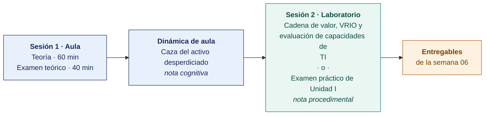

  
  &nbsp;&nbsp;&nbsp;&nbsp;&nbsp;&nbsp;
  

  <strong>Universidad Privada de Tacna</strong> 
  Facultad de Ingeniería · Escuela Profesional de Ingeniería de Sistemas

<h1 align="center">Semana 06 · Análisis Interno y Análisis Externo de la Organización</h1>

  <strong>SI-886 · Planeamiento Estratégico de TI</strong> 
  4 horas académicas de 50 min · 100 min de teoría con la dinámica incluida en aula · 100 min de taller en laboratorio

---

## Datos de la asignatura

| | |
|---|---|
| **Asignatura** | SI-886 · Planeamiento Estratégico de TI |
| **Escuela** | Escuela Profesional de Ingeniería de Sistemas |
| **Ciclo** | VIII · 04 horas semanales · 03 créditos · Obligatorio |
| **Unidad** | I — Fundamentos de Planeamiento Estratégico (cierre) |
| **Semana** | 06 de 17 |
| **Duración** | 4 horas académicas de 50 min · 60 min de teoría y 40 de examen teórico en aula · 100 min en laboratorio, compartidos entre el taller y el examen práctico |
| **Resultados de aprendizaje** | **RA1** Aplica la dirección estratégica, definiendo la misión y visión · **RA2** Desarrolla el análisis FODA |

### Lo que indica el sílabo

**Contenido conceptual.** Análisis Interno de la organización. Análisis Externo de la organización.

**Contenido procedimental.** Investiga sobre herramientas de diagnóstico organizacional.

## Materiales de esta semana

| | Documento | Qué encontrarás | Dónde y cuánto dura |
|---|---|---|---|
| 1 | **[Teoría](1-TEORIA.md)** | Análisis interno con la cadena de valor · Análisis interno de recursos y capacidades con el marco VRIO · Análisis externo con las cinco fuerzas y el mapa de interesados | Aula · **60 min** |
| 2 | **[Dinámica de aula](2-DINAMICA.md)** | Caza del activo desperdiciado, con su material, su ejemplo resuelto y su rúbrica | **Trabajo previo**, se entrega antes de la sesión |
| 3 | **[Taller de laboratorio](3-TALLER.md)** | Cadena de valor, VRIO y evaluación de capacidades de TI | Laboratorio · 100 min · **comparte sesión con el examen práctico** |

> **El laboratorio de esta semana lo reclaman dos documentos y solo caben los 100 minutos de una sesión.** El **examen práctico** y el **[taller](3-TALLER.md)** están escritos completos y son independientes entre sí. El docente publica en el aula virtual el que ocupará la sesión y deja el otro como trabajo fuera de ella, y lo comunica al inicio de la semana. **El plazo no cambia con esa decisión** — ambos vencen contando desde la sesión de laboratorio, que se dicta igual en cualquiera de los dos casos.

## Ruta de la semana

## Entregables

| Entregable | Formato y nombre del archivo | Vence |
|---|---|---|
| **Dinámica de aula** · Caza del activo desperdiciado | PDF desde la [plantilla de dinámica](../PLANTILLAS/SI886-PLANTILLA-DINAMICA.docx) · `SI886-S06-DINAMICA-Grupo<N>.pdf` | Antes de iniciar la sesión de aula |
| **Informe del taller de laboratorio N.º 06** | PDF en formato EPIS desde la [plantilla de taller](../PLANTILLAS/SI886-PLANTILLA-TALLER.docx) · `SI886-S06-TALLER-Grupo<N>.pdf` | 48 h después de la sesión de laboratorio |
| Secciones Sección 3.1 y Sección 3.2 del PETI (Plan Estratégico de Tecnologías de Información) · etiqueta `v0.6` | Commit en Git | 48 h después de la sesión de laboratorio |

> Ambos se entregan en **PDF**, con la carátula de la UPT y los códigos de todos los integrantes. Las plantillas obligatorias están en [`PLANTILLAS/`](../PLANTILLAS/).

## Cómo se evalúa

| Criterio | Instrumento | Peso en la unidad |
|---|---|---|
| Actitudinal | Participación, puntualidad, profesionalismo con la organización y cumplimiento del acuerdo de confidencialidad en las semanas 01–06 | 15 % |
| Cognitivo | Promedio de las rúbricas de las dinámicas S01–S06 | 25 % |
| Procedimental | Promedio de las listas de cotejo de los laboratorios 01–06 + calidad de las secciones Sección 0 a Sección 3.2 del PETI | 35 % |
| Examen de Unidad | **Teórico** en aula, 40 min, Preguntas de alternativas · **Práctico** en laboratorio, 100 min, con inteligencia artificial permitida | 25 % |
| | **La Unidad I aporta el 25 % de la nota final del curso** | |

## Preparación para la Semana 07

- Repasar las síntesis Sección 3.1.6 y Sección 3.2.3. Son el insumo del FODA cruzado, y su calidad determina la de las estrategias derivadas.
- **Leer.** González Millán, *Manual práctico de planeación estratégica* — capítulos sobre matrices EFI, EFE y FODA cruzado.
- Recopilar información para el análisis PESTEL — normativa sectorial, indicadores económicos, tendencias sociales y tecnológicas, requisitos ambientales y legales aplicables.

---

**Docente** · Dr. Oscar Juan Jimenez Flores
[oscarjimenezflores@upt.pe](mailto:oscarjimenezflores@upt.pe) · [LinkedIn](https://www.linkedin.com/in/oscar-jimenez-flores/) · [CTI Vitae — CONCYTEC](https://ctivitae.concytec.gob.pe/appDirectorioCTI/VerDatosInvestigador.do?id_investigador=33398)

Escuela Profesional de Ingeniería de Sistemas · Universidad Privada de Tacna · Tacna, Perú
