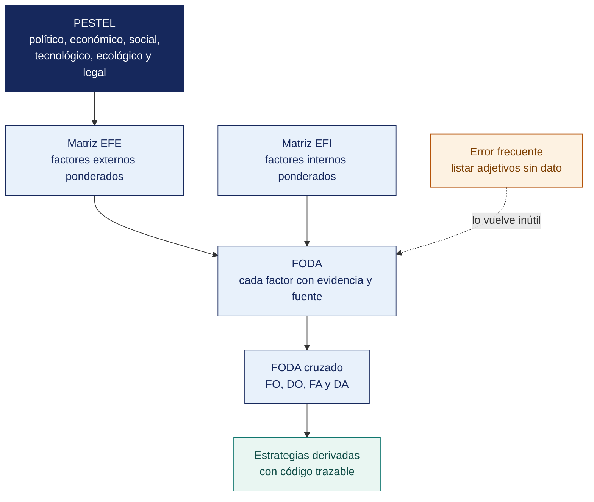

[Semana 07](README.md) · **Teoría** · [Dinámica de aula](2-DINAMICA.md) · [Taller de laboratorio](3-TALLER.md)

# Teoría · Análisis de la Organización con FODA y PESTEL

**SI-886 · Planeamiento Estratégico de TI** · Semana 07 · Sesión 1 en aula · 2 horas académicas, 100 min, con la dinámica incluida

> ¿Un término no le resulta claro? Está definido en el [glosario técnico del curso](../GLOSARIO.md).

---

## La pregunta de esta sesión

Una empresa presenta su matriz de factores externos al comité. Califica con 4 la oportunidad del canal digital, porque es la más importante que tiene. El puntaje total sale alto y el comité concluye que la organización responde bien a su entorno.

Su portal lo usa el 4 % de los clientes. La calificación 4 medía lo importante que es la oportunidad, no lo bien que la empresa la está aprovechando.

> **La pregunta que ordena esta sesión.** *¿Qué se está midiendo exactamente cuando se califica un factor del entorno?*

## Antes de empezar

| Lo que necesita traer | De dónde sale |
|---|---|
| El análisis interno con cadena de valor y marco VRIO | Semana 06 |
| El análisis externo con las cinco fuerzas | Semana 06 |
| La postura de TI y las tendencias con evidencia | Semana 02 |
| Los datos del diagnóstico de la organización | Trabajo acumulado |

> **Exploración (5 min), antes de cualquier definición.** El aula responde antes de la teoría y se anota. *¿Está bien esa calificación? ¿Qué debería medir? ¿Puede una oportunidad importantísima recibir un 1?* No se corrige nada todavía.

## Distribución del tiempo

| Momento | Minutos |
|---|---|
| El caso de la calificación 4 y la exploración inicial | 8 |
| **Bloque 1.** El análisis PESTEL del entorno | 15 |
| **Bloque 2.** El FODA y sus errores frecuentes · con su microaplicación | 22 |
| **Bloque 3.** El FODA cruzado y las estrategias derivadas | 15 |
| Cierre, respuesta a la pregunta de la sesión y puente a la dinámica | 5 |
| **Total de la sesión de aula** | **65** |

## Mapa de la sesión



---

## Bloque 1 · El análisis PESTEL del entorno

> **La pregunta del bloque.** *¿Qué convierte una tendencia en un factor que pertenece al plan?*

**Propósito.** Identificar los factores del macroentorno que **condicionan** a la organización sin que pueda modificarlos. Todo factor PESTEL termina siendo una **oportunidad** o una **amenaza** del FODA.

| Dimensión | Qué evaluar | Ejemplos con implicancia tecnológica | Fuentes oficiales |
|---|---|---|---|
| **P — Político** | Estabilidad, políticas públicas, prioridades de gobierno, descentralización | Política Nacional de Transformación Digital al 2030; agenda digital del gobierno regional | PCM, D. S. 085-2023-PCM, gobiernos regionales |
| **E — Económico** | Crecimiento, inflación, tipo de cambio, tasas, acceso a crédito, poder adquisitivo | Contratos de TI en dólares; costo de financiamiento del portafolio | BCRP, INEI, MEF |
| **S — Social** | Demografía, educación, hábitos, adopción digital, migración | Penetración de smartphone en el segmento de clientes; disponibilidad de talento técnico local | INEI (ENAHO), MINEDU, SUNEDU |
| **T — Tecnológico** | Madurez y costo de tecnologías, infraestructura, conectividad, obsolescencia | Cobertura 4G/5G en la zona de operación; disponibilidad de nube regional; fin de soporte de plataformas en uso | OSIPTEL, MTC, documentación de fabricantes |
| **E — Ecológico/Ético** | Sostenibilidad, residuos electrónicos, huella, ética del uso de datos y de la IA | Gestión de residuos de aparatos eléctricos y electrónicos; uso ético de datos de clientes | MINAM, D. S. sobre RAEE, UNESCO, OCDE |
| **L — Legal** | Normativa aplicable y sanción asociada | Ley 29733 y D. S. 016-2024-JUS; D. Leg. 822; D. Leg. 1412; normativa sectorial | ANPD, INDECOPI, PCM, regulador sectorial |

> **El sílabo pide «políticos, económicos, sociales, tecnológicos, éticos y legales».** Esa formulación integra la dimensión **ética** —uso responsable de los datos y de la inteligencia artificial— dentro del análisis, lo que es especialmente pertinente para un PETI. **Decisiones tecnológicas legales pueden ser éticamente cuestionables**, y esa diferencia debe quedar registrada.

**La regla de calidad del PESTEL.** Cada factor debe tener — **evidencia con cifra y fuente**, **efecto específico sobre esta organización**, **clasificación como oportunidad o amenaza**, **intensidad** y **horizonte**. Un PESTEL con afirmaciones genéricas —«la tecnología avanza rápidamente»— no aporta nada al plan.

> **El error frecuente del bloque.** Incluir un factor sin la decisión que obliga. «La tecnología avanza rápidamente» no aporta nada — falta la cifra, falta la fuente y falta el efecto sobre **esta** organización. Un factor que no responde qué decisión obliga a tomar pertenece a una charla de divulgación, no al plan.

## Bloque 2 · El análisis FODA y sus errores frecuentes

> **La pregunta del bloque.** *¿Puede una organización modificar ese factor por decisión propia?*

**El FODA mal hecho** es la herramienta más usada y peor aplicada del planeamiento. Sus tres defectos característicos:

| Defecto | Ejemplo | Por qué invalida el análisis |
|---|---|---|
| **Lista sin evidencia** | «Debilidad: falta de personal capacitado» | No se sabe cuánto falta, en qué, ni qué consecuencia tiene |
| **Confusión interno/externo** | «Oportunidad: mejorar nuestro sistema de ventas» | Eso es una acción interna, no un factor del entorno |
| **Se queda en el listado** | Cuatro columnas de viñetas y nada más | **El FODA no es el producto: el producto son las estrategias que se derivan de él** |

**La distinción interno/externo — la prueba.** *¿La organización puede modificarlo por decisión propia?* Si **sí**, es interno (fortaleza o debilidad). Si **no**, es externo (oportunidad o amenaza).

| Enunciado | ¿Puede modificarlo? | Clasificación correcta |
|---|---|---|
| El servidor está fuera de soporte | Sí | **Debilidad** |
| El fabricante dejó de dar soporte a esa versión | No | **Amenaza** |
| El 68 % de los clientes tiene smartphone | No | **Oportunidad** |
| El portal B2B tiene 4 % de adopción | Sí | **Debilidad** |
| La Ley 29733 exige medidas de seguridad | No | **Amenaza** (o requisito) |
| No existe inventario de datos personales | Sí | **Debilidad** |

**Las matrices EFI y EFE.** Convierten el listado en una evaluación ponderada:

| Matriz | Qué evalúa | Cómo se construye |
|---|---|---|
| **EFI** — Evaluación de Factores Internos | Fortalezas y debilidades | Peso por factor (suma 1) × calificación (1 = debilidad mayor, 4 = fortaleza mayor) |
| **EFE** — Evaluación de Factores Externos | Oportunidades y amenazas | Peso por factor (suma 1) × calificación (**1 a 4 según la respuesta actual de la organización al factor**) |

**Interpretación.** Un puntaje total de 2.5 es el promedio. Por debajo, la organización es internamente débil (EFI) o responde mal a su entorno (EFE). **La calificación de la EFE no mide qué tan grave es el factor. Mide qué tan bien responde la organización a él.** Confundir ambas cosas es el error más común.

**Ejemplo trabajado — una matriz EFE con las cifras a la vista.** Distribuidora Andina del Sur S.A.C. Cinco factores externos, con su peso, la calificación de **la respuesta actual de la organización** y el puntaje resultante:

| Factor externo | Peso | Calificación | Puntaje | Por qué esa calificación |
|---|---|---|---|---|
| **O1** — 68 % de las bodegas atendidas tiene smartphone (INEI 2025) | 0.25 | 2 | 0.50 | Existe portal propio, pero solo el 4 % lo usa. La respuesta es débil |
| **O2** — Herramientas de analítica en nube a costo accesible | 0.15 | 1 | 0.15 | No hay ninguna iniciativa; la base histórica sigue sin explotarse |
| **A1** — Marcas que venden directo a la bodega | 0.25 | 3 | 0.75 | La red de reparto propia sostiene la posición, aunque sin dato de demanda |
| **A2** — Ley 29733 y D. S. 016-2024-JUS exigen medidas de seguridad | 0.20 | 1 | 0.20 | No existe inventario de datos personales ni registro de tratamiento |
| **A3** — Fin de soporte del hosting del portal de pedidos | 0.15 | 2 | 0.30 | El riesgo está identificado, sin plan ni presupuesto asignado |
| **Total** | **1.00** | | **1.90** | Por debajo de 2.5 **la organización responde mal a su entorno** |

> **El 1.90 no dice que el entorno sea hostil. Dice que la organización no le está respondiendo.** Los dos factores calificados con 1 —analítica sin explotar y protección de datos sin inventario— son exactamente los que deben aparecer como proyectos en la Sección 7. **La matriz EFE se lee como una lista priorizada de tareas pendientes**, no como una calificación del sector.

> **Microaplicación (6 min) · interno o externo, en seis casos.** El docente lee seis enunciados y el aula clasifica cada uno aplicando una sola prueba — *¿puede la organización modificarlo por decisión propia?* Los dos sobre obsolescencia y soporte del fabricante son los que más se fallan.

| Caso | Qué debe contener una buena respuesta |
|---|---|
| Un factor gravísimo recibe calificación 4. ¿Es un error? | No. La calificación mide la respuesta de la organización, no la gravedad del factor. Una amenaza seria bien atendida se califica alto |
| ¿De dónde salen los pesos? | Del juicio del equipo, declarado y justificado. Cuánto afecta ese factor al resultado de la organización. Se documenta el criterio, porque la suma debe dar 1.00 y será cuestionada |
| ¿Sirve de algo un EFE de 3.4? | Sí — indica que el esfuerzo del PETI debe ir a capturar oportunidades, no a corregir carencias. Cambia el tipo de estrategia dominante, de DA hacia FO |

> **El error frecuente del bloque.** Calificar la matriz externa por la gravedad del factor en lugar de por la respuesta de la organización. Es el error del caso de hoy y el más común de la semana. **La calificación mide qué tan bien responde la organización**, de modo que un factor gravísimo al que responde bien se califica 4, y una oportunidad enorme que no aprovecha se califica 1.

## Bloque 3 · El FODA cruzado y las estrategias derivadas

> **La pregunta del bloque.** *¿Por qué el listado de cuatro columnas no es el producto?*

**El paso que casi nadie da.** Cruzar los factores internos con los externos produce cuatro tipos de estrategia:

```
                   │  OPORTUNIDADES (O)      │  AMENAZAS (A)
 ──────────────────┼─────────────────────────┼──────────────────────────
                   │  ESTRATEGIAS FO         │  ESTRATEGIAS FA
  FORTALEZAS (F)   │  «Ofensivas»            │  «Defensivas»
                   │  Usar fortalezas para   │  Usar fortalezas para
                   │  capturar oportunidades │  neutralizar amenazas
 ──────────────────┼─────────────────────────┼──────────────────────────
                   │  ESTRATEGIAS DO         │  ESTRATEGIAS DA
  DEBILIDADES (D)  │  «Adaptativas»          │  «De supervivencia»
                   │  Superar debilidades    │  Reducir debilidades y
                   │  aprovechando           │  evitar amenazas
                   │  oportunidades          │
```

**Cómo se redacta una estrategia cruzada.** Cada una nombra explícitamente **los factores que cruza**:

| Tipo | Formulación | Ejemplo |
|---|---|---|
| **FO** | «Aprovechar **F3** para capturar **O2**» | «Aprovechar la base histórica de 15 años de compras de 8 400 bodegas (F3) para capturar el crecimiento de la adopción de smartphone en el segmento minorista (O2), mediante un canal digital con recomendación personalizada de surtido» |
| **FA** | «Usar **F1** para neutralizar **A4**» | «Usar la red de distribución propia (F1) para neutralizar la entrada de mayoristas digitales sin logística local (A4), garantizando entrega en 24 horas como diferencial no replicable» |
| **DO** | «Superar **D2** aprovechando **O1**» | «Superar la ausencia de capacidad analítica (D2) aprovechando la disponibilidad de herramientas de analítica de bajo costo y talento técnico local (O1), mediante un programa de gobierno del dato y formación interna» |
| **DA** | «Reducir **D5** para mitigar **A2**» | «Reducir la dependencia de un único desarrollador (D5) para mitigar el riesgo de interrupción del canal digital ante su desvinculación (A2), documentando la arquitectura y formando un segundo responsable» |

> **Regla de trazabilidad.** Toda estrategia debe citar los códigos de los factores que cruza. Una estrategia sin códigos no se puede rastrear al diagnóstico, y por tanto no se puede defender cuando la gerencia pregunte por qué está en el plan.

**De la estrategia al proyecto.** Cada estrategia del FODA cruzado se convierte, en la Semana 13, en uno o más proyectos del portafolio. **Esa es la cadena que hace defendible el plan.**

```
Evidencia del diagnóstico → Factor F/D/O/A → Estrategia cruzada
   → Objetivo (Sección 6.2) → Proyecto del portafolio (Sección 7.1) → Presupuesto (Sección 7.4)
```

Un proyecto que no se puede rastrear hasta un factor con evidencia es un proyecto sin justificación.

## Cierre · qué se lleva de aquí

**La respuesta a la pregunta con la que abrimos.** En la matriz de factores externos se mide **la respuesta de la organización al factor**, no la importancia del factor. El comité del caso leyó un puntaje alto y concluyó lo contrario de lo que los datos decían. Con la calificación corregida a 1, ese mismo factor pasa de sostener una conclusión favorable a ser el argumento del proyecto más importante del plan.

**Las tres ideas que deben quedar.**

| Idea | Por qué importa en el ejercicio profesional |
|---|---|
| Todo factor del entorno termina en el FODA como oportunidad o amenaza | Y ninguno pertenece al plan si no responde qué decisión obliga a tomar |
| La prueba interno-externo es si la organización puede modificarlo por decisión propia | Resuelve en un segundo la clasificación que más se discute en los talleres |
| La calificación externa mide la respuesta, no la gravedad | Confundirlas produce puntajes altos en organizaciones que responden mal a todo |

**Volviendo a la exploración del inicio.** Se releen las respuestas del inicio. La tercera pregunta —si una oportunidad importantísima puede recibir un 1— casi siempre se responde que no, y es justo al revés. Ese es el giro conceptual de la sesión.

**Lo que sigue.** La [dinámica de esta sesión](2-DINAMICA.md) trabaja con los factores reales de su organización y exige la clasificación correcta con su evidencia. El taller construye después las matrices completas, donde la calificación de hoy decide el resultado.


**Pregunta de cierre.** *¿cuántas de nuestras estrategias son DA, de supervivencia?* Si son la mayoría, la organización no está en posición de crecer. Está en posición de resistir, y el PETI (Plan Estratégico de Tecnologías de Información) debe reconocerlo antes de proponer transformación digital.
---

---

[Semana 07](README.md) · **Teoría** · [Dinámica de aula](2-DINAMICA.md) · [Taller de laboratorio](3-TALLER.md)

---

**Docente** · Dr. Oscar Juan Jimenez Flores
[oscarjimenezflores@upt.pe](mailto:oscarjimenezflores@upt.pe) · [LinkedIn](https://www.linkedin.com/in/oscar-jimenez-flores/) · [CTI Vitae — CONCYTEC](https://ctivitae.concytec.gob.pe/appDirectorioCTI/VerDatosInvestigador.do?id_investigador=33398)

Escuela Profesional de Ingeniería de Sistemas · Universidad Privada de Tacna · Tacna, Perú
