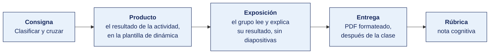

[Semana 07](README.md) · [Teoría](1-TEORIA.md) · **Dinámica de aula** · [Taller de laboratorio](3-TALLER.md)

# Dinámica de aula · Los que no son ninguna de las cuatro

**SI-886 · Planeamiento Estratégico de TI** · Semana 07 · Actividad en aula, **dentro de los 100 min de la sesión de teoría** · calificación **cognitiva**

> ¿Un término no le resulta claro? Está definido en el [glosario técnico del curso](../GLOSARIO.md).

---

## Cómo funciona la actividad

## Qué entregas

| | |
|---|---|
| **Archivo** | `SI886-S07-DINAMICA-Grupo<N>.pdf` |
| **Plantilla obligatoria** | [SI886-PLANTILLA-DINAMICA.docx](../PLANTILLAS/SI886-PLANTILLA-DINAMICA.docx) |
| **Formato** | PDF exportado desde la plantilla en Word, con la carátula de la UPT y los apellidos, nombres y códigos de todos los integrantes |
| **Qué va dentro** | Lo que el grupo resolvió en aula. Las tablas de la sección **Producto** van completas, con los textos redactados, y cada decisión va justificada |
| **Dónde se sube** | Aula virtual, tarea «Dinámica · Semana 07» |
| **Cuándo vence** | Hasta 24 h después de la sesión de teoría. La tabla se resuelve en aula; el PDF se formatea y se sube después |
| **Exposición** | En la ronda de cierre de **esta misma sesión**. El grupo **lee y explica su resultado** ante el aula, con el documento a la vista. No se usan diapositivas |

> No se califica un trabajo entregado en `.docx`, sin carátula, sin los códigos de los integrantes o con las tablas del producto vacías.

---

## Consigna

> **«Los que no son ninguna de las cuatro»**
> Un consultor externo entregó veinte enunciados de diagnóstico y una factura. La gerencia quiere verlos en la matriz FODA. Varios de esos enunciados **no son ni fortaleza, ni debilidad, ni oportunidad, ni amenaza**.

| | |
|---|---|
| **Su papel** | Analistas de la organización. Tienen que **devolverle el trabajo al consultor** con los descartes fundamentados |
| **Misión** | Clasificar los veinte en la matriz **FODA**, situar los del entorno en su dimensión **PESTEL**, y derivar las cuatro estrategias cruzadas |
| **Restricción** | Cada descarte se sostiene con **la pregunta que decide** — ¿puede la organización modificarlo? Descartar sin fundamento es tan malo como clasificar mal |

Descartar bien **vale igual que clasificar bien**. Un diagnóstico con lugares comunes dentro no sirve para derivar ninguna estrategia.

## Cómo se desarrolla · 35 minutos

| | Bloque | Quién | Minutos |
|---|---|---|---|
| **1** | **Clasificar los veinte.** Fortaleza, debilidad, oportunidad o amenaza. Los del entorno se sitúan además en su dimensión **PESTEL** | Equipo | 12 |
| **2** | **Los descartes.** Cuáles no son ninguna de las cuatro, con la razón de cada uno | Equipo | 6 |
| **3** | **El FODA cruzado.** Las cuatro estrategias, una de cada tipo, con el proyecto que originaría | Equipo | 10 |
| **4** | **Ronda en aula.** Los descartes. Se contrastan los conteos y se resuelve dónde el aula discrepa | Todos | 7 |

## Material de trabajo

Trabaja sobre estos veinte enunciados. Están tomados de diagnósticos reales y **algunos son trampas deliberadas**.

| # | Enunciado |
|---|---|
| 1 | El fabricante anunció el fin de soporte de la versión del gestor de base de datos en uso. |
| 2 | Debemos implementar un sistema de gestión documental. |
| 3 | El 71 % de las bodegas de la región usa aplicaciones de mensajería para pedir mercadería. |
| 4 | La empresa tiene una sola persona que conoce el código del portal de ventas. |
| 5 | Mejorar la comunicación interna entre las áreas. |
| 6 | Entró en vigencia el reglamento de la ley de protección de datos personales, con nuevas obligaciones de seguridad. |
| 7 | La organización opera con un margen bruto de 18 %, frente al promedio del sector de 24 %. |
| 8 | Hay que capacitar al personal en las nuevas tecnologías. |
| 9 | El equipo de desarrollo domina el marco de trabajo que usan los tres principales competidores. |
| 10 | La conectividad de la zona industrial mejoró con la entrada de un segundo operador de fibra. |
| 11 | Los reportes gerenciales se elaboran a mano y demoran 4 días en estar listos. |
| 12 | Un competidor lanzó una aplicación de pedidos con entrega en 24 horas. |
| 13 | La empresa cuenta con una base de datos de 11 años de historial de compras de sus clientes. |
| 14 | Falta liderazgo en el área de tecnología. |
| 15 | El tipo de cambio se movió 9 % en los últimos doce meses y el 60 % de los contratos de TI está en dólares. |
| 16 | La rotación del personal técnico fue de 34 % el último año, frente al 12 % del resto de la empresa. |
| 17 | Adquirir servidores nuevos para el centro de datos. |
| 18 | La empresa es la única de la región con certificación en su proceso productivo. |
| 19 | El acceso a internet en hogares del departamento pasó de 38 % a 54 % en cinco años. |
| 20 | La infraestructura tecnológica es obsoleta. |

**La regla que resuelve la clasificación**

| Pregunta | Si la respuesta es sí | Si la respuesta es no |
|---|---|---|
| ¿La organización puede modificarlo por decisión propia? | Es **interno** fortaleza o debilidad | Es **externo** oportunidad o amenaza |
| ¿Le favorece? | Fortaleza u oportunidad | Debilidad o amenaza |

**Los tres motivos de descarte**

| Motivo | Cómo se reconoce |
|---|---|
| Es una acción, no un factor | Empieza con un verbo en infinitivo — implementar, mejorar, capacitar, adquirir |
| Es un adjetivo sin dato | «Obsoleta», «insuficiente», «deficiente», sin cifra ni evidencia que lo sostenga |
| Es una opinión | No se puede verificar con un documento, una medición o un registro |

## Producto

**La matriz devuelta al consultor.**

| # | Enunciado | Clasificación FODA | Dimensión PESTEL, si es del entorno | ¿Se descarta? Razón |
|---|---|---|---|---|

Con el conteo final **F ___ · D ___ · O ___ · A ___ · descartados ___**.

**Y las cuatro estrategias del FODA cruzado.**

| Tipo | Factores que cruza, con sus códigos | Estrategia redactada | Proyecto que originaría |
|---|---|---|---|
| FO | | | |
| FA | | | |
| DO | | | |
| DA | | | |

> **Dónde va.** Este producto se presenta en la **sección 2 de la [plantilla de dinámica](../PLANTILLAS/SI886-PLANTILLA-DINAMICA.docx)**, «El producto». No se copia la consigna ni la teoría. Solo el resultado y lo que lo sostiene.

## Ejemplo resuelto

*El caso de este ejemplo es distinto del que le toca a tu grupo. Sirve para que veas el nivel de detalle que se espera, no para copiarlo.*

**Tres de los veinte enunciados, con la discrepancia que produjo el equipo auditor.**

| # | Enunciado | Nuestra clasificación | ¿Discreparon? | Quién tenía razón |
|---|---|---|---|---|
| 4 | «El tipo de cambio subió 6 % en el semestre» | Amenaza | No | — |
| 9 | «Nuestro jefe de TI renunció el mes pasado» | Amenaza | **Sí, dijeron debilidad** | **El equipo auditor.** La organización puede contratar a otro; es interna y modificable. La pregunta que decide lo resuelve solo |
| 15 | «El personal tiene buena disposición al cambio» | Fortaleza | **Sí, dijeron descarte** | **Nosotros a medias.** Es fortaleza, pero solo si hay evidencia. La declaramos con la encuesta de clima de 2025 y la aceptaron |

**Conteo final.** F 4 · D 5 · O 4 · A 4 · **descartados 3**.

Los tres descartes y su razón — «la tecnología avanza rápido» es un lugar común, no una oportunidad; «somos una empresa peruana» no es ninguna de las cuatro; «deberíamos capacitar al personal» es una acción, no un factor.

**Una de las cuatro estrategias.**

| Tipo | Cruza | Estrategia | Proyecto |
|---|---|---|---|
| DO | D-02 sin analítica × O-03 el proveedor abrió su API | Usar la API del proveedor para construir el tablero de rotación sin desarrollar la captura del dato | Tablero de rotación, S/ 38 000 |

**La diferencia entre aprobar y no aprobar**

| Así no | Así sí |
|---|---|
| «Está mal clasificado.» | «Es interna: la organización puede contratar a otro jefe de TI. Por eso es debilidad.» |
| «Descartamos tres enunciados.» | «"La tecnología avanza rápido" es un lugar común, no una oportunidad de esta organización.» |

## Reglas

- 35 min en aula, dentro de la sesión de teoría.
- La pregunta que clasifica es siempre la misma. **¿Puede la organización modificarlo?** Si sí, es interno. Si no, es externo.
- **Todo descarte lleva su razón.** «No sirve» no es una razón.
- Los factores del entorno llevan además **su dimensión PESTEL**. Un factor externo sin dimensión queda a medias.
- Cada estrategia cruzada **cita los códigos** de los factores que cruza. Una estrategia sin códigos no es una estrategia cruzada.
- La exposición es la ronda de cierre de esta misma sesión. El grupo **lee y explica su resultado**. No se usan diapositivas.

## Rúbrica cognitiva (20 puntos)

| Criterio | 5 | 3 | 1 |
|---|---|---|---|
| **La clasificación** | Los veinte bien resueltos, con la pregunta que decide aplicada de forma consistente | Dieciséis o más | Clasificación sin criterio explícito |
| **Los descartes** | Todos los que no son factor, cada uno con su razón | La mayoría, o alguno sin razón | No se descarta nada, o se descarta sin fundamento |
| **La dimensión PESTEL** | Todos los factores del entorno situados en su dimensión | La mayoría | Ausente |
| **El FODA cruzado** | Las cuatro estrategias, cada una con los códigos que cruza y su proyecto | Tres | Estrategias genéricas, sin cruce |

---

---

[Semana 07](README.md) · [Teoría](1-TEORIA.md) · **Dinámica de aula** · [Taller de laboratorio](3-TALLER.md)

---

**Docente** · Dr. Oscar Juan Jimenez Flores
[oscarjimenezflores@upt.pe](mailto:oscarjimenezflores@upt.pe) · [LinkedIn](https://www.linkedin.com/in/oscar-jimenez-flores/) · [CTI Vitae — CONCYTEC](https://ctivitae.concytec.gob.pe/appDirectorioCTI/VerDatosInvestigador.do?id_investigador=33398)

Escuela Profesional de Ingeniería de Sistemas · Universidad Privada de Tacna · Tacna, Perú
