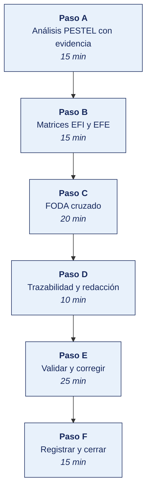

[Semana 07](README.md) · [Teoría](1-TEORIA.md) · [Dinámica de aula](2-DINAMICA.md) · **Taller de laboratorio**

# Taller de laboratorio 07 · Matrices EFI, EFE, PESTEL y FODA cruzado

**SI-886 · Planeamiento Estratégico de TI** · Semana 07 · Sesión 2 en laboratorio · 100 min · calificación **procedimental**

> ¿Un término no le resulta claro? Está definido en el [glosario técnico del curso](../GLOSARIO.md).

---

## Secuencia del taller



## Qué entregas

| | |
|---|---|
| **Archivo** | `SI886-S07-TALLER-Grupo<N>.pdf` |
| **Plantilla obligatoria** | [SI886-PLANTILLA-TALLER.docx](../PLANTILLAS/SI886-PLANTILLA-TALLER.docx) |
| **Formato** | PDF exportado desde la plantilla en Word, con la carátula de la UPT, el índice actualizado y las capturas numeradas |
| **Qué va dentro** | Las secciones de la plantilla. La **5. Resultados y evidencias** se califica contra la tabla de resultados esperados de esta guía, y **cada resultado necesita la evidencia que lo demuestre**. No se copian de aquí los objetivos, la duración ni los resultados de aprendizaje |
| **Dónde se sube** | Aula virtual, tarea «Taller · Semana 07» |
| **Cuándo vence** | 48 horas después de la sesión de laboratorio |

> No se califica un informe entregado en `.docx`, sin carátula, sin los códigos de los integrantes o con resultados declarados sin evidencia.

---

## El reto

| | |
|---|---|
| **Situación** | El equipo tiene decenas de factores sueltos del diagnóstico y ninguna estrategia. La gerencia no quiere una lista, quiere decisiones. |
| **Misión** | Convertir los factores en cuatro estrategias cruzadas, cada una con el proyecto que originaría. |
| **Criterio de éxito** | Cada estrategia cita los códigos de los factores que cruza, y ningún factor entra sin evidencia del diagnóstico. |

## 1. Información sobre el evento práctico

### 1.1. Objetivos

- Construir el **análisis PESTEL** de las seis dimensiones con evidencia, efecto e intensidad.
- Consolidar los factores internos y externos derivados de las secciones Sección 3.1 y Sección 3.2.
- Elaborar y calcular las matrices **EFI** y **EFE** con pesos justificados.
- Construir el **FODA cruzado** y derivar **al menos 12 estrategias**, tres por cuadrante.
- **Priorizar las estrategias** con criterios explícitos.
- Establecer la **trazabilidad** factor → estrategia → objetivo → proyecto.
- Redactar las secciones **Sección 3.3**, **Sección 3.4** y **Sección 3.5** del PETI (Plan Estratégico de Tecnologías de Información).

### 1.2. Recursos

| Recurso | Detalle |
|---|---|
| Secciones Sección 1.1, Sección 3.1 y Sección 3.2 del PETI | Insumo obligatorio |
| **Python 3.11+** con `pandas`, `matplotlib` | Cálculo de matrices y visualización |
| **LibreOffice Calc** | Matrices EFI y EFE |
| **draw.io** | Matriz FODA cruzado |
| Fuentes oficiales | INEI, BCRP, OSIPTEL, MEF, ANPD, MINAM, PCM |
| **Pandoc** | Generación del documento |

### 1.3. Seguridad

1. Los factores internos incluyen debilidades tecnológicas explotables. El documento se clasifica **Confidencial** y las debilidades de seguridad se describen sin detalle técnico explotable.
2. Los datos de la organización se presentan agregados cuando el detalle no es necesario para sustentar el factor.
3. Toda cifra externa se cita con institución, publicación y año; **no se admiten datos sin fuente verificable**.
4. Los factores derivados de entrevistas se registran por cargo, nunca por nombra.

---

## 2. Procedimiento o Metodología

### Paso A — Análisis PESTEL con evidencia

`03_diagnostico/PE01_pestel.csv`:

| id | Dimensión | Factor | Evidencia con cifra | Fuente (institución, publicación, año) | Efecto específico sobre la organización | Tipo (O/A) | Intensidad (1–5) | Horizonte | Decisión que obliga |
|---|---|---|---|---|---|---|---|---|---|
| PE-01 | Político | Política Nacional de Transformación Digital al 2030 | Aprobada por D. S. 085-2023-PCM, con objetivos prioritarios y aplicación obligatoria en el sector público | PCM, 2023 | Si la organización presta servicios al Estado, la interoperabilidad se vuelve requisito contractual | O | 3 | 24–36 m | Evaluar la integración con la PIDE |
| PE-02 | Económico | Volatilidad cambiaria | Variación del tipo de cambio de __ % en 24 meses | BCRP, último dato disponible | El __ % de los contratos de TI está denominado en dólares | A | 4 | Continuo | Cláusulas de cobertura en contratos plurianuales |
| PE-03 | Social | Adopción de smartphone en el segmento de clientes | __ % de hogares con acceso a internet en la región | INEI, ENAHO — última publicación | Viabiliza el canal digital para el __ % de los clientes | O | 4 | 12–24 m | Priorizar el proyecto de canal digital |
| PE-04 | Tecnológico | Fin de soporte de la plataforma en uso | El fabricante anunció fin de soporte anunciado por el fabricante | Documentación oficial del fabricante | El servidor del ERP quedará sin actualizaciones de seguridad | A | 5 | 12–18 m | Proyecto de migración con fecha límite |
| PE-05 | Ecológico/Ético | Gestión de residuos electrónicos | Obligación de manejo de RAEE conforme a la normativa vigente | MINAM | La renovación de equipos requiere disposición certificada | A | 2 | Continuo | Incluir el costo de disposición en el presupuesto |
| PE-06 | Ecológico/Ético | Uso ético de datos de clientes | Recomendación sobre la ética de la IA; principios de la OCDE | UNESCO, 2021; OCDE | El proyecto de analítica debe declarar finalidad y límites del uso de datos | A | 3 | Al implementar | Política de uso ético del dato antes del proyecto de analítica |
| PE-07 | Legal | Nuevo Reglamento de Protección de Datos Personales | D. S. 016-2024-JUS, vigente | ANPD | Obligaciones de consentimiento, seguridad y flujo transfronterizo | A | 5 | Inmediato | Programa de cumplimiento antes de cualquier proyecto de datos |

> **Regla del PESTEL.** Un factor sin **decisión que obliga** no pertenece al análisis. Se retira o se reformula.

### Paso B — Matrices EFI y EFE

**El programa está en [`HERRAMIENTAS/SEMANA-07/PE02_matrices.py`](../HERRAMIENTAS/SEMANA-07/PE02_matrices.py).** Se copia al repositorio del equipo como `03_diagnostico/PE02_matrices.py` y **se edita con los datos de su organización**. El programa hace el cálculo, las cifras y su justificación son del equipo.

```bash
cp ../HERRAMIENTAS/SEMANA-07/PE02_matrices.py 03_diagnostico/PE02_matrices.py
python3 03_diagnostico/PE02_matrices.py
```

| Matriz | Qué mide la calificación | Escala |
|---|---|---|
| **EFI** | La intensidad del factor interno | 1 debilidad mayor · 2 debilidad menor · 3 fortaleza menor · 4 fortaleza mayor |
| **EFE** | **Qué tan bien responde la organización** al factor, no qué tan grave es | 1 respuesta deficiente · 2 por debajo del promedio · 3 por encima · 4 superior |

> **La calificación de la EFE es el error más común de esta semana.** Mide la respuesta de la organización, no la importancia del factor. Un factor gravísimo al que la organización responde bien se califica 4.

> **Cómo se justifica el peso.** Cada peso se sustenta en el diagnóstico. La proporción del costo que representa (Sección 3.1.2), la criticidad de la capacidad (Sección 3.1.5) o la intensidad del factor PESTEL (Sección 3.3). **Un peso sin justificación convierte la matriz en una opinión con decimales.**

### Paso C — FODA cruzado

`03_diagnostico/PE03_foda_cruzado.csv`:

| id | Tipo | Factores cruzados | Estrategia | Objetivo al que apunta | Proyecto candidato | Prioridad preliminar |
|---|---|---|---|---|---|---|
| E-01 | **FO** | F2 + O1 + O2 | Aprovechar la base histórica de compras de 8 400 clientes (F2) para capturar la adopción de smartphone del segmento minorista (O1) con herramientas de analítica accesibles (O2), mediante un canal digital con recomendación personalizada de surtido | Aumentar la participación del canal digital | Canal digital B2B con motor de recomendación | Alta |
| E-02 | **FO** | F1 + O4 | Aprovechar la red de distribución propia (F1) para capturar el crecimiento del consumo regional (O4) mediante planificación de rutas basada en datos | Reducir el costo de despacho | Sistema de ruteo y trazabilidad de despacho | Alta |
| E-03 | **FA** | F1 + A1 | Usar la red de distribución propia con entrega en 24 h (F1) para neutralizar la entrada de mayoristas digitales sin logística local (A1), convirtiendo el tiempo de entrega en diferencial verificable | Retener clientes | Trazabilidad de entrega visible para el cliente | Alta |
| E-04 | **FA** | F4 + A2 | Usar la integración existente del ERP (F4) como base para migrar la plataforma antes del fin de soporte (A2), preservando los procesos ya estandarizados | Asegurar la continuidad operativa | Migración de la plataforma del ERP | **Crítica** |
| E-05 | **DO** | D1 + O2 + O3 | Superar la ausencia de capacidad analítica (D1) aprovechando herramientas de bajo costo (O2) y talento técnico local (O3), mediante un programa de gobierno del dato y formación interna | Habilitar la decisión basada en datos | Gobierno del dato y tablero de gestión | Alta |
| E-06 | **DO** | D3 + O1 | Superar la baja adopción del portal B2B (D3) aprovechando la penetración de smartphone (O1) con un rediseño móvil y un programa de acompañamiento al cliente | Aumentar la adopción del canal | Rediseño móvil y programa de adopción | Alta |
| E-07 | **DA** | D2 + A5 | Reducir la dependencia de un único desarrollador (D2) para mitigar la rotación de personal técnico (A5), documentando la arquitectura y formando un segundo responsable | Reducir el riesgo operativo | Gestión del conocimiento y de la configuración | **Crítica** |
| E-08 | **DA** | D5 + A3 | Reducir la ausencia de programa de cumplimiento (D5) para mitigar la exposición al nuevo Reglamento de Protección de Datos (A3), mediante el registro de actividades de tratamiento y las medidas de seguridad exigidas | Cumplir el marco legal | Programa de cumplimiento de datos personales | **Crítica** |
| E-09 | **DA** | D6 + A2 | Reducir la ausencia de redundancia y de prueba de restauración (D6) para mitigar la obsolescencia de la plataforma (A2), estableciendo continuidad verificable antes de la migración | Asegurar la continuidad | Continuidad de la infraestructura | Alta |

**Priorización preliminar de estrategias.**

```python
# 03_diagnostico/PE04_prioriza_estrategias.py
import pandas as pd
e = pd.read_csv("PE03_foda_cruzado.csv")
efi = pd.read_csv("PE02_matriz_efi.csv").set_index("id")
efe = pd.read_csv("PE02_matriz_efe.csv").set_index("id")
pesos = pd.concat([efi.peso, efe.peso])

def peso_estrategia(fs):
    return round(sum(pesos.get(f.strip(), 0) for f in fs.replace("+", " ").split()), 3)

e["peso_factores"] = e["Factores cruzados"].apply(peso_estrategia)
BONO = {"DA": 1.35, "FA": 1.20, "DO": 1.10, "FO": 1.00}   # supervivencia primero
e["puntaje"] = (e.peso_factores * e.Tipo.map(BONO)).round(3)
e = e.sort_values("puntaje", ascending=False)
e.to_csv("PE04_estrategias_priorizadas.csv", index=False)
print(e[["id","Tipo","puntaje","Proyecto candidato"]].to_string(index=False))
print("\nDistribución por tipo:\n", e.Tipo.value_counts().to_string())
print("\n→ Si predominan DA, la organización está en posición defensiva:")
print("  el PETI debe priorizar continuidad y cumplimiento antes que transformación.")
```

### Paso D — Trazabilidad y redacción

**Matriz de trazabilidad** (`03_diagnostico/PE05_trazabilidad.csv`) — el documento que hace defendible todo el plan:

| Evidencia del diagnóstico | Sección de origen | Factor F/D/O/A | Estrategia | Objetivo (Sección 6.2) | Proyecto (Sección 7.1) |
|---|---|---|---|---|---|
| El ruteo se gestiona en hoja de cálculo y concentra el 22 % del costo operativo | Sección 3.1.1 CV-03 | D4 | E-02 | Reducir el costo de despacho | Sistema de ruteo |
| El fabricante anunció fin de soporte anunciado | Sección 3.3 PE-04 | A2 | E-04, E-09 | Asegurar continuidad | Migración del ERP |
| Un solo desarrollador conoce el portal | Sección 3.1.3 VRIO | D2 | E-07 | Reducir riesgo operativo | Gestión del conocimiento |

```markdown
## 3.3 Análisis PESTEL
### 3.3.1 Metodología y fuentes
### 3.3.2 Factores por dimensión, con evidencia y decisión que obliga
### 3.3.3 Síntesis · factores de mayor intensidad

## 3.4 Análisis FODA
### 3.4.1 Factores internos · fortalezas y debilidades
### 3.4.2 Factores externos · oportunidades y amenazas
### 3.4.3 Matriz EFI, con justificación de los pesos
### 3.4.4 Matriz EFE, con justificación de los pesos
### 3.4.5 Interpretación de la posición estratégica

## 3.5 Estrategias derivadas
### 3.5.1 Matriz FODA cruzado
### 3.5.2 Estrategias FO, FA, DO y DA
### 3.5.3 Priorización de estrategias y su justificación
### 3.5.4 Matriz de trazabilidad evidencia → factor → estrategia → proyecto
```

### Paso E — Validar y corregir (25 min)

El resultado no vale por estar hecho, sino por resistir una comprobación. Se ejecutan estas tres y **se corrige lo que falle antes de cerrar la sesión**.

1. Comprobar que cada factor de la EFI y la EFE viene de una sección del diagnóstico, citada.
2. Verificar que los pesos de las matrices suman uno y que las calificaciones están fundamentadas.
3. Comprobar que cada estrategia cruzada nombra los códigos que cruza y no es una frase general.

> Lo que no se pueda corregir hoy se anota en la sección **Problemas y mejoras** de la evidencia, con lo que faltó y por qué. Un resultado parcial documentado con honestidad vale más que uno declarado sin prueba.

### Paso F — Registrar la evidencia y cerrar (15 min)

Se versiona lo producido, se anota la URL de cada resultado y se responde en dos frases la pregunta de transferencia — **qué riesgo correría una organización real si esto se hiciera mal**.

```bash
git add . && git commit -m "S07: PESTEL, matrices EFI y EFE, FODA cruzado y estrategias — secciones 3.3 a 3.5"
git tag -a v0.7 -m "PETI v0.7 — diagnostico estrategico con estrategias derivadas"
```

---

## 3. Resultados

> **Evidencia obligatoria en GitHub.** Todo resultado de este taller se versiona en el repositorio del equipo. El informe **no consigna capturas sueltas**. Consigna la **URL** del artefacto en GitHub. Una captura no permite verificar autoría, fecha ni contenido; un enlace sí.
>
> | Qué se entrega | Dónde vive | Qué se escribe en el informe |
> |---|---|---|
> | Código y archivos de configuración | Rama del taller, fusionada a `develop` vía Pull Request | URL del Pull Request |
> | Documentos y matrices | `docs/`, en formato de texto versionable | URL del archivo en la rama |
> | Capturas y videos que el taller exija | `docs/evidencias/S07/` | URL del archivo |
> | Salida de comandos | `docs/evidencias/S07/salidas/*.txt` | URL del archivo |
>
> **Etiqueta del taller.** Al cerrar el taller se crea la etiqueta `taller-07` sobre el commit entregado:
>
> ```bash
> git tag -a taller-07 -m "Taller 07 · SI886"
> git push origin taller-07
> ```
>
> La URL que se consigna en el informe apunta a esa etiqueta:
> `https://github.com/<organizacion>/<repositorio>/tree/taller-07`
>
> **El informe es lo que se califica; el repositorio es lo que lo prueba.** Cada resultado de la sección 3 del informe lleva la URL con la que se verifica, y **un resultado sin su URL se califica como no logrado**, por bien redactado que esté. Lo que no se puede abrir no se puede dar por hecho.

### 3.1. Los tres resultados que se califican

Son los que la rúbrica evalúa. El resto de la lista tiene que existir, pero no se califica fila por fila.

| Resultado | Qué demuestra | Dónde está |
|---|---|---|
| **PESTEL con evidencia** | Las seis dimensiones, cada factor con su efecto e intensidad | Matriz PESTEL |
| **EFI y EFE ponderadas** | Pesos que suman uno y calificaciones fundamentadas | Matrices EFI y EFE |
| **Las cuatro estrategias** | FO, FA, DO y DA, con los códigos que cruzan y su proyecto | FODA cruzado |

### 3.2. Lista de comprobación del taller

Todo esto debe existir al cerrar la sesión.

| # | Resultado esperado | Verificación |
|---|---|---|
| 1 | PESTEL con **las seis dimensiones** y al menos un factor por dimensión | `PE01_pestel.csv` |
| 2 | Cada factor con **evidencia con cifra y fuente institucional con año** | Misma tabla |
| 3 | **Cero factores sin «decisión que obliga»** | Revisión de la tabla |
| 4 | Matriz EFI con pesos que suman 1, **cada peso justificado** en el diagnóstico | `PE02_matriz_efi.csv` |
| 5 | Matriz EFE con pesos que suman 1 y **calificaciones que miden la respuesta**, no la gravedad | `PE02_matriz_efe.csv` |
| 6 | Totales ponderados calculados e **interpretados** frente al promedio de 2.5 | Salida de `PE02_matrices.py` |
| 7 | FODA cruzado con **al menos 12 estrategias**, mínimo 3 por cuadrante | `PE03_foda_cruzado.csv` |
| 8 | Cada estrategia **cita los códigos** de los factores que cruza | Misma tabla |
| 9 | Cada estrategia nombra un **proyecto candidato** concreto | Misma tabla |
| 10 | Priorización calculada, con la distribución por tipo interpretada | Salida de `PE04_prioriza_estrategias.py` |
| 11 | Matriz de trazabilidad evidencia → factor → estrategia → proyecto, con **al menos 12 filas** | `PE05_trazabilidad.csv` |
| 12 | Secciones Sección 3.3, Sección 3.4 y Sección 3.5 redactadas · etiqueta `v0.7` | `git tag` |

## Rúbrica procedimental (20 puntos)

Se aplica sobre el informe entregado y la evidencia enlazada en el repositorio. **Cada criterio se califica de forma independiente.**

| Criterio | 4 — Logrado | 2 — En proceso | 0 — Insuficiente |
|---|---|---|---|
| **El criterio de éxito** | Se cumple tal como lo pide el reto de esta sesión | Se cumple con reservas que el equipo declara | No se cumple, o se afirma cumplido sin prueba |
| **PESTEL con evidencia** | Completo y correcto, con la evidencia que lo respalda | Completo con errores menores, o correcto sin toda la evidencia | Incompleto o sin evidencia |
| **EFI y EFE ponderadas** | Completo y correcto, con la evidencia que lo respalda | Completo con errores menores, o correcto sin toda la evidencia | Incompleto o sin evidencia |
| **Las cuatro estrategias** | Completo y correcto, con la evidencia que lo respalda | Completo con errores menores, o correcto sin toda la evidencia | Incompleto o sin evidencia |
| **La validación** | Las tres comprobaciones ejecutadas, y lo que falló quedó corregido o documentado | Ejecutadas sin corregir lo que falló | No se validó nada |

| Puntaje | Equivalencia |
|---|---|
| 18 – 20 | Destacado |
| 14 – 17 | Logrado |
| 6 – 13 | En proceso |
| 0 – 5 | Insuficiente |

> **Un resultado declarado sin evidencia enlazada no se califica**, aunque el trabajo se haya hecho. La tabla de la sección 3.1 es la lista de cotejo; esta rúbrica es lo que determina la nota.

## 4. Conclusiones

Mínimo tres. Líneas argumentales esperadas:

1. El FODA no es el producto del diagnóstico. El producto son las estrategias cruzadas. Un listado de cuatro columnas sin cruce no permite derivar ninguna decisión y por eso la mayoría de los FODA terminan sin uso.
2. La calificación de la matriz EFE mide qué tan bien responde la organización a cada factor, no qué tan grave es el factor; confundirlas produce una matriz que describe el entorno en lugar de evaluar a la organización.
3. La matriz de trazabilidad evidencia → factor → estrategia → proyecto es la que permite defender cada línea del presupuesto ante la gerencia. Un proyecto que no puede rastrearse hasta una evidencia es un proyecto sin justificación.

## 5. Referencias Bibliográficas

- González Millán, J. (2020). *Manual práctico de planeación estratégica*. Ediciones Díaz de Santos. https://elibro.net/es/lc/bibliotecaupt/titulos/129291
- García Sánchez, E. y Valencia Velazco, M. L. *Planeación estratégica: teoría y práctica*. Trillas.
- David, F. R. y David, F. R. (2017). *Strategic Management: A Competitive Advantage Approach* (16.ª ed.). Pearson. — matrices EFI, EFE y FODA cruzado.
- Rodríguez Bermúdez, J. R. (2015). *Planificación y dirección estratégica de sistemas de información*. Editorial UOC. https://elibro.net/es/lc/bibliotecaupt/titulos/57875
- Decreto Supremo 085-2023-PCM, Política Nacional de Transformación Digital al 2030. https://busquedas.elperuano.pe/dispositivo/NL/2200457-5
- Ley 29733 y Decreto Supremo 016-2024-JUS, Reglamento de Protección de Datos Personales. https://www.gob.pe/institucion/anpd
- UNESCO. (2021). *Recomendación sobre la Ética de la Inteligencia Artificial*. https://www.unesco.org/es/artificial-intelligence/recommendation-ethics
- OCDE. *Recomendación del Consejo sobre Inteligencia Artificial*. https://www.oecd.org/
- Ministerio del Ambiente. *Gestión de residuos de aparatos eléctricos y electrónicos*. https://www.gob.pe/minam
- Instituto Nacional de Estadística e Informática. https://www.inei.gob.pe · Banco Central de Reserva del Perú. https://estadisticas.bcrp.gob.pe

## 6. Anexos

- `anexo_A_pestel.xlsx`
- `anexo_B_matrices_efi_efe.xlsx`
- `anexo_C_foda_cruzado.png`
- `anexo_D_estrategias_priorizadas.xlsx`
- `anexo_E_trazabilidad.xlsx`
- `anexo_F_secciones_3_3_a_3_5.pdf`

---

---

[Semana 07](README.md) · [Teoría](1-TEORIA.md) · [Dinámica de aula](2-DINAMICA.md) · **Taller de laboratorio**

---

**Docente** · Dr. Oscar Juan Jimenez Flores
[oscarjimenezflores@upt.pe](mailto:oscarjimenezflores@upt.pe) · [LinkedIn](https://www.linkedin.com/in/oscar-jimenez-flores/) · [CTI Vitae — CONCYTEC](https://ctivitae.concytec.gob.pe/appDirectorioCTI/VerDatosInvestigador.do?id_investigador=33398)

Escuela Profesional de Ingeniería de Sistemas · Universidad Privada de Tacna · Tacna, Perú
