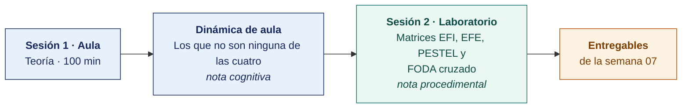

  
  &nbsp;&nbsp;&nbsp;&nbsp;&nbsp;&nbsp;
  

  <strong>Universidad Privada de Tacna</strong> 
  Facultad de Ingeniería · Escuela Profesional de Ingeniería de Sistemas

<h1 align="center">Semana 07 · Análisis de la Organización con FODA y PESTEL</h1>

  <strong>SI-886 · Planeamiento Estratégico de TI</strong> 
  4 horas académicas de 50 min · 100 min de teoría con la dinámica incluida en aula · 100 min de taller en laboratorio

---

## Datos de la asignatura

| | |
|---|---|
| **Asignatura** | SI-886 · Planeamiento Estratégico de TI |
| **Escuela** | Escuela Profesional de Ingeniería de Sistemas |
| **Ciclo** | VIII · 04 horas semanales · 03 créditos · Obligatorio |
| **Unidad** | II — Plan de Gobierno Digital — enfoque estratégico, objetivos, proyectos, riesgos y supervisión |
| **Semana** | 07 de 17 |
| **Duración** | 4 horas académicas de 50 min · 100 min de teoría con la dinámica incluida en aula · 100 min de taller en laboratorio |
| **Resultados de aprendizaje** | **RA1** Analiza la normativa y herramientas TI · **RA2** Evalúa la situación actual del gobierno digital |

### Lo que indica el sílabo

**Contenido conceptual.** Análisis de la organización FODA y PESTEL.

**Contenido procedimental.** Plantea la matriz con las fortalezas y debilidades, oportunidades y amenazas de una organización. Identifica los factores políticos, económicos, sociales, tecnológicos, éticos y legales.

## Materiales de esta semana

| | Documento | Qué encontrarás | Dónde y cuánto dura |
|---|---|---|---|
| 1 | **[Teoría](1-TEORIA.md)** | El análisis PESTEL del entorno · El análisis FODA y sus errores frecuentes · El FODA cruzado y las estrategias derivadas | Aula · 100 min |
| 2 | **[Dinámica de aula](2-DINAMICA.md)** | Los que no son ninguna de las cuatro, con su material, su ejemplo resuelto y su rúbrica | Aula · dentro de los 100 min de la sesión de teoría |
| 3 | **[Taller de laboratorio](3-TALLER.md)** | Matrices EFI, EFE, PESTEL y FODA cruzado | Laboratorio · 100 min |

## Ruta de la semana

## Entregables

| Entregable | Formato y nombre del archivo | Vence |
|---|---|---|
| **Dinámica de aula** · Los que no son ninguna de las cuatro | PDF desde la [plantilla de dinámica](../PLANTILLAS/SI886-PLANTILLA-DINAMICA.docx) · `SI886-S07-DINAMICA-Grupo<N>.pdf` | Antes de cerrar la sesión de teoría |
| **Informe del taller de laboratorio N.º 07** | PDF en formato EPIS desde la [plantilla de taller](../PLANTILLAS/SI886-PLANTILLA-TALLER.docx) · `SI886-S07-TALLER-Grupo<N>.pdf` | 48 h después del taller |
| Secciones Sección 3.3 a Sección 3.5 del PETI (Plan Estratégico de Tecnologías de Información) · etiqueta `v0.7` | Commit en Git | 48 h después del laboratorio |

> Ambos se entregan en **PDF**, con la carátula de la UPT y los códigos de todos los integrantes. Las plantillas obligatorias están en [`PLANTILLAS/`](../PLANTILLAS/).

## Cómo se evalúa

| Criterio | Instrumento | Peso |
|---|---|---|
| Cognitivo | Rúbrica de «Los que no son ninguna de las cuatro» + exposición de 10 min en la Semana 08 | 25 % |
| Procedimental | Lista de cotejo de los 12 resultados del laboratorio | 35 % |
| Actitudinal | Rigor en la citación de fuentes y en la justificación de los pesos | 15 % |

## Preparación de la evidencia del Atributo del Graduado

> **Esta semana prepara la evidencia del atributo, y no se registra.** Las dos capturas que la Escuela fija son la de la **Semana 05** y la de la **Semana 16**. Lo que se produce aquí alimenta esas dos y **no modifica tu calificación** ni añade trabajo adicional.

| | |
|---|---|
| **Atributo** | **AG-I01 · El Profesional y el Mundo** |
| **Criterio medido** | **CD1** · Comprende el alcance local y global de TICs/SI en la integración de la sociedad y las organizaciones |
| **Alineación con el sílabo** | **RA1** Analiza la normativa y herramientas TI · Contenido procedimental del sílabo, **literal**: «Identifica los factores políticos, económicos, sociales, tecnológicos, **éticos y legales**». El PESTEL del sílabo contiene, palabra por palabra, las dimensiones del atributo |
| **Evidencia que se lee** | `SI886-S07-TALLER-Grupo<N>.pdf` · matrices PESTEL y EFE, con las conclusiones del entorno |
| **Instrumento** | [Rúbrica AG-I01, escala 1–4](../ASSESSMENT/RUBRICAS-AG.md#ag-i01) |
| **Tipo de medición** | **Preparación de la evidencia** · no se registra |
| **Adónde va** | Alimenta la captura de la [Semana 16](../SEMANA-16/README.md) |

**Qué mira el evaluador.** Si el PESTEL distingue el plano global del local y fundamenta los pesos, o traslada factores genéricos sin vincularlos a la organización. Es la práctica que sostiene el criterio CD1 y llega, ya consolidada, a la captura sumativa de la Semana 16.

Mapa completo en [`ASSESSMENT/MAPA-AG.md`](../ASSESSMENT/MAPA-AG.md).

## Preparación para la Semana 08

- **Leer.** Decreto Legislativo 1412, Ley de Gobierno Digital, y su Reglamento D. S. 029-2021-PCM.
- **Leer.** Decreto Supremo 085-2023-PCM, Política Nacional de Transformación Digital al 2030.
- **Revisar.** Estándares de Interoperabilidad de la PIDE y la normativa de gobierno digital de la PCM.
- **Recopilar.** La normativa **sectorial** aplicable a la organización (regulador, obligaciones específicas, plazos).

---

**Docente** · Dr. Oscar Juan Jimenez Flores
[oscarjimenezflores@upt.pe](mailto:oscarjimenezflores@upt.pe) · [LinkedIn](https://www.linkedin.com/in/oscar-jimenez-flores/) · [CTI Vitae — CONCYTEC](https://ctivitae.concytec.gob.pe/appDirectorioCTI/VerDatosInvestigador.do?id_investigador=33398)

Escuela Profesional de Ingeniería de Sistemas · Universidad Privada de Tacna · Tacna, Perú
