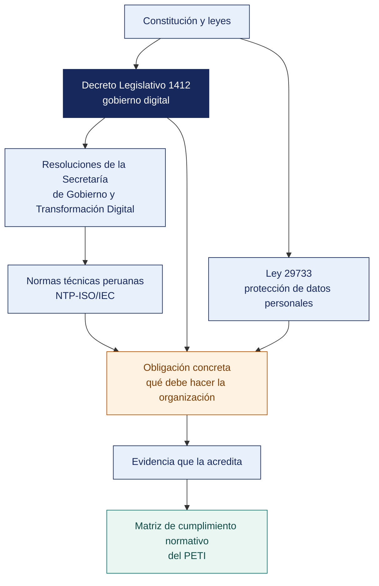

[Semana 08](README.md) · **Teoría** · [Dinámica de aula](2-DINAMICA.md) · [Taller de laboratorio](3-TALLER.md)

# Teoría · Normas Nacionales · Marco Normativo de las TIC en el Perú

**SI-886 · Planeamiento Estratégico de TI** · Semana 08 · Sesión 1 en aula · 2 horas académicas, 100 min, con la dinámica incluida

> ¿Un término no le resulta claro? Está definido en el [glosario técnico del curso](../GLOSARIO.md).

---

## La pregunta de esta sesión

Un plan de TI dedica su anexo C a listar catorce normas que le aplican a la organización. Está completo y bien citado.

Dos de esas normas tienen plazo de cumplimiento vencido. El plan las menciona en el anexo y no las convierte en ningún proyecto. La cartera aprobada, que ordena las inversiones por retorno esperado, no las incluye en ningún año.

> **La pregunta que ordena esta sesión.** *¿Dónde debe vivir la normativa dentro de un plan, y por qué no en un anexo?*

## Antes de empezar

| Lo que necesita traer | De dónde sale |
|---|---|
| El FODA, el PESTEL y las estrategias derivadas | Semana 07 |
| Los instrumentos de planeamiento y el régimen de la organización | Semana 03 |
| La postura de TI y las tendencias con fuente | Semana 02 |
| El diagnóstico completo de la organización | Trabajo acumulado |

> **Exploración (5 min), antes de cualquier definición.** El aula responde antes de la teoría y se anota. *¿Está bien ese anexo? ¿Qué debería pasar con las dos normas vencidas? ¿Compiten esos proyectos con los demás por presupuesto?* No se corrige nada todavía.

## Distribución del tiempo

| Momento | Minutos |
|---|---|
| El caso del anexo C y la exploración inicial | 8 |
| **Bloque 1.** Por qué el marco normativo es una sección del plan · con su microaplicación | 18 |
| **Bloque 2.** La arquitectura normativa del gobierno digital peruano | 20 |
| **Bloque 3.** Cómo se resume una norma para que sirva | 14 |
| Cierre, respuesta a la pregunta de la sesión y puente a la dinámica | 5 |
| **Total de la sesión de aula** | **65** |

## Mapa de la sesión



---

## Bloque 1 · Por qué el marco normativo es una sección del PETI

> **La pregunta del bloque.** *¿Es la normativa contexto del plan o materia prima del plan?*

**El error de tratarlo como anexo.** Muchos planes relegan la normativa a un anexo o a una lista de leyes en la introducción. Es un error de método **la normativa no es contexto, es un conjunto de requisitos obligatorios que determinan proyectos, plazos y presupuesto**.

| Naturaleza del requisito | Consecuencia en el PETI |
|---|---|
| Obligación legal con plazo vencido | **Proyecto no negociable, prioridad crítica**, con fecha |
| Obligación legal con plazo futuro | Proyecto con fecha límite determinada por la norma, no por el equipo |
| Obligación contractual con cliente o regulador | Proyecto habilitante de la relación comercial |
| Norma técnica de adopción voluntaria | Proyecto priorizable por criterio de valor |
| Buena práctica de referencia | Criterio de diseño, no proyecto en sí |

> **Regla de priorización.** Los proyectos derivados de obligaciones legales con plazo **no compiten** con los demás en la matriz de priorización. Entran directamente al portafolio con su fecha. Lo que se prioriza es todo lo demás.

> **El error frecuente del bloque.** Relegar la normativa a un anexo. Es un error de método, no de forma. **La normativa no es contexto, es un conjunto de requisitos obligatorios que determinan proyectos, plazos y presupuesto**, y un proyecto derivado de una obligación con plazo no compite en la matriz de priorización. Entra directamente con su fecha.

## Bloque 2 · La arquitectura normativa del gobierno digital peruano

> **La pregunta del bloque.** *¿Qué obligaciones concretas generan proyectos, y en qué nivel normativo viven?*

**Los cuatro niveles.**

```
  NIVEL 1 — LEY
  Decreto Legislativo 1412 · Ley de Gobierno Digital
      Marco de gobernanza, principios, arquitectura digital del Estado

  NIVEL 2 — REGLAMENTO
  Decreto Supremo 029-2021-PCM · Reglamento de la Ley de Gobierno Digital
      Desarrolla la ley: roles, procesos, servicios digitales, seguridad

  NIVEL 3 — POLÍTICA NACIONAL
  Decreto Supremo 085-2023-PCM · Política Nacional de Transformación
  Digital al 2030 — objetivos prioritarios, lineamientos, indicadores

  NIVEL 4 — NORMATIVA TÉCNICA DE LA SGTD
  Resoluciones de la Secretaría de Gobierno y Transformación Digital
      · RSGD 005-2018-PCM/SEGDI — Lineamientos del Plan de Gobierno Digital
      · RM 119-2018-PCM — Comité y Líder de Gobierno Digital
      · RSGTD 003-2023-PCM/SGTD — uso obligatorio de la NTP-ISO/IEC 27001 vigente
      · Estándares de Interoperabilidad de la PIDE
```

**Las obligaciones concretas que generan proyectos.**

| Ámbito | Norma | Obligación auditable | Proyecto típico que genera |
|---|---|---|---|
| **Gobernanza digital** | D. Leg. 1412 · D. S. 029-2021-PCM · RM 119-2018-PCM | Conformar el **Comité de Gobierno Digital**; designar al **Líder de Gobierno Digital** | Formalización del gobierno digital de la entidad |
| **Planeamiento digital** | RSGD 005-2018-PCM/SEGDI | Contar con **Plan de Gobierno Digital** aprobado por el titular, por al menos 3 años, **actualizado y evaluado anualmente** | **Este propio PETI/PGD** |
| **Seguridad de la información** | RSGTD 003-2023-PCM/SGTD | Usar obligatoriamente la **NTP-ISO/IEC 27001 vigente** (edición 2022) para el SGSI (Sistema de Gestión de Seguridad de la Información) | Implementación del SGSI |
| **Interoperabilidad** | D. S. 029-2021-PCM · Estándares de la PIDE | Interoperar mediante la **Plataforma de Interoperabilidad del Estado**; no solicitar al ciudadano información que el Estado ya posee | Integración con la PIDE |
| **Datos personales** | Ley 29733 · D. S. 016-2024-JUS (vigente desde el 31/03/2025) | Base legal del tratamiento, consentimiento, medidas de seguridad, derechos ARCO, flujo transfronterizo, notificación de brechas | Programa de cumplimiento de datos personales |
| **Datos abiertos** | Normativa de la SGTD sobre gobierno de datos | Publicar datos en formatos abiertos y reutilizables | Portal de datos abiertos institucional |
| **Identidad digital** | D. Leg. 1412 · D. S. 029-2021-PCM | Uso de mecanismos de identificación digital del Estado | Integración con servicios de identidad digital |
| **Firma digital** | Ley 27269 y su reglamento | Uso de firma digital con entidades de certificación acreditadas | Digitalización de trámites con valor legal |
| **Transparencia** | Ley 27806, Ley de Transparencia y Acceso a la Información Pública | Portal de transparencia estándar actualizado | Automatización de la publicación |
| **Software** | D. Leg. 822 | Uso de software con licencia válida | Regularización y gestión de licencias |
| **Delitos informáticos** | Ley 30096 y Ley 30171 | Marco penal del acceso ilícito y del atentado a la integridad de datos y sistemas | Delimita lo que se puede probar y monitorear |
| **Control interno** *(entidades públicas)* | Ley 28716 y directivas de la Contraloría | Implementar y evaluar el sistema de control interno | Fortalecimiento del control interno de TI |
| **Sistema financiero** | Resolución SBS 504-2021 y modificatorias | **SGSI-C**, gestión de incidentes, autenticación reforzada, reporte al supervisor | Programa de ciberseguridad regulatorio |

**Para organizaciones privadas no supervisadas.** El marco se reduce, pero no desaparece — Ley 29733 y su Reglamento, D. Leg. 822, Ley 30096, Ley 27269, normativa de SUNAT sobre comprobantes y libros electrónicos, y la normativa laboral sobre el uso de recursos informáticos. **El error frecuente es asumir que «como somos privados no nos aplica nada»**. La protección de datos personales alcanza a toda organización que trate datos de personas naturales.

> **El error frecuente del bloque.** Citar el marco de gobierno digital en una organización privada. Ese marco alcanza a las entidades públicas, y aplicarlo a una sociedad anónima descalifica el capítulo entero. La organización privada tiene su propio conjunto de obligaciones —tributarias, de datos personales, de propiedad intelectual y sectoriales—, que es más corto y más fácil de pasar por alto.

## Bloque 3 · Cómo se resume una norma para que sirva

> **La pregunta del bloque.** *¿Qué hay que extraer de una norma de ochenta artículos para que el plan la pueda usar?*

**El defecto del resumen normativo típico.** Se copia el índice de la norma o se parafrasea su artículo 1. El resultado no permite decidir nada.

**Estructura de un resumen normativo útil para un PETI.**

| Campo | Contenido |
|---|---|
| **Identificación** | Tipo, número, fecha de publicación, fecha de vigencia, norma que modifica o deroga |
| **Ámbito de aplicación** | A quién obliga exactamente. **¿Nos alcanza? ¿Por qué?** |
| **Autoridad de control** | Quién fiscaliza y sanciona |
| **Obligaciones concretas** | Lista de obligaciones **verificables**, con el artículo que las establece |
| **Plazos** | Fechas límite, periodicidades, plazos de respuesta |
| **Evidencia de cumplimiento** | Qué documento o registro demuestra que se cumple cada obligación |
| **Estado actual de la organización** | Cumple / cumple parcialmente / no cumple, con evidencia |
| **Brecha y proyecto asociado** | Qué falta y qué proyecto lo cierra |
| **Consecuencia del incumplimiento** | Sanción, tipo y rango si está establecido |

> **La fila que convierte el resumen en insumo del plan es «Evidencia de cumplimiento».** Si la organización no puede exhibir el documento, no cumple, con independencia de lo que declare.

**Cómo se lee una norma.** Orden práctico. (1) **disposiciones complementarias finales y transitorias** —ahí están las fechas de entrada en vigencia y los plazos de adecuación—; (2) **ámbito de aplicación** —para saber si obliga—; (3) **definiciones** —el vocabulario es normativo—; (4) el articulado con las obligaciones; (5) el régimen sancionador.

**Ejemplo trabajado — el mismo resumen, mal hecho y bien hecho.** Norma — **Ley 29733, Ley de Protección de Datos Personales**, y su Reglamento, el **D. S. 016-2024-JUS**. **Organización.** Una distribuidora mayorista privada, con datos de 157 trabajadores y de 8 400 bodegas cliente.

| | Así no | Así sí |
|---|---|---|
| **Identificación** | «Ley de Protección de Datos Personales» | Ley 29733, publicada el 03/07/2011; Reglamento D. S. 016-2024-JUS, que deroga al D. S. 003-2013-JUS |
| **Ámbito** | «Regula la protección de datos personales» | **Nos alcanza:** tratamos datos de personas naturales —planilla y titulares de bodegas— en bancos de datos bajo nuestro control |
| **Autoridad** | No lo dice | Autoridad Nacional de Protección de Datos Personales (ANPD), Ministerio de Justicia |
| **Obligación concreta** | «Proteger los datos» | Inscribir los bancos de datos; declarar base legal por finalidad; atender derechos ARCO en plazo; adoptar medidas de seguridad; notificar brechas |
| **Plazo** | No lo dice | Derechos de acceso: 20 días hábiles. Rectificación, cancelación y oposición: 10 días hábiles |
| **Evidencia de cumplimiento** | No lo dice | Registro de actividades de tratamiento; constancias de inscripción; cláusulas de consentimiento firmadas; procedimiento ARCO con acuses |
| **Estado actual** | «En proceso» | **No cumple.** No existe inventario de datos personales ni registro de tratamiento; el consentimiento no se recoge en el portal de pedidos |
| **Brecha y proyecto** | No lo dice | Proyecto P-04 «Programa de cumplimiento de datos personales», Sección 7.1, con fecha determinada por la norma |
| **Consecuencia** | «Sanciones» | Infracciones leves, graves y muy graves con multa en UIT, según la escala del régimen sancionador vigente |

> **La columna de la izquierda no permite decidir nada.** No dice si obliga, no dice qué falta, no dice qué cuesta incumplir y, sobre todo, **no genera ningún proyecto**. Un marco normativo que no produce filas en el portafolio de la Sección 7 es un anexo, no una sección del plan.

> **Microaplicación (5 min) · qué proyecto genera cada obligación.** El docente enuncia cuatro obligaciones de distinta naturaleza y el aula responde, para cada una, **qué tipo de proyecto genera y con qué prioridad**. La de plazo vencido se deja para el final.

| Caso | Qué debe contener una buena respuesta |
|---|---|
| ¿Por qué se leen primero las disposiciones complementarias? | Porque ahí están la entrada en vigencia y los plazos de adecuación. Una obligación cuyo plazo ya venció cambia por completo la prioridad del proyecto |
| Una organización privada dice que «esa norma es para el Estado». ¿Qué se responde? | Que el D. Leg. 1412 y sus resoluciones sí son del Estado, pero la Ley 29733, el D. Leg. 822 y la normativa de SUNAT alcanzan a toda organización que trate datos o use software |
| ¿Cómo se prioriza un proyecto de origen normativo frente a uno de valor? | No compite: entra al portafolio con la fecha que fija la norma. La priorización por valor se aplica al resto del portafolio |

## Cierre · qué se lleva de aquí

**La respuesta a la pregunta con la que abrimos.** La normativa vive en una **sección del plan**, no en un anexo, porque de ella salen proyectos con fecha impuesta desde fuera. Las dos normas vencidas del caso no son información de contexto — son los dos proyectos más urgentes de la cartera, y no debían competir por retorno con ninguno de los demás. Lo que se prioriza es todo lo otro.

**Las tres ideas que deben quedar.**

| Idea | Por qué importa en el ejercicio profesional |
|---|---|
| La naturaleza del requisito determina el tipo de proyecto que genera | Una obligación con plazo vencido es prioridad crítica; una buena práctica es criterio de diseño |
| Los proyectos de obligación legal con plazo no entran a la matriz de priorización | Entran al portafolio con su fecha, y esa es la regla que protege el cumplimiento |
| El régimen de la organización decide qué normativa la alcanza | Citar el marco equivocado descalifica el capítulo normativo entero |

**Volviendo a la exploración del inicio.** Se releen las respuestas del inicio. Casi todo el mundo detecta que las normas vencidas son un problema, y casi nadie dice que **no deben competir por presupuesto**. Esa regla es lo que separa un plan que cumple de uno que aspira a cumplir.

**Lo que sigue.** La [dinámica de esta sesión](2-DINAMICA.md) somete a la organización a una inspección simulada y pide, obligación por obligación, **qué evidencia exhibiría hoy**. Las que no tienen respuesta son los proyectos de la sección normativa.


**Pregunta de cierre.** *¿cuál es la obligación normativa que esta organización incumple hoy y que le costaría más si un fiscalizador llegara mañana?* Ese es el primer proyecto no negociable del portafolio.
---

---

[Semana 08](README.md) · **Teoría** · [Dinámica de aula](2-DINAMICA.md) · [Taller de laboratorio](3-TALLER.md)

---

**Docente** · Dr. Oscar Juan Jimenez Flores
[oscarjimenezflores@upt.pe](mailto:oscarjimenezflores@upt.pe) · [LinkedIn](https://www.linkedin.com/in/oscar-jimenez-flores/) · [CTI Vitae — CONCYTEC](https://ctivitae.concytec.gob.pe/appDirectorioCTI/VerDatosInvestigador.do?id_investigador=33398)

Escuela Profesional de Ingeniería de Sistemas · Universidad Privada de Tacna · Tacna, Perú
