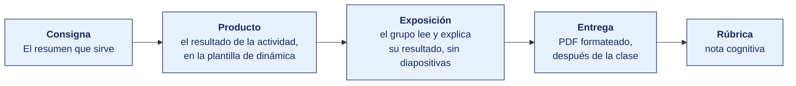

[Semana 08](README.md) · [Teoría](1-TEORIA.md) · **Dinámica de aula** · [Taller de laboratorio](3-TALLER.md)

# Dinámica de aula · Inspección normativa

**SI-886 · Planeamiento Estratégico de TI** · Semana 08 · Actividad en aula, **dentro de los 100 min de la sesión de teoría** · calificación **cognitiva**

> ¿Un término no le resulta claro? Está definido en el [glosario técnico del curso](../GLOSARIO.md).

---

## Cómo funciona la actividad

## Qué entregas

| | |
|---|---|
| **Archivo** | `SI886-S08-DINAMICA-Grupo<N>.pdf` |
| **Plantilla obligatoria** | [SI886-PLANTILLA-DINAMICA.docx](../PLANTILLAS/SI886-PLANTILLA-DINAMICA.docx) |
| **Formato** | PDF exportado desde la plantilla en Word, con la carátula de la UPT y los apellidos, nombres y códigos de todos los integrantes |
| **Qué va dentro** | Lo que el grupo resolvió en aula. Las tablas de la sección **Producto** van completas, con los textos redactados, y cada decisión va justificada |
| **Dónde se sube** | Aula virtual, tarea «Dinámica · Semana 08» |
| **Cuándo vence** | Hasta 24 h después de la sesión de teoría. La tabla se resuelve en aula; el PDF se formatea y se sube después |
| **Exposición** | En la ronda de cierre de **esta misma sesión**. El grupo **lee y explica su resultado** ante el aula, con el documento a la vista. No se usan diapositivas |

> No se califica un trabajo entregado en `.docx`, sin carátula, sin los códigos de los integrantes o con las tablas del producto vacías.

---

## Consigna

> **«Inspección normativa»**
> Llega una inspección a la entidad. El fiscalizador trae la norma; la entidad tiene que exhibir la evidencia de que la cumple, o reconocer la brecha por escrito.

| | |
|---|---|
| **Su papel** | Una mitad del equipo es la **entidad inspeccionada**. La otra es el **fiscalizador** |
| **Misión** | Cerrar el acta de inspección — qué se cumple, qué no, y con qué proyecto y plazo se cierra cada brecha |
| **Restricción** | El fiscalizador **cita artículo por artículo**. La entidad no puede alegar cumplimiento sin nombrar el documento que lo probaría |

Cada equipo trabaja con **una norma nacional distinta**, la que le fue asignada.

## Cómo se desarrolla · 35 minutos

| | Bloque | Quién | Minutos |
|---|---|---|---|
| **1** | **Preparación.** Cada mitad del equipo prepara lo suyo. El fiscalizador arma sus preguntas por artículo. La entidad reúne qué evidencia podría exhibir hoy | Equipo | 9 |
| **2** | **La inspección.** Artículo por artículo. El fiscalizador pregunta, la entidad exhibe o reconoce | Equipo | 10 |
| **3** | **El acta.** Obligaciones cumplidas, brechas encontradas, y el proyecto que cierra cada una con su plazo normativo | Equipo | 8 |
| **4** | **Ronda en aula.** La obligación que **ninguna** entidad del aula podría acreditar hoy | Todos | 8 |

## Producto

**El acta de inspección.**

| Obligación, con su artículo | ¿Nos alcanza? | Evidencia que exhibiríamos hoy | Estado | Proyecto que cierra la brecha | Plazo normativo |
|---|---|---|---|---|---|

**Estado**, uno de estos tres — cumple, cumple parcialmente o no cumple.

**Y el resumen de la norma**, con los nueve campos de la teoría, sobre la norma asignada al equipo.

> **Dónde va.** Este producto se presenta en la **sección 2 de la [plantilla de dinámica](../PLANTILLAS/SI886-PLANTILLA-DINAMICA.docx)**, «El producto». No se copia la consigna ni la teoría. Solo el resultado y lo que lo sostiene.

## Ejemplo resuelto

*El caso de este ejemplo es distinto del que le toca a tu grupo. Sirve para que veas el nivel de detalle que se espera, no para copiarlo.*

**La norma del ejemplo.** Decreto Legislativo 1412, Ley de Gobierno Digital, sobre una municipalidad distrital.

**El acta de inspección.**

| Obligación, con su artículo | ¿Nos alcanza? | Evidencia que exhibiríamos hoy | Estado | Proyecto que cierra la brecha | Plazo |
|---|---|---|---|---|---|
| Art. 33 · Designar al Líder de Gobierno Digital | Sí, toda entidad | Ninguna. No hay resolución de designación | **No cumple** | Resolución de alcaldía designando al Líder | Inmediato |
| Art. 30 · Contar con el Comité de Gobierno Digital | Sí | Ninguna | **No cumple** | Constitución del Comité, con acta de instalación | 30 días |
| Art. 8 · Interoperabilidad a través de la PIDE | Sí, para los datos que ya están en la PIDE | Convenio firmado en 2023, sin servicios consumidos | **Cumple parcialmente** | Consumo del servicio de RENIEC para validar el DNI en la mesa de partes | 6 meses |

**La ronda de preguntas, tal como ocurrió.** El fiscalizador preguntó por el Líder. La entidad respondió que «lo ve el jefe de sistemas». El fiscalizador pidió la resolución. No existía. La entidad lo reconoció en el acta.

**La diferencia entre aprobar y no aprobar**

| Así no | Así sí |
|---|---|
| «Incumple la ley de gobierno digital.» | «Incumple el artículo 33 del D. Leg. 1412: no hay resolución que designe al Líder de Gobierno Digital.» |
| «Sí lo hacemos, lo ve el jefe de sistemas.» | «No cumple. La función se ejerce de hecho, pero no hay acto administrativo que la designe.» |
| «Se implementará el gobierno digital.» | «Resolución de alcaldía designando al Líder. Plazo, inmediato, porque la obligación ya está vencida.» |

## Reglas

- 35 min en aula, dentro de la sesión de teoría.
- Toda observación del fiscalizador **cita el artículo**. «Incumple la ley» no es una observación.
- La entidad **no puede alegar sin documento**. Decir «sí lo hacemos» sin nombrar dónde consta equivale a no cumplir.
- Reconocer una brecha **no baja la nota**. Ocultarla sí la baja.
- Cada brecha necesita **plazo normativo**, no un plazo inventado.
- La exposición es la ronda de cierre de esta misma sesión. El grupo **lee y explica su resultado**. No se usan diapositivas.

## Rúbrica cognitiva (20 puntos)

| Criterio | 5 | 3 | 1 |
|---|---|---|---|
| **La cita normativa** | Cada observación con su artículo exacto de la norma asignada | La mayoría con artículo | Se cita la norma sin el artículo |
| **La evidencia exigida** | Para cada obligación se nombra el documento concreto que la probaría | Se nombra en la mayoría | Se afirma cumplimiento sin documento |
| **El acta** | Estado correcto en cada obligación, con las brechas reconocidas sin adorno | Estados correctos con alguna brecha suavizada | Todo aparece como cumplido |
| **El cierre de brechas** | Cada brecha con su proyecto y su plazo normativo | Proyecto sin plazo, o plazo inventado | Sin proyecto |

---

---

[Semana 08](README.md) · [Teoría](1-TEORIA.md) · **Dinámica de aula** · [Taller de laboratorio](3-TALLER.md)

---

**Docente** · Dr. Oscar Juan Jimenez Flores
[oscarjimenezflores@upt.pe](mailto:oscarjimenezflores@upt.pe) · [LinkedIn](https://www.linkedin.com/in/oscar-jimenez-flores/) · [CTI Vitae — CONCYTEC](https://ctivitae.concytec.gob.pe/appDirectorioCTI/VerDatosInvestigador.do?id_investigador=33398)

Escuela Profesional de Ingeniería de Sistemas · Universidad Privada de Tacna · Tacna, Perú
