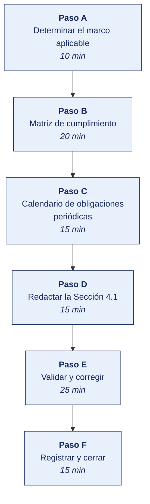

[Semana 08](README.md) · [Teoría](1-TEORIA.md) · [Dinámica de aula](2-DINAMICA.md) · **Taller de laboratorio**

# Taller de laboratorio 08 · Matriz de cumplimiento normativo del PETI

**SI-886 · Planeamiento Estratégico de TI** · Semana 08 · Sesión 2 en laboratorio · 100 min · calificación **procedimental**

> ¿Un término no le resulta claro? Está definido en el [glosario técnico del curso](../GLOSARIO.md).

---

## Secuencia del taller



## Qué entregas

| | |
|---|---|
| **Archivo** | `SI886-S08-TALLER-Grupo<N>.pdf` |
| **Plantilla obligatoria** | [SI886-PLANTILLA-TALLER.docx](../PLANTILLAS/SI886-PLANTILLA-TALLER.docx) |
| **Formato** | PDF exportado desde la plantilla en Word, con la carátula de la UPT, el índice actualizado y las capturas numeradas |
| **Qué va dentro** | Las secciones de la plantilla. La **5. Resultados y evidencias** se califica contra la tabla de resultados esperados de esta guía, y **cada resultado necesita la evidencia que lo demuestre**. No se copian de aquí los objetivos, la duración ni los resultados de aprendizaje |
| **Dónde se sube** | Aula virtual, tarea «Taller · Semana 08» |
| **Cuándo vence** | 48 horas después de la sesión de laboratorio |

> No se califica un informe entregado en `.docx`, sin carátula, sin los códigos de los integrantes o con resultados declarados sin evidencia.

---

## El reto

| | |
|---|---|
| **Situación** | La organización no sabe qué normas le obligan, y el plan podría proponer proyectos que ya son obligación legal vencida. |
| **Misión** | Determinar el marco normativo aplicable y construir la matriz de cumplimiento con evidencia por obligación. |
| **Criterio de éxito** | Cada obligación de la matriz trae su artículo exacto, la evidencia que la organización podría exhibir hoy y su estado real. |

## 1. Información sobre el evento práctico

### 1.1. Objetivos

- Determinar el **marco normativo aplicable** mediante un árbol de decisión por naturaleza y sector.
- Construir la **matriz de cumplimiento** con obligación, artículo, evidencia, estado y responsable.
- Evaluar el **estado real de cumplimiento** con evidencia documental, no declarativa.
- Identificar los **proyectos no negociables** derivados de obligaciones legales, con su plazo.
- Construir el **calendario de obligaciones periódicas** de la organización.
- Redactar la **Sección 4.1** del PETI (Plan Estratégico de Tecnologías de Información).

### 1.2. Recursos

| Recurso | Detalle |
|---|---|
| **Plataforma del Estado Peruano** | https://www.gob.pe — normas legales por institución |
| **Normativa sobre gobierno digital — PCM** | https://www.gob.pe/institucion/pcm/colecciones/147-normativa-sobre-gobierno-digital |
| **Diario Oficial El Peruano** | https://busquedas.elperuano.pe |
| **ANPD** | https://www.gob.pe/institucion/anpd |
| **SBS**, **SMV**, **Contraloría**, **INDECOPI**, **SUNAT** | Normativa sectorial |
| **Python 3.11+** con `pandas` | Matriz y calendario |
| **LibreOffice Calc** | Matriz de cumplimiento |
| Los 8 resúmenes normativos de la dinámica de aula | Base compartida del curso |

### 1.3. Seguridad

1. La matriz de cumplimiento **documenta los incumplimientos de la organización**. Es información **Restringida** su divulgación podría exponerla a fiscalización o a demanda.
2. Se acuerda con la organización, antes de elaborarla, **cómo se comunicarán los resultados** y a quién.
3. El análisis es **técnico**, no asesoría legal. Todo hallazgo con implicancia sancionatoria se comunica con la recomendación explícita de validarlo con asesoría legal.
4. El equipo no emite juicios sobre responsabilidades personales. Describe el estado de cumplimiento por obligación.

---

## 2. Procedimiento o Metodología

> **Documento adicional del caso.** La organización entrega también **Registro de tratamiento de datos e inventario de software**, en `CASOS/EMPRESA-<NN>-<slug>/documentos/registro-datos-y-licencias.md`.

### Paso A — Determinar el marco aplicable

Árbol de decisión, documentado en `04_normativa/NO01_marco_aplicable.md`:

```
¿La organización trata datos de personas naturales
 (clientes, trabajadores, postulantes, proveedores personas naturales)?
   └─ SÍ → Ley 29733 + D.S. 016-2024-JUS   [aplica a prácticamente toda organización]
         └─ ¿Trata datos SENSIBLES (salud, biometría, ingresos, convicciones)?
               └─ SÍ → consentimiento expreso + medidas reforzadas
         └─ ¿Almacena o procesa datos fuera del Perú (nube, correo, respaldo)?
               └─ SÍ → régimen de flujo transfronterizo

¿Es entidad de la administración pública?
   └─ SÍ → D. Leg. 1412 + D.S. 029-2021-PCM + D.S. 085-2023-PCM
         + RSGD 005-2018-PCM/SEGDI (PGD)  + RM 119-2018-PCM (Comité y Líder)
         + RSGTD 003-2023-PCM/SGTD (NTP-ISO/IEC 27001 vigente)
         + Ley 27806 (transparencia) + Ley 28716 (control interno)
         + Estándares de Interoperabilidad de la PIDE

¿Pertenece al sistema financiero, de seguros o AFP?
   └─ SÍ → Resolución SBS 504-2021 y modificatorias (SGSI-C)

¿Emite valores en el mercado de valores?
   └─ SÍ → normativa SMV y reporte de gobierno corporativo

¿Usa software de terceros?           → SÍ: D. Leg. 822   [siempre aplica]
¿Emite comprobantes electrónicos?    → SÍ: normativa SUNAT de conservación
¿Usa firma digital con valor legal?  → SÍ: Ley 27269 y su reglamento
¿Es institución educativa superior?  → SÍ: normativa SUNEDU aplicable
```

`04_normativa/NO02_normas_aplicables.csv`:

| id | Norma | Tipo | ¿Aplica? | Fundamento de la aplicabilidad | Autoridad de control | Prioridad |
|---|---|---|---|---|---|---|

### Paso B — Matriz de cumplimiento

`04_normativa/NO03_matriz_cumplimiento.csv` — **mínimo 25 obligaciones**:

| id | Norma | Artículo | Obligación concreta | Área responsable | **Evidencia de cumplimiento exigible** | ¿Existe la evidencia? | Estado | Brecha | Proyecto que la cierra | Plazo | Consecuencia del incumplimiento |
|---|---|---|---|---|---|---|---|---|---|---|---|
| N-01 | Ley 29733 | Art. 9 | Adoptar medidas técnicas, organizativas y legales para garantizar la seguridad de los datos personales | TI + Gerencia | Política de seguridad vigente; controles implementados; evidencia de operación | **Parcial.** Política v1.2, sin revisión sin revisión desde su aprobación | **Parcial** | Política desactualizada; sin evidencia de operación de controles | Programa de seguridad de la información | Inmediato | Sanción de la ANPD |
| N-02 | D. S. 016-2024-JUS | Registro de tratamiento | Mantener el registro de las actividades de tratamiento de datos personales | Legal + TI | Registro de actividades de tratamiento actualizado | **No existe** | **No cumple** | Registro completo | Programa de cumplimiento de datos personales | Inmediato | Sanción |
| N-03 | D. S. 016-2024-JUS | Flujo transfronterizo | Contar con garantías para la transferencia internacional de datos | Legal + TI | Cláusulas contractuales con el proveedor de nube | **No verificada** | **No cumple** | Adenda contractual | Regularización contractual | Inmediato | Sanción |
| N-04 | D. Leg. 822 | Programas de ordenador | Usar software con licencia válida y vigente | TI | Inventario de software contrastado con licencias adquiridas | Parcial | **Parcial** | 31 instalaciones sin licencia | Regularización y gestión de licencias | Inmediato | Sanción de INDECOPI y responsabilidad civil |
| N-05 | RM 119-2018-PCM | Comité y Líder | Conformar el Comité de Gobierno Digital y designar al Líder | Alta dirección | Resolución de conformación y designación | | | | | | |
| N-06 | RSGD 005-2018-PCM/SEGDI | Plan de Gobierno Digital | Contar con PGD aprobado por el titular, mínimo 3 años, actualizado y evaluado anualmente | Líder de Gobierno Digital | PGD vigente con resolución de aprobación e informe de evaluación anual | | | | **Este PETI/PGD** | | |
| … | | | | | | | | | | | |

**El programa está en [`HERRAMIENTAS/SEMANA-08/NO04_analisis_cumplimiento.py`](../HERRAMIENTAS/SEMANA-08/NO04_analisis_cumplimiento.py).** Se copia al repositorio del equipo como `04_normativa/NO04_analisis_cumplimiento.py` y **se edita con los datos de su organización**. El programa hace el cálculo, las cifras y su justificación son del equipo.

```bash
cp ../HERRAMIENTAS/SEMANA-08/NO04_analisis_cumplimiento.py 04_normativa/NO04_analisis_cumplimiento.py
python3 04_normativa/NO04_analisis_cumplimiento.py
```

### Paso C — Calendario de obligaciones periódicas

Muchas obligaciones no son de una sola vez. Se repiten. El calendario evita el incumplimiento por olvido.

`04_normativa/NO05_calendario.csv`:

| id | Obligación periódica | Norma | Periodicidad | Fecha o plazo | Responsable | Evidencia que se genera | Próximo vencimiento |
|---|---|---|---|---|---|---|---|
| C-01 | Evaluación anual del Plan de Gobierno Digital | RSGD 005-2018-PCM/SEGDI | Anual | Según el plan | Líder de Gobierno Digital | Informe de evaluación | |
| C-02 | Revisión de la política de seguridad de la información | ISO/IEC 27001 · NTP vigente | Anual | | Responsable de seguridad | Acta de revisión por la dirección | |
| C-03 | Revisión de accesos de usuarios | Práctica de control interno | Trimestral | | TI + áreas usuarias | Acta de conciliación | |
| C-04 | Actualización del portal de transparencia | Ley 27806 | Mensual | | Responsable de transparencia | Registro de actualización | |
| C-05 | Prueba de restauración de respaldos | ISO 22301 · práctica | Semestral | | TI | Acta de prueba con tiempos | |
| C-06 | Actualización del inventario de activos de información | ISO/IEC 27001 A.5.9 | Anual | | TI | Inventario firmado | |
| C-07 | Actualización del registro de actividades de tratamiento | D. S. 016-2024-JUS | Ante cambios y anual | | Legal + TI | Registro actualizado | |
| C-08 | Revisión de licencias de software | D. Leg. 822 | Anual | | TI | Inventario contrastado | |

```python
# 04_normativa/NO06_calendario.py
import pandas as pd
c = pd.read_csv("NO05_calendario.csv")
print(c.groupby("Periodicidad").size().to_string())
print(f"\nObligaciones periódicas: {len(c)}")
print(f"Sin responsable asignado: {c.Responsable.isna().sum()}")
print("\n→ Este calendario se incorpora a la sección 10 Supervisión: son los hitos")
print("  de cumplimiento que el tablero del plan debe monitorear.")
```

### Paso D — Redactar la Sección 4.1

`04_normativa/4.1_marco_normativo.md`:

```markdown
## 4.1 Marco normativo aplicable

### 4.1.1 Determinación del marco aplicable
Naturaleza jurídica de la organización, sector, actividad y tipo de datos que trata.
Árbol de decisión aplicado y su resultado. Normas descartadas y el fundamento del descarte.

### 4.1.2 Normas aplicables
Tabla de normas con su tipo, autoridad de control y fundamento de aplicabilidad.

### 4.1.3 Matriz de cumplimiento
Tabla completa de obligaciones con artículo, evidencia exigible, estado y responsable.
**Resumen cuantitativo:** N obligaciones evaluadas · X cumple · Y parcial · Z no cumple.

### 4.1.4 Obligaciones sin responsable asignado
Listado y su implicancia: una obligación sin responsable no se gestiona.

### 4.1.5 Proyectos no negociables
Proyectos derivados de obligaciones legales, con el plazo que impone la norma.
**Estos proyectos ingresan al portafolio (Sección 7.1) sin competir en la priorización (Sección 7.2).**

### 4.1.6 Calendario de obligaciones periódicas
Tabla del calendario, que se incorpora al tablero de supervisión (Sección 10).

### 4.1.7 Resumen normativo de referencia
Los ocho resúmenes elaborados por el curso, como anexo compartido.
```

### Paso E — Validar y corregir (25 min)

El resultado no vale por estar hecho, sino por resistir una comprobación. Se ejecutan estas tres y **se corrige lo que falle antes de cerrar la sesión**.

1. Tomar tres obligaciones y verificar que el artículo citado dice lo que la matriz afirma.
2. Comprobar que ningún estado «cumple» se declara sin nombrar el documento que lo probaría.
3. Verificar que las obligaciones vencidas están marcadas como tales, con su fecha.

> Lo que no se pueda corregir hoy se anota en la sección **Problemas y mejoras** de la evidencia, con lo que faltó y por qué. Un resultado parcial documentado con honestidad vale más que uno declarado sin prueba.

### Paso F — Registrar la evidencia y cerrar (15 min)

Se versiona lo producido, se anota la URL de cada resultado y se responde en dos frases la pregunta de transferencia — **qué riesgo correría una organización real si esto se hiciera mal**.

```bash
git add . && git commit -m "S08: marco normativo, matriz de cumplimiento y proyectos no negociables — seccion 4.1"
git tag -a v0.8 -m "PETI v0.8 — marco normativo"
```

---

## 3. Resultados

> **Evidencia obligatoria en GitHub.** Todo resultado de este taller se versiona en el repositorio del equipo. El informe **no consigna capturas sueltas**. Consigna la **URL** del artefacto en GitHub. Una captura no permite verificar autoría, fecha ni contenido; un enlace sí.
>
> | Qué se entrega | Dónde vive | Qué se escribe en el informe |
> |---|---|---|
> | Código y archivos de configuración | Rama del taller, fusionada a `develop` vía Pull Request | URL del Pull Request |
> | Documentos y matrices | `docs/`, en formato de texto versionable | URL del archivo en la rama |
> | Capturas y videos que el taller exija | `docs/evidencias/S08/` | URL del archivo |
> | Salida de comandos | `docs/evidencias/S08/salidas/*.txt` | URL del archivo |
>
> **Etiqueta del taller.** Al cerrar el taller se crea la etiqueta `taller-08` sobre el commit entregado:
>
> ```bash
> git tag -a taller-08 -m "Taller 08 · SI886"
> git push origin taller-08
> ```
>
> La URL que se consigna en el informe apunta a esa etiqueta:
> `https://github.com/<organizacion>/<repositorio>/tree/taller-08`
>
> **El informe es lo que se califica; el repositorio es lo que lo prueba.** Cada resultado de la sección 3 del informe lleva la URL con la que se verifica, y **un resultado sin su URL se califica como no logrado**, por bien redactado que esté. Lo que no se puede abrir no se puede dar por hecho.

### 3.1. Los tres resultados que se califican

Son los que la rúbrica evalúa. El resto de la lista tiene que existir, pero no se califica fila por fila.

| Resultado | Qué demuestra | Dónde está |
|---|---|---|
| **El marco aplicable** | Determinado con el árbol de decisión, no copiado de otra organización | Sección 3.5 |
| **La matriz de cumplimiento** | Obligación, artículo, evidencia, estado y responsable, completos | Matriz normativa |
| **Las brechas con plazo** | Cada incumplimiento con su proyecto y su plazo normativo | Sección 3.5 |

### 3.2. Lista de comprobación del taller

Todo esto debe existir al cerrar la sesión.

| # | Resultado esperado | Verificación |
|---|---|---|
| 1 | Árbol de decisión aplicado, con la **naturaleza y el sector de la organización determinados** | `NO01_marco_aplicable.md` |
| 2 | Tabla de normas aplicables con **fundamento de aplicabilidad** y normas descartadas justificadas | `NO02_normas_aplicables.csv` |
| 3 | Matriz de cumplimiento con **≥ 25 obligaciones**, todas con artículo | `NO03_matriz_cumplimiento.csv` |
| 4 | Columna **«evidencia de cumplimiento exigible»** completa en todas las obligaciones | Misma tabla |
| 5 | Estado de cumplimiento evaluado con **evidencia documental**, no declarativa | Misma tabla |
| 6 | Resumen cuantitativo del cumplimiento calculado | Salida de `NO04_analisis_cumplimiento.py` |
| 7 | Obligaciones **sin responsable asignado** identificadas y reportadas | Salida del script |
| 8 | **Proyectos no negociables** identificados, con el plazo más exigente de cada uno | Salida del script |
| 9 | Calendario de obligaciones periódicas con **≥ 8 entradas** y responsable | `NO05_calendario.csv` |
| 10 | Resumen normativo del equipo, con los nueve campos completos | Anexo |
| 11 | Los ocho resúmenes del curso compartidos entre equipos | Repositorio del curso |
| 12 | Sección 4.1 redactada · etiqueta `v0.8` | `git tag` |

## Rúbrica procedimental (20 puntos)

Se aplica sobre el informe entregado y la evidencia enlazada en el repositorio. **Cada criterio se califica de forma independiente.**

| Criterio | 4 — Logrado | 2 — En proceso | 0 — Insuficiente |
|---|---|---|---|
| **El criterio de éxito** | Se cumple tal como lo pide el reto de esta sesión | Se cumple con reservas que el equipo declara | No se cumple, o se afirma cumplido sin prueba |
| **El marco aplicable** | Completo y correcto, con la evidencia que lo respalda | Completo con errores menores, o correcto sin toda la evidencia | Incompleto o sin evidencia |
| **La matriz de cumplimiento** | Completo y correcto, con la evidencia que lo respalda | Completo con errores menores, o correcto sin toda la evidencia | Incompleto o sin evidencia |
| **Las brechas con plazo** | Completo y correcto, con la evidencia que lo respalda | Completo con errores menores, o correcto sin toda la evidencia | Incompleto o sin evidencia |
| **La validación** | Las tres comprobaciones ejecutadas, y lo que falló quedó corregido o documentado | Ejecutadas sin corregir lo que falló | No se validó nada |

| Puntaje | Equivalencia |
|---|---|
| 18 – 20 | Destacado |
| 14 – 17 | Logrado |
| 6 – 13 | En proceso |
| 0 – 5 | Insuficiente |

> **Un resultado declarado sin evidencia enlazada no se califica**, aunque el trabajo se haya hecho. La tabla de la sección 3.1 es la lista de cotejo; esta rúbrica es lo que determina la nota.

## 4. Conclusiones

Mínimo tres. Líneas argumentales esperadas:

1. Los proyectos derivados de obligaciones legales con plazo no compiten en la matriz de priorización. Entran al portafolio con la fecha que impone la norma, y confundirlos con proyectos discrecionales expone a la organización a sanción.
2. La columna que revela la madurez del cumplimiento es la del responsable. Una obligación sin área responsable no se gestiona, se descubre cuando llega la fiscalización.
3. Buena parte de las obligaciones normativas son periódicas, no de una sola vez; sin calendario, el cumplimiento se degrada silenciosamente entre una fiscalización y la siguiente.

## 5. Referencias Bibliográficas

- Decreto Legislativo 1412, Ley de Gobierno Digital. https://www.gob.pe/institucion/pcm/colecciones/147-normativa-sobre-gobierno-digital
- Decreto Supremo 029-2021-PCM, Reglamento de la Ley de Gobierno Digital. https://www.gob.pe/13326-reglamento-de-la-ley-de-gobierno-digital
- Decreto Supremo 085-2023-PCM, Política Nacional de Transformación Digital al 2030. https://busquedas.elperuano.pe/dispositivo/NL/2200457-5
- Resolución de Secretaría de Gobierno Digital 005-2018-PCM/SEGDI — Lineamientos para la formulación del Plan de Gobierno Digital. https://cdn.www.gob.pe/uploads/document/file/356863/Anexo_I_Lineamientos_PGD.pdf
- Resolución Ministerial 119-2018-PCM — Comité de Gobierno Digital y Líder de Gobierno Digital.
- Resolución de Secretaría de Gobierno y Transformación Digital 003-2023-PCM/SGTD — uso obligatorio de la NTP-ISO/IEC 27001 vigente. https://www.gob.pe/institucion/pcm/tema/transformacion-digital/normas-legales
- Estándares de Interoperabilidad de la Plataforma de Interoperabilidad del Estado (PIDE). https://www.peru.gob.pe/normas/docs/Estandares_Interoperabilidad_PIDE_SEGDI.pdf
- Ley 29733, Ley de Protección de Datos Personales, y Decreto Supremo 016-2024-JUS. https://www.gob.pe/institucion/anpd
- Ley 27269, Ley de Firmas y Certificados Digitales.
- Ley 27806, Ley de Transparencia y Acceso a la Información Pública.
- Ley 28716, Ley de Control Interno de las Entidades del Estado. https://www.gob.pe/contraloria
- Decreto Legislativo 822, Ley sobre el Derecho de Autor. https://www.gob.pe/institucion/indecopi
- Resolución SBS N.º 504-2021 y modificatorias. https://www.sbs.gob.pe/

## 6. Anexos

- `anexo_A_matriz_cumplimiento.xlsx` — **clasificado Restringido**
- `anexo_B_calendario_obligaciones.xlsx`
- `anexo_C_resumen_normativo.pdf` — el de la dinámica de aula
- `anexo_D_resumenes_del_curso.pdf` — los ocho resúmenes compartidos
- `anexo_E_seccion_4_1.pdf`

---

---

[Semana 08](README.md) · [Teoría](1-TEORIA.md) · [Dinámica de aula](2-DINAMICA.md) · **Taller de laboratorio**

---

**Docente** · Dr. Oscar Juan Jimenez Flores
[oscarjimenezflores@upt.pe](mailto:oscarjimenezflores@upt.pe) · [LinkedIn](https://www.linkedin.com/in/oscar-jimenez-flores/) · [CTI Vitae — CONCYTEC](https://ctivitae.concytec.gob.pe/appDirectorioCTI/VerDatosInvestigador.do?id_investigador=33398)

Escuela Profesional de Ingeniería de Sistemas · Universidad Privada de Tacna · Tacna, Perú
