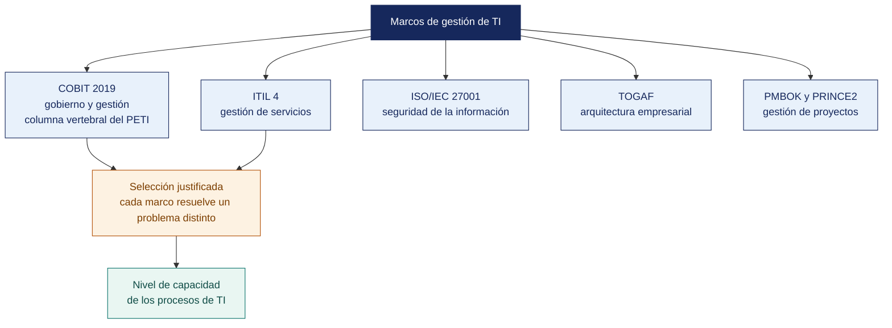

[Semana 09](README.md) · **Teoría** · [Dinámica de aula](2-DINAMICA.md) · [Taller de laboratorio](3-TALLER.md)

# Teoría · Herramientas y Marcos para el Desarrollo de la TI en la Organización

**SI-886 · Planeamiento Estratégico de TI** · Semana 09 · Sesión 1 en aula · 2 horas académicas, 100 min, con la dinámica incluida

> ¿Un término no le resulta claro? Está definido en el [glosario técnico del curso](../GLOSARIO.md).

---

## La pregunta de esta sesión

Una organización de sesenta personas anuncia que va a implementar COBIT, ITIL y la ISO 27001. Contrata capacitación para los tres, compra la documentación y arranca los tres proyectos el mismo trimestre.

Dieciocho meses después no ha implementado ninguno. Tiene tres carpetas de documentación, dos personas certificadas que ya renunciaron y ningún proceso que funcione distinto que antes.

> **La pregunta que ordena esta sesión.** *¿Cómo se elige un marco de gestión de TI, si todos parecen buenos y ninguno es gratis?*

## Antes de empezar

| Lo que necesita traer | De dónde sale |
|---|---|
| El diagnóstico interno y externo de la organización | Semanas 06 y 07 |
| El marco normativo aplicable y sus obligaciones | Semana 08 |
| La postura de TI de la organización | Semana 02 |
| Nociones de proceso y de nivel de madurez | Conocimiento general |

> **Exploración (5 min), antes de cualquier definición.** El aula responde antes de la teoría y se anota. *¿Qué hizo mal esa organización? ¿Por cuál habría empezado usted? ¿Se puede adoptar la mitad de un marco?* No se corrige nada todavía.

## Distribución del tiempo

| Momento | Minutos |
|---|---|
| El caso de los tres marcos y la exploración inicial | 8 |
| **Bloque 1.** Qué resuelve cada marco de gestión de TI · con su microaplicación | 22 |
| **Bloque 2.** COBIT 2019 como columna vertebral del plan | 20 |
| **Bloque 3.** ITIL 4 y la gestión de servicios | 10 |
| Cierre, respuesta a la pregunta de la sesión y puente a la dinámica | 5 |
| **Total de la sesión de aula** | **65** |

## Mapa de la sesión

---

## Bloque 1 · Qué resuelve cada marco de gestión de TI

> **La pregunta del bloque.** *¿Compiten los marcos entre sí o resuelven problemas distintos?*

**El error de adoptar marcos por moda.** Una organización de 60 personas que decide «implementar ITIL, COBIT y la ISO 27001» no implementará ninguno. **Los marcos no compiten. Resuelven problemas distintos.** El PETI debe seleccionar el que resuelve el problema que la organización tiene.

| Marco | Pregunta que responde | Alcance | Certificable | Cuándo conviene |
|---|---|---|---|---|
| **COBIT 2019** | ¿Cómo **gobernamos y gestionamos** la información y la tecnología en su conjunto? | Gobierno y gestión de I&T. 40 objetivos en 5 dominios | No (hay certificación de personas) | Cuando el problema es de dirección, alineamiento o rendición de cuentas |
| **ITIL 4** | ¿Cómo **entregamos y soportamos servicios** de TI que generen valor? | **Gestión de servicios.** 34 prácticas, cadena de valor del servicio | No (certificación de personas) | Cuando el problema es operativo — incidentes, cambios, solicitudes, nivel de servicio |
| **ISO/IEC 20000-1** | ¿Cómo **certificamos** nuestro sistema de gestión de servicios de TI? | Requisitos del SGSTI | **Sí** | Cuando un cliente o un contrato exige certificación de gestión de servicios |
| **ISO/IEC 27001:2022** | ¿Cómo **protegemos** la información con un sistema de gestión? | SGSI (Sistema de Gestión de Seguridad de la Información). Cláusulas 4–10 y 93 controles del Anexo A | **Sí** | Cuando hay obligación normativa, contractual o riesgo material de seguridad |
| **ISO/IEC 38500:2024** | ¿Qué **principios** debe seguir el órgano de gobierno respecto de la TI? | Gobierno de TI: 11 principios | No | Para orientar al directorio, complementa a COBIT |
| **TOGAF 10** | ¿Cómo **estructuramos y evolucionamos** la arquitectura empresarial? | Método ADM y marco de contenido | No (certificación de personas) | Cuando el problema es de integración, redundancia o deuda arquitectónica |
| **CMMI** | ¿Cuál es la **capacidad** de nuestros procesos, especialmente de desarrollo? | Modelo de madurez por áreas de práctica | **Sí** (evaluación) | Cuando la organización desarrolla software y necesita demostrar capacidad |
| **PMBOK / ISO 21500** | ¿Cómo **gestionamos proyectos** individuales? | Dirección de proyectos | No | Cuando el problema es la ejecución de proyectos |
| **ISO 31000:2018** | ¿Cómo **gestionamos el riesgo** de forma integrada? | Principios, marco y proceso de gestión del riesgo | No | Base metodológica de la sección 8 del PETI |
| **NIST CSF 2.0** | ¿Cómo **organizamos la ciberseguridad**? | 6 funciones — Govern, Identify, Protect, Detect, Respond, Recover | No | Alternativa liviana a la 27001 para organizaciones pequeñas |

**Cómo se seleccionan.** Tres criterios, en este orden:

1. **¿Hay obligación?** Norma, contrato o cliente que lo exija. Si la hay, no es una elección.
2. **¿Resuelve el problema diagnosticado?** Se contrasta con las capacidades de menor nivel y mayor criticidad de sección 3.1.5.
3. **¿Es proporcional?** ¿La organización tiene el tamaño, el personal y la madurez para sostenerlo?

> **Regla de proporcionalidad.** Adoptar un marco completo en una organización que no puede sostenerlo produce documentación que nadie usa. La alternativa profesional es **adoptar selectivamente** — los objetivos de COBIT pertinentes, las prácticas de ITIL que resuelven el problema, los controles de la 27001 que tratan riesgos reales. **La adopción selectiva justificada es una decisión de diseño, no una renuncia.**

> **El error frecuente del bloque.** Adoptar marcos por moda. Una organización que decide implementar tres a la vez no implementará ninguno, y ese es el caso de hoy. **Los marcos no compiten. Resuelven problemas distintos**, y el plan selecciona el que resuelve el problema que la organización realmente tiene.

## Bloque 2 · COBIT 2019 como columna vertebral del PETI

> **La pregunta del bloque.** *¿Cómo se evita adoptar los cuarenta objetivos de golpe?*

**Por qué COBIT y no otro.** Es el único marco que cubre **gobierno y gestión** de TI de extremo a extremo y que ofrece un mecanismo explícito para **adaptarlo a la organización**. Los factores de diseño.

**Los cinco dominios y sus 40 objetivos.**

| Dominio | Objetivos | Naturaleza | Qué evalúa |
|---|---|---|---|
| **EDM** — Evaluar, Dirigir y Supervisar | EDM01–EDM05 | **Gobierno** (directorio) | Marco de gobierno, entrega de beneficios, optimización del riesgo y de recursos, transparencia |
| **APO** — Alinear, Planificar y Organizar | APO01–APO14 | Gestión | Marco de gestión, estrategia, arquitectura, innovación, portafolio, presupuesto, personas, relaciones, acuerdos de servicio, proveedores, calidad, riesgo, seguridad, datos |
| **BAI** — Construir, Adquirir e Implementar | BAI01–BAI11 | Gestión | Programas, requisitos, soluciones, disponibilidad, cambio organizacional, cambios de TI, aceptación, conocimiento, activos, configuración, proyectos |
| **DSS** — Entregar, dar Servicio y Soporte | DSS01–DSS06 | Gestión | Operaciones, solicitudes e incidentes, problemas, continuidad, seguridad, controles de proceso de negocio |
| **MEA** — Supervisar, Evaluar y Valorar | MEA01–MEA04 | Gestión | Desempeño y conformidad, control interno, cumplimiento externo, aseguramiento |

**Los factores de diseño** — el mecanismo que evita adoptar los 40 objetivos:

| # | Factor de diseño | Qué determina |
|---|---|---|
| 1 | Estrategia empresarial | Crecimiento, innovación, liderazgo en costo, servicio al cliente |
| 2 | Metas empresariales | Cuáles de las 13 metas son prioritarias |
| 3 | Perfil de riesgo | Qué categorías de riesgo son más relevantes |
| 4 | Problemas relacionados con I&T | Qué problemas concretos padece la organización |
| 5 | Panorama de amenazas | Normal o alto |
| 6 | Requisitos de cumplimiento | Bajo, normal o alto |
| 7 | Rol de la TI | Soporte, fábrica, giro estratégico o estratégico *(la postura de la Semana 02)* |
| 8 | Modelo de aprovisionamiento | Interno, externalizado, nube, híbrido |
| 9 | Métodos de implementación de TI | Ágil, DevOps, tradicional, híbrido |
| 10 | Estrategia de adopción tecnológica | Primer adoptante, seguidor, adoptante tardío |
| 11 | Tamaño de la empresa | Grande, mediana, pequeña |

> **Producto de los factores de diseño.** Una **priorización de los 40 objetivos** para *esta* organización. Ese es el resultado que el PETI necesita. No los 40, sino los 10 o 12 que importan aquí.

**La escala de capacidad de procesos** (basada en ISO/IEC 33000). Niveles **0 Incompleto · 1 Realizado · 2 Gestionado · 3 Establecido · 4 Predecible · 5 Optimizado**. Un nivel N solo se alcanza si todos los anteriores están completos.

**Ejemplo trabajado — de los factores de diseño a los objetivos que sí se adoptan.** Distribuidora Andina del Sur S.A.C. — 157 trabajadores, TI de 4 personas, presupuesto de S/ 742 000 (1.08 % de la facturación), comité de TI que no se reúne, módulo de almacén abandonado y 4.7 % de diferencia de inventario.

| Factor de diseño | Valor observado en esta organización | Qué empuja hacia arriba |
|---|---|---|
| **7 — Rol de la TI** | **Fábrica**: la operación se detiene sin TI, pero TI no diferencia | DSS01, DSS02, DSS04 |
| **4 — Problemas de I&T** | Inventario descuadrado, sistema pagado en desuso, portal sin soporte | BAI05, BAI09, APO11 |
| **6 — Requisitos de cumplimiento** | Normal: Ley 29733, D. Leg. 822, SUNAT | APO12, APO13, MEA03 |
| **8 — Aprovisionamiento** | **Concentrado en un proveedor.** ERP, app de ventas y facturación | APO10, EDM03 |
| **11 — Tamaño** | Mediana, TI de 4 personas | Descarta adoptar los 40 objetivos |

**Los objetivos priorizados que entran al PETI** —diez, no cuarenta:

| Objetivo | Por qué entra | Capacidad actual | Meta a 3 años |
|---|---|---|---|
| **EDM01** Marco de gobierno | El comité existe en el papel y no sesiona | 1 | 3 |
| **EDM03** Optimización del riesgo | Concentración en un proveedor sin salida documentada | 1 | 3 |
| **APO10** Gestión de proveedores | Tres servicios críticos del mismo proveedor | 1 | 3 |
| **APO12** Gestión del riesgo | No hay registro de riesgos de TI | 0 | 3 |
| **APO13** Seguridad de la información | Política de 2022 sin difusión ni revisión | 1 | 3 |
| **BAI05** Cambio organizacional | El módulo de almacén se abandonó. Causa de adopción | 0 | 2 |
| **BAI09** Gestión de activos | Diferencia de 4.7 % entre inventario contable y físico | 1 | 3 |
| **DSS01** Operaciones | Sin catálogo de servicios ni turnos definidos | 1 | 3 |
| **DSS02** Solicitudes e incidentes | Los usuarios llaman al técnico por celular | 1 | 3 |
| **DSS04** Continuidad | Nunca se probó una restauración | 0 | 2 |

> **BAI05 es el objetivo que casi ningún equipo prioriza y el que explica el fracaso anterior.** El módulo de almacén no se abandonó por un defecto técnico. Se abandonó porque no hubo gestión del cambio. Adoptar BAI09 sin BAI05 compra otro sistema que también se abandonará. **Los factores de diseño no sirven para justificar lo que ya se quería hacer. Sirven para descubrir lo que no se estaba viendo.**

> **Microaplicación (6 min) · el marco que resuelve su problema.** Cada pareja enuncia **el problema principal de TI de su propia organización** en una frase y elige qué marco lo resuelve, aplicando los tres criterios en orden. Se recogen dos y se contrastan.

| Caso | Qué debe contener una buena respuesta |
|---|---|
| ¿Por qué la meta de capacidad es 3 y no 5? | Porque el nivel se sostiene con personal y presupuesto. Con cuatro personas en TI, comprometer nivel 4 o 5 en diez objetivos es un plan que no se cumplirá y que perderá credibilidad en el primer seguimiento |
| ¿Se puede saltar del nivel 0 al 3? | No. Cada nivel exige los anteriores completos. Por eso una meta de 3 partiendo de 0 es un proyecto de tres años, no una casilla que se marca |
| ¿Adoptar selectivamente es hacer las cosas a medias? | No, si la selección está justificada por los factores de diseño y queda documentada. Lo que no es profesional es declarar la adopción de los 40 objetivos y evidenciar ninguno |

> **El error frecuente del bloque.** Adoptar un marco completo en una organización que no puede sostenerlo. Produce documentación que nadie usa, que es exactamente lo que quedó en las tres carpetas del caso. La alternativa profesional es la **adopción selectiva justificada**, que es una decisión de diseño y no una renuncia.

## Bloque 3 · ITIL 4 y la gestión de servicios

> **La pregunta del bloque.** *¿Cuándo el problema de la organización es operativo y no de gobierno?*

**El cambio de ITIL 4 respecto de versiones anteriores.** Abandona la noción de procesos encadenados y adopta el **sistema de valor del servicio**, con la **cadena de valor del servicio** (planificar, mejorar, involucrar, diseñar y transicionar, obtener y construir, entregar y soportar) y **34 prácticas** de gestión.

**Las prácticas que un PETI de organización mediana debe considerar primero.**

| Práctica | Problema que resuelve | Señal de que hace falta |
|---|---|---|
| **Mesa de servicio** | No hay punto único de contacto ni registro de solicitudes | Los usuarios llaman al técnico por celular |
| **Gestión de incidentes** | Los incidentes no se registran ni se analizan | Registro de incidentes vacío o mínimo |
| **Gestión de solicitudes de servicio** | Todo pedido se trata como urgencia | No hay catálogo de servicios ni tiempos comprometidos |
| **Gestión de cambios habilitados** | Los cambios llegan a producción sin control | Cambios revertidos, incidentes tras despliegues |
| **Gestión de problemas** | Los mismos incidentes se repiten | Incidentes recurrentes sin análisis de causa raíz |
| **Gestión de nivel de servicio** | No hay compromiso medible con el negocio | Nadie sabe si TI cumple o no |
| **Gestión de activos de TI** | No se sabe qué se tiene ni dónde | Inventario desactualizado, licencias sin control |
| **Gestión de la continuidad del servicio** | No hay plan de recuperación probado | Nunca se restauró un respaldo |

**Herramientas libres para implementar estas prácticas** —lo que hace viable el proyecto en una organización pequeña:

| Práctica | Herramienta libre | Nota |
|---|---|---|
| Mesa de servicio, incidentes, solicitudes | **GLPI**, **Zammad**, **osTicket** | GLPI incorpora además inventario de activos |
| Gestión de activos e inventario | **GLPI**, **Snipe-IT**, **OCS Inventory** | |
| Base de conocimiento | **BookStack**, **Wiki.js** | |
| Gestión de proyectos y cambios | **OpenProject**, **Taiga**, **Redmine** | |
| Monitoreo y disponibilidad | **Zabbix**, **Prometheus + Grafana**, **Uptime Kuma** | |
| Tableros e indicadores | **Metabase**, **Grafana** | |
| Gestión de riesgos | **SimpleRisk Community** | |

## Cierre · qué se lleva de aquí

**La respuesta a la pregunta con la que abrimos.** Con tres criterios, en este orden — **si hay obligación**, porque entonces no es una elección; **si resuelve el problema diagnosticado**, contrastándolo con las capacidades de menor nivel y mayor criticidad; y **si es proporcional** al tamaño, al personal y a la madurez de la organización. La empresa del caso no aplicó ninguno de los tres.

**Las tres ideas que deben quedar.**

| Idea | Por qué importa en el ejercicio profesional |
|---|---|
| **Los marcos no compiten.** Cada uno responde una pregunta distinta | Elegir por moda produce documentación que nadie usa y proyectos que no terminan |
| La adopción selectiva justificada es una decisión de diseño | Adoptar los objetivos pertinentes y descartar el resto por escrito es lo profesional, no una renuncia |
| Los factores de diseño de COBIT evitan adoptar los cuarenta objetivos | Convierten un marco de cuarenta piezas en una selección defendible ante la gerencia |

**Volviendo a la exploración del inicio.** Se releen las respuestas del inicio. La pregunta que más se falla es la tercera — casi todo el mundo cree que un marco se adopta entero o no se adopta, y la práctica profesional es exactamente la contraria.

**Lo que sigue.** La [dinámica de esta sesión](2-DINAMICA.md) pone al equipo a decidir con un presupuesto limitado de unidades. Se adopta lo que se puede sostener y **se descarta el resto con fundamento**, que es la parte que casi nunca se escribe.

**Pregunta de cierre.** *si la organización solo pudiera adoptar tres prácticas de gestión de TI en tres años, ¿cuáles y por qué?* La respuesta debe derivarse de las capacidades críticas con mayor brecha de sección 3.1.5, no de la preferencia del equipo.
---

---

[Semana 09](README.md) · **Teoría** · [Dinámica de aula](2-DINAMICA.md) · [Taller de laboratorio](3-TALLER.md)

---

**Docente** · Dr. Oscar Juan Jimenez Flores
[oscarjimenezflores@upt.pe](mailto:oscarjimenezflores@upt.pe) · [LinkedIn](https://www.linkedin.com/in/oscar-jimenez-flores/) · [CTI Vitae — CONCYTEC](https://ctivitae.concytec.gob.pe/appDirectorioCTI/VerDatosInvestigador.do?id_investigador=33398)

Escuela Profesional de Ingeniería de Sistemas · Universidad Privada de Tacna · Tacna, Perú
