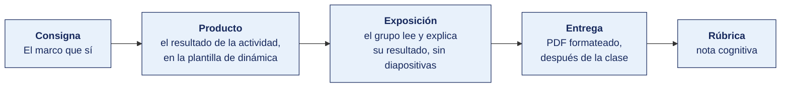

[Semana 09](README.md) · [Teoría](1-TEORIA.md) · **Dinámica de aula** · [Taller de laboratorio](3-TALLER.md)

# Dinámica de aula · La feria de marcos

**SI-886 · Planeamiento Estratégico de TI** · Semana 09 · Actividad en aula, **dentro de los 100 min de la sesión de teoría** · calificación **cognitiva**

> ¿Un término no le resulta claro? Está definido en el [glosario técnico del curso](../GLOSARIO.md).

---

## Cómo funciona la actividad

## Qué entregas

| | |
|---|---|
| **Archivo** | `SI886-S09-DINAMICA-Grupo<N>.pdf` |
| **Plantilla obligatoria** | [SI886-PLANTILLA-DINAMICA.docx](../PLANTILLAS/SI886-PLANTILLA-DINAMICA.docx) |
| **Formato** | PDF exportado desde la plantilla en Word, con la carátula de la UPT y los apellidos, nombres y códigos de todos los integrantes |
| **Qué va dentro** | Lo que el grupo resolvió en aula. Las tablas de la sección **Producto** van completas, con los textos redactados, y cada decisión va justificada |
| **Dónde se sube** | Aula virtual, tarea «Dinámica · Semana 09» |
| **Cuándo vence** | Hasta 24 h después de la sesión de teoría. La tabla se resuelve en aula; el PDF se formatea y se sube después |
| **Exposición** | En la ronda de cierre de **esta misma sesión**. El grupo **lee y explica su resultado** ante el aula, con el documento a la vista. No se usan diapositivas |

> No se califica un trabajo entregado en `.docx`, sin carátula, sin los códigos de los integrantes o con las tablas del producto vacías.

---

## Consigna

> **«La feria de marcos»**
> COBIT, ITIL, ISO 27001, TOGAF y CMMI se venden hoy en el aula. Su dirección tiene un presupuesto de esfuerzo limitado y no alcanza para todos.

| | |
|---|---|
| **Su papel** | Dos integrantes son **proveedores** del marco que les fue asignado y tienen que venderlo. El resto es **la dirección**, que compra |
| **Misión** | Adoptar solo lo que resuelve un problema que el diagnóstico ya encontró, y **descartar el resto por escrito** |
| **Restricción** | **Doce unidades de esfuerzo.** Una adopción completa cuesta 6, una selectiva 3, una práctica suelta 1. Adoptar todo es imposible |

De la teoría de hoy. Los tres criterios que deciden — ¿hay obligación? ¿qué problema diagnosticado resuelve? ¿es proporcional al tamaño de la organización?

## Cómo se desarrolla · 35 minutos

| | Bloque | Quién | Minutos |
|---|---|---|---|
| **1** | **Los proveedores preparan.** Tres líneas de argumento — qué problema resuelve, qué cuesta y a qué tamaño de organización le sirve | Equipo | 8 |
| **2** | **La feria.** Cada proveedor vende en **60 segundos**. La dirección pregunta siempre lo mismo — ¿qué problema **nuestro** resuelve? | Equipo | 10 |
| **3** | **La compra.** Qué se adopta y con qué alcance, hasta agotar las doce unidades. Y qué se descarta, con fundamento | Equipo | 9 |
| **4** | **Ronda en aula.** El marco que más equipos descartaron, y si coinciden en la razón | Todos | 8 |

## Producto

**La decisión de marcos.**

| Marco | ¿Se adopta? | ¿Hay obligación? | Problema diagnosticado que resuelve | ¿Proporcional? | Alcance | Unidades |
|---|---|---|---|---|---|---|
| COBIT 2019 | | | | | | |
| ITIL 4 | | | | | | |
| ISO/IEC 27001:2022 | | | | | | |
| TOGAF | | | | | | |
| CMMI | | | | | | |

Con el total **de doce unidades gastadas ___** y las **tres prácticas prioritarias** que se implantan primero, cada una con la brecha que cierra y su herramienta libre.

> **Dónde va.** Este producto se presenta en la **sección 2 de la [plantilla de dinámica](../PLANTILLAS/SI886-PLANTILLA-DINAMICA.docx)**, «El producto». No se copia la consigna ni la teoría. Solo el resultado y lo que lo sostiene.

## Ejemplo resuelto

*El caso de este ejemplo es distinto del que le toca a tu grupo. Sirve para que veas el nivel de detalle que se espera, no para copiarlo.*

**La organización del ejemplo.** Empresa prestadora de saneamiento · 68 000 conexiones · TI 5 personas.

**La decisión de marcos, con doce unidades de esfuerzo.**

| Marco | ¿Se adopta? | ¿Obligación? | Problema diagnosticado que resuelve | ¿Proporcional? | Alcance | Unidades |
|---|---|---|---|---|---|---|
| COBIT 2019 | Sí | No | Sección 3.2 · nadie responde por las decisiones de TI | Solo por partes | Selectiva · APO01, APO12 y DSS04 | **3** |
| ITIL 4 | Sí | No | Sección 3.4 · los reclamos de sistemas se atienden por WhatsApp | Sí | Selectiva · gestión de incidencias y de solicitudes | **3** |
| ISO/IEC 27001:2022 | Sí | **Sí**, por la RSGD para entidades del Estado | Sección 3.1 · no hay inventario de activos | Solo el núcleo | Selectiva · cláusulas 4 a 10 sin certificar | **6** |
| TOGAF | No | No | — | No, para 5 personas de TI es inviable | — | 0 |
| CMMI | No | No | — | No, la organización no desarrolla software | — | 0 |

**Total, 12 de 12 unidades.**

**Las tres prácticas prioritarias.** APO12 gestión de riesgos, porque el plan lo exige · gestión de incidencias de ITIL, con GLPI, porque hoy no hay registro de nada · inventario de activos del A.5.9, porque sin él ninguna otra práctica de seguridad se sostiene.

**Por qué se descartó TOGAF.** El proveedor lo vendió bien y el problema de arquitectura existe. Pero TOGAF con cinco personas consume el año entero del equipo y deja la operación sin nadie. La proporcionalidad decidió, no la utilidad.

**La diferencia entre aprobar y no aprobar**

| Así no | Así sí |
|---|---|
| «Adoptaremos COBIT, ITIL e ISO 27001.» | «COBIT selectivo, tres objetivos. ITIL selectivo, dos prácticas. ISO, cláusulas 4 a 10 sin certificar. Doce unidades.» |
| «TOGAF no aplica.» | «TOGAF resolvería un problema real, pero con cinco personas consume el año del equipo. Se descarta por proporcionalidad.» |

## Reglas

- 35 min en aula, dentro de la sesión de teoría.
- **Doce unidades y ni una más.** Un plan que adopta todo no priorizó nada.
- El problema que el marco resuelve tiene que estar **en el diagnóstico de la organización**, citado por su sección. Un problema hipotético no justifica una adopción.
- **Descartar también se califica.** Un descarte con fundamento vale igual que una adopción.
- Sesenta segundos de venta. Pasado ese tiempo se cierra la intervención.
- La exposición es la ronda de cierre de esta misma sesión. El grupo **lee y explica su resultado**. No se usan diapositivas.

## Rúbrica cognitiva (20 puntos)

| Criterio | 5 | 3 | 1 |
|---|---|---|---|
| **Los tres criterios** | Aplicados a los cinco marcos, con respuesta explícita en cada uno | Aplicados a tres o cuatro | Se decide sin aplicarlos |
| **El anclaje al diagnóstico** | Cada adopción cita el problema real y su sección de origen | Cita el problema sin la sección | Justifica con un problema hipotético |
| **El presupuesto** | Se respetan las doce unidades y el alcance declarado es coherente con lo pagado | Se respeta el total con algún alcance incoherente | Se excede, o se adopta todo |
| **El descarte** | Los marcos descartados con fundamento propio de esta organización | Descarte genérico | No se descarta nada |

---

---

[Semana 09](README.md) · [Teoría](1-TEORIA.md) · **Dinámica de aula** · [Taller de laboratorio](3-TALLER.md)

---

**Docente** · Dr. Oscar Juan Jimenez Flores
[oscarjimenezflores@upt.pe](mailto:oscarjimenezflores@upt.pe) · [LinkedIn](https://www.linkedin.com/in/oscar-jimenez-flores/) · [CTI Vitae — CONCYTEC](https://ctivitae.concytec.gob.pe/appDirectorioCTI/VerDatosInvestigador.do?id_investigador=33398)

Escuela Profesional de Ingeniería de Sistemas · Universidad Privada de Tacna · Tacna, Perú
