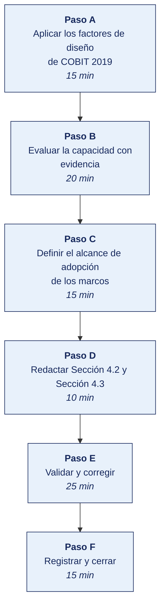

[Semana 09](README.md) · [Teoría](1-TEORIA.md) · [Dinámica de aula](2-DINAMICA.md) · **Taller de laboratorio**

# Taller de laboratorio 09 · Evaluación de capacidad de los procesos de TI y selección de marcos

**SI-886 · Planeamiento Estratégico de TI** · Semana 09 · Sesión 2 en laboratorio · 100 min · calificación **procedimental**

> ¿Un término no le resulta claro? Está definido en el [glosario técnico del curso](../GLOSARIO.md).

---

## Secuencia del taller



## Qué entregas

| | |
|---|---|
| **Archivo** | `SI886-S09-TALLER-Grupo<N>.pdf` |
| **Plantilla obligatoria** | [SI886-PLANTILLA-TALLER.docx](../PLANTILLAS/SI886-PLANTILLA-TALLER.docx) |
| **Formato** | PDF exportado desde la plantilla en Word, con la carátula de la UPT, el índice actualizado y las capturas numeradas |
| **Qué va dentro** | Las secciones de la plantilla. La **5. Resultados y evidencias** se califica contra la tabla de resultados esperados de esta guía, y **cada resultado necesita la evidencia que lo demuestre**. No se copian de aquí los objetivos, la duración ni los resultados de aprendizaje |
| **Dónde se sube** | Aula virtual, tarea «Taller · Semana 09» |
| **Cuándo vence** | 48 horas después de la sesión de laboratorio |

> No se califica un informe entregado en `.docx`, sin carátula, sin los códigos de los integrantes o con resultados declarados sin evidencia.

---

## El reto

| | |
|---|---|
| **Situación** | Adoptar marcos completos es inviable para esta organización, pero alguien tiene que decir cuáles sí y con qué alcance. |
| **Misión** | Aplicar los factores de diseño de COBIT 2019 y seleccionar los objetivos pertinentes, descartando el resto por escrito. |
| **Criterio de éxito** | La selección sale del cálculo de los factores de diseño, no de la preferencia del equipo, y los descartes están fundamentados. |

## 1. Información sobre el evento práctico

### 1.1. Objetivos

- Aplicar los **11 factores de diseño de COBIT 2019** a la organización.
- Obtener la **priorización de los 40 objetivos** y seleccionar los pertinentes.
- Evaluar el **nivel de capacidad** de los objetivos priorizados, con evidencia, no con autopercepción.
- Definir el **nivel objetivo** de cada proceso, proporcional al tamaño y al riesgo.
- Determinar el **alcance de adopción** de cada marco seleccionado.
- Producir el **mapa de brechas de proceso** y sus proyectos candidatos.
- Redactar las secciones **Sección 4.2** y **Sección 4.3** del PETI (Plan Estratégico de Tecnologías de Información).

### 1.2. Recursos

| Recurso | Detalle |
|---|---|
| **COBIT 2019 — Introduction and Methodology**, **Governance and Management Objectives** y **Design Guide** | https://www.isaca.org/resources/cobit |
| **ITIL 4 Foundation** — prácticas de gestión | https://www.axelos.com/certifications/itil-service-management |
| **ISO/IEC 20000-1**, **ISO/IEC 27001:2022**, **ISO/IEC 33020** | https://www.iso.org |
| **NIST CSF 2.0** | https://www.nist.gov/cyberframework |
| Notas de la **Entrevista 2 con la jefatura de TI** | Insumo obligatorio |
| Documentación de TI de la organización | Procedimientos, registro de incidentes, contratos, indicadores |
| **Python 3.11+** con `pandas`, `matplotlib` | Cálculo y radar |
| **GLPI** o **Zammad** (Docker) | Demostración de mesa de servicio |

### 1.3. Seguridad

1. La evaluación de capacidad expone las debilidades de gestión de TI de la organización. Es información **Confidencial**.
2. **La evaluación es de procesos, no de personas.** Un proceso en nivel 1 no significa que el responsable trabaje mal. Significa que no existe un proceso definido.
3. Toda calificación se sustenta en **evidencia documental o verificable**; la declaración del entrevistado sostiene como máximo el nivel 1.
4. Se acuerda con la jefatura de TI cómo se comunicarán los resultados antes de presentarlos a la gerencia.

---

## 2. Procedimiento o Metodología

> **Documento del caso para esta semana.** La organización entrega **Contratos con proveedores de TI**, en `CASOS/EMPRESA-<NN>-<slug>/documentos/contratos-proveedores.md`. Es consistente con los datos de `datos/`. Las personas, usuarios y proveedores que menciona existen en los archivos. **No señala sus debilidades**; declara lo que la organización dice hacer.

### Paso A — Aplicar los factores de diseño de COBIT 2019

`04_normativa/MG01_factores_diseno.csv`:

| # | Factor de diseño | Valor determinado para la organización | Evidencia | Sección del PETI que lo sustenta |
|---|---|---|---|---|
| 1 | Estrategia empresarial | Servicio al cliente / Liderazgo en costo | Declaración de enfoque estratégico | Sección 1.2.4 |
| 2 | Metas empresariales prioritarias | EG06 Continuidad y disponibilidad del servicio; EG08 Optimización de costos internos; EG12 Productos y servicios competentes | Visión y objetivos de negocio | Sección 2.2 |
| 3 | Perfil de riesgo | **Alto en.** Continuidad, cumplimiento normativo, dependencia de personal | Registro de riesgos preliminar, matriz de cumplimiento | Sección 3.1.5, Sección 4.1 |
| 4 | Problemas relacionados con I&T | Baja adopción del canal digital; ausencia de analítica; dependencia de una persona; plataforma en fin de soporte | FODA cruzado | Sección 3.4, Sección 3.5 |
| 5 | Panorama de amenazas | Normal | PESTEL, dimensión tecnológica y legal | Sección 3.3 |
| 6 | Requisitos de cumplimiento | **Alto** (Ley 29733 + D. S. 016-2024-JUS) | Matriz de cumplimiento | Sección 4.1 |
| 7 | **Rol de la TI** | **Fábrica** (la operación depende de TI, aún sin ventaja competitiva) | Análisis de postura de TI | Sección 1.1.4 |
| 8 | Modelo de aprovisionamiento | **Híbrido.** ERP local + servicios en la nube | Inventario de sistemas | Sección 3.1.1 |
| 9 | Métodos de implementación | Tradicional, con desarrollo interno puntual | Entrevista 2 | Evidencia |
| 10 | Estrategia de adopción tecnológica | Seguidor | Historial de inversiones | Sección 3.1 |
| 11 | Tamaño de la empresa | Pequeña/mediana (64 personas, 5 en TI) | Ficha de la organización | Sección 0 |

**El programa está en [`HERRAMIENTAS/SEMANA-09/MG02_priorizacion_cobit.py`](../HERRAMIENTAS/SEMANA-09/MG02_priorizacion_cobit.py).** Se copia al repositorio del equipo como `04_normativa/MG02_priorizacion_cobit.py` y **se edita con los datos de su organización**. El programa hace el cálculo, las cifras y su justificación son del equipo.

```bash
cp ../HERRAMIENTAS/SEMANA-09/MG02_priorizacion_cobit.py 04_normativa/MG02_priorizacion_cobit.py
python3 04_normativa/MG02_priorizacion_cobit.py
```

### Paso B — Evaluar la capacidad con evidencia

**Regla de calificación, escrita antes de evaluar.**

```
NIVEL 0 — El proceso no se ejecuta o no logra su propósito. Sin evidencia de ningún tipo.
NIVEL 1 — El proceso logra su propósito de forma reactiva. Existen sus productos,
          pero no hay planificación, responsable formal ni registro sistemático.
NIVEL 2 — El proceso se planifica, se monitorea y se ajusta. Hay responsable asignado
          y registros. Los productos se controlan.
NIVEL 3 — Existe un procedimiento documentado, aprobado y aplicado uniformemente en
          toda la organización.
NIVEL 4 — El proceso se mide cuantitativamente con indicadores, metas y análisis de
          desviación documentado.
NIVEL 5 — Hay evidencia de mejoras implementadas a partir del análisis de los indicadores,
          con su efecto medido.

REGLAS:
  R1. Un nivel N solo se otorga si todos los anteriores están completos.
  R2. La declaración del entrevistado sin evidencia sostiene como máximo el nivel 1.
  R3. Ante duda entre dos niveles se asigna el MENOR y se documenta la razón.
  R4. Toda calificación cita el identificador de la evidencia que la sostiene.
```

`04_normativa/MG03_capacidad.csv`:

| Objetivo | Nombre | Relevancia | **Evidencia examinada** | Nivel actual | Justificación del nivel | Nivel objetivo | Justificación del objetivo | Brecha |
|---|---|---|---|---|---|---|---|---|
| APO13 | Seguridad gestionada | 5 | Política v1.2, sin revisión desde su aprobación; sin registro de operación de controles | **1** | Existe política (producto) pero sin responsable formal, sin revisión ni registros | 3 | Requisito de cumplimiento alto exige procedimiento documentado y aplicado | 2 |
| DSS02 | Solicitudes e incidentes | 5 | Sin herramienta; 3 incidentes registrados en 12 meses | **0** | No existe proceso. Los usuarios contactan al técnico directamente | 2 | Nivel 2 es proporcional a 64 personas y 5 en TI | 2 |
| DSS04 | Continuidad gestionada | 5 | Respaldo diario a USB; última prueba de restauración. Hace más de dos años | **1** | Existe el respaldo (producto) sin plan, sin prueba periódica ni responsable | 2 | Nivel 2 con prueba semestral es proporcional | 1 |
| APO14 | Datos gestionados | 5 | Reportes manuales en hojas de cálculo; sin dueños de dato | **0** | No existe proceso de gobierno del dato | 2 | Habilitante de la ventaja no capturada | 2 |
| APO10 | Proveedores gestionados | 5 | Contrato del ERP vencido; sin niveles de servicio | **1** | Existen contratos pero sin gestión ni seguimiento | 3 | Riesgo de dependencia crítica | 2 |
| APO07 | Recursos humanos gestionados | 5 | Sin matriz de competencias; un desarrollador único | **1** | Sin plan de sucesión ni respaldo de competencias críticas | 2 | Mitiga el riesgo de dependencia | 1 |
| MEA03 | Cumplimiento externo | 5 | Sin matriz de cumplimiento antes de este trabajo | **0** | No existía identificación sistemática de obligaciones | 3 | Requisito de cumplimiento alto | 3 |
| EDM01 | Marco de gobierno | 5 | Sin comité de TI; sin actas | **0** | No existe estructura formal de gobierno de TI | 2 | Proporcional al tamaño | 2 |
| EDM03 | Optimización del riesgo | 5 | Sin apetito de riesgo declarado; sin informes al directorio | **0** | El riesgo de TI nunca se trató en directorio | 2 | Habilitante de la sección 8 del plan | 2 |
| APO02 | Estrategia gestionada | 5 | Sin PETI previo | **0** → **2** | Este plan lo lleva a nivel 2 al aprobarse | 3 | Revisión anual formalizada | 1 |
| DSS05 | Servicios de seguridad | 5 | Sin gestión de vulnerabilidades ni monitoreo | **1** | Controles puntuales sin proceso | 2 | Proporcional | 1 |
| APO12 | Riesgo gestionado | 5 | Sin registro de riesgos | **0** | No existe proceso | 2 | Habilitante de la sección 8 | 2 |

**El programa está en [`HERRAMIENTAS/SEMANA-09/MG04_analisis_capacidad.py`](../HERRAMIENTAS/SEMANA-09/MG04_analisis_capacidad.py).** Se copia al repositorio del equipo como `04_normativa/MG04_analisis_capacidad.py` y **se edita con los datos de su organización**. El programa hace el cálculo, las cifras y su justificación son del equipo.

```bash
cp ../HERRAMIENTAS/SEMANA-09/MG04_analisis_capacidad.py 04_normativa/MG04_analisis_capacidad.py
python3 04_normativa/MG04_analisis_capacidad.py
```

### Paso C — Definir el alcance de adopción de los marcos

`04_normativa/MG05_adopcion_marcos.csv`:

| Marco | ¿Se adopta? | Fundamento (obligación / problema / proporcionalidad) | **Alcance exacto de la adopción** | Objetivo o práctica | Proyecto que lo implementa | Horizonte |
|---|---|---|---|---|---|---|
| **COBIT 2019** | Sí, selectiva | Resuelve el problema de gobierno y alineamiento diagnosticado en sección 3.1.5 | Los 12 objetivos de relevancia 5, más EDM04 y APO03 | EDM01, EDM03, APO01, APO02, APO07, APO10, APO12, APO13, APO14, DSS02, DSS04, DSS05, MEA03 | Programa de gobierno de TI | 3 años |
| **ITIL 4** | Sí, selectiva | **Resuelve el problema operativo.** DSS02 en nivel 0 | 5 prácticas — mesa de servicio, incidentes, solicitudes, activos, nivel de servicio | — | Implantación de mesa de servicio con GLPI | Año 1 |
| **ISO/IEC 27001:2022** | Sí, como **referencia de controles**, sin certificar | Requisito de cumplimiento alto (Sección 4.1), pero certificar no es proporcional a 64 personas | Controles del Anexo A que tratan los riesgos de la sección 8; **no** se implanta el sistema de gestión completo | A.5.9, A.5.17, A.5.18, A.8.8, A.8.13, A.8.15, A.8.24 | Programa de seguridad de la información | 2 años |
| **TOGAF 10** | Sí, solo el **método ADM** | Existe deuda arquitectónica y redundancia de datos (Sección 3.1) | Fases A a D del ADM, una sola iteración | — | Levantamiento de arquitectura empresarial (Sección 5) | Año 1 |
| **CMMI** | **No** | La organización no desarrolla software como actividad principal (factor 9) | — | — | — | — |
| **ISO/IEC 20000-1** | **No** | Ningún cliente ni contrato exige certificación de gestión de servicios | — | — | — | — |
| **NIST CSF 2.0** | **No** | Se opta por la ISO/IEC 27001 por su obligatoriedad indirecta vía NTP; adoptar ambos duplicaría el esfuerzo | — | — | — | — |
| **ISO 31000:2018** | Sí | Base metodológica de la gestión de riesgos del plan | Proceso de gestión del riesgo | — | Sección 8 del PETI | Inmediato |

**Demostración práctica. Mesa de servicio con GLPI** (10 min):

```bash
docker run -d --name peti_glpi_db -e MARIADB_ROOT_PASSWORD=glpi_lab \
  -e MARIADB_DATABASE=glpi -e MARIADB_USER=glpi -e MARIADB_PASSWORD=glpi mariadb:11
docker run -d --name peti_glpi --link peti_glpi_db:mysql \
  -p 127.0.0.1:8089:80 diouxx/glpi
```

Se configura un catálogo mínimo de servicios y se registra un ticket de prueba, para **dimensionar el esfuerzo real** de la práctica antes de estimarla en el portafolio.

### Paso D — Redactar Sección 4.2 y Sección 4.3

```markdown
## 4.2 Marcos de gestión adoptados
### 4.2.1 Criterios de selección
### 4.2.2 Factores de diseño de COBIT 2019 aplicados a la organización
### 4.2.3 Marcos adoptados y **alcance exacto** de cada adopción
### 4.2.4 Marcos descartados y fundamento del descarte
### 4.2.5 Herramientas libres seleccionadas para su implementación

## 4.3 Madurez de los procesos de TI
### 4.3.1 Objetivos COBIT priorizados según los factores de diseño
### 4.3.2 Regla de calificación de capacidad (fijada antes de evaluar)
### 4.3.3 Evaluación de capacidad · nivel actual con su evidencia
### 4.3.4 Nivel objetivo y su justificación de proporcionalidad
### 4.3.5 Mapa de brechas y proyectos candidatos
### 4.3.6 Radar de capacidad actual vs. objetivo
```

### Paso E — Validar y corregir (25 min)

El resultado no vale por estar hecho, sino por resistir una comprobación. Se ejecutan estas tres y **se corrige lo que falle antes de cerrar la sesión**.

1. Comprobar que los once factores de diseño tienen valor asignado y que el valor viene del diagnóstico.
2. Verificar que la priorización de los cuarenta objetivos es la que produce el modelo, sin retoques a mano.
3. Comprobar que cada objetivo seleccionado se relaciona con una brecha concreta del diagnóstico.

> Lo que no se pueda corregir hoy se anota en la sección **Problemas y mejoras** de la evidencia, con lo que faltó y por qué. Un resultado parcial documentado con honestidad vale más que uno declarado sin prueba.

### Paso F — Registrar la evidencia y cerrar (15 min)

Se versiona lo producido, se anota la URL de cada resultado y se responde en dos frases la pregunta de transferencia — **qué riesgo correría una organización real si esto se hiciera mal**.

```bash
git add . && git commit -m "S09: marcos de gestion y madurez de procesos de TI — secciones 4.2 y 4.3"
git tag -a v0.9 -m "PETI v0.9 — marcos y madurez"
```

---

## 3. Resultados

> **Evidencia obligatoria en GitHub.** Todo resultado de este taller se versiona en el repositorio del equipo. El informe **no consigna capturas sueltas**. Consigna la **URL** del artefacto en GitHub. Una captura no permite verificar autoría, fecha ni contenido; un enlace sí.
>
> | Qué se entrega | Dónde vive | Qué se escribe en el informe |
> |---|---|---|
> | Código y archivos de configuración | Rama del taller, fusionada a `develop` vía Pull Request | URL del Pull Request |
> | Documentos y matrices | `docs/`, en formato de texto versionable | URL del archivo en la rama |
> | Capturas y videos que el taller exija | `docs/evidencias/S09/` | URL del archivo |
> | Salida de comandos | `docs/evidencias/S09/salidas/*.txt` | URL del archivo |
>
> **Etiqueta del taller.** Al cerrar el taller se crea la etiqueta `taller-09` sobre el commit entregado:
>
> ```bash
> git tag -a taller-09 -m "Taller 09 · SI886"
> git push origin taller-09
> ```
>
> La URL que se consigna en el informe apunta a esa etiqueta:
> `https://github.com/<organizacion>/<repositorio>/tree/taller-09`
>
> **El informe es lo que se califica; el repositorio es lo que lo prueba.** Cada resultado de la sección 3 del informe lleva la URL con la que se verifica, y **un resultado sin su URL se califica como no logrado**, por bien redactado que esté. Lo que no se puede abrir no se puede dar por hecho.

### 3.1. Los tres resultados que se califican

Son los que la rúbrica evalúa. El resto de la lista tiene que existir, pero no se califica fila por fila.

| Resultado | Qué demuestra | Dónde está |
|---|---|---|
| **Los factores de diseño** | Los once con valor asignado y su origen en el diagnóstico | Hoja de cálculo |
| **La priorización obtenida** | Los cuarenta objetivos ordenados por el modelo, sin retoque | Salida del cálculo |
| **La selección justificada** | Los pertinentes y los descartados, cada uno con su razón | Sección 3.4 |

### 3.2. Lista de comprobación del taller

Todo esto debe existir al cerrar la sesión.

| # | Resultado esperado | Verificación |
|---|---|---|
| 1 | Los **11 factores de diseño** determinados, cada uno **trazado a una sección del PETI** | `MG01_factores_diseno.csv` |
| 2 | Objetivos COBIT priorizados por relevancia, cada uno con su **fundamento** | `MG02_objetivos_priorizados.csv` |
| 3 | Alcance recomendado del PETI definido. Objetivos con relevancia ≥ 4 | Salida del script |
| 4 | **Regla de calificación escrita antes de evaluar** | Sección 4.3.2 |
| 5 | **Al menos 12 objetivos** evaluados en capacidad, con **evidencia examinada** por cada uno | `MG03_capacidad.csv` |
| 6 | **Cero calificaciones sostenidas solo en declaración** del entrevistado | Revisión de la columna de evidencia |
| 7 | Nivel objetivo **justificado por proporcionalidad**, no por aspiración | Misma tabla |
| 8 | Análisis de brechas con los objetivos de relevancia 5 y brecha ≥ 2 | Salida de `MG04_analisis_capacidad.py` |
| 9 | Radar de capacidad actual vs. objetivo | `MG_capacidad_cobit.png` |
| 10 | Tabla de adopción de marcos con **alcance exacto** de cada uno | `MG05_adopcion_marcos.csv` |
| 11 | **Al menos dos marcos descartados** con su fundamento | Misma tabla |
| 12 | Mesa de servicio desplegada y probada, con el esfuerzo dimensionado | Captura de GLPI |
| 13 | Secciones Sección 4.2 y Sección 4.3 redactadas · etiqueta `v0.9` | `git tag` |

## Rúbrica procedimental (20 puntos)

Se aplica sobre el informe entregado y la evidencia enlazada en el repositorio. **Cada criterio se califica de forma independiente.**

| Criterio | 4 — Logrado | 2 — En proceso | 0 — Insuficiente |
|---|---|---|---|
| **El criterio de éxito** | Se cumple tal como lo pide el reto de esta sesión | Se cumple con reservas que el equipo declara | No se cumple, o se afirma cumplido sin prueba |
| **Los factores de diseño** | Completo y correcto, con la evidencia que lo respalda | Completo con errores menores, o correcto sin toda la evidencia | Incompleto o sin evidencia |
| **La priorización obtenida** | Completo y correcto, con la evidencia que lo respalda | Completo con errores menores, o correcto sin toda la evidencia | Incompleto o sin evidencia |
| **La selección justificada** | Completo y correcto, con la evidencia que lo respalda | Completo con errores menores, o correcto sin toda la evidencia | Incompleto o sin evidencia |
| **La validación** | Las tres comprobaciones ejecutadas, y lo que falló quedó corregido o documentado | Ejecutadas sin corregir lo que falló | No se validó nada |

| Puntaje | Equivalencia |
|---|---|
| 18 – 20 | Destacado |
| 14 – 17 | Logrado |
| 6 – 13 | En proceso |
| 0 – 5 | Insuficiente |

> **Un resultado declarado sin evidencia enlazada no se califica**, aunque el trabajo se haya hecho. La tabla de la sección 3.1 es la lista de cotejo; esta rúbrica es lo que determina la nota.

## 4. Conclusiones

Mínimo tres. Líneas argumentales esperadas:

1. Los factores de diseño de COBIT 2019 convierten un marco de 40 objetivos en un alcance manejable de 12 a 14, y esa reducción justificada es lo que hace viable su adopción en una organización mediana.
2. La adopción selectiva de un marco —nombrando exactamente qué objetivos, qué prácticas y qué controles— es una decisión de diseño defendible; adoptar el marco completo en una organización que no puede sostenerlo produce documentación que nadie usa.
3. El nivel objetivo de capacidad debe derivarse del riesgo y del tamaño, no de la aspiración. Proponer nivel 4 uniforme genera un plan que la organización no ejecutará y que desacredita todo el diagnóstico.

## 5. Referencias Bibliográficas

- ISACA. (2018). *COBIT 2019 Framework: Introduction and Methodology*. https://www.isaca.org/resources/cobit
- ISACA. (2018). *COBIT 2019 Framework: Governance and Management Objectives*. https://www.isaca.org/resources/cobit
- ISACA. (2018). *COBIT 2019 Design Guide: Designing an Information and Technology Governance Solution*. https://www.isaca.org/resources/cobit
- AXELOS. *ITIL 4 Foundation: ITIL 4 Edition*. https://www.axelos.com/certifications/itil-service-management
- ISO/IEC 20000-1:2018. *Service management system requirements*. https://www.iso.org/standard/70636.html
- ISO/IEC 27001:2022. *Information security management systems — Requirements*. https://www.iso.org/standard/27001
- ISO/IEC 38500:2024. *Governance of IT for the organization*. https://www.iso.org/standard/81684.html
- ISO/IEC 33020:2019. *Process measurement framework for assessment of process capability*. https://www.iso.org/standard/54195.html
- ISO 31000:2018. *Risk management — Guidelines*. https://www.iso.org/standard/65694.html
- NIST. (2024). *The NIST Cybersecurity Framework (CSF) 2.0*. https://www.nist.gov/cyberframework
- The Open Group. *TOGAF Standard, 10th Edition*. https://www.opengroup.org/togaf
- CMMI Institute. *CMMI Model V3.0*. https://cmmiinstitute.com/
- Rodríguez Bermúdez, J. R. (2015). *Planificación y dirección estratégica de sistemas de información*. Editorial UOC. https://elibro.net/es/lc/bibliotecaupt/titulos/57875

## 6. Anexos

- `anexo_A_factores_diseno.xlsx`
- `anexo_B_objetivos_priorizados.xlsx`
- `anexo_C_evaluacion_capacidad.xlsx`
- `anexo_D_radar_capacidad.png`
- `anexo_E_adopcion_marcos.xlsx`
- `anexo_F_secciones_4_2_4_3.pdf`

---

---

[Semana 09](README.md) · [Teoría](1-TEORIA.md) · [Dinámica de aula](2-DINAMICA.md) · **Taller de laboratorio**

---

**Docente** · Dr. Oscar Juan Jimenez Flores
[oscarjimenezflores@upt.pe](mailto:oscarjimenezflores@upt.pe) · [LinkedIn](https://www.linkedin.com/in/oscar-jimenez-flores/) · [CTI Vitae — CONCYTEC](https://ctivitae.concytec.gob.pe/appDirectorioCTI/VerDatosInvestigador.do?id_investigador=33398)

Escuela Profesional de Ingeniería de Sistemas · Universidad Privada de Tacna · Tacna, Perú
