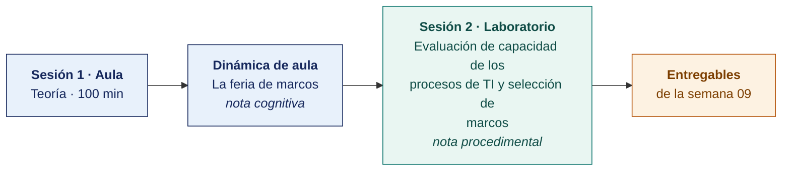

  
  &nbsp;&nbsp;&nbsp;&nbsp;&nbsp;&nbsp;
  

  <strong>Universidad Privada de Tacna</strong> 
  Facultad de Ingeniería · Escuela Profesional de Ingeniería de Sistemas

<h1 align="center">Semana 09 · Herramientas y Marcos para el Desarrollo de la TI en la Organización</h1>

  <strong>SI-886 · Planeamiento Estratégico de TI</strong> 
  4 horas académicas de 50 min · 100 min de teoría con la dinámica incluida en aula · 100 min de taller en laboratorio

---

## Datos de la asignatura

| | |
|---|---|
| **Asignatura** | SI-886 · Planeamiento Estratégico de TI |
| **Escuela** | Escuela Profesional de Ingeniería de Sistemas |
| **Ciclo** | VIII · 04 horas semanales · 03 créditos · Obligatorio |
| **Unidad** | II — Plan de Gobierno Digital |
| **Semana** | 09 de 17 |
| **Duración** | 4 horas académicas de 50 min · 100 min de teoría con la dinámica incluida en aula · 100 min de taller en laboratorio |
| **Resultados de aprendizaje** | **RA1** Analiza la normativa y herramientas TI · **RA2** Evalúa la situación actual del gobierno digital |

### Lo que indica el sílabo

**Contenido conceptual.** Herramientas para desarrollo de la TI en la organización.

**Contenido procedimental.** Revisa las normas y los estándares sobre la gestión de los procesos de TI.

## Materiales de esta semana

| | Documento | Qué encontrarás | Dónde y cuánto dura |
|---|---|---|---|
| 1 | **[Teoría](1-TEORIA.md)** | Qué resuelve cada marco de gestión de TI · COBIT 2019 como columna vertebral del PETI · ITIL 4 y la gestión de servicios | Aula · 100 min |
| 2 | **[Dinámica de aula](2-DINAMICA.md)** | La feria de marcos, con su material, su ejemplo resuelto y su rúbrica | Aula · dentro de los 100 min de la sesión de teoría |
| 3 | **[Taller de laboratorio](3-TALLER.md)** | Evaluación de capacidad de los procesos de TI y selección de marcos | Laboratorio · 100 min |

## Ruta de la semana

## Entregables

| Entregable | Formato y nombre del archivo | Vence |
|---|---|---|
| **Dinámica de aula** · La feria de marcos | PDF desde la [plantilla de dinámica](../PLANTILLAS/SI886-PLANTILLA-DINAMICA.docx) · `SI886-S09-DINAMICA-Grupo<N>.pdf` | Antes de cerrar la sesión de teoría |
| **Informe del taller de laboratorio N.º 09** | PDF en formato EPIS desde la [plantilla de taller](../PLANTILLAS/SI886-PLANTILLA-TALLER.docx) · `SI886-S09-TALLER-Grupo<N>.pdf` | 48 h después del taller |
| Secciones Sección 4.2 y Sección 4.3 del PETI (Plan Estratégico de Tecnologías de Información) · etiqueta `v0.9` | Commit en Git | 48 h después del laboratorio |

> Ambos se entregan en **PDF**, con la carátula de la UPT y los códigos de todos los integrantes. Las plantillas obligatorias están en [`PLANTILLAS/`](../PLANTILLAS/).

## Cómo se evalúa

| Criterio | Instrumento | Peso |
|---|---|---|
| Cognitivo | Rúbrica de «La feria de marcos» + exposición de 10 min en la Semana 10 | 25 % |
| Procedimental | Lista de cotejo de los 13 resultados del laboratorio | 35 % |
| Actitudinal | Evaluación de procesos sin juicios sobre personas; comunicación acordada con la jefatura de TI | 15 % |

## Preparación para la Semana 10

- Instalar **Archi** (modelador ArchiMate libre). https://www.archimatetool.com/download/
- **Leer.** The Open Group, *TOGAF Standard, 10th Edition* — método ADM, fases A a D.
- **Revisar.** *ArchiMate 3.2 Specification* — capas de negocio, aplicación y tecnología.
- Recopilar — **inventario completo de sistemas**, integraciones existentes, flujos de datos entre sistemas y diagrama de red si existe.

---

**Docente** · Dr. Oscar Juan Jimenez Flores
[oscarjimenezflores@upt.pe](mailto:oscarjimenezflores@upt.pe) · [LinkedIn](https://www.linkedin.com/in/oscar-jimenez-flores/) · [CTI Vitae — CONCYTEC](https://ctivitae.concytec.gob.pe/appDirectorioCTI/VerDatosInvestigador.do?id_investigador=33398)

Escuela Profesional de Ingeniería de Sistemas · Universidad Privada de Tacna · Tacna, Perú
