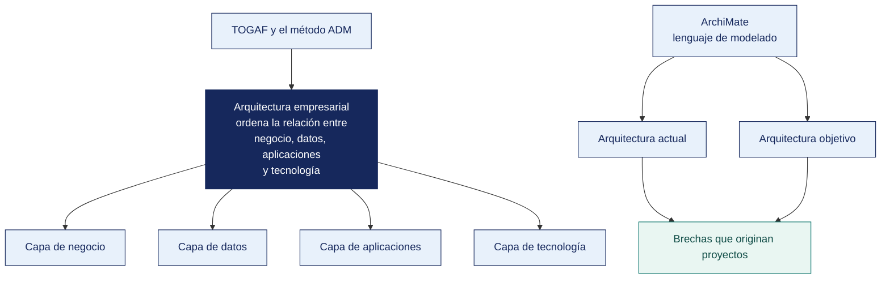

[Semana 10](README.md) · **Teoría** · [Dinámica de aula](2-DINAMICA.md) · [Taller de laboratorio](3-TALLER.md)

# Teoría · Arquitectura Empresarial

**SI-886 · Planeamiento Estratégico de TI** · Semana 10 · Sesión 1 en aula · 2 horas académicas, 100 min, con la dinámica incluida

> ¿Un término no le resulta claro? Está definido en el [glosario técnico del curso](../GLOSARIO.md).

---

## La pregunta de esta sesión

Una empresa pide una cifra sencilla — cuántos clientes activos tiene. El área comercial responde 6 200, finanzas responde 5 400 y el sistema de facturación devuelve 7 100.

Las tres cifras son correctas. Cada área define «cliente activo» de una manera distinta, ninguna definición está escrita, y las tres llevan años decidiendo con la suya.

> **La pregunta que ordena esta sesión.** *¿Por qué una organización con todos sus sistemas funcionando no puede responder una pregunta simple?*

## Antes de empezar

| Lo que necesita traer | De dónde sale |
|---|---|
| El diagnóstico de capacidades y el marco de gestión adoptado | Semana 09 |
| El análisis interno de procesos y sistemas | Semana 06 |
| La cadena de valor y los sistemas que la soportan | Semana 06 |
| Nociones de bases de datos e integración de sistemas | Cursos previos de la carrera |

> **Exploración (5 min), antes de cualquier definición.** El aula responde antes de la teoría y se anota. *¿De quién es la culpa? ¿Qué habría que hacer para que las tres cifras coincidan? ¿Es un problema técnico o de otra cosa?* No se corrige nada todavía.

## Distribución del tiempo

| Momento | Minutos |
|---|---|
| El caso de las tres cifras y la exploración inicial | 8 |
| **Bloque 1.** Qué problema resuelve la arquitectura empresarial · con su microaplicación | 20 |
| **Bloque 2.** TOGAF y el método ADM | 22 |
| **Bloque 3.** ArchiMate como lenguaje de modelado | 10 |
| Cierre, respuesta a la pregunta de la sesión y puente a la dinámica | 5 |
| **Total de la sesión de aula** | **65** |

## Mapa de la sesión



---

## Bloque 1 · Qué problema resuelve la arquitectura empresarial

> **La pregunta del bloque.** *¿Cuál de las cuatro capas explica el problema de las tres cifras?*

**El síntoma.** Toda organización que creció sin arquitectura presenta el mismo cuadro:

| Síntoma | Manifestación concreta | Costo |
|---|---|---|
| **Islas de información** | El mismo dato existe en tres sistemas con valores distintos | Nadie confía en el reporte; se decide con la hoja de cálculo propia |
| **Integraciones punto a punto** | N sistemas requieren N(N−1)/2 integraciones | Cada cambio rompe algo en otro lado |
| **Redundancia funcional** | Dos sistemas hacen lo mismo porque dos áreas los compraron por separado | Doble licencia, doble mantenimiento, doble digitación |
| **Deuda arquitectónica** | Componentes fuera de soporte que nadie puede reemplazar | Riesgo de continuidad y de seguridad |
| **Dependencia de proveedor** | No hay salida documentada de una plataforma | El proveedor fija el precio |
| **Proyecto imposible de estimar** | Nadie sabe qué se rompe si se cambia X | Los proyectos duran el doble de lo estimado |

**Definición.** La arquitectura empresarial es la **descripción estructurada de la organización** —sus procesos, información, aplicaciones y tecnología— y de cómo esos elementos se relacionan, con el fin de **guiar su evolución de forma coherente**.

**Las cuatro capas** y sus preguntas:

| Capa | Pregunta | Elementos | Quién la conoce |
|---|---|---|---|
| **Negocio** | ¿Qué hace la organización y para quién? | Actores, roles, procesos, servicios de negocio, productos | Las áreas usuarias |
| **Datos / Información** | ¿Qué información maneja y quién es su dueño? | Entidades de negocio, objetos de datos, flujos, dueños | Nadie completo — ese es el hallazgo |
| **Aplicaciones** | ¿Qué sistemas soportan los procesos? | Componentes, servicios de aplicación, interfaces, integraciones | TI parcialmente |
| **Tecnología** | ¿Sobre qué infraestructura corren? | Nodos, redes, servicios de plataforma, dispositivos | TI |

> **La capa que más valor aporta al PETI es la de datos**, y es la que casi nunca existe documentada. Preguntar «¿quién es el dueño del dato *cliente*?» suele revelar que cuatro áreas lo mantienen y ninguna responde por él.

> **El error frecuente del bloque.** Reducir la arquitectura empresarial a un diagrama de servidores y redes. Esa es la capa de tecnología, que es la que TI conoce y la que menos aporta al plan. **La capa que más valor aporta es la de datos**, y es la que casi nunca existe documentada.

## Bloque 2 · TOGAF y el método ADM

> **La pregunta del bloque.** *¿Cómo se convierte una visión en proyectos concretos?*

**TOGAF** es el marco de arquitectura empresarial más difundido. Su núcleo es el **Architecture Development Method (ADM)**, un ciclo iterativo:

```
        Preliminar — establecer el marco y los principios
                          │
                          ▼
      ┌──────► A. Visión de la Arquitectura ◄──────────┐
      │                   │                            │
      │                   ▼                            │
      │        B. Arquitectura de Negocio              │
      │                   │                            │
      │                   ▼                            │
      │   C. Arquitectura de Sistemas de Información   │
      │      (datos y aplicaciones)                    │
      │                   │                            │
   H. Gestión            ▼                             │
   del Cambio    D. Arquitectura de Tecnología         │
   de la                  │                            │
   Arquitectura           ▼                            │
      │        E. Oportunidades y Soluciones           │
      │                   │                            │
      │                   ▼                            │
      │        F. Planificación de la Migración        │
      │                   │                            │
      │                   ▼                            │
      └────── G. Gobierno de la Implementación ────────┘
                          │
              Gestión de Requisitos (centro, permanente)
```

**Lo que este curso ejecuta.** Una iteración de las fases **A a D**, más las salidas de **E y F** que alimentan el portafolio (Sección 7):

| Fase | Producto | Semana |
|---|---|---|
| **A** — Visión de la arquitectura | Alcance, interesados, visión de alto nivel | 10 |
| **B** — Arquitectura de negocio | Actores, procesos y servicios de negocio, actual y objetivo | 10 |
| **C** — Sistemas de información | Aplicaciones y datos, actual y objetivo, con dueños de dato | 10 |
| **D** — Tecnología | Infraestructura actual y objetivo | 10 |
| **E** — Oportunidades y soluciones | **Análisis de brechas → paquetes de trabajo** | 10 → 13 |
| **F** — Planificación de la migración | **Hoja de ruta y secuencia** | 14 |

**El principio del análisis de brechas.** Se construye la arquitectura **actual (as-is)**, luego la **objetivo (to-be)** derivada de la visión (Sección 2.2) y de las capacidades requeridas, y la diferencia produce los **paquetes de trabajo**. Ese es el mecanismo que convierte una visión en proyectos concretos.

**Principios de arquitectura.** Antes de modelar se declaran las reglas que gobernarán las decisiones. Cada principio se enuncia con nombre, declaración, razón e implicancias:

| Principio | Declaración | Implicancia práctica |
|---|---|---|
| **Dato único con dueño** | Cada entidad de negocio tiene una fuente autoritativa y un dueño designado | Prohibido crear una segunda base del mismo dato |
| **Comprar antes que construir** | Se construye solo lo que diferencia; el resto se adquiere | Todo desarrollo interno requiere justificación de diferenciación |
| **Integración por servicios** | Los sistemas se integran por interfaces publicadas, no por acceso directo a la base de datos | Prohibida la integración por consulta directa a tablas de otro sistema |
| **Sin dependencia irreversible** | Toda decisión tecnológica debe tener una salida documentada | Se exige plan de salida en cada contrato |
| **Seguridad y privacidad desde el diseño** | Los requisitos de seguridad y de protección de datos se incorporan en el diseño, no después | Ningún proyecto pasa a construcción sin su evaluación |
| **Proporcionalidad** | La complejidad de la solución debe ser proporcional al problema | Se prefiere lo simple mantenible sobre lo elegante frágil |

**Ejemplo trabajado — un análisis de brechas que produce paquetes de trabajo.** Distribuidora Andina del Sur S.A.C., capa de aplicaciones y datos (fase C del ADM). A la izquierda lo que hay; a la derecha lo que la visión exige; en el medio, lo único que importa. La diferencia.

| Elemento | Actual (*as-is*) | Objetivo (*to-be*) | Brecha | Paquete de trabajo |
|---|---|---|---|---|
| **Gestión de almacén** | Módulo del ERP en desuso + hojas de cálculo paralelas | Módulo del ERP como fuente única de ubicaciones y existencias | **Sustitución de práctica**, no de sistema | PT-01 Reactivación del módulo con rediseño de proceso y capacitación |
| **Dato «existencia»** | **Dos fuentes.** ERP y hoja de almacén, con 4.7 % de diferencia | Fuente autoritativa única, con dueño designado (Jefe de Almacén) | **Eliminar** la segunda fuente | PT-01 (mismo), con conciliación y cierre de la hoja |
| **Portal de pedidos** | Desarrollo propio, hosting compartido, **sin soporte desde 2022** | Servicio con soporte, integrado al ERP por interfaz publicada | **Reemplazar** | PT-02 Reconstrucción del canal de pedidos |
| **Integración portal–ERP** | Consulta directa a las tablas del ERP | API de consulta de stock y registro de pedido | **Nueva** | PT-02 (mismo), viola hoy el principio «integración por servicios» |
| **Dato «cliente/bodega»** | En ERP, en la app de ventas y en la hoja del portal | Fuente autoritativa en el ERP; las demás consumen | **Consolidar** | PT-03 Gobierno del dato maestro |
| **Analítica de demanda** | No existe | Tablero de rotación por bodega sobre el histórico de compras | **Nueva** | PT-04 Explotación de la base histórica |
| **Registro de datos personales** | No existe | Inventario y registro de actividades de tratamiento | **Nueva** | PT-05 Cumplimiento de la Ley 29733 |

> **Cada brecha se clasifica como *nueva*, *reemplazar*, *consolidar* o *eliminar*, y esa palabra decide el tipo de proyecto.** La primera fila es la más instructiva — **la brecha no es tecnológica**. El sistema objetivo ya está comprado y en producción. Un análisis que la clasificara como «nueva» propondría comprar un WMS y repetiría el fracaso de 2015.

> **Microaplicación (5 min) · el dueño del dato.** El aula responde a mano alzada una sola pregunta antes de la explicación — *en su organización, ¿quién responde por el dato «cliente»?* La respuesta más frecuente es que nadie, y ese es el punto de entrada.

| Caso | Qué debe contener una buena respuesta |
|---|---|
| ¿Por qué se modela primero el *as-is* si lo que interesa es el *to-be*? | Porque sin el actual no hay brecha, y sin brecha no hay paquete de trabajo justificable. El *to-be* solo no dice qué hay que hacer, dice a dónde llegar |
| ¿Qué profundidad debe tener el modelo? | La que permita decidir. Modelar cada tabla de cada sistema consume el semestre y no cambia ninguna decisión del plan |
| Una brecha no tiene proyecto asociado. ¿Se deja así? | Se declara explícitamente como brecha aceptada, con el motivo y quién lo decidió. Lo que no se hace es borrarla del modelo para que el plan se vea completo |

> **El error frecuente del bloque.** Modelar solo la arquitectura objetivo. Sin la arquitectura actual no hay brecha, y sin brecha no hay paquetes de trabajo — solo una lámina bonita de un futuro que nadie sabe cómo alcanzar. **El análisis de brechas es el mecanismo que convierte la visión en cartera de proyectos.**

## Bloque 3 · ArchiMate como lenguaje de modelado

> **La pregunta del bloque.** *¿Para qué sirve un lenguaje común de modelado en un plan de TI?*

**Por qué un lenguaje formal.** Un diagrama de cajas y flechas dibujado libremente no es comparable entre versiones ni entre personas. **ArchiMate** es el lenguaje estándar de The Open Group para modelar arquitectura empresarial, con notación definida por capa.

**Elementos esenciales por capa** —los que bastan para un PETI (Plan Estratégico de Tecnologías de Información):

| Capa | Elemento | Qué representa | Ejemplo |
|---|---|---|---|
| **Negocio** | Actor de negocio | Persona u organización | Cliente, vendedor, jefe de almacén |
| | Rol de negocio | Función asumida por un actor | Aprobador de crédito |
| | Proceso de negocio | Secuencia de actividades que produce un resultado | Atención de pedido |
| | Servicio de negocio | Lo que la organización ofrece | Entrega en 24 horas |
| | Objeto de negocio | Información con significado de negocio | Pedido, cliente, factura |
| **Aplicación** | Componente de aplicación | Sistema o módulo | ERP Ventas, Portal B2B |
| | Servicio de aplicación | Capacidad que el sistema expone | Consulta de stock |
| | Interfaz de aplicación | Punto de conexión | API REST de inventario |
| | Objeto de datos | Representación de datos | Registro de pedido |
| **Tecnología** | Nodo | Servidor, contenedor, dispositivo | Servidor del ERP, VPS del portal |
| | Servicio de tecnología | Capacidad de infraestructura | Base de datos, almacenamiento |
| | Red de comunicación | Conexión | Red LAN, enlace a internet |
| **Motivación** | Motor (*driver*) | Fuerza que impulsa el cambio | Cumplimiento normativo |
| | Objetivo (*goal*) | Fin deseado | Reducir el costo de despacho |
| | Requisito | Condición que la solución debe cumplir | Trazabilidad de la entrega |

**Las relaciones que más se usan.** *Asignación* (un actor ejecuta un proceso), *servicio/serving* (una aplicación sirve a un proceso), *acceso* (un proceso accede a un objeto de datos), *realización* (un componente realiza un servicio), *composición* (un elemento está formado por otros) y *flujo* (transferencia entre elementos).

**Las tres vistas mínimas de un PETI.**

| Vista | Qué muestra | Para quién |
|---|---|---|
| **Vista de cooperación proceso-aplicación** | Qué sistema soporta cada proceso, y qué proceso no tiene soporte | Gerencia y áreas usuarias |
| **Vista de estructura de la información** | Qué dato existe, dónde reside y quién es su dueño | Gobierno del dato |
| **Vista de infraestructura** | Sobre qué corre cada aplicación y dónde está el riesgo | TI |

## Cierre · qué se lleva de aquí

**La respuesta a la pregunta con la que abrimos.** Porque el problema no está en los sistemas sino en **la capa de datos**, que ninguna de las tres áreas gobierna. Las tres cifras son correctas dentro de su propia definición, y ninguna definición está escrita ni tiene dueño. Preguntar «¿quién es el dueño del dato cliente?» suele revelar que cuatro áreas lo mantienen y ninguna responde por él.

**Las tres ideas que deben quedar.**

| Idea | Por qué importa en el ejercicio profesional |
|---|---|
| Los síntomas de la ausencia de arquitectura son predecibles y reconocibles | Islas de información, integraciones punto a punto, redundancia funcional y proyectos imposibles de estimar |
| La capa de datos es la que más valor aporta al plan y la que nunca está documentada | Es donde aparece el hallazgo que ninguna herramienta detecta |
| El análisis de brechas entre lo actual y lo objetivo produce los paquetes de trabajo | Es el mecanismo que convierte una visión en proyectos con esfuerzo estimable |

**Volviendo a la exploración del inicio.** Se releen las respuestas del inicio. La mayoría propone integrar los sistemas. Integrar tres sistemas que definen el término de tres maneras distintas **produce una cuarta cifra**, no la respuesta correcta.

**Lo que sigue.** La [dinámica de esta sesión](2-DINAMICA.md) toma un dato que vive en varios sistemas de su organización y pide encontrar su fuente autoritativa, o **demostrar que no existe**. La restricción es que no vale responder «hay que integrar los sistemas».


**Pregunta de cierre.** *¿cuántas integraciones punto a punto existen hoy y cuántas habría con una capa de integración?* La diferencia entre N(N−1)/2 y N suele justificar por sí sola el proyecto de integración.
---

---

[Semana 10](README.md) · **Teoría** · [Dinámica de aula](2-DINAMICA.md) · [Taller de laboratorio](3-TALLER.md)

---

**Docente** · Dr. Oscar Juan Jimenez Flores
[oscarjimenezflores@upt.pe](mailto:oscarjimenezflores@upt.pe) · [LinkedIn](https://www.linkedin.com/in/oscar-jimenez-flores/) · [CTI Vitae — CONCYTEC](https://ctivitae.concytec.gob.pe/appDirectorioCTI/VerDatosInvestigador.do?id_investigador=33398)

Escuela Profesional de Ingeniería de Sistemas · Universidad Privada de Tacna · Tacna, Perú
