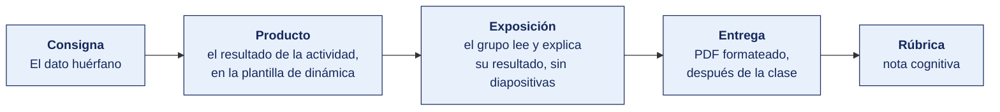

[Semana 10](README.md) · [Teoría](1-TEORIA.md) · **Dinámica de aula** · [Taller de laboratorio](3-TALLER.md)

# Dinámica de aula · Rastreo del dato

**SI-886 · Planeamiento Estratégico de TI** · Semana 10 · Actividad en aula, **dentro de los 100 min de la sesión de teoría** · calificación **cognitiva**

> ¿Un término no le resulta claro? Está definido en el [glosario técnico del curso](../GLOSARIO.md).

---

## Cómo funciona la actividad

## Qué entregas

| | |
|---|---|
| **Archivo** | `SI886-S10-DINAMICA-Grupo<N>.pdf` |
| **Plantilla obligatoria** | [SI886-PLANTILLA-DINAMICA.docx](../PLANTILLAS/SI886-PLANTILLA-DINAMICA.docx) |
| **Formato** | PDF exportado desde la plantilla en Word, con la carátula de la UPT y los apellidos, nombres y códigos de todos los integrantes |
| **Qué va dentro** | Lo que el grupo resolvió en aula. Las tablas de la sección **Producto** van completas, con los textos redactados, y cada decisión va justificada |
| **Dónde se sube** | Aula virtual, tarea «Dinámica · Semana 10» |
| **Cuándo vence** | Hasta 24 h después de la sesión de teoría. La tabla se resuelve en aula; el PDF se formatea y se sube después |
| **Exposición** | En la ronda de cierre de **esta misma sesión**. El grupo **lee y explica su resultado** ante el aula, con el documento a la vista. No se usan diapositivas |

> No se califica un trabajo entregado en `.docx`, sin carátula, sin los códigos de los integrantes o con las tablas del producto vacías.

---

## Consigna

> **«Rastreo del dato»**
> El mismo dato aparece con tres valores distintos en tres sistemas. Gerencia pregunta cuál es el bueno y nadie sabe responder.

| | |
|---|---|
| **Su papel** | **Arquitecto de datos** citado por gerencia para dar una respuesta hoy |
| **Misión** | Encontrar la fuente autoritativa del dato, o demostrar que **no existe**, y decir qué se rompe por eso |
| **Restricción** | **No vale responder «hay que integrar».** Hay que nombrar quién es el dueño del dato, por cargo |

Un dato que vive en cuatro sistemas y no tiene dueño no es un problema técnico. Es un problema **de la capa de negocio**, y por eso el análisis de brechas del ADM lo encuentra antes que cualquier herramienta.

## Cómo se desarrolla · 35 minutos

| | Bloque | Quién | Minutos |
|---|---|---|---|
| **1** | **El mapa.** Dónde vive el dato, con cuántos registros, cuántos campos y **quién lo actualiza** en cada sitio | Equipo | 10 |
| **2** | **La fuente autoritativa.** Cuál manda, en **qué capa de ArchiMate** vive el problema —negocio, datos, aplicaciones o tecnología— y **quién es su dueño por cargo**. Si hoy no hay ninguno, se declara así | Equipo | 9 |
| **3** | **El daño.** Qué se rompe por culpa del huérfano. **Un caso concreto**, no una lista de riesgos | Equipo | 8 |
| **4** | **Ronda en aula.** El dato huérfano más caro de los que aparecieron | Todos | 8 |

## Producto

**El informe del arquitecto.**

| Dónde vive el dato | Registros | Campos | Quién lo actualiza | ¿Es la fuente autoritativa? |
|---|---|---|---|---|

**Y el veredicto, en cuatro líneas.**

| | Contenido |
|---|---|
| **La fuente autoritativa** | Cuál es, o **«hoy no existe»** si es el caso |
| **El dueño** | El cargo que responde por el dato. Si nadie responde, ese es el hallazgo |
| **El daño concreto** | Un caso real o verosímil donde la organización ya perdió tiempo, dinero o credibilidad por esto |
| **La capa donde está la brecha** | La capa de ArchiMate donde de verdad está — negocio, datos, aplicaciones o tecnología. Casi nunca es la que parece |
| **Qué exige arreglarlo** | La decisión de gobierno, no solo la integración técnica |

> **Dónde va.** Este producto se presenta en la **sección 2 de la [plantilla de dinámica](../PLANTILLAS/SI886-PLANTILLA-DINAMICA.docx)**, «El producto». No se copia la consigna ni la teoría. Solo el resultado y lo que lo sostiene.

## Ejemplo resuelto

*El caso de este ejemplo es distinto del que le toca a tu grupo. Sirve para que veas el nivel de detalle que se espera, no para copiarlo.*

**La entidad rastreada.** «Cliente», en una distribuidora mayorista.

| Dónde vive el dato | Registros | Campos | Quién lo actualiza | ¿Fuente autoritativa? |
|---|---|---|---|---|
| ERP, módulo Ventas | 8 400 | 14 | Facturación, al emitir | Se asume que sí |
| Portal B2B | 340 | 6 | El propio cliente | No |
| Hoja de cálculo comercial | 8 900 | 22 | Un analista, a mano | No, pero es la que se usa para decidir |
| Correo del vendedor | variable | — | Nadie | No |

**El veredicto.**

| | Contenido |
|---|---|
| **La fuente autoritativa** | **Hoy no existe.** El ERP tiene el dato fiscal, pero la hoja de cálculo tiene 500 clientes más y 8 campos más, y es la que la gerencia mira |
| **El dueño** | Nadie. Ningún cargo responde por el maestro de clientes. **Ese es el hallazgo principal** |
| **El daño concreto** | En la campaña de marzo se envió la promoción a 8 400 clientes del ERP. Las 500 bodegas que solo estaban en la hoja de cálculo no la recibieron, y son las de mayor rotación. Se perdió la campaña con el mejor segmento |
| **Qué exige arreglarlo** | Designar al **Jefe Comercial** como dueño del maestro de clientes, con facultad para aprobar altas y bajas. La integración viene después, y sin el dueño no sirve de nada |

**La diferencia entre aprobar y no aprobar**

| Así no | Así sí |
|---|---|
| «El ERP es la fuente principal.» | «Hoy no existe fuente autoritativa: la hoja de cálculo tiene 500 clientes más y es la que se usa para decidir.» |
| «Hay que integrar los sistemas.» | «Designar al Jefe Comercial como dueño del maestro. La integración viene después.» |
| «Existe riesgo de inconsistencia.» | «En marzo, 500 bodegas de alta rotación no recibieron la promoción.» |

## Reglas

- 35 min en aula, dentro de la sesión de teoría.
- El dueño se nombra **por cargo**, nunca por persona.
- «Hay que integrar los sistemas» **no es una respuesta**. La integración es la consecuencia, no la decisión.
- El daño se cuenta como **un caso**, con su fecha o su situación. Una lista de riesgos genéricos no se califica.
- Declarar que no hay fuente autoritativa **es un hallazgo válido** y suele ser el correcto.
- La exposición es la ronda de cierre de esta misma sesión. El grupo **lee y explica su resultado**. No se usan diapositivas.

## Rúbrica cognitiva (20 puntos)

| Criterio | 5 | 3 | 1 |
|---|---|---|---|
| **El mapa** | Todos los lugares donde vive el dato, con volumen y responsable de actualización | Falta un lugar o un responsable | Solo los sistemas formales, sin las hojas de cálculo ni el correo |
| **La fuente autoritativa** | Determinada con criterio, o declarada inexistente con fundamento | Determinada sin fundamentar | Se elige la más grande sin criterio |
| **La capa y el dueño** | La brecha situada en su capa de la arquitectura, y el dueño nombrado por cargo. Si no existe, se dice con todas las letras | Nombrado de forma difusa | Ausente |
| **El daño** | Un caso concreto que la organización reconocería | Un caso verosímil pero genérico | Una lista de riesgos |

---

---

[Semana 10](README.md) · [Teoría](1-TEORIA.md) · **Dinámica de aula** · [Taller de laboratorio](3-TALLER.md)

---

**Docente** · Dr. Oscar Juan Jimenez Flores
[oscarjimenezflores@upt.pe](mailto:oscarjimenezflores@upt.pe) · [LinkedIn](https://www.linkedin.com/in/oscar-jimenez-flores/) · [CTI Vitae — CONCYTEC](https://ctivitae.concytec.gob.pe/appDirectorioCTI/VerDatosInvestigador.do?id_investigador=33398)

Escuela Profesional de Ingeniería de Sistemas · Universidad Privada de Tacna · Tacna, Perú
