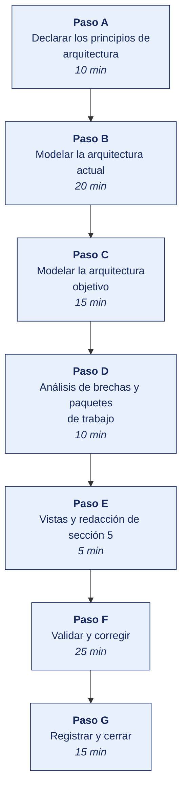

[Semana 10](README.md) · [Teoría](1-TEORIA.md) · [Dinámica de aula](2-DINAMICA.md) · **Taller de laboratorio**

# Taller de laboratorio 10 · Modelado de la arquitectura actual y objetivo en Archi

**SI-886 · Planeamiento Estratégico de TI** · Semana 10 · Sesión 2 en laboratorio · 100 min · calificación **procedimental**

> ¿Un término no le resulta claro? Está definido en el [glosario técnico del curso](../GLOSARIO.md).

---

## Secuencia del taller



## Qué entregas

| | |
|---|---|
| **Archivo** | `SI886-S10-TALLER-Grupo<N>.pdf` |
| **Plantilla obligatoria** | [SI886-PLANTILLA-TALLER.docx](../PLANTILLAS/SI886-PLANTILLA-TALLER.docx) |
| **Formato** | PDF exportado desde la plantilla en Word, con la carátula de la UPT, el índice actualizado y las capturas numeradas |
| **Qué va dentro** | Las secciones de la plantilla. La **5. Resultados y evidencias** se califica contra la tabla de resultados esperados de esta guía, y **cada resultado necesita la evidencia que lo demuestre**. No se copian de aquí los objetivos, la duración ni los resultados de aprendizaje |
| **Dónde se sube** | Aula virtual, tarea «Taller · Semana 10» |
| **Cuándo vence** | 48 horas después de la sesión de laboratorio |

> No se califica un informe entregado en `.docx`, sin carátula, sin los códigos de los integrantes o con resultados declarados sin evidencia.

---

## El reto

| | |
|---|---|
| **Situación** | Nadie en la organización puede dibujar cómo encajan sus procesos, sus datos, sus aplicaciones y su infraestructura. |
| **Misión** | Modelar la arquitectura actual y la objetivo en ArchiMate, y obtener de ahí las brechas que el plan tendrá que cerrar. |
| **Criterio de éxito** | Las brechas salen de comparar los dos modelos, no de una lista de deseos, y cada una se sitúa en su capa. |

## 1. Información sobre el evento práctico

### 1.1. Objetivos

- Declarar los **principios de arquitectura** que gobernarán las decisiones del plan.
- Modelar la **arquitectura actual** en las tres capas con ArchiMate 3.2.
- Construir la **vista de cooperación proceso-aplicación** y detectar procesos sin soporte.
- Construir la **estructura de la información** con fuentes autoritativas y dueños de dato.
- Modelar la **arquitectura objetivo** derivada de la visión (Sección 2.2) y de las capacidades (Sección 3.1.5).
- Ejecutar el **análisis de brechas** y derivar los **paquetes de trabajo**.
- Redactar la **Sección 5** del PETI (Plan Estratégico de Tecnologías de Información).

### 1.2. Recursos

| Recurso | Detalle |
|---|---|
| **Archi** — modelador ArchiMate libre | https://www.archimatetool.com/download/ |
| **ArchiMate 3.2 Specification** | https://pubs.opengroup.org/architecture/archimate3-doc/ |
| **TOGAF Standard, 10th Edition** | https://www.opengroup.org/togaf |
| Inventario de sistemas de la organización | Insumo obligatorio |
| Cadena de valor de sección 3.1.1 | Procesos de negocio |
| **draw.io** | Diagramas complementarios |
| **Python 3.11+** con `pandas` | Análisis de brechas |

### 1.3. Seguridad

1. El modelo de arquitectura describe **la superficie completa** de sistemas, integraciones y tecnología de la organización. Es información **Restringida** es un mapa útil para un atacante.
2. No se incluyen en el modelo direcciones IP, credenciales, versiones exactas de software vulnerable ni rutas internas.
3. El archivo del modelo se almacena en el repositorio **privado** y no se publica.
4. Las vistas que se entregan a la organización se generan sin el detalle técnico sensible.

---

## 2. Procedimiento o Metodología

### Paso A — Declarar los principios de arquitectura

`05_arquitectura/AR01_principios.md` — mínimo **seis principios**, cada uno con:

| Campo | Contenido |
|---|---|
| **Nombre** | Dato único con dueño |
| **Declaración** | Cada entidad de negocio tiene una única fuente autoritativa y un dueño de dato designado por cargo |
| **Razón** | Las decisiones se toman hoy con cifras discrepantes; el diagnóstico detectó N entidades sin fuente autoritativa |
| **Implicancias** | Ningún proyecto puede crear una segunda base de una entidad existente. Todo proyecto que consuma una entidad debe usar su fuente autoritativa. Antes de los proyectos de analítica debe ejecutarse el de gobierno del dato |
| **Trazabilidad** | Deriva del hallazgo Sección 3.1.3 (ventaja no capturada) y de la dinámica de la Semana 10 |

### Paso B — Modelar la arquitectura actual

**B.1 — Capa de negocio.** Se modelan los procesos de la cadena de valor (Sección 3.1.1):

| Elemento ArchiMate | Contenido de la organización |
|---|---|
| Actores de negocio | Cliente (bodega), vendedor, jefe de almacén, analista comercial, tesorería |
| Roles de negocio | Solicitante de pedido, aprobador de crédito, despachador |
| Procesos de negocio | Toma de pedido · Aprobación de crédito · Preparación · Ruteo y despacho · Facturación · Cobranza |
| Servicios de negocio | Entrega en 24 h · Crédito a 30 días · Atención de reclamo |
| Objetos de negocio | Cliente · Producto · Pedido · Factura · Ruta |

**B.2 — Capa de aplicación.**

| Elemento | Contenido |
|---|---|
| Componentes | ERP (Compras, Ventas, Inventarios, Contabilidad) · Portal B2B · WMS · Sistema de planilla · **Hojas de cálculo comerciales** |
| Servicios de aplicación | Registro de pedido · Consulta de stock · Emisión de comprobante · Cálculo de comisión |
| Interfaces | Interfaz de archivo plano ERP↔WMS · API del portal |
| Objetos de datos | Registro de pedido · Maestro de clientes · Maestro de productos |

> **Las hojas de cálculo se modelan como componentes de aplicación.** Omitirlas produce una arquitectura ficticia. En la mayoría de las organizaciones medianas, procesos críticos corren sobre ellas.

**B.3 — Capa de tecnología.**

| Elemento | Contenido |
|---|---|
| Nodos | Servidor del ERP (local) · VPS del portal (externo) · Estaciones de trabajo · Dispositivos móviles de la fuerza de ventas |
| Servicios de tecnología | Base de datos · Servicio web · Almacenamiento · Servicio de correo (nube) |
| Redes | LAN de oficina · Enlace a internet · Enlace del almacén |

**B.4 — Vista de cooperación proceso-aplicación.** La vista que la gerencia entiende:

```
 PROCESO              │ SISTEMA QUE LO SOPORTA        │ NIVEL
 ─────────────────────┼───────────────────────────────┼──────────
 Toma de pedido       │ Teléfono + papel + Portal (4%) │ ✗ Deficiente
 Aprobación de crédito│ ERP Ventas                     │ ✓ Bueno
 Preparación          │ WMS + escáner                  │ ✓ Bueno
 Ruteo y despacho     │ HOJA DE CÁLCULO                │ ✗ Deficiente
 Facturación          │ ERP Ventas                     │ ✓ Bueno
 Cobranza             │ ERP + hoja de cálculo          │ ~ Parcial
 Atención de reclamo  │ CORREO                         │ ✗ Deficiente
 Análisis comercial   │ HOJAS DE CÁLCULO               │ ✗ Deficiente
```

**B.5 — Estructura de la información.** `05_arquitectura/AR02_entidades.csv`:

| Entidad | Sistemas donde reside | N.º de registros por sistema | **¿Fuente autoritativa?** | **Dueño del dato (cargo)** | Discrepancia observada | Clasificación | ¿Contiene datos personales? |
|---|---|---|---|---|---|---|---|
| Cliente | ERP, Portal, Hoja comercial | 8 400 / 340 / 8 900 | **Ninguna** | **Ninguno** | 500 registros | Confidencial | **Sí** |
| Producto | ERP, WMS, Hoja de precios | | | | | Interna | No |
| Pedido | ERP, Portal, WMS | | | | | Confidencial | Sí (contacto) |
| Trabajador | Planilla, ERP, hoja de RR. HH. | | | | | **Restringida** | **Sí, sensibles** |

### Paso C — Modelar la arquitectura objetivo

**Derivación.** La arquitectura objetivo **no se inventa**. Se deriva de tres insumos ya producidos.

| Insumo | Sección | Qué aporta a la arquitectura objetivo |
|---|---|---|
| Capacidades de TI requeridas | Sección 3.1.5 | Qué capacidades deben existir y en qué nivel |
| Visión y sus métricas | Sección 2.2 | Qué debe ser posible: «80 % de pedidos en canal digital» exige un portal integrado |
| Estrategias del FODA cruzado | Sección 3.5 | Qué se va a construir, comprar o retirar |
| Marcos adoptados | Sección 4.2 | Qué prácticas y controles deben estar soportados |
| Proyectos no negociables | Sección 4.1.5 | Qué cambios impone la normativa |

**Arquitectura objetivo — cambios por capa.**

| Capa | Elemento actual | Elemento objetivo | Origen del cambio |
|---|---|---|---|
| Negocio | Toma de pedido por teléfono y papel | Autoservicio del cliente por canal digital, con atención asistida como excepción | Visión Sección 2.2 |
| Negocio | Atención de reclamo por correo | Proceso de atención con registro y trazabilidad | ITIL — DSS02, Sección 4.2 |
| Datos | Cliente en 3 lugares sin dueño | **Maestro de clientes en el ERP como fuente autoritativa**, con dueño designado (Gerencia Comercial) | Principio «dato único» |
| Datos | Sin registro de datos personales | Registro de actividades de tratamiento | Sección 4.1 — obligación normativa |
| Aplicación | Portal B2B sin integración | Portal integrado al ERP y al inventario en tiempo real | Visión Sección 2.2 |
| Aplicación | Ruteo en hoja de cálculo | Componente de planificación de rutas integrado al WMS | Estrategia E-02 Sección 3.5 |
| Aplicación | Integración por archivo plano nocturno | **Capa de integración con servicios publicados** | Principio «integración por servicios» |
| Aplicación | Análisis en hojas de cálculo | Tablero de gestión sobre el maestro consolidado | Estrategia E-05 Sección 3.5 |
| Tecnología | Servidor único sin redundancia | Infraestructura con respaldo verificado y copia inmutable | Sección 4.3 — DSS04 |
| Tecnología | Plataforma en fin de soporte | Plataforma con soporte vigente | Sección 3.3 PE-04 — plazo normativo del fabricante |

### Paso D — Análisis de brechas y paquetes de trabajo

**El programa está en [`HERRAMIENTAS/SEMANA-10/AR03_brechas.py`](../HERRAMIENTAS/SEMANA-10/AR03_brechas.py).** Se copia al repositorio del equipo como `05_arquitectura/AR03_brechas.py` y **se edita con los datos de su organización**. El programa hace el cálculo, las cifras y su justificación son del equipo.

```bash
cp ../HERRAMIENTAS/SEMANA-10/AR03_brechas.py 05_arquitectura/AR03_brechas.py
python3 05_arquitectura/AR03_brechas.py
```

### Paso E — Vistas y redacción de sección 5

Se exportan desde Archi las tres vistas mínimas en PNG y se redacta:

```markdown
## 5. Arquitectura empresarial

### 5.1 Principios de arquitectura
Los seis principios con nombre, declaración, razón, implicancias y trazabilidad.

### 5.2 Arquitectura actual (as-is)
   5.2.1 Capa de negocio: actores, procesos y servicios
   5.2.2 Capa de datos: entidades, fuentes autoritativas y dueños
         **Entidades sin fuente autoritativa: N de M**
   5.2.3 Capa de aplicación: componentes, servicios e integraciones
   5.2.4 Capa de tecnología: nodos, servicios y redes
   5.2.5 Vista de cooperación proceso-aplicación
         **Procesos sin soporte o con soporte deficiente: N de M**

### 5.3 Arquitectura objetivo (to-be)
   5.3.1 Derivación: de la visión, las capacidades y las estrategias a la arquitectura
   5.3.2 Cambios por capa, con su origen trazado
   5.3.3 Vistas objetivo

### 5.4 Análisis de brechas
   5.4.1 Tabla de brechas por capa y tipo
   5.4.2 Paquetes de trabajo derivados
   5.4.3 Dependencias y secuencia obligada
   **Los paquetes de trabajo son el insumo directo del portafolio (Sección 7.1).**
```

### Paso F — Validar y corregir (25 min)

El resultado no vale por estar hecho, sino por resistir una comprobación. Se ejecutan estas tres y **se corrige lo que falle antes de cerrar la sesión**.

1. Abrir el modelo en Archi y comprobar que los elementos están en la capa que les corresponde.
2. Verificar que toda aplicación del modelo actual existe de verdad en la organización.
3. Comprobar que cada brecha del análisis se puede señalar en los dos modelos.

> Lo que no se pueda corregir hoy se anota en la sección **Problemas y mejoras** de la evidencia, con lo que faltó y por qué. Un resultado parcial documentado con honestidad vale más que uno declarado sin prueba.

### Paso G — Registrar la evidencia y cerrar (15 min)

Se versiona lo producido, se anota la URL de cada resultado y se responde en dos frases la pregunta de transferencia — **qué riesgo correría una organización real si esto se hiciera mal**.

```bash
git add . && git commit -m "S10: arquitectura empresarial actual, objetivo y analisis de brechas — seccion 5"
git tag -a v0.10 -m "PETI v0.10 — arquitectura empresarial"
```

---

## 3. Resultados

> **Evidencia obligatoria en GitHub.** Todo resultado de este taller se versiona en el repositorio del equipo. El informe **no consigna capturas sueltas**. Consigna la **URL** del artefacto en GitHub. Una captura no permite verificar autoría, fecha ni contenido; un enlace sí.
>
> | Qué se entrega | Dónde vive | Qué se escribe en el informe |
> |---|---|---|
> | Código y archivos de configuración | Rama del taller, fusionada a `develop` vía Pull Request | URL del Pull Request |
> | Documentos y matrices | `docs/`, en formato de texto versionable | URL del archivo en la rama |
> | Capturas y videos que el taller exija | `docs/evidencias/S10/` | URL del archivo |
> | Salida de comandos | `docs/evidencias/S10/salidas/*.txt` | URL del archivo |
>
> **Etiqueta del taller.** Al cerrar el taller se crea la etiqueta `taller-10` sobre el commit entregado:
>
> ```bash
> git tag -a taller-10 -m "Taller 10 · SI886"
> git push origin taller-10
> ```
>
> La URL que se consigna en el informe apunta a esa etiqueta:
> `https://github.com/<organizacion>/<repositorio>/tree/taller-10`
>
> **El informe es lo que se califica; el repositorio es lo que lo prueba.** Cada resultado de la sección 3 del informe lleva la URL con la que se verifica, y **un resultado sin su URL se califica como no logrado**, por bien redactado que esté. Lo que no se puede abrir no se puede dar por hecho.

### 3.1. Los tres resultados que se califican

Son los que la rúbrica evalúa. El resto de la lista tiene que existir, pero no se califica fila por fila.

| Resultado | Qué demuestra | Dónde está |
|---|---|---|
| **La arquitectura actual** | Las tres capas modeladas, con elementos que existen de verdad | Modelo en Archi |
| **La arquitectura objetivo** | Coherente con los objetivos del plan, no con la moda | Modelo en Archi |
| **El análisis de brechas** | Cada brecha situada en su capa y trazable a los dos modelos | Sección 4.3 |

### 3.2. Lista de comprobación del taller

Todo esto debe existir al cerrar la sesión.

| # | Resultado esperado | Verificación |
|---|---|---|
| 1 | **Seis principios de arquitectura** con los cinco campos y su trazabilidad al diagnóstico | `AR01_principios.md` |
| 2 | Modelo en Archi con las **tres capas** de la arquitectura actual | Archivo `.archimate` |
| 3 | **Las hojas de cálculo modeladas** como componentes de aplicación | Modelo |
| 4 | Vista de cooperación proceso-aplicación, con los procesos sin soporte identificados | Vista exportada |
| 5 | Estructura de la información con **≥ 6 entidades**, sus sistemas y su número de registros | `AR02_entidades.csv` |
| 6 | **Entidades sin fuente autoritativa y sin dueño identificadas y contadas** | Misma tabla |
| 7 | Entidades que contienen datos personales marcadas, con su clasificación | Misma tabla |
| 8 | Arquitectura objetivo modelada, con **cada cambio trazado a su origen** | Modelo y tabla |
| 9 | Análisis de brechas con **≥ 10 brechas**, su tipo, esfuerzo y dependencias | `AR03_brechas.csv` |
| 10 | **Paquetes de trabajo derivados** de las brechas | Salida de `AR03_brechas.py` |
| 11 | **Secuencia obligada por dependencias** determinada | Salida del script |
| 12 | Tres vistas exportadas en PNG, sin detalle técnico sensible | `graficos/` |
| 13 | Sección 5 redactada · etiqueta `v0.10` | `git tag` |

## Rúbrica procedimental (20 puntos)

Se aplica sobre el informe entregado y la evidencia enlazada en el repositorio. **Cada criterio se califica de forma independiente.**

| Criterio | 4 — Logrado | 2 — En proceso | 0 — Insuficiente |
|---|---|---|---|
| **El criterio de éxito** | Se cumple tal como lo pide el reto de esta sesión | Se cumple con reservas que el equipo declara | No se cumple, o se afirma cumplido sin prueba |
| **La arquitectura actual** | Completo y correcto, con la evidencia que lo respalda | Completo con errores menores, o correcto sin toda la evidencia | Incompleto o sin evidencia |
| **La arquitectura objetivo** | Completo y correcto, con la evidencia que lo respalda | Completo con errores menores, o correcto sin toda la evidencia | Incompleto o sin evidencia |
| **El análisis de brechas** | Completo y correcto, con la evidencia que lo respalda | Completo con errores menores, o correcto sin toda la evidencia | Incompleto o sin evidencia |
| **La validación** | Las tres comprobaciones ejecutadas, y lo que falló quedó corregido o documentado | Ejecutadas sin corregir lo que falló | No se validó nada |

| Puntaje | Equivalencia |
|---|---|
| 18 – 20 | Destacado |
| 14 – 17 | Logrado |
| 6 – 13 | En proceso |
| 0 – 5 | Insuficiente |

> **Un resultado declarado sin evidencia enlazada no se califica**, aunque el trabajo se haya hecho. La tabla de la sección 3.1 es la lista de cotejo; esta rúbrica es lo que determina la nota.

## 4. Conclusiones

Mínimo tres. Líneas argumentales esperadas:

1. La capa de datos es la que más valor aporta al diagnóstico y la que menos existe documentada. Preguntar quién es el dueño de una entidad crítica suele revelar que varias áreas la mantienen y ninguna responde por ella.
2. La arquitectura objetivo no se inventa. Se deriva de la visión, de las capacidades requeridas y de las estrategias del FODA cruzado; esa derivación es lo que permite defender cada cambio propuesto.
3. Las dependencias entre paquetes de trabajo imponen una secuencia que la hoja de ruta debe respetar. Ejecutar analítica antes que gobierno del dato produce tableros que muestran cifras que nadie reconoce como válidas.

## 5. Referencias Bibliográficas

- The Open Group. *TOGAF Standard, 10th Edition*. https://www.opengroup.org/togaf
- The Open Group. *ArchiMate 3.2 Specification*. https://pubs.opengroup.org/architecture/archimate3-doc/
- Archi. *Archi — Open Source ArchiMate Modelling*. https://www.archimatetool.com/
- ISACA. (2018). *COBIT 2019*, objetivo **APO03 Managed Enterprise Architecture**. https://www.isaca.org/resources/cobit
- Ross, J. W., Weill, P. y Robertson, D. C. (2006). *Enterprise Architecture as Strategy*. Harvard Business School Press.
- Lankhorst, M. (2017). *Enterprise Architecture at Work: Modelling, Communication and Analysis* (4.ª ed.). Springer.
- Rodríguez Bermúdez, J. R. (2015). *Planificación y dirección estratégica de sistemas de información*. Editorial UOC. https://elibro.net/es/lc/bibliotecaupt/titulos/57875
- MINTIC Colombia. *Marco de Referencia de Arquitectura Empresarial para la gestión de TI*. https://www.mintic.gov.co/arquitecturati/630/w3-channel.html
- Decreto Supremo 029-2021-PCM — arquitectura digital del Estado peruano. https://www.gob.pe/13326-reglamento-de-la-ley-de-gobierno-digital

## 6. Anexos

- `anexo_A_modelo_arquitectura.archimate` — modelo completo (repositorio privado)
- `anexo_B_vista_proceso_aplicacion.png`
- `anexo_C_estructura_informacion.xlsx`
- `anexo_D_arquitectura_objetivo.png`
- `anexo_E_analisis_brechas.xlsx`
- `anexo_F_seccion_5.pdf`

---

---

[Semana 10](README.md) · [Teoría](1-TEORIA.md) · [Dinámica de aula](2-DINAMICA.md) · **Taller de laboratorio**

---

**Docente** · Dr. Oscar Juan Jimenez Flores
[oscarjimenezflores@upt.pe](mailto:oscarjimenezflores@upt.pe) · [LinkedIn](https://www.linkedin.com/in/oscar-jimenez-flores/) · [CTI Vitae — CONCYTEC](https://ctivitae.concytec.gob.pe/appDirectorioCTI/VerDatosInvestigador.do?id_investigador=33398)

Escuela Profesional de Ingeniería de Sistemas · Universidad Privada de Tacna · Tacna, Perú
