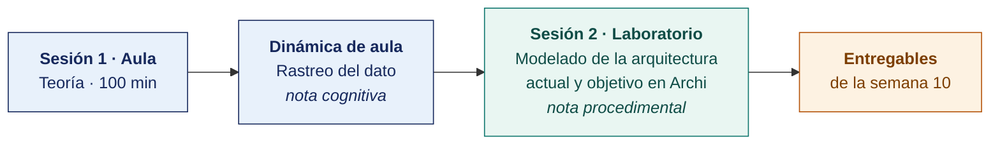

  
  &nbsp;&nbsp;&nbsp;&nbsp;&nbsp;&nbsp;
  

  <strong>Universidad Privada de Tacna</strong> 
  Facultad de Ingeniería · Escuela Profesional de Ingeniería de Sistemas

<h1 align="center">Semana 10 · Arquitectura Empresarial</h1>

  <strong>SI-886 · Planeamiento Estratégico de TI</strong> 
  4 horas académicas de 50 min · 100 min de teoría con la dinámica incluida en aula · 100 min de taller en laboratorio

---

## Datos de la asignatura

| | |
|---|---|
| **Asignatura** | SI-886 · Planeamiento Estratégico de TI |
| **Escuela** | Escuela Profesional de Ingeniería de Sistemas |
| **Ciclo** | VIII · 04 horas semanales · 03 créditos · Obligatorio |
| **Unidad** | II — Plan de Gobierno Digital |
| **Semana** | 10 de 17 |
| **Duración** | 4 horas académicas de 50 min · 100 min de teoría con la dinámica incluida en aula · 100 min de taller en laboratorio |
| **Resultados de aprendizaje** | **RA1** Analiza la normativa y herramientas TI · **RA2** Evalúa la situación actual del gobierno digital |

### Lo que indica el sílabo

**Contenido conceptual.** Arquitectura Empresarial.

**Contenido procedimental.** Revisa las arquitecturas de las metodologías de la Arquitectura Empresarial.

## Materiales de esta semana

| | Documento | Qué encontrarás | Dónde y cuánto dura |
|---|---|---|---|
| 1 | **[Teoría](1-TEORIA.md)** | Qué problema resuelve la arquitectura empresarial · TOGAF y el método ADM · ArchiMate como lenguaje de modelado | Aula · 100 min |
| 2 | **[Dinámica de aula](2-DINAMICA.md)** | Rastreo del dato, con su material, su ejemplo resuelto y su rúbrica | Aula · dentro de los 100 min de la sesión de teoría |
| 3 | **[Taller de laboratorio](3-TALLER.md)** | Modelado de la arquitectura actual y objetivo en Archi | Laboratorio · 100 min |

## Ruta de la semana

## Entregables

| Entregable | Formato y nombre del archivo | Vence |
|---|---|---|
| **Dinámica de aula** · Rastreo del dato | PDF desde la [plantilla de dinámica](../PLANTILLAS/SI886-PLANTILLA-DINAMICA.docx) · `SI886-S10-DINAMICA-Grupo<N>.pdf` | Antes de cerrar la sesión de teoría |
| **Informe del taller de laboratorio N.º 10** | PDF en formato EPIS desde la [plantilla de taller](../PLANTILLAS/SI886-PLANTILLA-TALLER.docx) · `SI886-S10-TALLER-Grupo<N>.pdf` | 48 h después del taller |
| Sección 5 del PETI (Plan Estratégico de Tecnologías de Información) · etiqueta `v0.10` | Commit en Git | 48 h después del laboratorio |

> Ambos se entregan en **PDF**, con la carátula de la UPT y los códigos de todos los integrantes. Las plantillas obligatorias están en [`PLANTILLAS/`](../PLANTILLAS/).

## Cómo se evalúa

| Criterio | Instrumento | Peso |
|---|---|---|
| Cognitivo | Rúbrica de «Rastreo del dato» + exposición de 10 min en la Semana 11 | 25 % |
| Procedimental | Lista de cotejo de los 13 resultados del laboratorio | 35 % |
| Actitudinal | Tratamiento del modelo como información Restringida y exclusión del detalle técnico sensible | 15 % |

## Preparación para la Semana 11

- **Leer.** Resolución de Secretaría de Gobierno Digital 005-2018-PCM/SEGDI, Anexo I — componente «situación actual» del Plan de Gobierno Digital.
- **Leer.** Decreto Supremo 085-2023-PCM — objetivos prioritarios y lineamientos de la Política Nacional de Transformación Digital al 2030.
- **Recopilar.** Indicadores que la organización mide hoy sobre sus servicios digitales, canales de atención y uso de sistemas.
- Si la organización es privada. Identificar el equivalente de «servicio digital» en su modelo de negocio (canal de venta, autoservicio del cliente, atención en línea).

---

**Docente** · Dr. Oscar Juan Jimenez Flores
[oscarjimenezflores@upt.pe](mailto:oscarjimenezflores@upt.pe) · [LinkedIn](https://www.linkedin.com/in/oscar-jimenez-flores/) · [CTI Vitae — CONCYTEC](https://ctivitae.concytec.gob.pe/appDirectorioCTI/VerDatosInvestigador.do?id_investigador=33398)

Escuela Profesional de Ingeniería de Sistemas · Universidad Privada de Tacna · Tacna, Perú
