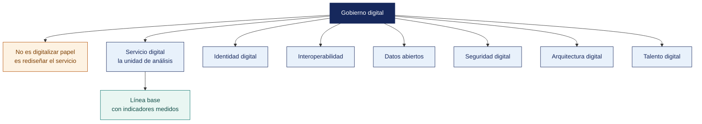

[Semana 11](README.md) · **Teoría** · [Dinámica de aula](2-DINAMICA.md) · [Taller de laboratorio](3-TALLER.md)

# Teoría · Situación Actual del Gobierno Digital

**SI-886 · Planeamiento Estratégico de TI** · Semana 11 · Sesión 1 en aula · 2 horas académicas, 100 min, con la dinámica incluida

> ¿Un término no le resulta claro? Está definido en el [glosario técnico del curso](../GLOSARIO.md).

---

## La pregunta de esta sesión

Una entidad afirma que su trámite de licencias está digitalizado. Tiene el formulario en su portal, tiene mesa de partes virtual y tiene un sistema que registra la solicitud.

El ciudadano descarga el formulario, lo llena, lo imprime, y lo lleva a la ventanilla con tres documentos adjuntos. Dos de los tres los emite el propio Estado, y uno lo emite la misma entidad que se los pide.

> **La pregunta que ordena esta sesión.** *¿Qué mide realmente el grado de digitalización de un servicio?*

## Antes de empezar

| Lo que necesita traer | De dónde sale |
|---|---|
| La arquitectura empresarial y sus cuatro capas | Semana 10 |
| El marco normativo de gobierno digital | Semana 08 |
| El diagnóstico de capacidades y los marcos adoptados | Semana 09 |
| Los procesos de la organización y sus sistemas | Semana 06 |

> **Exploración (5 min), antes de cualquier definición.** El aula responde antes de la teoría y se anota. *¿Está digitalizado ese trámite? ¿En qué grado? ¿Qué pediría usted para medirlo de forma objetiva?* No se corrige nada todavía.

## Distribución del tiempo

| Momento | Minutos |
|---|---|
| El caso del trámite «digitalizado» y la exploración inicial | 8 |
| **Bloque 1.** Qué es gobierno digital y qué no es | 15 |
| **Bloque 2.** El servicio digital como unidad de análisis · con su microaplicación | 25 |
| **Bloque 3.** Los ejes e indicadores del diagnóstico | 12 |
| Cierre, respuesta a la pregunta de la sesión y puente a la dinámica | 5 |
| **Total de la sesión de aula** | **65** |

## Mapa de la sesión

---

## Bloque 1 · Qué es gobierno digital y qué no es

> **La pregunta del bloque.** *¿Tener sistemas es tener gobierno digital?*

**La confusión frecuente.** «Gobierno digital» no significa «tener sistemas» ni «estar en internet». El **Decreto Legislativo 1412** lo define como el conjunto de principios, normas, procedimientos, técnicas y actividades orientados a **la gestión de la identidad digital, los servicios digitales, la arquitectura digital, la interoperabilidad, la seguridad digital y los datos**, en el marco de una gestión pública centrada en el ciudadano.

| Lo que **no** es gobierno digital | Lo que **sí** es |
|---|---|
| Publicar un PDF en el portal institucional | Que el ciudadano complete el trámite en línea, de extremo a extremo |
| Digitalizar el papel y seguir imprimiéndolo | Rediseñar el proceso para que el papel no sea necesario |
| Comprar sistemas | Diseñar servicios digitales alrededor de la necesidad del usuario |
| Que cada área tenga su sistema | Que los sistemas interoperen y no se pida al ciudadano lo que el Estado ya tiene |
| Tener un área de TI | Tener un **Comité de Gobierno Digital** y un **Líder** con autoridad |

**Los seis componentes del gobierno digital según el D. Leg. 1412 y su reglamento**, con su equivalente en organizaciones privadas:

| Componente | En el sector público | Equivalente en el sector privado |
|---|---|---|
| **Identidad digital** | Identificación del ciudadano en el entorno digital | Identidad del cliente y del trabajador. Registro único, autenticación |
| **Servicios digitales** | Trámites y servicios entregados por canal digital | **Autoservicio del cliente.** Pedido, consulta, reclamo, pago |
| **Arquitectura digital** | Estructura de procesos, datos, aplicaciones y tecnología | Arquitectura empresarial (Sección 5) |
| **Interoperabilidad** | Intercambio de información entre entidades vía la **PIDE** | Integración con clientes, proveedores, bancos, SUNAT |
| **Seguridad digital** | Protección de la información y confianza en el entorno digital | SGSI (Sistema de Gestión de Seguridad de la Información) y cumplimiento de la Ley 29733 |
| **Datos** | Gobierno de datos, datos abiertos, calidad y uso | Gobierno del dato, analítica, calidad |

> **Para organizaciones privadas.** El curso aplica los mismos seis componentes. La diferencia no es conceptual sino de exigibilidad. En el sector público son obligación normativa; en el privado son decisiones de negocio con la misma estructura de análisis.

> **El error frecuente del bloque.** Digitalizar el papel y seguir imprimiéndolo. Es el caso de hoy — el formulario existe en el portal y el proceso sigue siendo el mismo. **Gobierno digital es rediseñar el proceso para que el papel no sea necesario**, no publicar el papel en formato electrónico.

## Bloque 2 · El servicio digital como unidad de análisis

> **La pregunta del bloque.** *¿Se cuentan sistemas o se cuentan servicios completos?*

**El error de medir sistemas en lugar de servicios.** Una entidad puede tener 14 sistemas y cero servicios digitales completos, porque todos requieren que el ciudadano se presente en ventanilla al final del proceso.

**Los niveles de digitalización de un servicio** —la escala que ordena el diagnóstico:

| Nivel | Descripción | Prueba de verificación |
|---|---|---|
| **0 — Presencial** | El servicio solo existe de forma presencial | El usuario debe acudir para todo |
| **1 — Informativo** | Hay información en línea sobre el servicio | Existe la ficha del servicio publicada |
| **2 — Descarga** | El formulario se descarga, se llena y se presenta presencialmente | El PDF existe, la presentación es física |
| **3 — Interacción parcial** | Parte del trámite se hace en línea; alguna etapa requiere presencia | Se envía en línea pero se recoge presencialmente |
| **4 — Transaccional completo** | El servicio se completa íntegramente en línea, incluido el pago si aplica | El usuario nunca acude |
| **5 — Proactivo / personalizado** | La organización anticipa la necesidad y ofrece el servicio sin que el usuario lo solicite | El servicio llega antes de la solicitud |

**El principio de «una sola vez».** El reglamento de la Ley de Gobierno Digital y los estándares de interoperabilidad establecen que **no debe solicitarse al ciudadano información que el Estado ya posee**. La prueba de auditoría es directa. Revisar los requisitos de cada trámite y contar cuántos documentos pide que otra entidad del Estado ya emitió.

**La ficha del servicio digital.** Cada servicio se caracteriza con:

| Campo | Contenido |
|---|---|
| Nombre del servicio | |
| Usuario destinatario | Ciudadano, empresa, trabajador, cliente |
| Volumen anual | |
| Nivel de digitalización actual | 0 a 5 |
| Canales disponibles | Presencial, teléfono, correo, web, aplicación móvil |
| Tiempo de atención actual | |
| Requisitos que el Estado o la organización ya posee | **Cuántos y cuáles** |
| Sistemas que lo soportan | |
| Datos personales que trata | |
| Nivel objetivo | Con su justificación |

> **El error frecuente del bloque.** Medir sistemas en lugar de servicios. Una entidad puede tener catorce sistemas y **cero servicios digitales completos**, porque todos exigen que el ciudadano se presente en ventanilla al final. El sistema es un medio; la unidad de análisis del diagnóstico es el servicio.

## Bloque 3 · Los ejes e indicadores del diagnóstico de gobierno digital

> **La pregunta del bloque.** *¿Qué se mide para saber en qué estado está el gobierno digital de una organización?*

`Ejes del diagnóstico`, cada uno con indicadores medibles y **línea base obligatoria**:

| Eje | Indicadores | Fuente del dato |
|---|---|---|
| **1. Gobernanza digital** | ¿Existe Comité de Gobierno Digital? ¿Sesionó en los últimos 12 meses? ¿Hay Líder designado por resolución? ¿Existe PGD (Plan de Gobierno Digital)/PETI (Plan Estratégico de Tecnologías de Información) vigente? | Actas, resoluciones |
| **2. Servicios digitales** | N.º de servicios · % en nivel ≥ 4 · % de transacciones por canal digital · tiempo medio de atención | Registro de atenciones |
| **3. Interoperabilidad** | N.º de integraciones activas · ¿usa la PIDE? · N.º de documentos solicitados que otra entidad ya emitió | Inventario de integraciones |
| **4. Seguridad digital** | ¿Existe SGSI? · ¿Se aplica la NTP-ISO/IEC 27001 vigente? · N.º de incidentes registrados · % de sistemas con respaldo probado | Sección 4.1, Sección 4.3 |
| **5. Datos** | N.º de entidades con dueño designado · % de decisiones sustentadas en datos · ¿publica datos abiertos? | Sección 5.2.2 |
| **6. Identidad digital** | ¿Se usa mecanismo de identidad digital? · % de usuarios con identidad única · ¿hay segundo factor? | Inventario de accesos |
| **7. Talento y cultura digital** | % de personal capacitado en el último año · ¿existe plan de formación? · perfil cultural | Sección 2.4, RR. HH. |
| **8. Infraestructura y conectividad** | Disponibilidad de servicios críticos · ancho de banda · % de equipos dentro de soporte | Sección 5.2.4 |

> **Regla de oro del diagnóstico.** **Todo indicador necesita línea base.** Si la organización no mide algo, la línea base es «no se mide», y el primer proyecto asociado es **empezar a medirlo**. Declarar una meta sobre un indicador sin línea base hace imposible demostrar avance.

**Modelo de madurez del gobierno digital** —cinco niveles para posicionar a la organización:

| Nivel | Denominación | Características |
|---|---|---|
| **1 — Inicial** | Reactivo | Sin gobernanza; iniciativas aisladas por área; sin plan |
| **2 — Emergente** | En formación | Existe el comité o el líder; hay plan pero sin ejecución sistemática |
| **3 — Definido** | Estructurado | Plan vigente, servicios digitales identificados, seguridad gestionada, interoperabilidad iniciada |
| **4 — Gestionado** | Medido | Indicadores con metas; servicios mayoritariamente transaccionales; datos gobernados |
| **5 — Optimizado** | Centrado en el usuario | Servicios proactivos; mejora continua basada en datos de uso |

**Ejemplo trabajado — el nivel de digitalización real de una municipalidad distrital.** Municipalidad Distrital de Alto Selva — 41 800 habitantes, 178 trabajadores en planilla, TI de 3 personas, presupuesto de TI de S/ 520 000. Cinco servicios de alta demanda, evaluados con la prueba de verificación:

| Servicio | Volumen anual | Canal actual | Nivel declarado | **Nivel real** | Por qué |
|---|---|---|---|---|---|
| Consulta de deuda predial | 9 400 | Web de rentas | 4 | **3** | Consulta en línea, pero el pago se hace en caja |
| Pago del impuesto predial | 6 100 | Presencial | 4 | **1** | La web informa el monto; no hay pasarela de pago |
| Licencia de funcionamiento | 610 | Mesa de partes virtual | 3 | **2** | El formulario se descarga y se presenta con expediente físico |
| Certificado de posesión | 1 250 | Presencial | 0 | **0** | Sin canal digital |
| Reclamo de limpieza pública | 2 300 | Teléfono | 1 | **1** | No se registra. No hay línea base de reclamos |

> **Cinco servicios, 19 660 atenciones al año, y ninguno alcanza el nivel 4.** La entidad declara «tener mesa de partes virtual» y eso es cierto; lo que no es cierto es que exista un servicio digital completo. **Un formulario en línea que termina en ventanilla es nivel 2, no nivel 4**, y esa diferencia es la que el diagnóstico debe registrar con evidencia, no con la declaración del área.

**La prueba del principio de «una sola vez»** sobre el mismo pliego de servicios:

| Servicio | Requisitos que pide | De ellos, ya obrantes en el Estado | Cuáles |
|---|---|---|---|
| Licencia de funcionamiento | 7 | **4** | Ficha RUC (SUNAT), vigencia de poder (SUNARP), DNI (RENIEC), certificado de zonificación (la propia municipalidad) |
| Certificado de posesión | 5 | **2** | DNI (RENIEC), constancia de no adeudo (la propia municipalidad) |

> **Cuatro de siete requisitos ya los tiene el Estado, y uno de ellos lo emite la propia entidad que lo solicita.** Ese hallazgo no requiere comprar nada. Requiere rediseñar el requisito e integrarse a la PIDE. Es el proyecto de mayor razón beneficio-costo que suele aparecer en un PGD.

> **Microaplicación (6 min) · el nivel real de un trámite propio.** Cada pareja toma **un servicio real de su organización** y lo sitúa en la escala de 0 a 5, con la prueba de verificación que corresponde a ese nivel. Casi todos bajan un escalón al aplicar la prueba.

| Caso | Qué debe contener una buena respuesta |
|---|---|
| ¿Por qué el nivel declarado difiere del real? | Porque se mide el sistema y no el servicio. La prueba es una sola. ¿Puede el usuario terminar sin acudir? Si no, el nivel es 3 o menos |
| El indicador de reclamos no tiene línea base. ¿Se descarta? | No. La línea base es «no se mide», y el primer proyecto es empezar a medirlo. Un indicador sin línea base impide demostrar avance en la evaluación anual |
| ¿Qué nivel de madurez tiene esta entidad? | **1, inicial.** No existe Comité ni Líder de Gobierno Digital, y el Plan nunca se formuló. Sin gobernanza no se alcanza el nivel 2, por muchos sistemas que haya |

## Cierre · qué se lleva de aquí

**La respuesta a la pregunta con la que abrimos.** Lo mide **si el usuario tiene que acudir**. El trámite del caso está en el nivel 2 —descarga— y no en el 4, porque el formulario se presenta físicamente. Y hay un hallazgo peor — de los tres documentos que se le exigen al ciudadano, **uno lo emite la propia entidad que se lo pide**, lo que no requiere interoperar con nadie. Requiere rediseñar el trámite.

**Las tres ideas que deben quedar.**

| Idea | Por qué importa en el ejercicio profesional |
|---|---|
| Gobierno digital no es tener sistemas ni estar en internet | Es la gestión de la identidad, los servicios, la arquitectura, la interoperabilidad, la seguridad y los datos |
| La unidad de análisis es el servicio, no el sistema | Catorce sistemas pueden convivir con cero servicios digitales completos |
| El principio de una sola vez se audita contando documentos | Cuántos de los que se piden al ciudadano ya los posee el Estado |

**Volviendo a la exploración del inicio.** Se releen las respuestas del inicio. La mayoría sitúa el trámite en un nivel alto porque el formulario está en línea. La prueba del nivel 4 es de una sola línea —*el usuario nunca acude*— y descalifica a casi todos los trámites que se dan por digitalizados.

**Lo que sigue.** La [dinámica de esta sesión](2-DINAMICA.md) recorre un servicio de la organización con los ojos de quien lo usa, etapa por etapa, y determina su nivel real. El taller construye después el catálogo completo con sus brechas.

**Pregunta de cierre.** *¿cuántos de nuestros servicios puede completar un usuario sin contactarnos por otro canal?* Si la respuesta es cero, el nivel de digitalización real es 2, con independencia de cuántos sistemas existan.
---

---

[Semana 11](README.md) · **Teoría** · [Dinámica de aula](2-DINAMICA.md) · [Taller de laboratorio](3-TALLER.md)

---

**Docente** · Dr. Oscar Juan Jimenez Flores
[oscarjimenezflores@upt.pe](mailto:oscarjimenezflores@upt.pe) · [LinkedIn](https://www.linkedin.com/in/oscar-jimenez-flores/) · [CTI Vitae — CONCYTEC](https://ctivitae.concytec.gob.pe/appDirectorioCTI/VerDatosInvestigador.do?id_investigador=33398)

Escuela Profesional de Ingeniería de Sistemas · Universidad Privada de Tacna · Tacna, Perú
