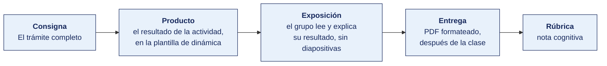

[Semana 11](README.md) · [Teoría](1-TEORIA.md) · **Dinámica de aula** · [Taller de laboratorio](3-TALLER.md)

# Dinámica de aula · Cliente incógnito

**SI-886 · Planeamiento Estratégico de TI** · Semana 11 · Actividad en aula, **dentro de los 100 min de la sesión de teoría** · calificación **cognitiva**

> ¿Un término no le resulta claro? Está definido en el [glosario técnico del curso](../GLOSARIO.md).

---

## Cómo funciona la actividad

## Qué entregas

| | |
|---|---|
| **Archivo** | `SI886-S11-DINAMICA-Grupo<N>.pdf` |
| **Plantilla obligatoria** | [SI886-PLANTILLA-DINAMICA.docx](../PLANTILLAS/SI886-PLANTILLA-DINAMICA.docx) |
| **Formato** | PDF exportado desde la plantilla en Word, con la carátula de la UPT y los apellidos, nombres y códigos de todos los integrantes |
| **Qué va dentro** | Lo que el grupo resolvió en aula. Las tablas de la sección **Producto** van completas, con los textos redactados, y cada decisión va justificada |
| **Dónde se sube** | Aula virtual, tarea «Dinámica · Semana 11» |
| **Cuándo vence** | Hasta 24 h después de la sesión de teoría. La tabla se resuelve en aula; el PDF se formatea y se sube después |
| **Exposición** | En la ronda de cierre de **esta misma sesión**. El grupo **lee y explica su resultado** ante el aula, con el documento a la vista. No se usan diapositivas |

> No se califica un trabajo entregado en `.docx`, sin carátula, sin los códigos de los integrantes o con las tablas del producto vacías.

---

## Consigna

> **«Cliente incógnito»**
> Su equipo hace de ciudadano que necesita un trámite de la organización. Va a cronometrar exactamente lo que le pasa, y después se lo va a decir al responsable del trámite.

| | |
|---|---|
| **Su papel** | Una mitad es el **ciudadano** que recorre el trámite. La otra es el **jefe del trámite**, que tendrá que justificar cada paso |
| **Misión** | Llevar a la mesa dos números — **cuántas veces cambió de canal** y **cuántos documentos le pidieron que la organización ya tenía** |
| **Restricción** | **Cada etapa se cronometra.** Una etapa sin tiempo no entra en el recorrido |

El dato que más incomoda en una mesa de gobierno digital no es el tiempo total. Es el documento que la organización se pide a sí misma, porque incumple **el principio de «una sola vez»** que se acaba de ver en la teoría.

## Cómo se desarrolla · 35 minutos

| | Bloque | Quién | Minutos |
|---|---|---|---|
| **1** | **El recorrido.** Cada etapa con su canal, su tiempo, quién actúa y qué documento se solicita | Equipo | 11 |
| **2** | **La ronda de preguntas.** El ciudadano señala cada documento que la organización **ya tenía**. El jefe del trámite lo justifica o lo cede | Equipo | 8 |
| **3** | **El rediseño.** El recorrido objetivo, las etapas que desaparecen y **qué integración lo habilita** | Equipo | 8 |
| **4** | **Ronda en aula.** El documento que la organización se pide a sí misma, de tres equipos | Todos | 8 |

## Producto

**El expediente del cliente incógnito.**

| # | Etapa | Canal | Quién actúa | Tiempo | ¿Presencial? | Documento solicitado | ¿Ya lo teníamos? |
|---|---|---|---|---|---|---|---|

Con el resumen **tiempo total ___ · cambios de canal ___ · etapas presenciales ___ · documentos que ya poseíamos ___ · nivel de digitalización actual ___ de 5**.

**Y el rediseño**, con el **nivel de digitalización objetivo**, el tiempo objetivo, las etapas eliminadas, los documentos que dejan de pedirse por aplicación del principio de «una sola vez», y la integración que lo hace posible.

> **Dónde va.** Este producto se presenta en la **sección 2 de la [plantilla de dinámica](../PLANTILLAS/SI886-PLANTILLA-DINAMICA.docx)**, «El producto». No se copia la consigna ni la teoría. Solo el resultado y lo que lo sostiene.

## Ejemplo resuelto

*El caso de este ejemplo es distinto del que le toca a tu grupo. Sirve para que veas el nivel de detalle que se espera, no para copiarlo.*

**El trámite del ejemplo.** Licencia de funcionamiento en una municipalidad distrital.

| # | Etapa | Canal | Quién actúa | Tiempo | ¿Presencial? | Documento solicitado | ¿Ya lo teníamos? |
|---|---|---|---|---|---|---|---|
| 1 | Consultar requisitos | Web | Ciudadano | 12 min | No | — | — |
| 2 | Descargar y llenar el formulario | Web | Ciudadano | 20 min | No | — | — |
| 3 | Presentar el expediente | Presencial | Ciudadano | 95 min de cola | **Sí** | Copia del DNI | **Sí**, RENIEC está en la PIDE |
| 4 | Pago de la tasa | Presencial, caja | Ciudadano | 25 min | **Sí** | — | — |
| 5 | Inspección técnica | Presencial | Municipalidad | 11 días | Sí | Copia del predial pagado | **Sí**, es de la propia municipalidad |
| 6 | Recoger la licencia | Presencial | Ciudadano | 40 min | **Sí** | — | — |

**Resumen.** Tiempo total **13 días y 3 h 12 min** · cambios de canal **3** · etapas presenciales **4** · documentos que ya poseíamos **2**.

**La ronda de preguntas.** El ciudadano señaló el predial. El jefe del trámite respondió que «lo pide el TUPA». El ciudadano preguntó quién emite el predial. La respuesta fue la misma municipalidad. El jefe cedió.

**El rediseño.** Tiempo objetivo **5 días**. Desaparecen las etapas 3 y 6, que pasan a mesa de partes virtual con notificación electrónica. Dejan de pedirse el DNI y el predial. **La integración que lo habilita** — consumo del servicio de RENIEC por la PIDE para el DNI, y consulta interna al sistema de rentas para el predial. Sin esas dos, el rediseño es solo un formulario nuevo.

## Reglas

- 35 min en aula, dentro de la sesión de teoría.
- **Sin tiempo no hay etapa.** Estimarlo es válido; dejarlo en blanco, no.
- El jefe del trámite tiene que **justificar o ceder** en cada documento repetido. No puede callar.
- El rediseño nombra **la integración concreta** que lo habilita, no «digitalizar el proceso».
- Si el trámite ya está bien resuelto, se dice, y se elige otro. Fingir una fricción que no existe baja la nota.
- La exposición es la ronda de cierre de esta misma sesión. El grupo **lee y explica su resultado**. No se usan diapositivas.

## Rúbrica cognitiva (20 puntos)

| Criterio | 5 | 3 | 1 |
|---|---|---|---|
| **El recorrido** | Todas las etapas con canal, tiempo y documento, desde la necesidad hasta la satisfacción | Falta una etapa o los tiempos de alguna | Se describe el procedimiento oficial, no el recorrido real |
| **Los dos números y el nivel** | Cambios de canal, documentos ya poseídos y el nivel de digitalización del servicio, los tres correctos | Uno de los dos | Ninguno |
| **La ronda de preguntas** | El jefe del trámite justifica con una razón real o cede explícitamente | Justifica de forma difusa | No hay ronda de preguntas |
| **El rediseño** | Nombra la integración concreta y qué etapas desaparecen por su causa | Rediseño sin nombrar la integración | «Digitalizar el trámite» |

---

---

[Semana 11](README.md) · [Teoría](1-TEORIA.md) · **Dinámica de aula** · [Taller de laboratorio](3-TALLER.md)

---

**Docente** · Dr. Oscar Juan Jimenez Flores
[oscarjimenezflores@upt.pe](mailto:oscarjimenezflores@upt.pe) · [LinkedIn](https://www.linkedin.com/in/oscar-jimenez-flores/) · [CTI Vitae — CONCYTEC](https://ctivitae.concytec.gob.pe/appDirectorioCTI/VerDatosInvestigador.do?id_investigador=33398)

Escuela Profesional de Ingeniería de Sistemas · Universidad Privada de Tacna · Tacna, Perú
