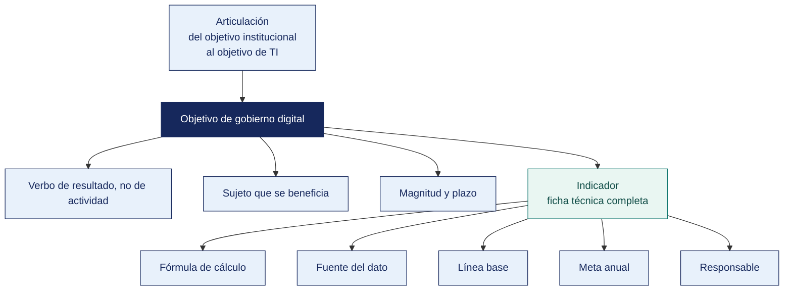

[Semana 12](README.md) · **Teoría** · [Dinámica de aula](2-DINAMICA.md) · [Taller de laboratorio](3-TALLER.md)

# Teoría · Objetivos del Gobierno Digital · Indicadores y Metas · Examen de Unidad II

**SI-886 · Planeamiento Estratégico de TI** · Semana 12 · Sesión 1 en aula · 2 horas académicas, 100 min, con la dinámica incluida

> ¿Un término no le resulta claro? Está definido en el [glosario técnico del curso](../GLOSARIO.md).

---

## La pregunta de esta sesión

Un plan declara el objetivo «implementar un sistema de gestión documental». Lo cumple. El sistema se implementa en el plazo previsto y con el presupuesto previsto.

Dos años después, el tiempo de atención de un expediente sigue siendo el mismo, el ciudadano sigue presentando los mismos documentos y nadie puede decir si el plan sirvió de algo. El objetivo se cumplió y el problema sigue intacto.

> **La pregunta que ordena el material de esta unidad.** *¿Qué distingue a un objetivo de un proyecto disfrazado de objetivo?*

## Antes de empezar

| Lo que necesita traer | De dónde sale |
|---|---|
| El diagnóstico de gobierno digital y los niveles de servicio | Semana 11 |
| La arquitectura empresarial y el análisis de brechas | Semana 10 |
| Los marcos de gestión adoptados y su justificación | Semana 09 |
| Los objetivos institucionales de la organización y sus metas | Semana 03 |

> **Autocomprobación, antes de leer el material.** Antes de leer, anote su respuesta a tres preguntas. *¿Qué le falta al objetivo del caso para ser un objetivo? ¿Se puede fijar una meta sin línea base? ¿Cuántos objetivos debería tener el plan?* Al terminar el material, vuelva a sus respuestas.

## Distribución del tiempo

| Momento | Minutos |
|---|---|
| Exposición de avance de la Unidad II | 60 |
| Examen teórico de Unidad II | 40 |
| **Total de la sesión de aula** | **100** |

## Mapa de la sesión



---

## Material de estudio de la unidad

> **No se dicta en clase.** Los 100 minutos de aula de esta semana se reparten entre la exposición de avance y el examen teórico. Este material —80 minutos de desarrollo— **se estudia por cuenta propia antes de la sesión y entra en el examen teórico de la Unidad II**. Está aquí completo, no resumido. Es el mismo desarrollo que tendría en aula.

### Cómo se formula un objetivo que sirve

**La diferencia entre objetivo, estrategia y proyecto** —confundirlos es el error más frecuente:

| Concepto | Qué es | Ejemplo |
|---|---|---|
| **Objetivo** | El **resultado** que se busca, medible | «Elevar al 60 % la proporción de pedidos originados en canal digital al cierre del horizonte del plan» |
| **Estrategia** | El **camino** elegido | «Superar la baja adopción del portal aprovechando la penetración de smartphone» |
| **Proyecto** | El **esfuerzo acotado** que produce un entregable | «Rediseño móvil del portal B2B» |
| **Actividad** | La **tarea** dentro del proyecto | «Diseñar la interfaz de catálogo» |

> **Prueba rápida.** Si el enunciado empieza con «implementar», «desarrollar», «adquirir» o «capacitar», **no es un objetivo. Es un proyecto**. Un objetivo describe un estado alcanzado, no una acción ejecutada.

**Formulación SMART aplicada.**

| Atributo | Exigencia | Ejemplo defectuoso | Ejemplo correcto |
|---|---|---|---|
| **S** — Específico | Qué cambia, en quién, dónde | «Mejorar la atención» | «Reducir el tiempo de atención de reclamos de clientes» |
| **M** — Medible | Indicador con fórmula y unidad | «Mejorar significativamente» | «De 48 h a 8 h (mediana)» |
| **A** — Alcanzable | Sustentado en capacidad y recursos | «Llegar al 100 % en un año» | «Al 60 % en tres años, con el proyecto X» |
| **R** — Relevante | Ligado a la estrategia y al objetivo superior | Objetivo que a nadie le importa | Trazado al OEI o al objetivo de negocio |
| **T** — Temporal | Con fecha | «A mediano plazo» | «Al 31 de el cierre del horizonte del plan» |

**Estructura del enunciado de un objetivo.**

> *«<Verbo de resultado en infinitivo> <qué se modifica> de <línea base> a <meta>, en <población o alcance>, al <fecha>.»*

Verbos de resultado adecuados — **incrementar, reducir, elevar, ampliar, disminuir, alcanzar, mantener**. Verbos que delatan un proyecto disfrazado — implementar, desarrollar, adquirir, capacitar, elaborar.

**Ejemplo trabajado — cuatro enunciados que los equipos presentan como objetivos, y por qué solo uno lo es.**

| Enunciado presentado | ¿Es objetivo? | Qué es en realidad | Reformulación correcta |
|---|---|---|---|
| «Implementar un sistema de gestión de almacén» | **No** | Proyecto. Empieza con «implementar» | «Reducir la diferencia entre inventario contable y físico de **4.7 % a 1.0 %** al cierre del tercer año» |
| «Mejorar la seguridad de la información» | **No** | Aspiración. Sin línea base, sin meta, sin fecha | «Elevar de 0 a 3 la capacidad del objetivo APO13 de COBIT, verificada por evaluación externa, al cierre del segundo año» |
| «Capacitar al 100 % del personal en herramientas digitales» | **No** | Proyecto con métrica de producto. Puede cumplirse sin que nada cambie | «Elevar del 12 % al 60 % la proporción de solicitudes registradas por los propios usuarios en la mesa de servicio, al cierre del tercer año» |
| «Elevar del 4 % al 60 % la proporción de pedidos originados en canal digital, sobre el total de pedidos de las 8 400 bodegas atendidas, al cierre del tercer año» | **Sí** | Objetivo de resultado | — |

> **Los tres primeros comparten el mismo defecto. Describen lo que hará TI, no lo que cambiará en la organización.** Se pueden ejecutar al 100 % y dejar el problema intacto —el sistema comprado y no usado de 2015 es exactamente eso—. **El objetivo se escribe desde el lado del que recibe el resultado**, nunca desde el lado del que hace el trabajo.

> **Autoevaluación (6 min) · el verbo del objetivo.** Antes de mirar la tabla, reescriba el objetivo del caso —«implementar un sistema de gestión documental»— **como un objetivo de resultado**, con su verbo, su magnitud y su plazo. Después compare con la respuesta.

| Caso | Qué debe contener una buena respuesta |
|---|---|
| ¿Cómo se detecta un proyecto disfrazado de objetivo? | Por el verbo implementar, desarrollar, adquirir, elaborar y capacitar delatan un proyecto. Un objetivo usa incrementar, reducir, elevar, alcanzar o mantener |
| No tenemos línea base. ¿Se puede fijar la meta igual? | No. Sin línea base la meta es arbitraria y el avance indemostrable. El primer año del plan se dedica a medir, y eso se declara así en la ficha |
| ¿Puede un objetivo tener dos indicadores? | Sí, y a menudo conviene. Uno de resultado y uno de impacto. Lo que no debe tener es solo indicadores de producto |

> **El error frecuente.** Escribir el proyecto en el lugar del objetivo. Es el error del caso y se detecta por el verbo — implementar, desarrollar, adquirir, elaborar y capacitar describen lo que se hace, no lo que cambia. **Un objetivo enuncia el cambio; el proyecto es el medio**, y confundirlos deja al plan sin manera de demostrar que sirvió.

### La ficha técnica del indicador

**Un objetivo sin ficha de indicador no es evaluable.** La ficha responde todas las preguntas que surgirán cuando alguien deba medirlo:

| Campo | Contenido | Por qué es indispensable |
|---|---|---|
| **Nombre del indicador** | Preciso y sin ambigüedad | Dos personas deben entender lo mismo |
| **Definición** | Qué mide exactamente | Evita interpretaciones divergentes |
| **Fórmula de cálculo** | Expresión matemática con numerador y denominador | Sin fórmula no es replicable |
| **Unidad de medida** | Porcentaje, horas, número, soles | |
| **Fuente del dato** | Sistema, tabla, reporte específico | Si no existe, el indicador no se puede medir |
| **Método de recolección** | Automático, consulta, conteo manual | Determina el costo de medir |
| **Frecuencia de medición** | Mensual, trimestral, anual | |
| **Responsable de la medición** | Cargo | Sin responsable, nadie mide |
| **Línea base** | Valor actual, con fecha de medición | **Sin línea base no hay meta** |
| **Meta por año** | Valor esperado al cierre de cada año del plan | Permite corregir a tiempo |
| **Sentido esperado** | Ascendente o descendente | |
| **Umbral de alerta** | Valor que dispara acción correctiva | Convierte el indicador en control |
| **Supuestos** | Condiciones bajo las cuales la meta es alcanzable | Protege al plan de la evaluación injusta |
| **Limitaciones** | Qué **no** mide el indicador | Evita conclusiones excesivas |

**Los tres tipos de indicador y cuándo usar cada uno.**

| Tipo | Qué mide | Ejemplo | Cuándo se usa |
|---|---|---|---|
| **De producto** | Lo que se entrega | «N.º de servicios digitalizados» | Fácil de medir, no demuestra valor |
| **De resultado** | El cambio en el usuario o el proceso | «% de pedidos originados en canal digital» | **El que debe predominar en un PETI** |
| **De impacto** | El efecto de largo plazo en el negocio | «Costo de despacho por pedido» | Difícil de atribuir, valioso para la gerencia |

> **La trampa del indicador de producto.** «Implementamos 5 sistemas» es un indicador de producto. Puede cumplirse al 100 % sin que nada mejore. Un PETI cuyos indicadores son todos de producto no puede demostrar valor, y esa es la razón por la que muchas gerencias dejan de financiar los planes de TI.

**Regla de proporción recomendada.** Al menos **60 % de indicadores de resultado**, hasta 30 % de producto y al menos un indicador de impacto por objetivo estratégico.

> **El error frecuente.** Definir el indicador sin su ficha. Un nombre de indicador sin fórmula, sin fuente, sin frecuencia y sin responsable se calcula distinto cada vez que alguien lo mide. **La ficha existe para que dos personas que midan por separado obtengan el mismo número.**

### La articulación y la cadena completa

**Cada objetivo debe articularse hacia arriba y hacia abajo.**

```
   Objetivo institucional o de negocio (sección 1.2.3)
              ▲  articula
   OBJETIVO DEL PETI  ◄──── deriva de ──── Estrategia del FODA cruzado (sección 3.5)
              │                                      ▲
              │ se mide con                          │ responde a
              ▼                                      │
        Indicador con ficha                  Factor F/D/O/A con evidencia (sección 3.4)
              │
              │ se alcanza mediante
              ▼
    Proyectos del portafolio (sección 7.1)
              │
              │ requiere
              ▼
        Presupuesto (sección 7.4)
```

**La matriz de objetivos** que se incorpora al PETI (Plan Estratégico de Tecnologías de Información):

| Campo | Contenido |
|---|---|
| Código del objetivo | OD-01 |
| Enunciado SMART | |
| **Objetivo superior al que se articula** | OEI ___ o objetivo de negocio ___ |
| **Estrategias que lo sustentan** | E-01, E-06 (sección 3.5) |
| **Componente de gobierno digital** | Servicios digitales |
| Indicador o indicadores | Con su ficha |
| Línea base y meta anual | |
| Proyectos que lo alcanzan | PT-03, PT-01 (sección 5.4.2) |
| Responsable del objetivo | Cargo |
| Riesgos asociados | Se detallan en sección 8 |

**Cuántos objetivos.** Entre **cinco y ocho**. Menos de cinco no cubre los componentes; más de ocho dispersa el esfuerzo y ninguno se cumple. Es el rango que la práctica de planeamiento sostiene.

**Ejemplo trabajado — la cadena completa de un solo objetivo, de la evidencia al presupuesto.** Es el recorrido que el jurado del examen pide reconstruir hacia atrás:

| Eslabón | Contenido concreto | Sección |
|---|---|---|
| **Evidencia** | El portal de pedidos registra 4 % de adopción; 68 % de las bodegas atendidas tiene smartphone (INEI 2025) | Sección 3.4 |
| **Factores** | **D4** baja adopción del canal digital · **O1** penetración de smartphone en el segmento minorista | Sección 3.4 |
| **Estrategia cruzada** | **DO-02:** superar la baja adopción del canal digital (D4) aprovechando la penetración de smartphone (O1) | Sección 3.5 |
| **Objetivo** | **OD-03:** elevar del 4 % al 60 % la proporción de pedidos originados en canal digital, al cierre del tercer año | Sección 6.2 |
| **Indicador** | Pedidos por canal digital ÷ total de pedidos × 100. Fuente: tabla de pedidos del ERP, campo `origen`. Mensual. Responsable: Jefe de Sistemas. Línea base 4 % (12/2025). Metas: 20 % · 40 % · 60 %. Umbral de alerta: menos del 15 % al cierre del primer año | Sección 6.2.3 |
| **Proyectos** | **PT-02** Reconstrucción del canal de pedidos · **PT-06** Programa de adopción con las 40 bodegas de mayor volumen | Sección 7.1 |
| **Presupuesto** | S/ 186 000 en tres años, 25 % del presupuesto de TI del primer año | Sección 7.4 |

> **Cualquier eslabón que falte rompe la cadena entera.** Un proyecto sin objetivo es gasto sin justificación; un objetivo sin indicador es una declaración; un indicador sin fuente de dato es un campo que nadie llenará en la evaluación anual. **La pregunta que la gerencia hace siempre es «¿por qué este proyecto y no otro?», y la única respuesta defendible es recorrer esta tabla de abajo hacia arriba hasta llegar a la evidencia.**

> **Autoevaluación (6 min) · la cadena completa de un objetivo propio.** Tome uno de los objetivos de su propio plan y recorra la cadena entera —objetivo institucional, objetivo del plan, indicador, meta y proyecto que lo mueve. El eslabón que no pueda nombrar es un hallazgo del avance.

| Caso | Qué debe contener una buena respuesta |
|---|---|
| ¿Por qué cinco a ocho objetivos y no quince? | Porque cada objetivo consume presupuesto, responsable y seguimiento. Quince objetivos en una TI de cuatro personas significa que ninguno tendrá dueño real |
| ¿Qué se hace con un proyecto que no se articula a ningún objetivo? | O se descarta, o se descubre que falta un objetivo en el plan. Lo que no se hace es dejarlo en el portafolio sin trazabilidad |
| ¿Para qué sirve el campo «limitaciones» de la ficha? | Para declarar qué **no** mide el indicador. Sin él, el indicador se usará para concluir más de lo que sostiene, y eso desacredita el plan en la primera evaluación |

---

## Exposición de avance de la Unidad II

Cada equipo expone el avance de su producto ante el aula y el docente. **6 minutos por equipo**, 10 equipos, sin margen. Se corta al minuto seis.

| Momento | Duración | Qué se muestra |
|---|---|---|
| Qué se propuso el equipo para esta unidad | 1 min | El objetivo declarado al inicio de la unidad |
| **Lo construido, funcionando** | 3 min | Producto real, no diapositivas de lo que se piensa hacer |
| Lo que no se logró y por qué | 1 min | Con honestidad. Ocultarlo cuesta más que declararlo |
| Preguntas | 1 min | Del docente |

> **Se evalúa el avance verificable, no la presentación.** Un equipo que muestra poco pero real puntúa por encima de uno que muestra mucho y no lo tiene.

## Examen de Unidad II

El Examen de Unidad se rinde en dos partes, y juntas valen el 25 % de la nota de la unidad.

| Parte | Dónde y cuándo | Duración | Qué evalúa | Materiales |
|---|---|---|---|---|
| **Teórico** | Aula, al cierre de esta sesión | 40 min | Preguntas de alternativas sobre las Semanas 07 a 11 | Apuntes propios. **Sin** internet ni asistentes de inteligencia artificial |
| **Práctico** | Laboratorio | 100 min | Construir el diagnóstico y los objetivos sobre datos reales, con la ficha de indicador completa | Laboratorio de cómputo, **con inteligencia artificial permitida** y declarada |


## Cierre · qué se lleva de esta unidad

**La respuesta a la pregunta del material.** El verbo, y detrás del verbo, la posibilidad de demostrar el cambio. «Implementar un sistema» se cumple el día que el sistema entra en producción y no dice nada sobre el problema que motivó la inversión. **Un objetivo se formula sobre el resultado** —reducir el tiempo de atención de un expediente de doce a cuatro días— y entonces el sistema es el proyecto que lo mueve, no el fin.

**Las tres ideas que deben quedar.**

| Idea | Por qué importa en el ejercicio profesional |
|---|---|
| El verbo delata si lo escrito es un objetivo o un proyecto | Implementar, adquirir y capacitar describen medios; incrementar, reducir y alcanzar describen resultados |
| Sin línea base la meta es arbitraria y el avance indemostrable | Y si no hay línea base se declara, y el primer año del plan se dedica a medir |
| La cadena objetivo, indicador, meta y proyecto debe cerrar en los dos sentidos | Todo objetivo con al menos un proyecto y todo proyecto trazable a un objetivo |

**Lo que sigue.** Con estos objetivos medibles cierra la Unidad II. La Unidad III construye el portafolio que los mueve, y la primera prueba de cada proyecto será justamente esa — **a qué objetivo se articula y qué indicador desplaza**.

---

---

[Semana 12](README.md) · **Teoría** · [Dinámica de aula](2-DINAMICA.md) · [Taller de laboratorio](3-TALLER.md)

---

**Docente** · Dr. Oscar Juan Jimenez Flores
[oscarjimenezflores@upt.pe](mailto:oscarjimenezflores@upt.pe) · [LinkedIn](https://www.linkedin.com/in/oscar-jimenez-flores/) · [CTI Vitae — CONCYTEC](https://ctivitae.concytec.gob.pe/appDirectorioCTI/VerDatosInvestigador.do?id_investigador=33398)

Escuela Profesional de Ingeniería de Sistemas · Universidad Privada de Tacna · Tacna, Perú
